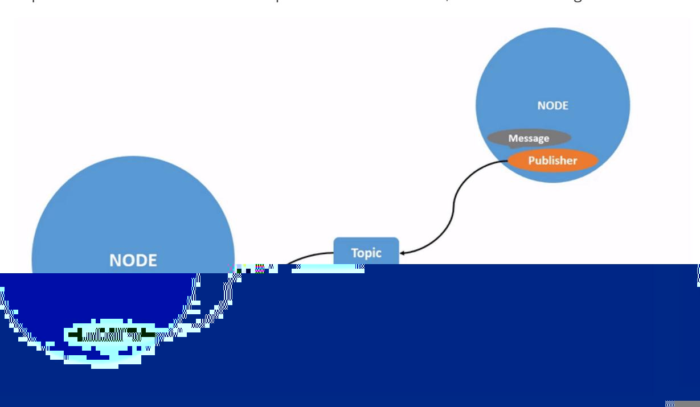
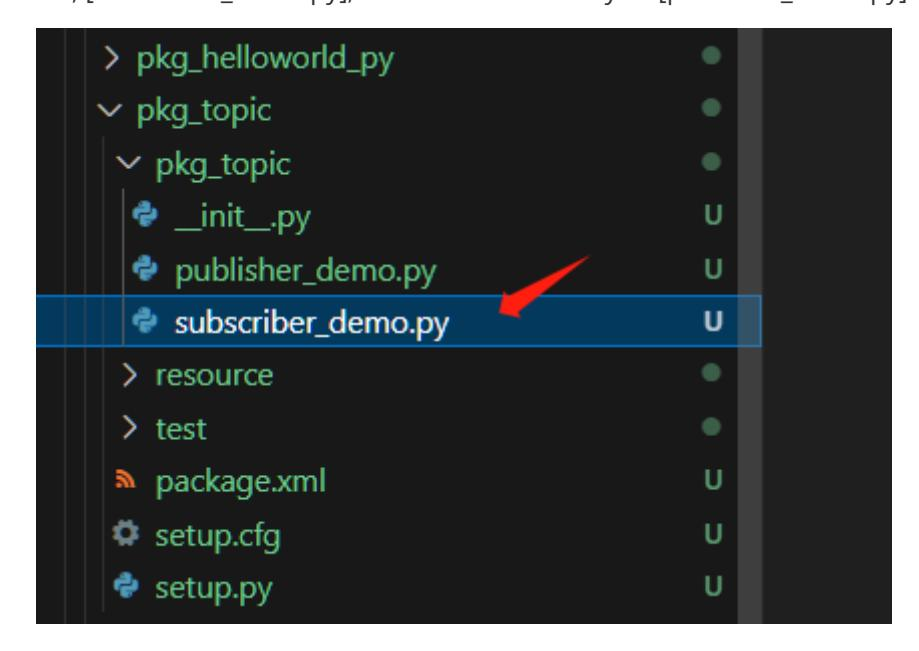

# 7. ROS2 Topic Communication

## 1. Introduction to Topic Communication

Topic communication is the most frequently used communication method in ROS2. A publisher publishes data on a specified topic, and subscribers who subscribe to that topic receive the data.

Topic communication is based on the publish/subscribe model, as shown in the figure:



Topic data transmission is a process where the data is transmitted from one node to another. The object sending data is called a publisher, and the object receiving data is called a subscriber. Each topic must have a name, and the data transmitted must have a fixed data type.

Next, we will explain how to implement topic communication between nodes using Python.

## 2. Create a New Package

- Switch to the src directory of the workspace
- Create a new pkg_topic package

```bash
ros2 pkg create pkg_topic --build-type ament_python --dependencies rclpy --node-
name publisher_demo
```

After executing the above command, the pkg_topic package will be created, along with a publisher_demo node and the relevant configuration files.

## 3. Publisher Implementation

### 3.1 Create a Publisher

Next, edit [publisher_demo.py] to implement the publisher functionality and add the following code:

```python
#Import the rclpy library
import rclpy
from rclpy.node import Node
#Import String messages
from std_msgs.msg import String
#Create a Topic_Pub node subclass that inherits from the Node base
class Topic_Pub(Node):
    def __init__(self,name):
        super().__init__(name)
        #Create a publisher using the create_publisher function. The passed
parameters are:
        #Topic data type, topic name, and queue length for storing messages
        self.pub = self.create_publisher(String,"/topic_demo",1)
        #Create a timer that enters the interrupt handler every 1 second. The
passed parameters are:
        #Interval between interrupt executions, interrupt handler function
        self.timer = self.create_timer(1,self.pub_msg)
    #Define the interrupt handler function
    def pub_msg(self):
        msg = String() #Create a String variable, msg
        msg.data = "Hi,I send a message." #Assign data to msg
        self.pub.publish(msg) #Publish topic data
#Main function
def main():
    rclpy.init() #Initialization
    pub_demo = Topic_Pub("publisher_node") #Create a Topic_Pub class object,
passing in the node name as a parameter
    rclpy.spin(pub_demo) #Execute the rclpy.spin function, passing in the
Topic_Pub class object just created as a parameter
    pub_demo.destroy_node() #Destroy the node object
    rclpy.shutdown() #Shut down the ROS2 Python interface
```

### 3.2 Editing the Configuration File

### 3.3 Compiling the Package

Compiling the Package

```bash
colcon build --packages-select pkg_topic
```

Refresh the environment variables in the workspace

### 3.4 Running the Program

After refreshing the environment variables, run the command

```bash
ros2 run pkg_topic publisher_demo
```

After the program successfully runs, nothing is printed. We can use the ros2 topic tool to view the data. First, check if there are any topics being published. Open another terminal and enter:

This topic_demo is the topic data defined in the program. Next, we'll use ros2 topic echo to print this data. In the terminal, enter:

```bash
ros2 topic echo /topic_demo
```

As you can see, the output "Hi, I send a message." from the terminal matches the line msg.data = "Hi, I send a message." in our code.

## 4. Subscriber Implementation

### 4.1 Creating a Subscriber

Create a new file, [subscriber_demo.py], in the same directory as [publisher_demo.py].



Next, edit [subscriber_demo.py] to implement the subscriber functionality and add the following code:

```python
#Import related libraries
import rclpy
from rclpy.node import Node
from std_msgs.msg import String
class Topic_Sub(Node):
    def __init__(self,name):
        super().__init__(name)
        #Create a subscriber using create_subscription. The passed parameters
are: topic data type, topic name, callback function name, and queue length.
        self.sub =
self.create_subscription(String,"/topic_demo",self.sub_callback,1)
    #Callback function executes the program: prints the received message.
    def sub_callback(self,msg):
        # print(msg.data,flush=True)
        self.get_logger().info(msg.data)
def main():
    rclpy.init() #Initialize the ROS2 Python interface.
    sub_demo = Topic_Sub("subscriber_node")#Create the object and initialize it.
    rclpy.spin(sub_demo)
    sub_demo.destroy_node() #Destroy the node object
    rclpy.shutdown() #Shut down the ROS2 Python interface
```

### 4.2 Editing the Configuration File

### 4.3 Compile the Workspace

Compile the package

```bash
colcon build --packages-select pkg_topic
```

Refresh the environment variables in the workspace

### 4.4 Run the Program

Execute the following command in a separate terminal:

```bash
# Start the publisher node
ros2 run pkg_topic publisher_demo
# Start the subscriber node
ros2 run pkg_topic subscriber_demo
```

As shown in the figure above, the terminal running the subscriber node will print the information published by the publisher, /topic_demo.
