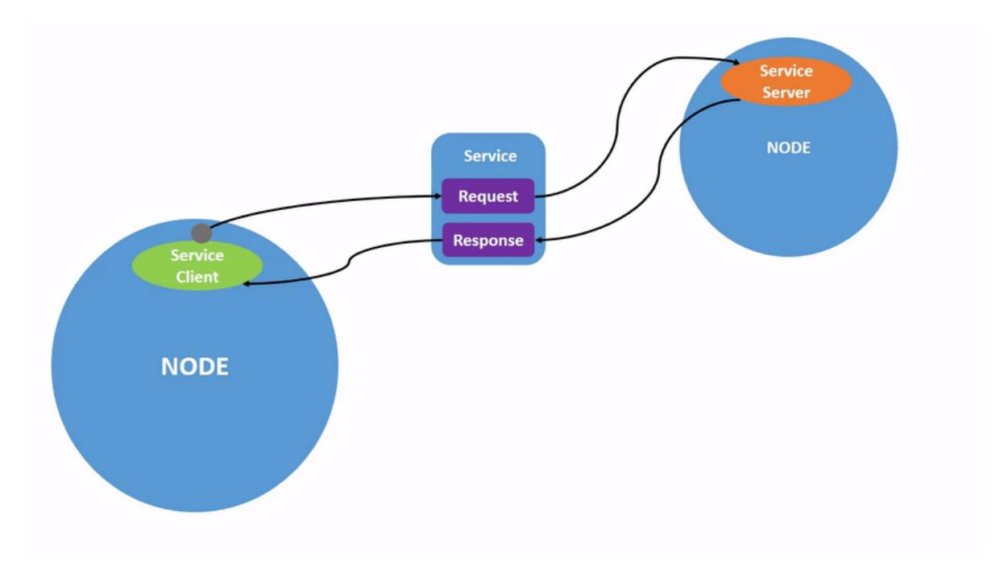
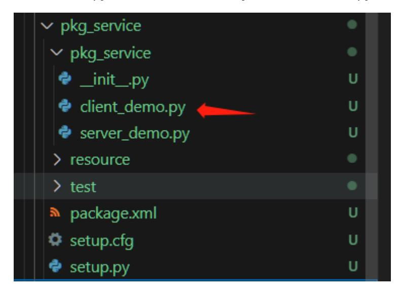

# 8. ROS2 Service Communication

# 1. Introduction to Service Communication

Service communication is a request-response communication model. On both sides of the communication chain, the client sends a request to the server, and the server responds to the client.

The client/server model is as follows:



From the perspective of service implementation, this Q&A format is called the client/server model, or CS model for short. When a client needs certain data, it sends a request to a specific service. After receiving the request, the server processes the request and returns a response.

This communication mechanism is also very common in everyday life. For example, in the various web pages we frequently browse, your computer browser is the client. It sends a request to the website server using a domain name or various operations. The server then responds with the page data to be displayed.

# 2. Create a new package

In the src directory of the workspace:

```
ros2 pkg create pkg_service --build-type ament_python --dependencies rclpy --
node-name server_demo
```

After executing the above command, the pkg_service package will be created, along with a server_demo node and the relevant configuration files.

# 3. Server Implementation

## 3.1 Creating the Server

Next, edit [server_demo.py] to implement the server functionality and add the following code:

```
#Import related libraries
import rclpy
from rclpy.node import Node
from example_interfaces.srv import AddTwoInts
class Service_Server(Node):
   def __init__(self,name):
       super().__init__(name)
       #Create a server using the create_service function. The parameters
passed in are:
       #Service data type, service name, service callback function (i.e.,
service content)
       self.srv = self.create_service(AddTwoInts, '/add_two_ints',
self.Add2Ints_callback)
   #The service callback function here adds two integers and returns the result.
   def Add2Ints_callback(self,request,response):
       response.sum = request.a + request.b
       print("response.sum = ",response.sum)
       return response
def main():
   rclpy.init()
   server_demo = Service_Server("publisher_node")
   rclpy.spin(server_demo)
   server_demo.destroy_node() #Destroy the node object
   rclpy.shutdown() #Shut down the ROS2 Python
interface
```

Focus on the service callback function, Add2Ints_callback. Besides self, the required parameters here are request and response. Request is the parameter required by the service, and response is the service's feedback. Request.a and request.b are the contents of the request, and response.sum is the contents of the response. First, let's take a look at what the data type AddTwoInts looks like.

You can use the following command to view it:

The "---" character divides the data type into two parts: the top part represents the request, and the bottom part represents the response. Each field then contains its own variable, such as int64 a and int64 b. When passing parameters, you must specify the values of a and b. Similarly, the feedback result also needs to specify the sum value.

#### 3.2 Editing the Configuration File

Open setup.py and add the following line to the console_scripts list:

```
'server_demo = pkg_service.server_demo:main',
```

## 3.3 Compiling the Package

Compiling the Package

```
colcon build --packages-select pkg_service
```

### 3.4 Running the Program

Refresh the environment variables and run the node.

```
ros2 run pkg_service server_demo
```

After running, since the service is not called, there is no feedback. You can call the service through the command line. First, query the current services. In another terminal, enter:

```
ros2 service list
```

/add_two_ints is the service we need to call. Call it with the following command. In the terminal, enter:

```
ros2 service call /add_two_ints example_interfaces/srv/AddTwoInts "{a: 1, b: 4}"
```

Here, we assign the value of a to 1 and the value of b to 4, effectively calling the service to calculate the sum of 1 and 4:

As shown in the image above, after calling the service, the result returned is 5, and the terminal running the server also prints the returned value.

## 4. Client Implementation

#### 4.1 Creating the Client

Create a new file, [client_demo.py], in the same directory as [server_demo.py].



Next, edit [client_demo.py] to implement the client functionality and add the following code:

```
#Import related libraries
import rclpy
from rclpy.node import Node
from example_interfaces.srv import AddTwoInts
class Service_Client(Node):
    def __init__(self,name):
        super().__init__(name)
        #Create the client using the create_client function, passing in the
service data type and service topic name as parameters.
        self.client = self.create_client(AddTwoInts,'/add_two_ints')
        #Loop waiting for the server to successfully start
        while not self.client.wait_for_service(timeout_sec=1.0):
            print("service not available, waiting again...")
        #Create the service request data object
        self.request = AddTwoInts.Request()
    def send_request(self):
        self.request.a = 10
        self.request.b = 90
        #Send the service request
        self.future = self.client.call_async(self.request)
def main():
    rclpy.init() #Node initialization
    service_client = Service_Client("client_node") #Create object
    service_client.send_request() #Send service request
    while rclpy.ok():
        rclpy.spin_once(service_client)
        #Determine if data processing is complete
        if service_client.future.done():
            try:
                #Get service feedback and print it
                response = service_client.future.result()
                print("service_client.request.a = ",service_client.request.a)
                print("service_client.request.b = ",service_client.request.b)
```

```
print("Result = ",response.sum)
            except Exception as e:
                service_client.get_logger().info('Service call failed %r' %
(e,))
        break
    service_client.destroy_node()
    rclpy.shutdown()
```

#### 4.2 Edit the Configuration File

Open setup.py and add the following line to the console_scripts list:

```
'client_demo = pkg_service.client_demo:main'
```

## 4.3 Compile the Package

```
colcon build --packages-select pkg_service
```

#### 4.4 Run the Program

Refresh the environment variables and run the node

```
# Start the server node
ros2 run pkg_service server_demo
# Start the client node
ros2 run pkg_service client_demo
```

First run the server, then the client. The client provides a=10 and b=90. The server performs the sum and obtains 100. The result is printed on both terminals.
