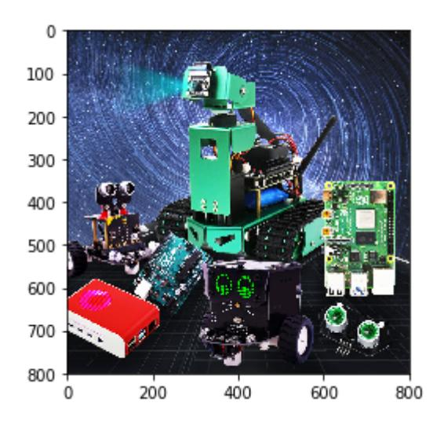
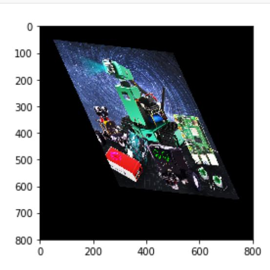

# Affine transformation

Affine Transformation (Affine Transformation or Affine Map) is a linear transformation from twodimensional coordinates (x, y) to two-dimensional coordinates (u, v). Its mathematical expression

is as follows: The corresponding homogeneous coordinate

matrix representation is:
$$\begin{bmatrix} u \\ v \\ 1 \end{bmatrix} = \begin{bmatrix} a_1 & b_1 & c_1 \\ a_2 & b_2 & c_2 \\ 0 & 0 & 1 \end{bmatrix} \begin{bmatrix} x \\ y \\ 1 \end{bmatrix}$$

Affine transformation maintains the "straightness" of two-dimensional graphics (a straight line remains a straight line after an affine transformation) and "parallelism" (the relative position relationship between straight lines remains unchanged, parallel lines remain parallel lines after an affine transformation, and the position order of the points on the straight lines does not change). Three pairs of non-collinear corresponding points determine a unique affine transformation. The rotation and stretching of an image is an image affine transformation. Affine transformation also requires an M matrix. However, due to the complexity of affine transformation, it is generally difficult to find this matrix directly. OpenCV provides a method to automatically solve M based on the correspondence between the three points before and after the transformation. This function is:

```
M=cv2.getAffineTransform(pos1,pos2)
```

The two positions are the corresponding positions before and after the transformation. The output is the affine matrix M. Then use the function cv2.warpAffine().

Code path:

opencv/opencv_basic/02_OpenCV Transform/05Affine transformation.ipynb

```python
import cv2
import numpy as np
import matplotlib.pyplot as plt
img = cv2.imread('yahboom.jpg',1)
img_bgr2rgb = cv2.cvtColor(img, cv2.COLOR_BGR2RGB)
plt.imshow(img_bgr2rgb)
plt.show()
# cv2.waitKey(0)
```

```
imgInfo = img.shape
height = imgInfo[0]
width = imgInfo[1]
#src 3->dst 3 (upper left, lower left, upper right)
matSrc = np.float32([[0,0], [0,height-1], [width-1,0]])
matDst = np.float32([[50,50], [300,height-200], [width-300,100]])
#combination
matAffine = cv2.getAffineTransform(matSrc,matDst)# mat 1 src 2 dst
dst = cv2.warpAffine(img,matAffine,(width,height))
img_bgr2rgb = cv2.cvtColor(dst, cv2.COLOR_BGR2RGB)
plt.imshow(img_bgr2rgb)
```




