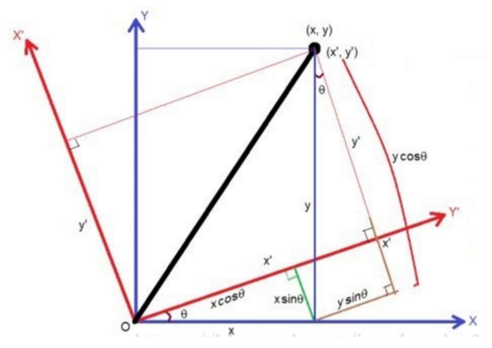
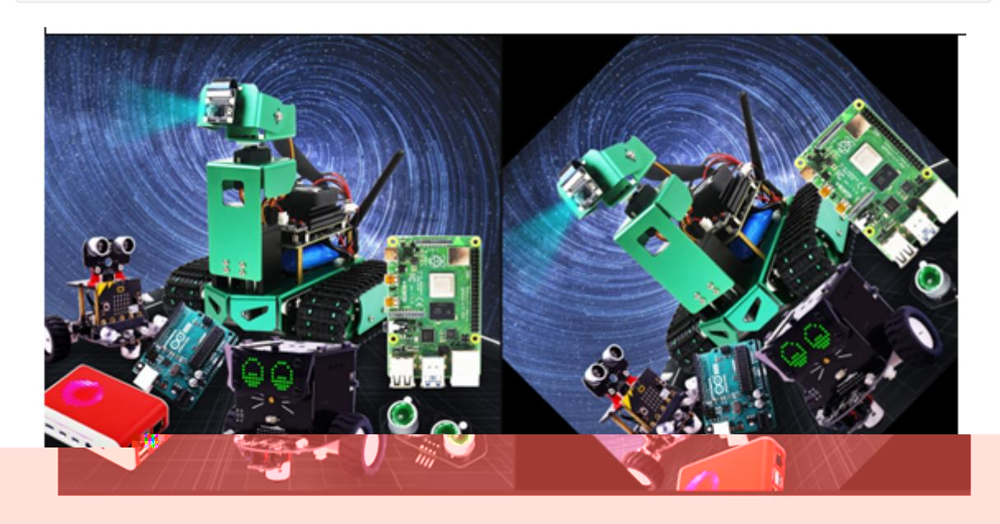

## Image Rotation

Image rotation refers to the process of rotating an image by a certain angle according to a certain position, while maintaining the original size. After the image is rotated, the horizontal axis of symmetry, vertical axis of symmetry, and center coordinate origin of the image may change, so the coordinates of the image during rotation need to be converted accordingly. As shown in the figure below:



Assuming that the image is rotated counterclockwise by θ, the rotation transformation can be obtained according to the coordinate transformation:

$$\begin{cases} x' = r\cos(\alpha - \theta) \\ y' = r\sin(\alpha - \theta) \end{cases}$$
(1)

and

$$r = \sqrt{x^2 + y^2}, \sin \alpha = \frac{y}{\sqrt{x^2 + y^2}}, \cos \alpha = \frac{x}{\sqrt{x^2 + y^2}}$$
(2)

(2) Substituting (1) into (2) yields:

$$\begin{cases} x' = x\cos\theta + y\sin\theta \\ y' = -x\sin\theta + y\cos\theta \end{cases}$$
 (3)  $\leftarrow$

That is as follows:

$$\begin{bmatrix} [x' & y' & 1] &= [x & y & 1] \ \begin{bmatrix} \cos \theta & -\sin \theta & 0 \ \sin \theta & \cos \theta & 0 \ 0 & 0 & 1 \end{bmatrix}$$

The grayscale value of the rotated image is equal to the grayscale value of the corresponding position in the original image as follows:

```
f(x′,y′)=f(x,y)
```

The above is the principle of rotation, but the API provided by OpenCV can directly obtain the transformation matrix through the function. The syntax format of this function is:

matRotate = cv2.getRotationMatrix2D(center, angle, scale)

center: the center point of rotation

Angle: The angle of rotation. Positive number means counterclockwise; negative number means clockwise.

scale: The scale of the transformation (zoom in or out). 1 means no change, less than 1 means reduction, and greater than 1 means enlargement.

Code path:

```
opencv/opencv_basic/02_OpenCV Transform/06 pictures rotating.ipynb
import cv2
import numpy as np
img = cv2.imread(yahboom.jpg',1)
#cv2.imshow('src',img)
imgInfo = img.shape
height = imgInfo[0]
width = imgInfo[1]
matRotate = cv2.getRotationMatrix2D((height*0.5, width*0.5), 45, 1)# mat rotate 1
center 2 angle 3 scale
#100*100 25
dst = cv2.warpAffine(img, matRotate, (height,width))
```

The following will show the original image and the rotated image in the JupyterLab control.

```
#bgr8 to jpeg format
import enum
import cv2
def bgr8_to_jpeg(value, quality=75):
    return bytes(cv2.imencode('.jpg', value)[1])
```

```
import ipywidgets.widgets as widgets
image_widget1 = widgets.Image(format='jpg', )
image_widget2 = widgets.Image(format='jpg', )
# create a horizontal box container to place the image widget next to each other
image_container = widgets.HBox([image_widget1, image_widget2])
# display the container in this cell's output
display(image_container)
#display(image_widget2)
img1 = cv2.imread('image0.jpg',1)
image_widget1.value = bgr8_to_jpeg(img1)
    image_widget2.value = bgr8_to_jpeg(dst)
```


