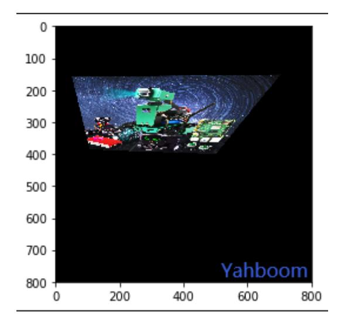

## Perspective Transformation

Perspective transformation is also called projection transformation. The affine transformation we often talk about is a special case of perspective transformation. The purpose of perspective transformation is to transform objects that are straight lines in reality, which may appear as diagonal lines in the image, into straight lines through perspective transformation. Perspective transformation can map rectangles into arbitrary quadrilaterals. This technology will be used later when our robot is driving autonomously. Perspective transformation is achieved through the function:

dst = cv2. warpPerspective(src, M, dsize[,flag, [,borderMode[,borderValue]]])

dst: The output image after perspective transformation. dsize determines the actual size of the output.

src: source image

M: 3X3 transformation matrix

dsize: Output image size.

flags: interpolation method, the default is INTER_LINEAR (bilinear interpolation). When it is WARP_INVERSE_MAP, it means that M is an inverse transform, which can achieve the inverse transform from the target dst to src.

borderMode: Border type. Defaults to BORDER_CONSTANT. When this value is BORDER_TRANSPARENT, the values in the target image are not changed; they correspond to the outliers in the original image.

borderValue: Boundary value, the default is 0. Like affine transformation, OpenCV still provides a function cv2.getPerspectiveTransform() to provide the transformation matrix above.

The function is as follows:

```
matAffine = cv2.getPerspectiveTransform(matSrc, matDst)
```

matSrc: The coordinates of the four vertices of the input image.

matDst: The coordinates of the four vertices of the output image.

Code path:

opencv/opencv_basic/02_OpenCV Transform/07 perspective transformation.ipynb

```
import cv2
import numpy as np
import matplotlib.pyplot as plt
img = cv2.imread('yahboom.jpg',1)
imgInfo = img.shape
height = imgInfo[0]
width = imgInfo[1]
```

```
#src 4->dst 4 (upper left corner lower left corner upper right corner lower right
corner)
matSrc = np.float32([[200,100],[200,400],[600,100],[width-1,height-1]])
matDst = np.float32([[200,200],[200,300],[500,200],[500,400]])
#combination
matAffine = cv2.getPerspectiveTransform(matSrc,matDst)# mat 1 src 2 dst
dst = cv2.warpPerspective(img,matAffine,(width,height))
img_bgr2rgb = cv2.cvtColor(dst, cv2.COLOR_BGR2RGB)
plt.imshow(img_bgr2rgb)
    plt.show()
```


