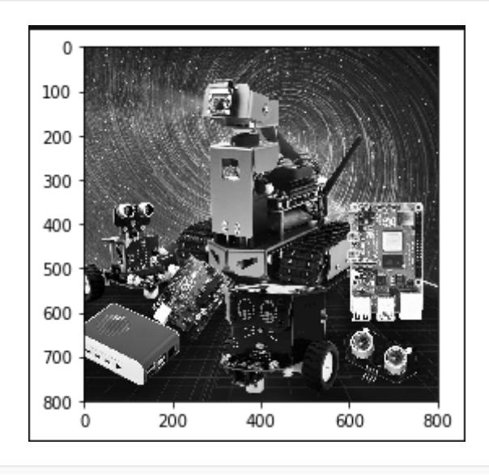
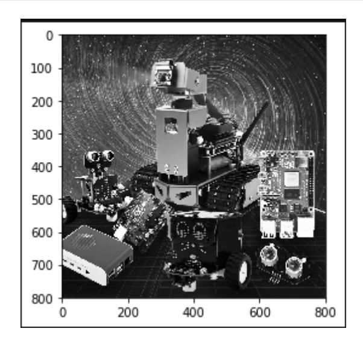

# Grayscale processing

The process of converting a color image to a grayscale image is called grayscaling. The color of each pixel in a color image is determined by three components: R, G, and B. Each component can take values from 0 to 255, resulting in a pixel with a range of over 16 million possible colors (256 *256* 256 = 1,677,256). A grayscale image is a special type of color image where the R, G, and B components are identical, but the range of possible colors for a single pixel is 256. Therefore, in digital image processing, images of various formats are generally converted to grayscale to reduce the amount of computation required for subsequent image processing. Like color images, grayscale images still reflect the distribution and characteristics of the overall and local chromaticity and highlight levels of the entire image.

**Image grayscale processing**. Grayscale processing is the process of converting a color image into a grayscale image. Color images are divided into three components: R, G, and B, which represent red and green respectively.

Grayscale is the process of making the R, G, and B components of a color equal. Pixels with large grayscale values are brighter (the maximum pixel value is 255, which is

White), whereas it is darker (the bottom pixel is 0, which is black).

The core idea of image grayscale is R = G = B, and this value is also called grayscale value.

Image grayscale algorithm

- **1) Maximum value method**: Make the converted R, G, and B values equal to the largest of the three values before conversion, that is, R = G = B = max (R, G, B). This method converts the grayscale image to a very bright level.
- **2) Average value method**: The R, G, and B values after conversion are the average of the R, G, and B values before conversion. That is, R = G = B = (R + G + B) / 3. This method produces a softer grayscale image.
- **3) Weighted Average Method**: The R, G, and B values are weighted and averaged according to certain weights. Different weights are used to create different grayscale images. Since the human eye is most sensitive to green, followed by red, and least sensitive to blue, this method produces a more easily recognizable grayscale image. Generally, this method produces the best grayscale image.

There are four ways to implement grayscale in the following code:

Code path:

opencv/opencv_basic/03_Image processing and text drawing/01gray processing.ipynb

```python
#Method 1 imread
#Note: Sometimes the image will not be displayed the first time you run it, but
will be displayed the second time
import cv2
import matplotlib.pyplot as plt
img0 = cv2.imread('yahboom.jpg',0)
img1 = cv2.imread('yahboom.jpg',1)
# print(img0.shape)
# print(img1.shape)
```

```
# cv2.imshow('src',img0)
# cv2.waitKey(0)
#Original image
# img_bgr2rgb1 = cv2.cvtColor(img1, cv2.COLOR_BGR2RGB)
# plt.imshow(img_bgr2rgb1)
#Gray Image
img_bgr2rgb0 = cv2.cvtColor(img0, cv2.COLOR_BGR2RGB)
    plt.imshow(img_bgr2rgb0)
    plt.show()
```


```python
#Method 2 cvtColor
#Note: Sometimes the image will not be displayed the first time you run it, but
will be displayed the second time
import cv2
import matplotlib.pyplot as plt
img = cv2.imread('image0.jpg',1)
dst = cv2.cvtColor(img,cv2.COLOR_BGR2GRAY)# Color space conversion 1 data 2 BGR
gray
#cv2.imshow('dst',dst)
#cv2.waitKey(0)
#Original image
# img_bgr2rgb1 = cv2.cvtColor(img, cv2.COLOR_BGR2RGB)
# plt.imshow(img_bgr2rgb1)
#Gray Image
img_bgr2rgb0 = cv2.cvtColor(dst, cv2.COLOR_BGR2RGB)
    plt.imshow(img_bgr2rgb0)
    plt.show()
```


```python
#Method 3 Average Method
import cv2
import numpy as np
import matplotlib.pyplot as plt
img = cv2.imread('yahboom.jpg',1)
imgInfo = img.shape
height = imgInfo[0]
width = imgInfo[1]
# RGB R=G=B = gray (R+G+B)/3
dst = np.zeros((height,width,3),np.uint8)
for i in range(0,height):
    for j in range(0,width):
        (b,g,r) = img[i,j]
        gray = (int(b)+int(g)+int(r))/3
        dst[i,j] = np.uint8(gray)
#cv2.imshow('dst',dst)
#cv2.waitKey(0)
#Original image
# img_bgr2rgb1 = cv2.cvtColor(img, cv2.COLOR_BGR2RGB)
# plt.imshow(img_bgr2rgb1)
#Gray Image
img_bgr2rgb0 = cv2.cvtColor(dst, cv2.COLOR_BGR2RGB)
plt.imshow(img_bgr2rgb0)
    plt.show()
```



```python
#Method 4 Weighted Average Method
# gray = r*0.299+g*0.587+b*0.114
import cv2
import numpy as np
img = cv2.imread('yahboom.jpg',1)
imgInfo = img.shape
height = imgInfo[0]
width = imgInfo[1]
dst = np.zeros((height,width,3),np.uint8)
for i in range(0,height):
    for j in range(0,width):
        (b,g,r) = img[i,j]
        b = int(b)
        g = int(g)
        r = int(r)
        gray = r*0.299+g*0.587+b*0.114
        dst[i,j] = np.uint8(gray)
#cv2.imshow('dst',dst)
#cv2.waitKey(0)
#Original image
# img_bgr2rgb1 = cv2.cvtColor(img, cv2.COLOR_BGR2RGB)
# plt.imshow(img_bgr2rgb1)
#Gray Image
img_bgr2rgb0 = cv2.cvtColor(dst, cv2.COLOR_BGR2RGB)
plt.imshow(img_bgr2rgb0)
    plt.show()
```


