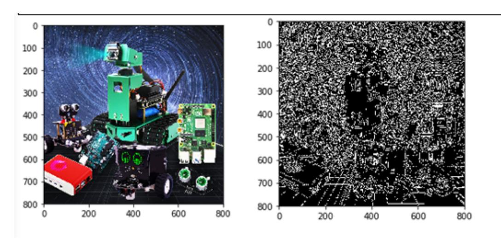
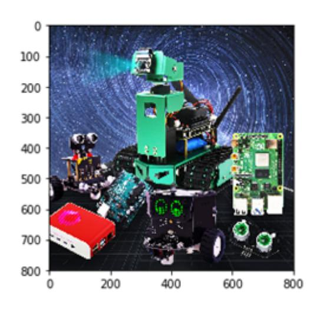
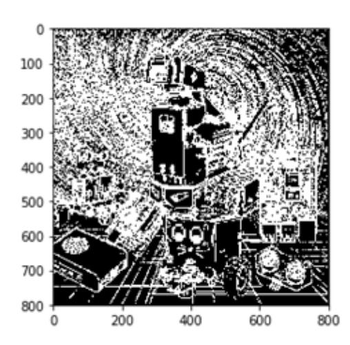

# Edge Detection

The goal of edge detection is to significantly reduce the size of an image's data while preserving its original properties. Currently, there are multiple algorithms for edge detection. Although the Canny algorithm is quite old, it can be considered a standard algorithm for edge detection and is still widely used in research. Canny edge detection is a technique that extracts useful structural information from different visual objects and significantly reduces the amount of data to be processed. It is currently widely used in various computer vision systems. Canny discovered that the requirements for edge detection are relatively similar across different visual systems, thus enabling the development of a broadly applicable edge detection technique. General criteria for edge detection include:

Detecting edges with a low error rate means capturing as many edges in an image as accurately as possible. Detected edges should be precisely located at the center of true edges. A given edge in an image should be marked only once, and, where possible, image noise should not produce false edges. To meet these requirements, Canny uses a variational method. The optimal function in the Canny detector is described by the sum of four exponential terms, which can be approximated by the first-order derivative of a Gaussian function.

Among the commonly used edge detection methods, the Canny edge detection algorithm is one that has a strict definition and provides good and reliable detection. Because it meets the three edge detection criteria and has the advantages of a simple implementation process, it has become one of the most popular edge detection algorithms.

The Canny edge detection algorithm can be divided into the following 5 steps:

- 1. Use a Gaussian filter to smooth the image and remove noise.
- 2. Calculate the gradient strength and direction for each pixel in the image.
- 3. Apply non-maximum suppression to eliminate spurious responses caused by edge detection.
- 4. Apply Double-Threshold detection to determine real and potential edges.
- 5. Finally, edge detection is completed by suppressing isolated weak edges.

## Code path:

```
opencv/opencv_basic/03_Image processing and text drawing/03_1Edge detection
1.ipynb
```

```python
#Method 1
import cv2
import numpy as np
import random
import matplotlib.pyplot as plt
img = cv2.imread('image0.jpg',1)
imgInfo = img.shape
height = imgInfo[0]
width = imgInfo[1]
#cv2.imshow('src',img)
#canny 1 gray 2 Gauss 3 canny
gray = cv2.cvtColor(img,cv2.COLOR_BGR2GRAY)
imgG = cv2.GaussianBlur(gray,(3,3),0)
```

```
dst = cv2.Canny(img,50,50) # Image convolution--th
# cv2.imshow('dst',dst)
    # cv2.waitKey(0)
```

## Compare the two pictures

```
img_bgr2rgb1 = cv2.cvtColor(img, cv2.COLOR_BGR2RGB)
plt.imshow(img_bgr2rgb1)
    plt.show()
```

```
img_bgr2rgb1 = cv2.cvtColor(dst, cv2.COLOR_BGR2RGB)
plt.imshow(img_bgr2rgb1)
plt.show()
```



## Code path:

opencv/opencv_basic/03_Image processing and text drawing/03_2 Edge detection 2.ipynb

```python
#Method 2
import cv2
import numpy as np
import random
import math
img = cv2.imread('image0.jpg',1)
imgInfo = img.shape
height = imgInfo[0]
width = imgInfo[1]
# cv2.imshow('src',img)
# sobel 1 operator template 2 image convolution 3 threshold judgment
# [1 2 1 [ 1 0 -1
# 0 0 0 2 0 -2
# -1 -2 -1 ] 1 0 -1 ]
# [1 2 3 4] [abcd] a*1+b*2+c*3+d*4 = dst
# sqrt(a*a+b*b) = f>th
gray = cv2.cvtColor(img,cv2.COLOR_BGR2GRAY)
dst = np.zeros((height,width,1),np.uint8)
for i in range(0,height-2):
```

```
for j in range(0,width-2):
        gy = gray[i,j]*1+gray[i,j+1]*2+gray[i,j+2]*1-gray[i+2,j]*1-
gray[i+2,j+1]*2-gray[i+2,j+2]*1
        gx = gray[i,j]+gray[i+1,j]*2+gray[i+2,j]-gray[i,j+2]-gray[i+1,j+2]*2-
gray[i+2,j+2]
        grad = math.sqrt(gx*gx+gy*gy)
        if grad>50:
            dst[i,j] = 255
        else:
            dst[i,j] = 0
# cv2.imshow('dst',dst)
    # cv2.waitKey(0)
```




