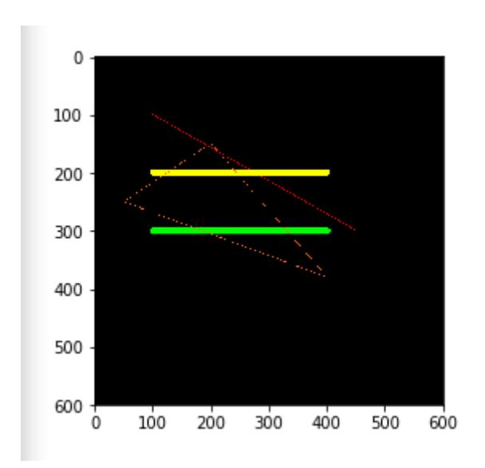

# Line drawing

When using OpenCV to process images, we sometimes need to draw line segments, rectangles, etc. on the image. In OpenCV, we use the line(dst, pt1, pt2, color, thickness=None, lineType=None, shift=None) function to draw line segments.

Parameter Description:

dst: output image.

pt1, pt2: Required parameters. The coordinate points of the line segment, representing the starting point and the ending point respectively

color: Required parameter. Used to set the color of the line segment

thickness: optional parameter. Used to set the width of the line segment

lineType: Optional parameter. Used to set the type of line segment. Optional values include 8 (8 adjacent connected lines - default), 4 (4 adjacent connected lines), and cv2.LINE_AA for antialiasing.

Code path:

opencv/opencv_basic/03_Image processing and text drawing/04 Line segment drawing.ipynb

```python
import cv2
import numpy as np
import matplotlib.pyplot as plt
newImageInfo = (600, 600, 3)
dst = np.zeros(newImageInfo,np.uint8)
# line
# Draw line segment 1 dst 2 begin 3 end 4 color
cv2.line(dst, (100,100), (450,300), (0,0,255))
# 5 line w
cv2.line(dst, (100,200), (400,200), (0,255,255), 10)
# 6 line type
cv2.line(dst, (100,300), (400,300), (0,255,0), 10, cv2.LINE_AA)
cv2.line(dst, (200,150), (50,250), (25,100,255))
cv2.line(dst, (50,250), (400,380), (25,100,255))
cv2.line(dst, (400,380), (200,150), (25,100,255))
# cv2.imshow('dst',dst)
# cv2.waitKey(0)
dst = cv2.cvtColor(dst, cv2.COLOR_BGR2RGB)
plt.imshow(dst)
    plt.show()
```


