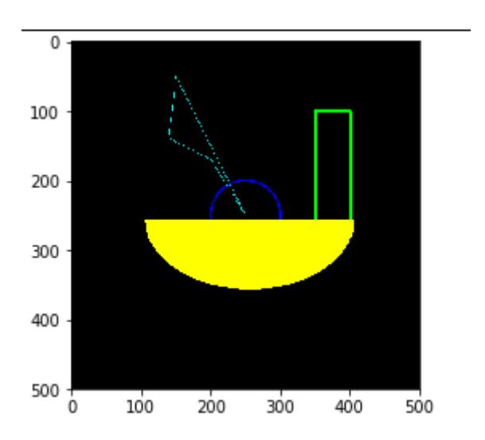

# Rectangle and circle drawing

## 1. Drawing a rectangle

rectangle(img, pt1, pt2, color, thickness=None, lineType=None, shift=None)

Parameter Description:

img: canvas or carrier image.

pt1, pt2: Required parameters. The vertices of the rectangle, representing the top and diagonal vertices, i.e. the upper left corner and lower right corner of the rectangle (these two vertices can determine a unique rectangle)

color: Required parameter. Used to set the color of the rectangle

thickness: Optional parameter. Used to set the width of the rectangle side. When the value is negative, it means filling the rectangle.

lineType: Optional parameter. Used to set the type of line segment. Optional values include 8 (8 adjacent connected lines - default), 4 (4 adjacent connected lines), and cv2.LINE_AA for antialiasing.

## 2. Drawing a circle

cv2.circle(img, center, radius, color[,thickness[,lineType]])

Parameter Description:

img: canvas or carrier image

center: the coordinates of the circle center, format: (50,50)

radius: radius

color: color

thickness: Line thickness. Defaults to 1. If -1, it is filled solid.

lineType: Line type. The default is 8, connection type. The following table describes

| parameter   | illustrate                                                 |
|-------------|------------------------------------------------------------|
| cv2.FILLED  | filling                                                    |
| cv2.LINE_4  | 4Connection Type                                           |
| cv2.LINE_8  | 8 connection types                                         |
| cv2.LINE_AA | Anti-aliasing, this parameter will make the lines smoother |

## 3. Draw an ellipse

cv2.ellipse(img, center, axes, angle, StartAngle, endAngle, color[,thickness[,lineType]])

center: the center point of the ellipse, (x, x)

Axes: refers to the short radius and long radius, (x, x)

Angle: refers to the angle of counterclockwise rotation

StartAngle: The angle of the arc's starting angle

endAngle: The angle of the arc end angle

For img and color, please refer to the description of circle.

#The fifth parameter refers to the counterclockwise starting angle of the drawing, and the sixth refers to the counterclockwise ending angle of the drawing

#If the 456 parameter is added with a sign, it means the opposite direction, that is, clockwise.

## 4. Draw polygons

cv2.polylines(img,[pts],isClosed, color[,thickness[,lineType]])

pts: vertices of the polygon

isClosed: Whether it is closed. (True/False)

Other parameters refer to the circle drawing parameters

Code path:

opencv/opencv_basic/03_Image processing and text drawing/05Draw a rectangular circle.ipynb

```python
import cv2
import numpy as np
newImageInfo = (500,500,3)
dst = np.zeros(newImageInfo,np.uint8)
# 1 2 top left corner 3 bottom right corner 4 5 fill -1 >0 line w
cv2.rectangle(dst,(350,100),(400,270),(0,255,0),3)
# 2 center 3 r
cv2.circle(dst,(250,250),(50),(255,0,0),2)
# 2 center 3 axis 4 angle 5 begin 6 end 7
cv2.ellipse(dst, (256,256), (150,100), 0, 0, 180, (0,255,255), -1)
points = np.array([[150,50], [140,140], [200,170], [250,250], [150,50]],
np.int32)
#print(points.shape)
points = points.reshape((-1,1,2))
#print(points.shape)
cv2.polylines(dst,[points],True,(255,255,0))
# cv2.imshow('dst',dst)
    # cv2.waitKey(0)
```

```python
import matplotlib.pyplot as plt
dst = cv2.cvtColor(dst, cv2.COLOR_BGR2RGB)
plt.imshow(dst)
plt.show()
```


