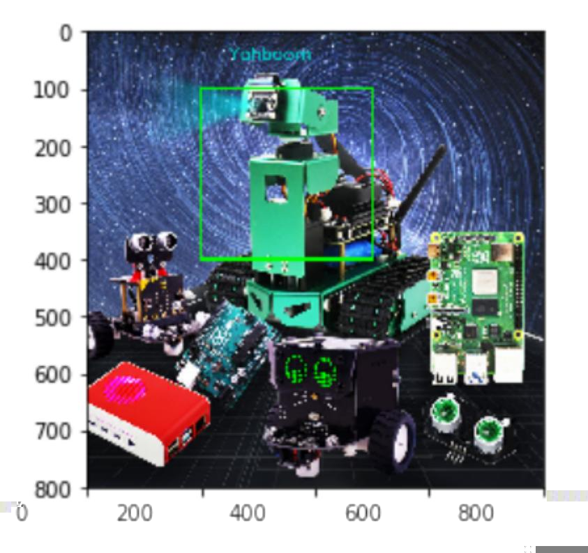

# Text and picture drawing

Function call: cv2.putText(img, str, origin, font, size, color, thickness)

The parameters are: picture, added text, upper left corner coordinates (integer), font, font size, color, font weight.

The font types are as follows:


## Code path:

opencv/opencv_basic/03_Image processing and text drawing/06Text and image drawing.ipynb

```python
import cv2
import numpy as np
img = cv2.imread('yahboom.jpg',1)
font = cv2.FONT_HERSHEY_SIMPLEX
cv2.rectangle(img,(200,100),(500,400),(0,255,0),3)
# 1 dst 2 text content 3 coordinates 4 5 font size 6 color 7 thickness 8 line
type
cv2.putText(img,'Yahboom',(250,50),font,1,(200,200,0),2,cv2.LINE_AA)
# cv2.imshow('src',img)
# cv2.waitKey(0)
```

```python
import matplotlib.pyplot as plt\nimg = cv2.cvtColor(img, cv2.COLOR_BGR2RGB)
plt.imshow(img)
plt.show()
```


