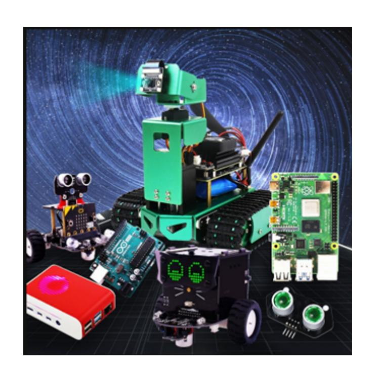

## Image writing

Function method: cv2.imwrite('yahboom1.jpg', img).

The first parameter is the file name to save, and the second parameter is the saved image.

Next, we demonstrate how to write an image. First, we read an image yahboom.jpg and then write it to yahboom1.jpg.

Code path:

```
~/opencv/opencv_basic/01_Getting_Started_with_OpenCV/02_OpenCV Image
writing.ipynb
import cv2
# 1 File reading 2 Packaging format analysis 3 Data decoding 4 Data loading
img = cv2.imread('yahboom.jpg', 1)
# cv2.imshow('yahboom, img) #See the explanation below
cv2.imwrite('yahboom1.jpg', img) # 1 name 2 dat
```

The cv2.imshow('yahboom, img) function in jupyLab cannot be executed. If you need to use this sentence to display the read image, you need to execute the python file through the command: python3 XX.py

```
#bgr8 to jpeg format
import enum
import cv2
def bgr8_to_jpeg(value, quality=75):
      return bytes(cv2.imencode('.jpg', value)[1])
import ipywidgets.widgets as widgets
image_widget = widgets.Image(format='jpg', width=320, height=240)
display(image_widget)
img = cv2.imread('yahboom1.jpg',1)
image_widget.value = bgr8_to_jpeg(img)
```

When the code block finishes running, you can see that the yahboom.jpg image is written to yahboom1.jpg.


