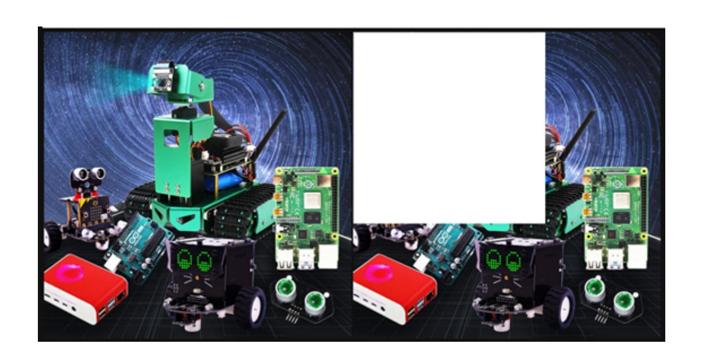

# 5.OpenCV pixel operations

Pixel operations allow us to change the color of any pixel at any position. Here we first read the image and then assign an area to white.

Code path:

```
opencv/opencv_basic/01_Getting_Started_with_OpenCV/04_OpenCV pixel
operation.ipynb
```

The main code is as follows:

```python
import cv2
img = cv2.imread('yahboom.jpg',1)
(b,g,r) = img[100,100]
print(b,g,r)# bgr
#10 100 --- 110 100
i=j=0
for j in range(1,500):
      img[i,j] = (255,255,255)
      for i in range(1,500):
        img[i,j] = (255,255,255)
# cv2.imshow('image',img)
# cv2.waitKey(0) #1000 ms
```

```python
#bgr8 to jpeg format
import enum
import cv2
def bgr8_to_jpeg(value, quality=75):
      return bytes(cv2.imencode('.jpg', value)[1])
```

JupyterLab displays the before and after image comparison:

```python
import ipywidgets.widgets as widgets
image_widget1 = widgets.Image(format='jpg', )
image_widget2 = widgets.Image(format='jpg', )
# create a horizontal box container to place the image widget next to , each
other
image_container = widgets.HBox([image_widget1, image_widget2])
# display the container in this cell's output
display(image_container)
img1 = cv2.imread('yahboom.jpg',1)
image_widget1.value = bgr8_to_jpeg(img1) #original
image_widget2.value = bgr8_to_jpeg(img) #After pixel operation
```

After the code block is run, you can see that some of the pixels in the second image have turned into white pixels.


