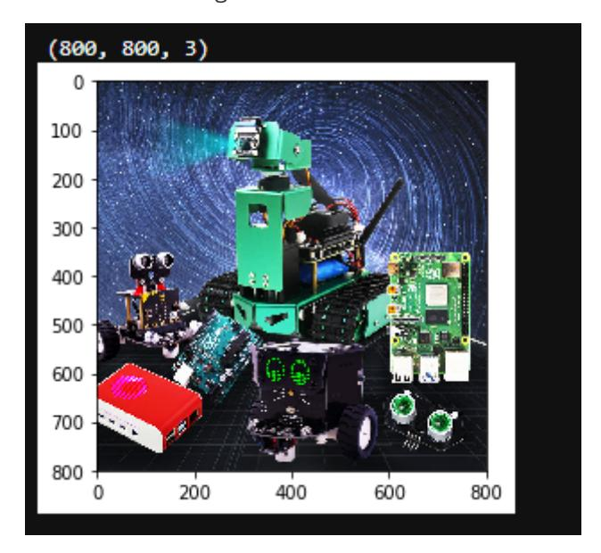
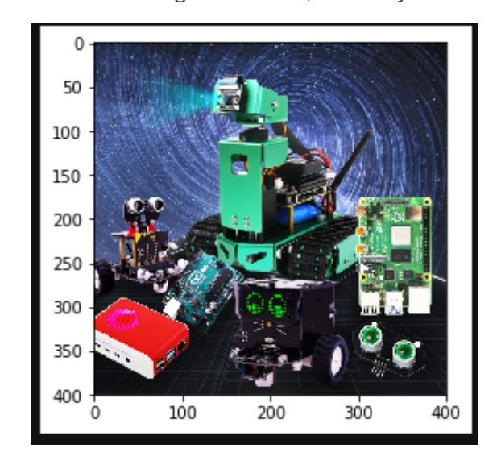
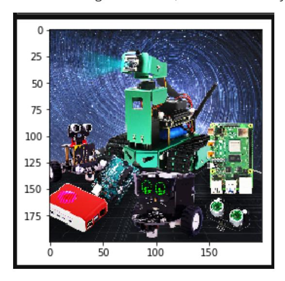
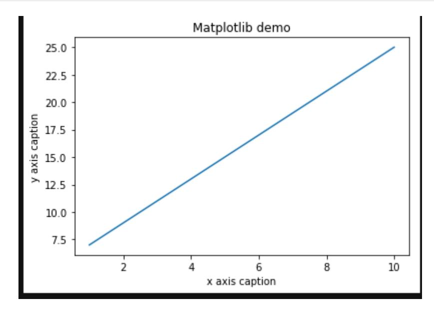

# Image zoom

In OpenCV, the function for image scaling is: cv2.resize(InputArray src, OutputArray dst, Size, fx, fy, interpolation)

Code path:

```
opencv/opencv_basic/02_OpenCV Transform/01 pixel operation.ipynb
```

## Parameter explanation:

| InputArray src  | Input image                                |
|-----------------|--------------------------------------------|
| OutputArray dst | Output image                               |
| Size            | Output image size                          |
| fx, fy          | Scaling factor along the x-axis and y-axis |
| interpolation   | Insertion method                           |

The interpolation method used by the options:

| INTER_NEAREST  | Nearest neighbor interpolation                    |
|----------------|---------------------------------------------------|
| INTER_LINEAR   | Bilinear interpolation (the default)              |
| INTER_AREA     | Resampling using pixel region relations.          |
| INTER_CUBIC    | Bicubic interpolation of a 4x4 pixel neighborhood |
| INTER_LANCZOS4 | Lanczos interpolation of 8x8 pixel neighborhood   |

## Notice:

- \1. The output size format is (width, height)
- \2. The default interpolation method is: bilinear interpolation

The main code is as follows:

```python
# 1 load 2 info 3 resize 4 check
import cv2
import matplotlib.pyplot as plt # Python 2D plotting library
# Read in the original image
img = cv2.imread('yahboom.jpg')
# Print out the image size
print(img.shape)
# Assign the image height and width to x and y respectively
x, y = img.shape[0:2]
# Scale to half of the original size, output size format is (width, height)
img_test1 = cv2.resize(img, (int(y / 2), int(x / 2)))
```

```
# cv2.imshow('resize0', img_test1)
# cv2.waitKey()
# Nearest neighbor interpolation scaling
# Scale to one-quarter of its original size
img_test2 = cv2.resize(img, (0, 0), fx=0.25, fy=0.25,
interpolation=cv2.INTER_NEAREST)
# cv.imshow('resize1', img_test2)
# cv2.waitKey()
# cv2.destroyAllWindows()
img = cv2.cvtColor(img, cv2.COLOR_BGR2RGB)
dst1 = cv2.cvtColor(img_test1, cv2.COLOR_BGR2RGB)
dst2 = cv2.cvtColor(img_test2, cv2.COLOR_BGR2RGB)
# Display the original image
plt.imshow(img)
plt.show()
```

After execution, you can see that the image is 800\*800



```
# Display zoom 1/2
plt.imshow(dst1)
plt.show()
```

After execution, you can see that the image is 400\*400, scaled by half



```
# Display zoom 1/4 neighbor interpolation zoom
plt.imshow(dst2)
plt.show()
```

After execution, you can see that the image is 200\*200, which is scaled by one quarter.



Next, let's talk about matplotlib: Python's 2D plotting library.

Reference tutorial:<https://www.runoob.com/numpy/numpy-matplotlib.html>

```python
import numpy as np
from matplotlib import pyplot as plt
x = np.arange(1,11)
y = 2 * x + 5
plt.title("Matplotlib demo")
plt.xlabel("x axis caption")
plt.ylabel("y axis caption")
plt.plot(x,y)
plt.show()
```


