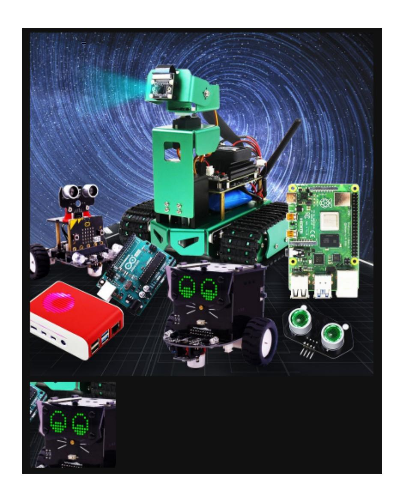

# 7. Image cutting

Image cropping first reads the image and then retrieves the pixel region from the array. The following code selects a region with an X:300-500 and a Y:500-700 pixel resolution. Note that the image size is 800\*800, so the selected region should not exceed this resolution.

Code path:

```python
opencv/opencv_basic/02_OpenCV Transform/02Picture clipping.ipynb
import cv2
img = cv2.imread('yahboom.jpg', 1)
dst = img[500:700,300:500] #Select the rectangular area X: 300-500 Y: 500-700
#cv2.imshow('image',dst)
#cv2.waitKey(0)
```

The following will show the comparison of two compressed images in the jupyterLab control:

```python
#bgr8 to jpeg format
import enum
import cv2
def bgr8_to_jpeg(value, quality=75):
   return bytes(cv2.imencode('.jpg', value)[1])
```

Here are the before and after images:

```python
import ipywidgets.widgets as widgets
image_widget1 = widgets.Image(format='jpg', )
image_widget2 = widgets.Image(format='jpg', )
# display the container in this cell's output
display(image_widget1)
display(image_widget2)
img1 = cv2.imread('yahboom.jpg',1)
image_widget1.value = bgr8_to_jpeg(img1) #original image
image_widget2.value = bgr8_to_jpeg(dst) #Cut image
```

After the program is run, you can see that some parts have been cut out.


