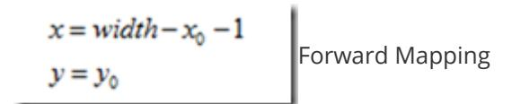
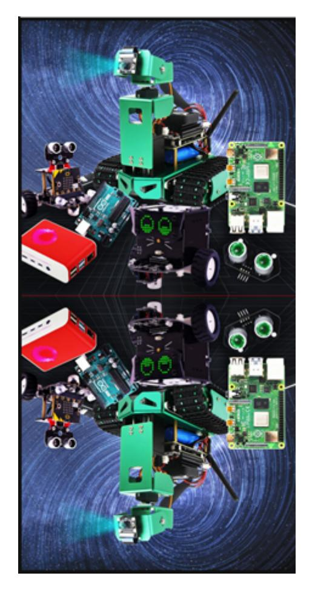

## Image mirroring

There are two types of image mirroring: horizontal and vertical. Horizontal mirroring swaps the image's pixels around its vertical centerline, essentially swapping the left and right halves. Vertical mirroring swaps the top and bottom halves around its horizontal centerline.

Transformation principle: Let the width of the image be width and the length be height. (x,y) is the coordinate after transformation, and (x0,y0) is the coordinate of the original image.

## Horizontal mirror transformation



Its inverse transform is

$$x_0 = width - x - 1$$

 $y_0 = y$  Backward Mapping

## Vertical mirror transformation

$$x = x_0$$
$$y = height - y_0 - 1$$

Its inverse transform is

$$x_0 = x$$
$$y_0 = height - y - 1$$

Summarize:

During a horizontal mirroring transformation, the entire image is traversed, and then each pixel is processed according to the mapping relationship. In fact, a horizontal mirroring transformation is to swap the image coordinate columns to the right and the right columns to the left. The transformation can be performed on a column-by-column basis. The same is true for a vertical mirroring transformation, which can be performed on a row-by-row basis. Here, we take a vertical transformation as an example to see how it is written in Python:

Code path:

```
opencv/opencv_basic/02_OpenCV Transform/04 Image mirroring.ipynb
```

```
import cv2
import numpy as np
img = cv2.imread('yahboom.jpg',1)
#cv2.imshow('src',img)
imgInfo = img.shape
height = imgInfo[0]
width = imgInfo[1]
deep = imgInfo[2]
```

```
newImgInfo = (height*2,width,deep)
dst = np.zeros(newImgInfo,np.uint8)#uint8
for i in range(0,height):
    for j in range(0,width):
        dst[i,j] = img[i,j]
        #xy = 2*h - y -1
        dst[height*2-i-1,j] = img[i,j]
for i in range(0,width):
    dst[height,i] = (0,0,255) #BGR
```

```
#bgr8 to jpeg format
import enum
import cv2
def bgr8_to_jpeg(value, quality=75):
    return bytes(cv2.imencode('.jpg', value)[1])
```

```
import ipywidgets.widgets as widgets
image_widget1 = widgets.Image(format='jpg', )
# image_widget2 = widgets.Image(format='jpg', )
# create a horizontal box container to place the image widget next to each other
# image_container = widgets.HBox([image_widget1, image_widget2])
# display the container in this cell's output
display(image_widget1)
#display(image_widget2)
image_widget1.value = bgr8_to_jpeg(dst)
```



You can see the mirror image from the picture.
