# Register a Model Service Account

## 1. Course Content

Register an account with a model service provider and create an API key using your email address or mobile phone number. This gives the robot access to cloud-based models.

## 2. Register an Alibaba Cloud Model Studio Account

### 2.1 Alibaba Cloud Model Studio

[International site: https://modelstudio.console.alibabacloud.com/ap-southeast-1/?tab=doc](https://modelstudio.console.alibabacloud.com/ap-southeast-1/?tab=doc#/doc/?type=model&url=2840914)

Click **Log in** to register an account.

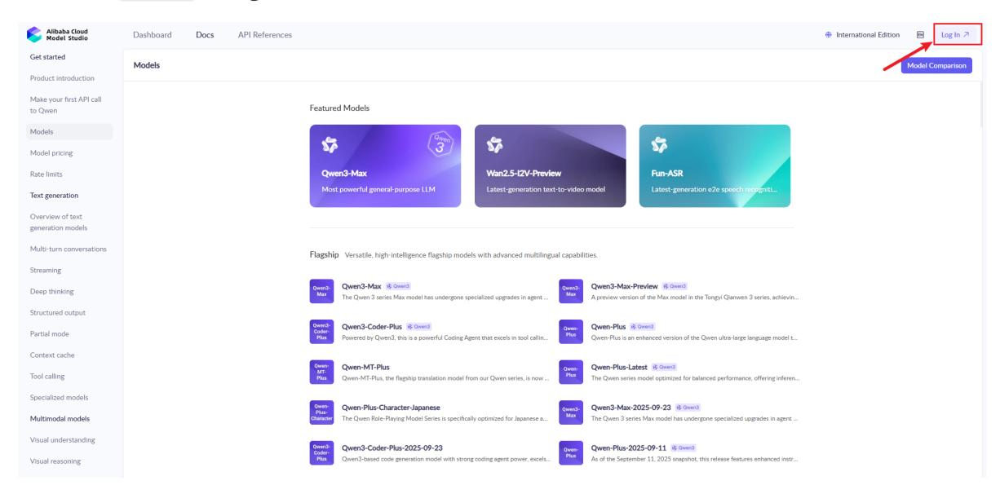

If you do not already have an account, register one first.

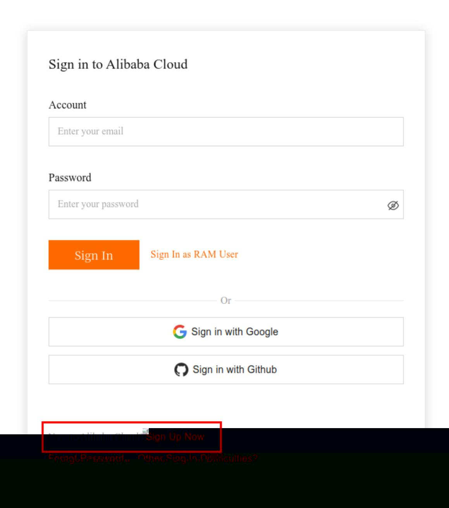

Choose **Individual Account** to register.

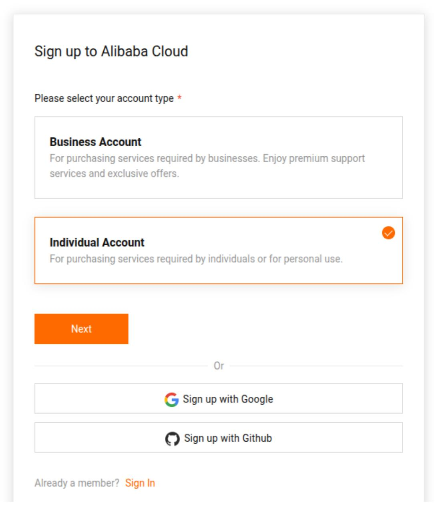

Return to the Alibaba Cloud Model Studio home page, refresh the page, and click **Agree** to complete Model Studio registration.

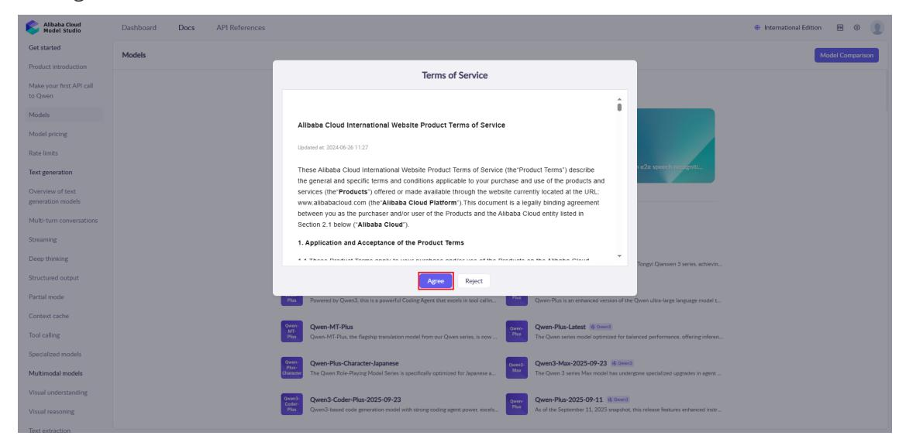

In **API References**, click [Singapore](https://modelstudio.console.alibabacloud.com/?tab=playground#/api-key) to open the API key creation page.

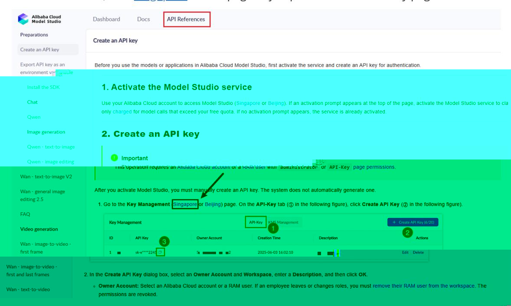

Click **Create API Key**, select the account, and click **OK**.

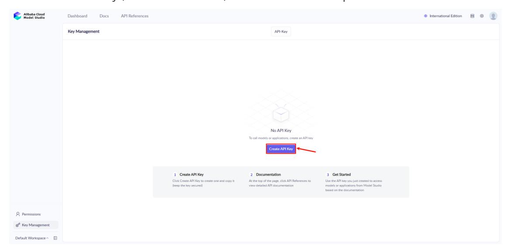

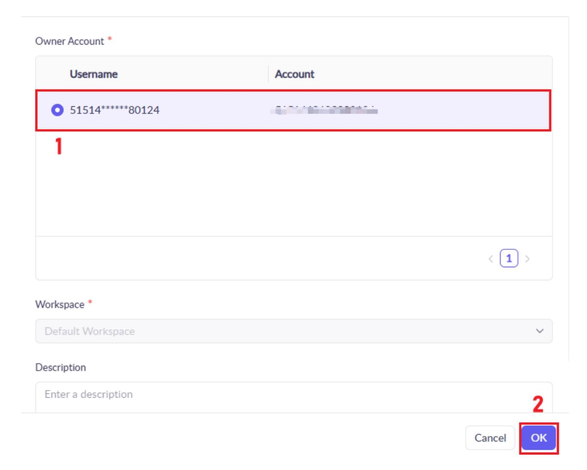

At this point, Alibaba Cloud Model Studio account registration and API key creation are complete.

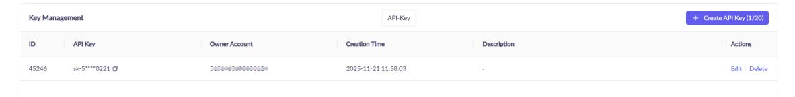

### 2.2 Free Quota

When you activate Alibaba Cloud Model Studio in the Singapore region for the first time, each model receives a free quota automatically.

You can view the remaining quota for each model and select model versions in the **Models** section. For example, click the Qwen-Plus model to view its details.

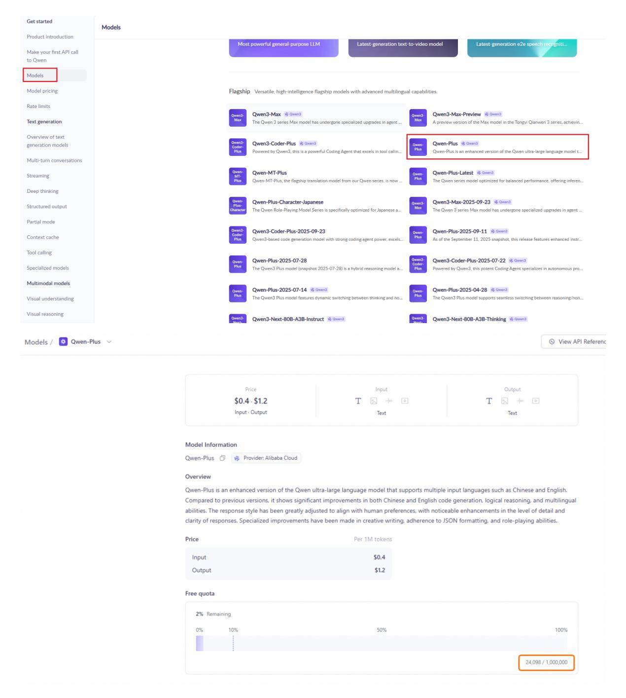

The free quota for new users is usually valid for 30 to 90 days, starting from the date you activate Model Studio or the date your model request is approved. After the validity period expires or the free quota is used up, continued use of the model inference service will incur fees.

For details, see [Free quota for new users](https://modelstudio.console.alibabacloud.com/?tab=doc#/doc/?type=model&url=2766612).

## 3. OpenRouter Platform Account

> [!NOTE]
> OpenRouter provides many free model services, but access frequency is limited and the capabilities of free models vary widely. For a better user experience, Alibaba Bailian model services are recommended first. This section is for users who need OpenRouter services.

### 3.1 Register an Account

Open [OpenRouter](https://openrouter.ai/), then click the avatar in the upper-right corner to register an account. Email registration is similar to the process above, so it is not repeated here.

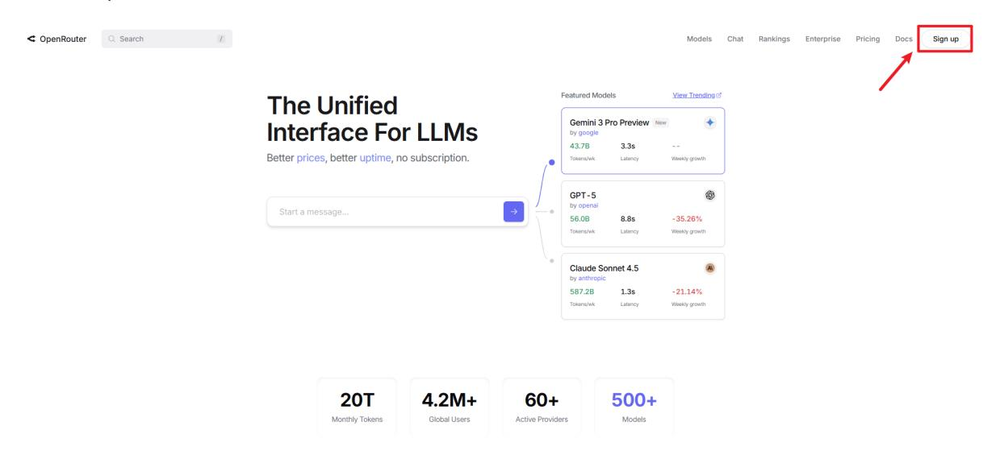

### 3.2 Create an API Key

Click **Keys** in the upper-right corner to create an API key.

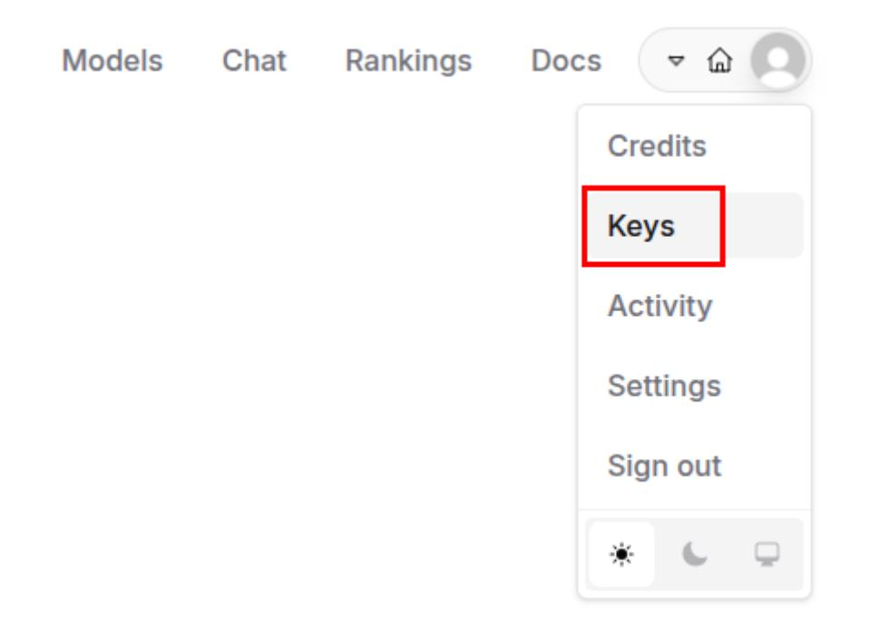

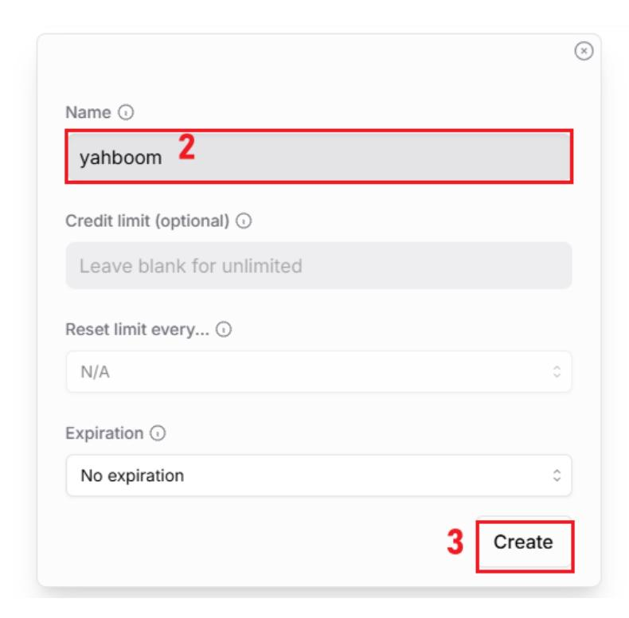

You will receive an API key. **Copy this key immediately, because it cannot be viewed again after you close the page.**

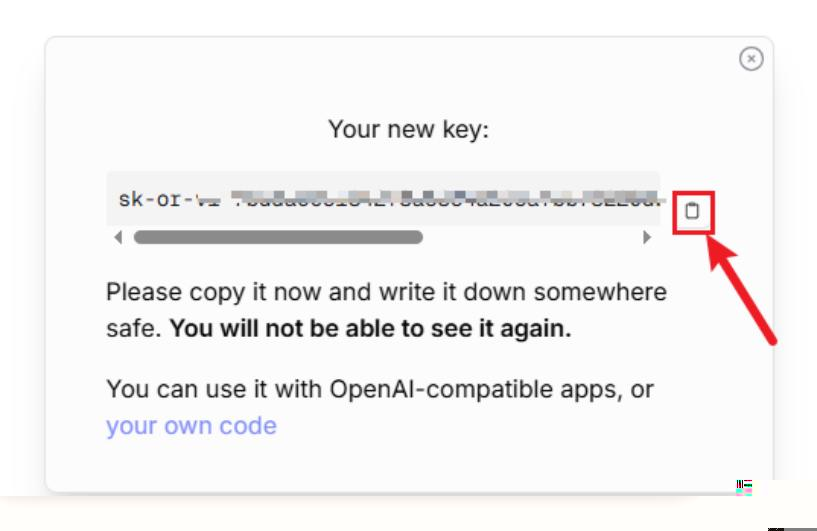
