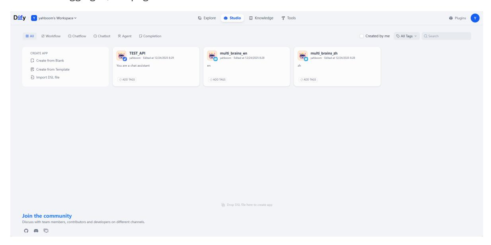
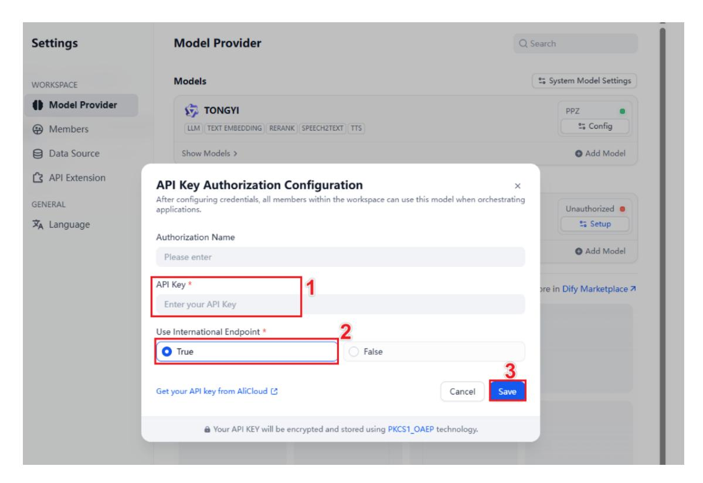
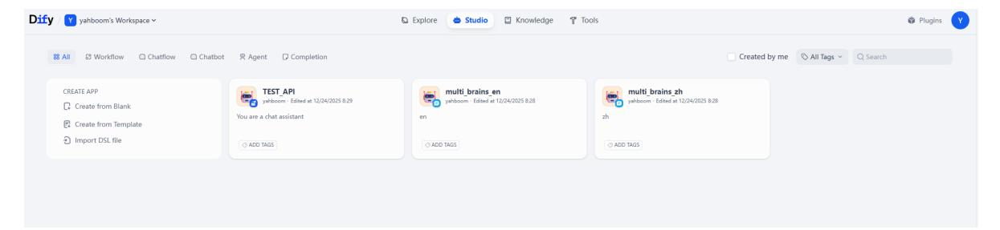
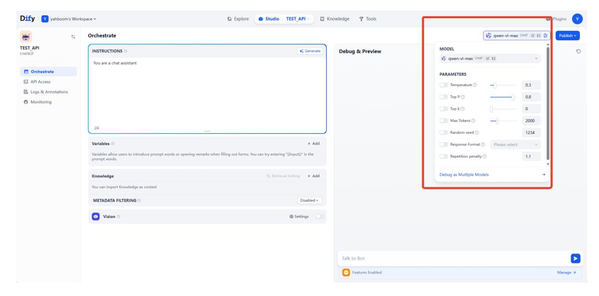
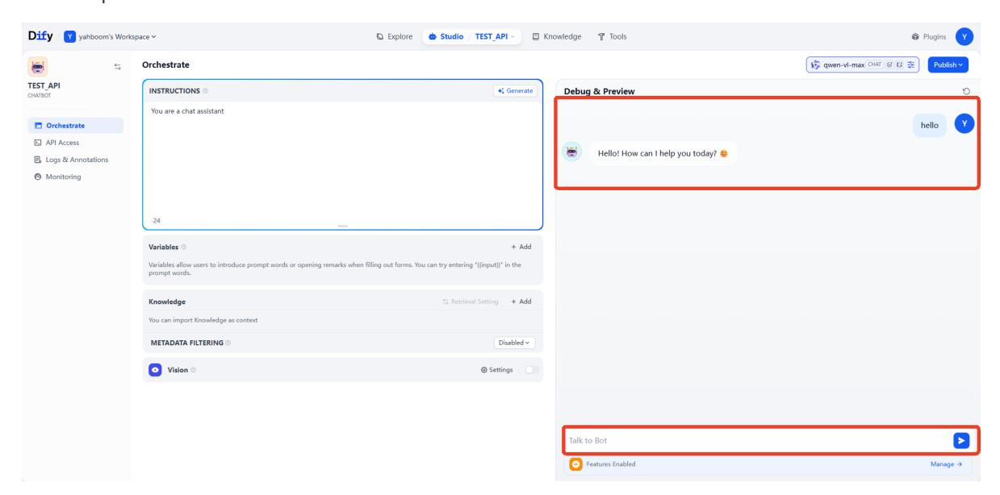
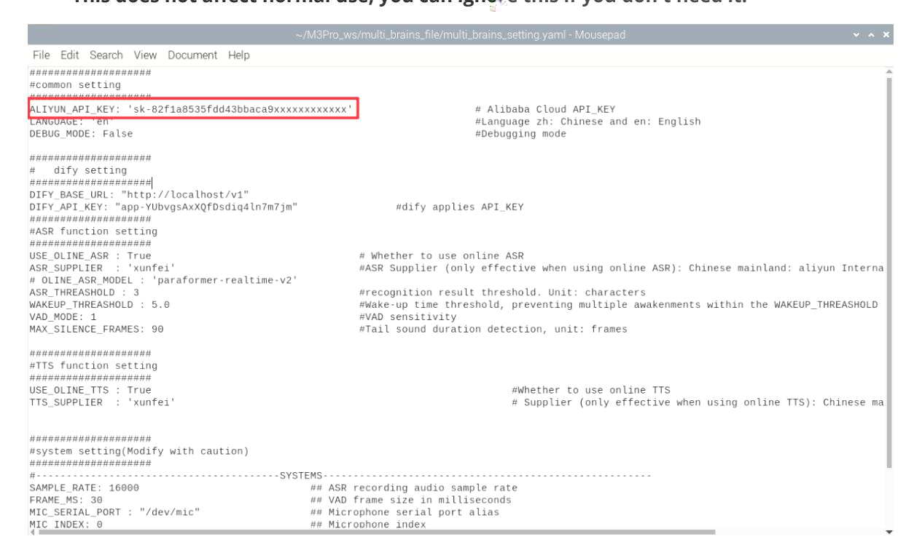

# Configure the API Key

## 1. Course Content

Use the API key registered earlier to configure the robot's model-service access.

> [!WARNING]
> Make sure the robot is connected to the internet before using cloud-based model services.

## 2. Start the Dify Service

> [!TIP]
> ROSMASTER-M3 Pro uses Dify to build a multi-agent system. Dify manages calls to cloud-based models.

Connect to the robot system through VNC or SSH, then run the following command in a terminal:

```bash
bringup_dify
```

Check the robot's IP address. You can view it on the OLED screen or run `ifconfig` in the terminal.

Enter the robot's IP address directly in your browser address bar to open the Dify management page. If this is your first login, use the account and password below. You can change the page language in the upper-left corner.

> [!NOTE]
> Account: `yahboom@163.com`
>
> Password: `yahboom123`
>
> All account passwords, AI agent applications, and RAG data are stored locally.

After login, the page looks like this:



## 3. Configure the Model Service Provider API Key

Click **Settings**.


This example uses the Alibaba Cloud Model Studio API. Click **Model Provider** -> **Setup**.


Enter your Alibaba Cloud Model Studio API key, select whether it is an international account, and click **Save**.



## 4. Test the API Key

> [!TIP]
> Use this section if you need to test whether your API key is valid. Otherwise, you can skip it.

Click the **TEST_API** application in the studio.



Select any model from the model selector for testing.



Enter any content in the chat box. If the API key is valid, the model will respond.



## 5. Configure the `multi_brains` Package API

Generate the parameter file by running the following commands in the terminal:

```bash
cd ~/M3Pro_ws/multi_brains_file
cp .multi_brains_setting_example_en.yaml multi_brains_setting.yaml
```

If you later use Alibaba Cloud speech synthesis to generate custom voice files, apply for an API key from Alibaba Cloud International and fill in `ALIYUN_API_KEY`. **This does not affect normal use; ignore this setting if you do not need it.**



## 6. Use Local Speech Services

- By default, online speech services are used for speech recognition and speech synthesis. If you need local speech services, follow this section. Otherwise, skip it.
- Because of memory and performance limits, local speech services are not currently available on Jetson Nano.

### 6.1 Local Speech Recognition

```bash
nano ~/M3Pro_ws/multi_brains_file/multi_brains_setting.yaml
```

Find `USE_ONLINE_ASR` in the ASR settings and set it to `False`. Save and exit with Ctrl+X to enable local speech recognition.

Other parameters configure the recording process. See the comments for each parameter. Beginners can keep the default settings.

```yaml
####################
#ASR function setting
#Speech Recognition Function Settings
####################
USE_OLINE_ASR : False # Whether to use online
ASR
ASR_SUPPLIER : 'xunfei' #ASR Supplier (only
effective when using online ASR): Chinese mainland: aliyun International: xunfei
OLINE_ASR_MODEL : 'paraformer-realtime-v2'
ASR_THREASHOLD : 3 # ASR recognition result
threshold, unit: characters
WAKEUP_THREASHOLD : 5.0 # Wake-up time threshold, to
prevent multiple wake-ups within WAKEUP_THREASHOLD time, unit: seconds
VAD_MODE: 1 # VAD sensitivity
MAX_SILENCE_FRAMES: 90 # Tail sound duration
detection, unit: frames
```

### 6.2 Local Speech Synthesis

```bash
nano ~/M3Pro_ws/multi_brains_file/multi_brains_setting.yaml
```

Find `USE_OLINE_TTS` in the TTS settings and set it to `False`. Save and exit with Ctrl+X to enable local speech synthesis.

```yaml
####################
#TTS function setting
#Speech Synthesis Function Settings
####################
USE_OLINE_TTS : False
# Whether to use online TTS
... .
```

## 7. Modify the Dify Service API

- **Note:** This section is only for users with development needs and can usually be ignored.
- If you need to modify the address used by the robot system to access the Dify application API, or if Dify is deployed on another server, modify the access address in the configuration file:

```bash
nano ~/M3Pro_ws/multi_brains_file/multi_brains_setting.yaml
```

Find the `DIFY_API_KEY` and `DIFY_BASE_URL` parameters:

- `DIFY_BASE_URL` is the address used to access the Dify backend service.
- `DIFY_API_KEY` is the API key for the AI application in Dify.

```yaml
####################
# dify setting
# dify configuration options
####################
DIFY_BASE_URL: "http://localhost/v1"
DIFY_API_KEY: "app-mhawRyoHteauIho7wvXhlhwR" # Dify application
API_KEY
```
