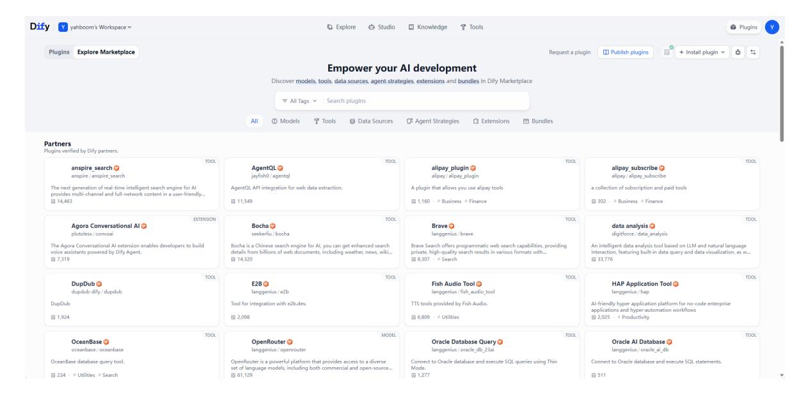

# Introduction to Dify

## 1. Course Content

Understand the basic functions of Dify to facilitate the development of subsequent AI agents.

## 2. Dify

### 2.1 Introduction

Dify is an open-source development and deployment platform for **production-grade agentic AI solutions**. Developers can quickly build, deploy, and scale AI applications without requiring complex technical skills.

### 2.2 Features

Visually build AI applications

Design AI workflows and applications intuitively through **drag-and-drop operations**. It supports the combination and nesting of complex logic, eliminating the need for in-depth backend development. Quickly complete the construction from conception to underlying logic, and rapidly build powerful AI agent applications.

Seamless Integration with Large AI Models from Global Model Service Providers

Simply apply for the corresponding model service provider's API-KEY to easily access hundreds of online model services.

Multi-Source Data Support

dify can extract and transform data from diverse data sources, automatically build indexes and store them in a vector database, providing efficient RAG (Retrieval Augmented Generation) for large models, and can directly deploy local RAG knowledge bases.

#### Rich Plugin System

Through Dify's rich plugin ecosystem, large AI models can be combined with tools and the RAG knowledge base to become AI agents, providing support for AI applications in various vertical fields.

