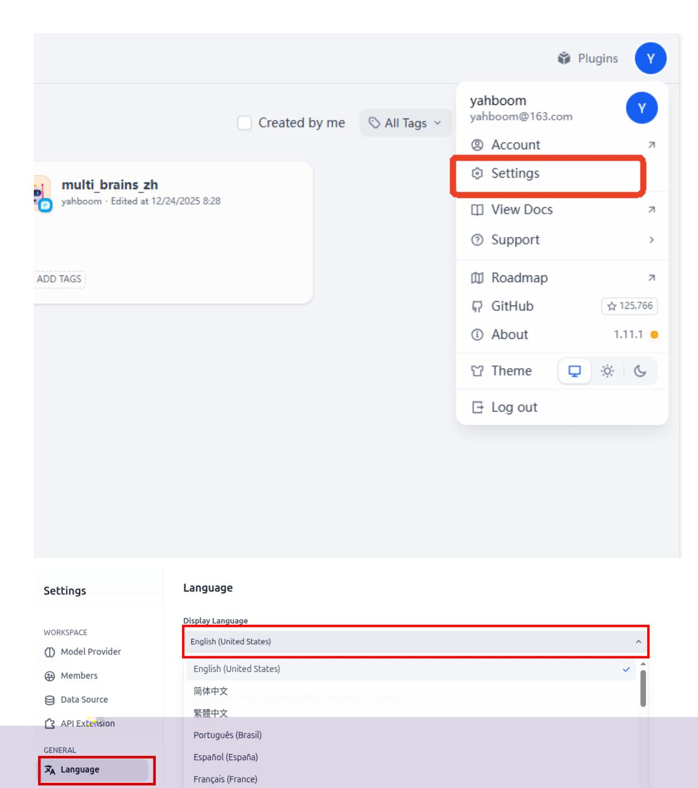
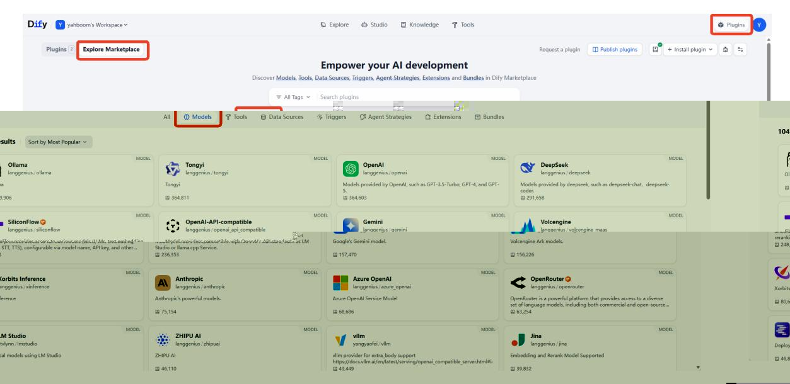
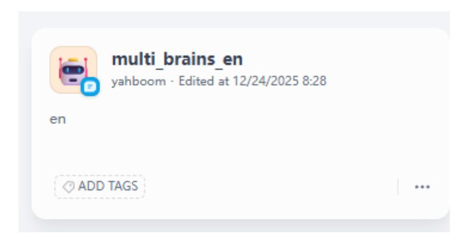
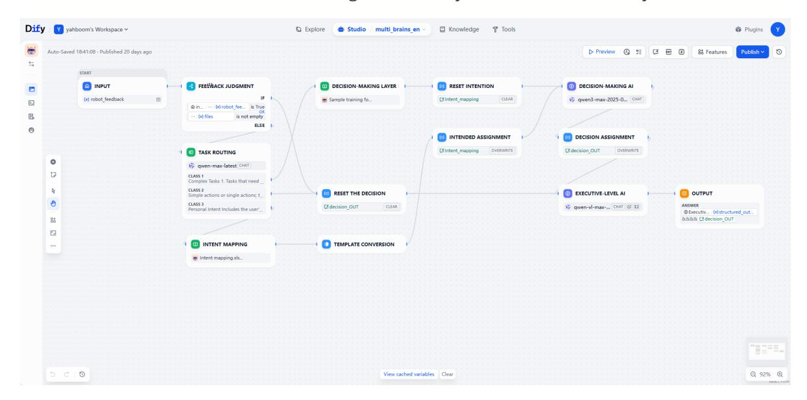
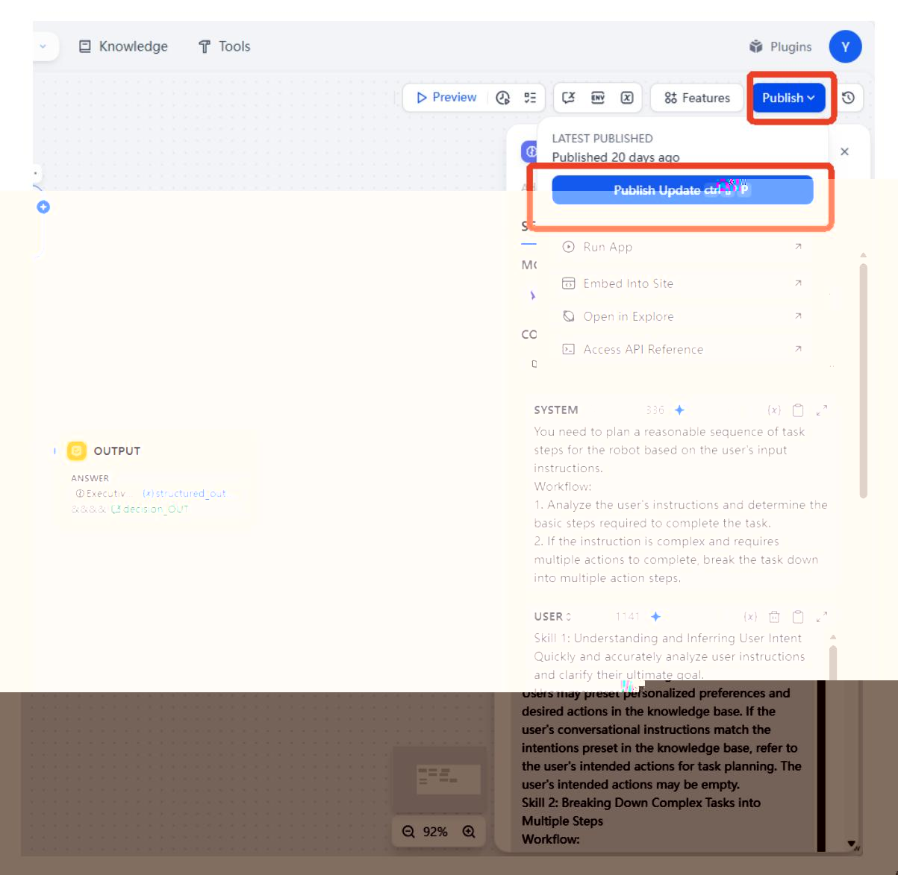
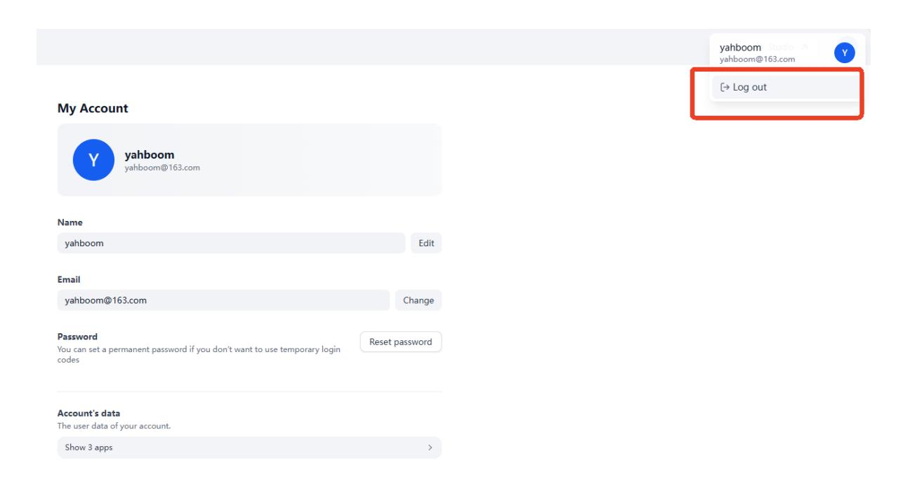
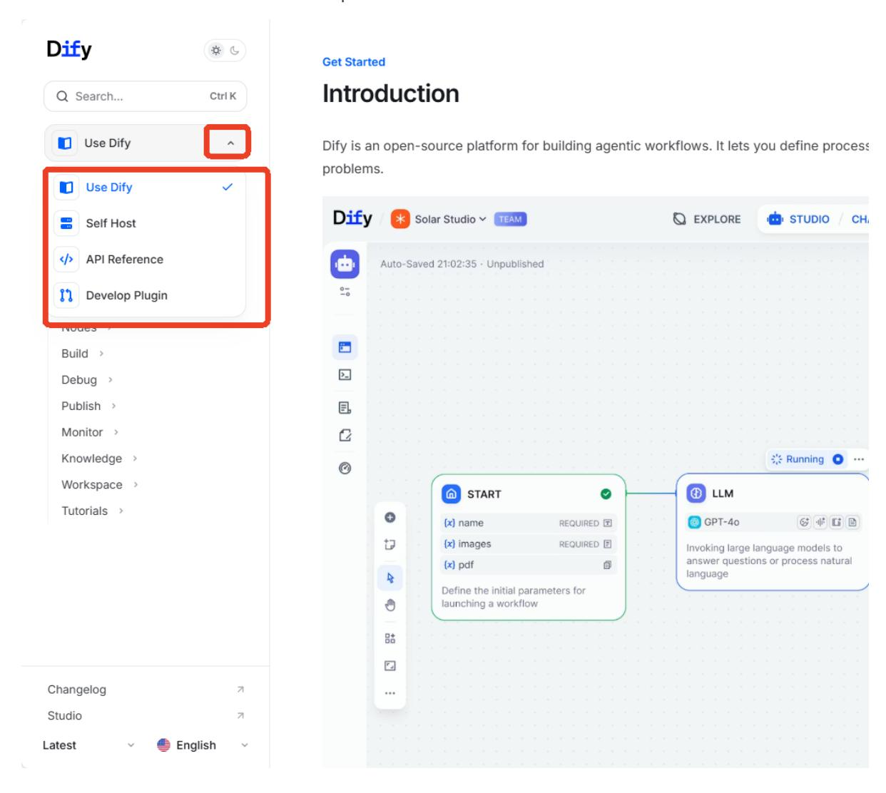

# Basic Dify Functions

## 1. Course Content

Learn and practice the basic operations and functions of Dify.

## 2. Start the Dify Service

Connect to the robot computer through VNC or SSH, then run the following command in the terminal:

```bash
bringup_dify
```

Check the robot's IP address. You can view it on the OLED screen, use `ifconfig`, or check it directly in the terminal.

Enter the robot's IP address directly in the browser address bar to open the Dify management page. If this is the first login, use the account and password below. You can change the language in the upper-left corner.

> [!NOTE]
> Account: `yahboom@163.com`
>
> Password: `yahboom123`
>
> All account passwords, AI agent applications, and RAG data are stored locally.

The Dify main interface is shown below:


## 3. Basic Usage

> [!TIP]
> If you need cloud-based AI models from model providers, make sure the robot computer is connected to the internet.

### 3.1 Switch the Dify Language

Usually, Dify follows the browser language. To switch manually, select the language in the settings.



### 3.2 Access Model Provider Services

- Dify includes model interface plugins for many model providers. These plugins are maintained and upgraded by their respective providers. Install the corresponding plugin to quickly access cloud models from different vendors.
- On the home page, click **Plugins** -> **Explore Marketplace** -> **Models** in the upper-left corner to open the model plugin page.



This example installs and configures the Tongyi Qianwen plugin. Other plugins are installed the same way: click **Install**.


Then enter the API key from the corresponding platform in the **Model Provider** section of the **Settings** page. If the API key is valid, the corresponding plugin shows a green indicator.

> [!TIP]
> For detailed API key configuration and testing steps, see section 6, **Configuring API-KEY**, in the previous chapter.


### 3.3 Switch the AI Application Model

For existing AI agent applications, you can quickly switch between different models to compare their behavior. This example uses the ROSMASTER-M3 Pro `multi_brains` core AI agent. Click the AI agent application on the home page.



There are three core AI modules: Task Routing, Decision Layer AI, and Execution Layer AI.



This example switches the Decision Layer AI. Click the **Decision MAKING AI** card, then select a different vendor model from the model dropdown menu.


- You can also tune parameters to adjust model responses. Hover over each parameter to view its function.
- For example, the temperature parameter controls randomness and diversity. A higher temperature smooths the probability distribution and allows more low-probability words to be selected, producing more diverse text. A lower temperature makes high-probability words more likely, producing more deterministic text.

> [!TIP]
> Beginners can usually keep the default parameters.


After modifying the AI application, click **Publish** -> **Publish Update** to save the changes.



> [!WARNING]
> For the execution layer model, only multimodal models can be selected because this layer processes images. Visual models have special icons, as shown below.
>
> Task routing and decision-making layers do not have this restriction.
>
> Task routing can use a smaller model to improve response speed.


## 4. Account Settings

> [!NOTE]
> Dify account information is stored locally and has no privacy risk. ROSMASTER-M3 Pro includes a preconfigured administrator account. Use this section only if you need to modify account information.

Click the avatar in the upper-right corner, then click **Account**.


The account information is shown below. Modify it as needed.


To log out, click the avatar again.



## 5. Development Documentation

For users who need further development, detailed development documentation is available. Click the avatar in the upper-right corner, then click **View Docs**.


Dify's online development documentation page opens. Select different documentation content from the dropdown list on the left.


