# Deploy a Local RAG Knowledge Base

## 1. Course Content

- Learn the process and methods for deploying, debugging, and testing a local RAG knowledge base.
- Learn how to extend the RAG knowledge base for your own task scenarios.

> [!TIP]
> The RAG knowledge base helps general AI large models use reference knowledge in vertical domains. This reduces hallucinated responses and improves domain-specific answers.
>
> The RAG knowledge base also helps robots quickly expand their generalization capabilities for different task scenarios.

## 2. Start the Dify Service

Connect to the robot computer through VNC or SSH, then run the following command in the terminal:

```bash
bringup_dify
```

Check the robot's IP address. You can view it on the OLED screen, use `ifconfig`, or check it directly in the terminal. Enter the robot's IP address directly in the browser address bar to open the Dify management page.

## 3. View the Preset Knowledge Base

On the home page, click **Knowledge Base**. Dify is preconfigured with two RAG knowledge bases that contain the same content in different languages.

> [!TIP]
> The preset knowledge base provides training examples for task scenarios, helping the AI model quickly learn relevant skills.

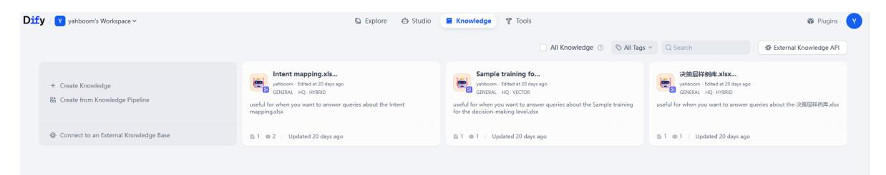

Open a knowledge base. It contains a preset file named **Sample training for the decision-making level**.

- **Sample training for the decision-making level**: Stores preset reference examples related to specific task scenarios.

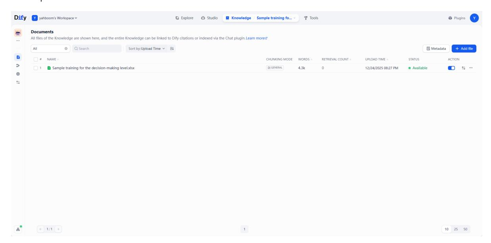

## 4. Expand the RAG Knowledge Base

To create a new knowledge base, click **Create Knowledge**.

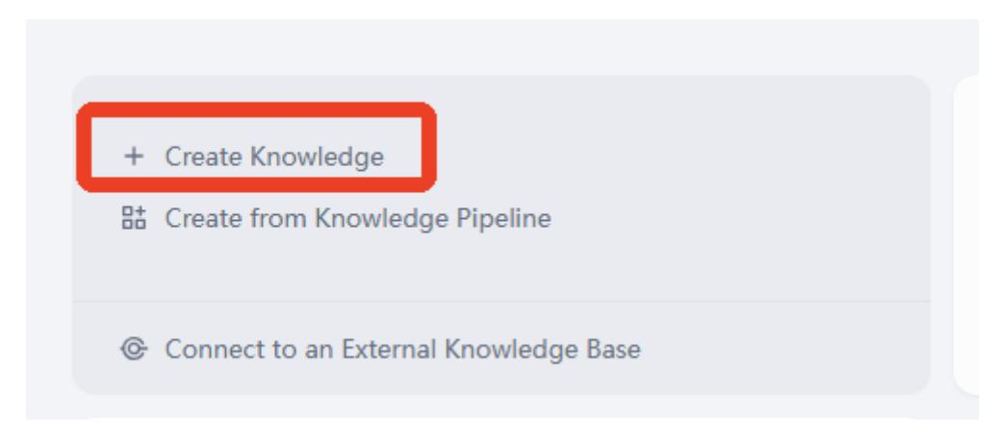

This example imports local data.

Click **Import Existing file** -> **Select File** -> **Next**.

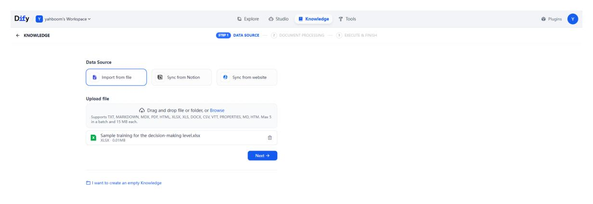

The knowledge base configuration page opens. Click the preview block to view the file chunking result. For this example, select **Economic** as the indexing mode.

> [!TIP]
> Beginners are advised to use Economic mode for learning and testing.
>
> Economic mode retrieves content from the knowledge base using **keywords**. It cannot perform expanded retrieval of semantically similar content, so fragment retrieval is relatively rigid.
>
> High-Quality mode requires an embedding model, consumes extra tokens, and requires a rerank model, but it provides more accurate retrieval of semantically similar fragments.
>
> The default knowledge base mode is High-Quality mode.

### 4.1 Economic Mode Knowledge Base

After selecting the following configuration, click **Save and Process**.

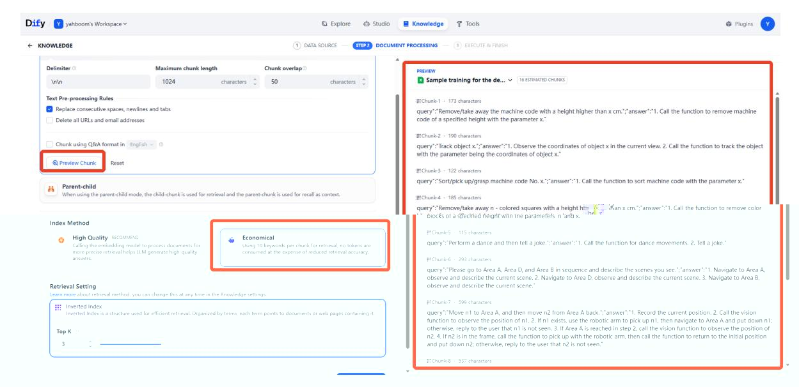

Wait for embedding to complete, then click to open the document.

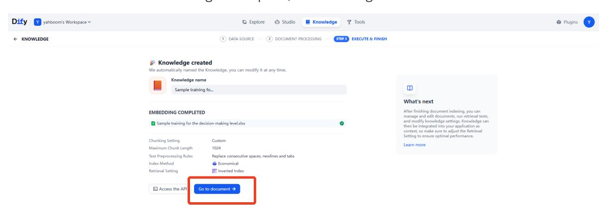

When the knowledge base is working normally, its status is shown as available. Then click the knowledge base file.

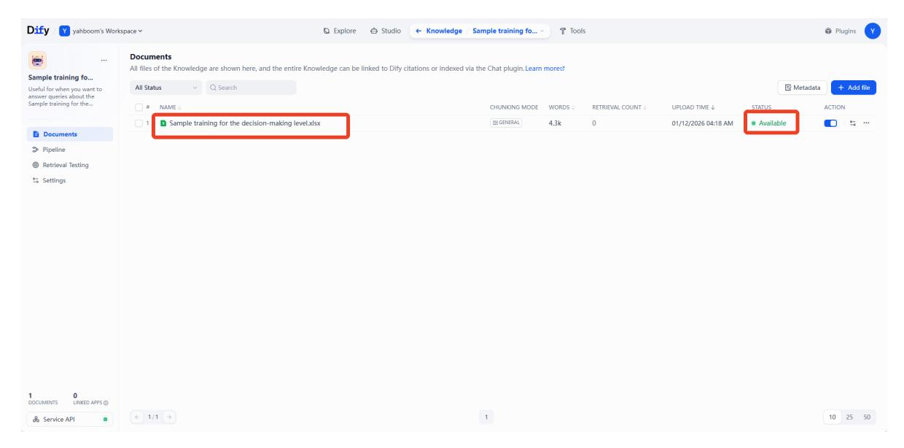

You can then view the segmented knowledge base fragments. The small text under each fragment shows automatically generated keywords for that segment, which are available only in Economic mode.

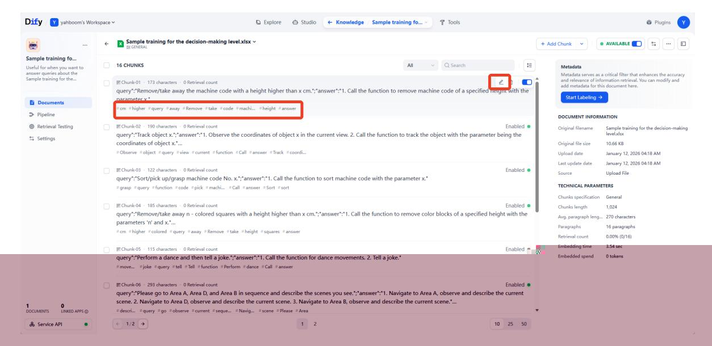

If the keywords do not accurately describe a knowledge fragment, click **Edit** on the right side of that fragment to edit its content or keywords. The image below shows modified keywords. Click **Save** afterward.

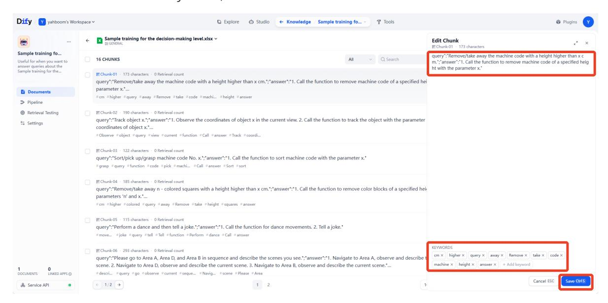

### 4.2 High-Quality Mode Knowledge Base

- If you need a high-quality knowledge base later, refer to this section.
- The knowledge base creation and file import process is the same as above.
- Select **High-Quality** as the indexing method and choose a retrieval method. This example uses hybrid retrieval. Then click **Save and Process**.

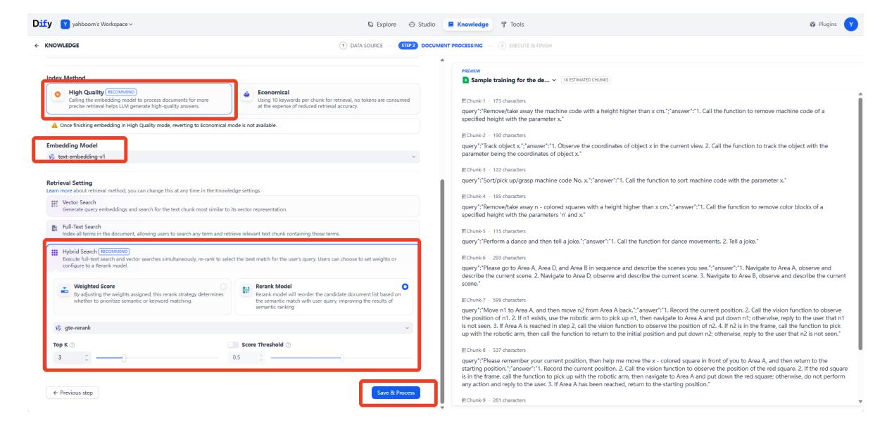

### 4.3 Recall Test

- Retrieval testing checks whether relevant knowledge fragments are retrieved from the knowledge base for a given input. This helps optimize AI model response quality.
- After opening a knowledge base, click **Retrieval Testing** on the left side.

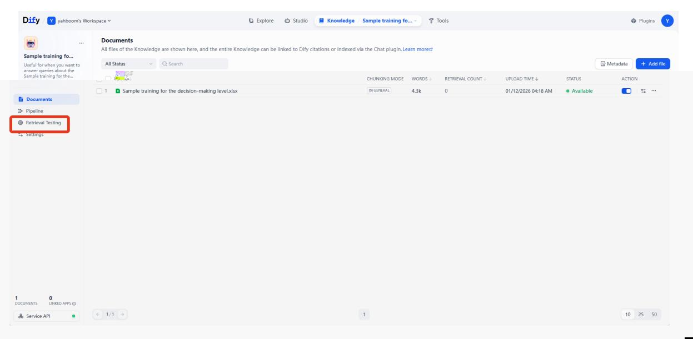

Enter test content in the source text field, simulating real user input, then click **Test**.

The retrieved paragraphs and related knowledge base content appear on the right. The example below uses the Economic mode knowledge base, which retrieves information based on keywords.

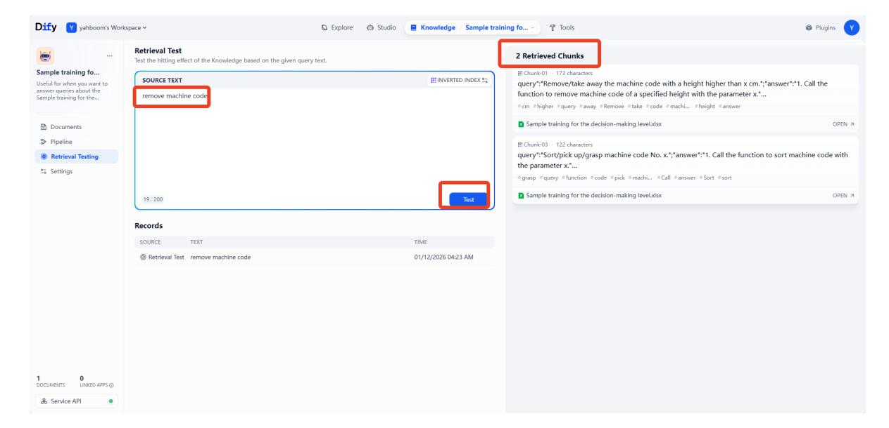

In a High-Quality mode knowledge base, retrieved snippets include a SCORE rating. A higher score means the snippet is more relevant to the input. High-Quality mode can retrieve semantically similar content, but it consumes tokens.

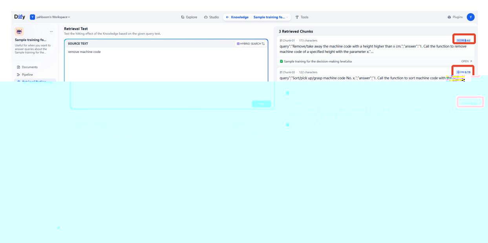
