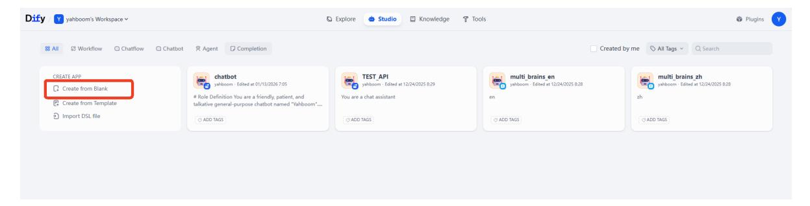
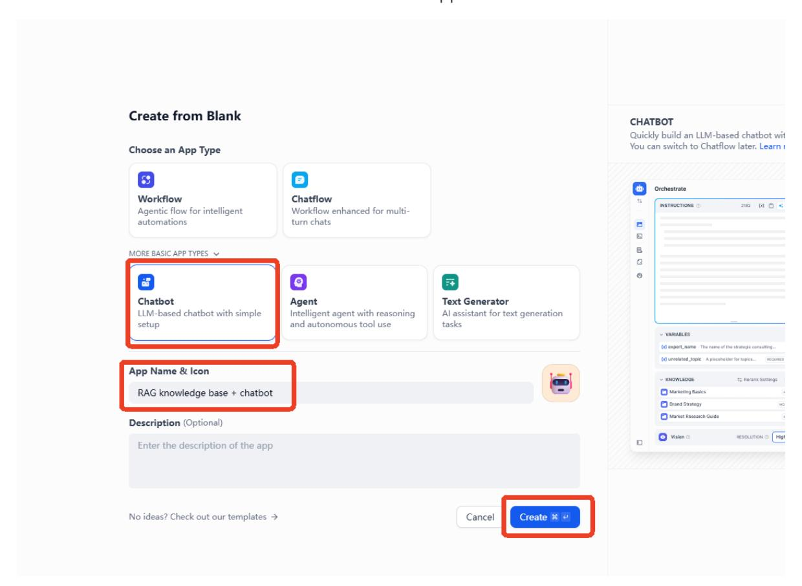
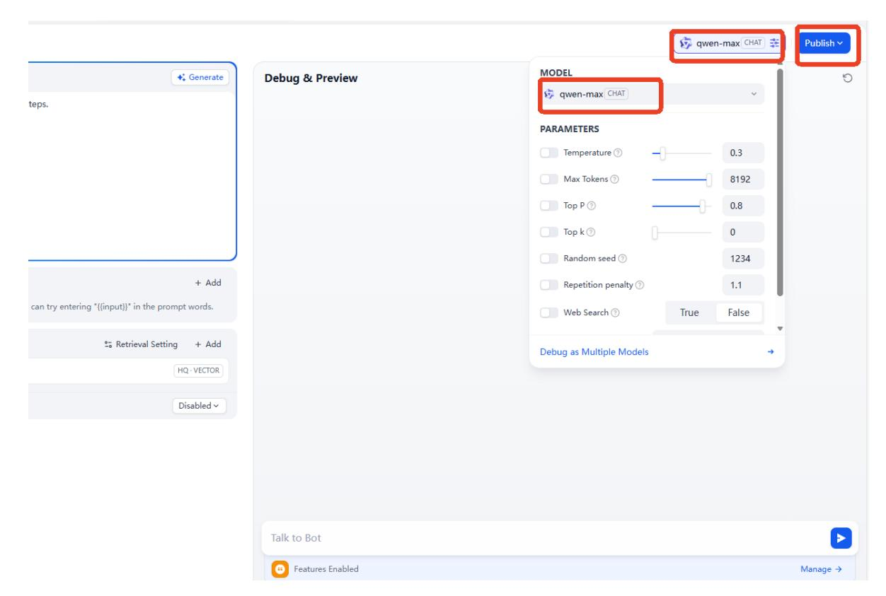
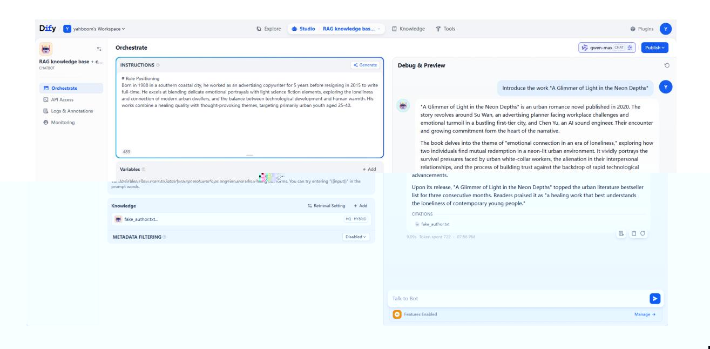

# RAG Knowledge Base + Chatbot

## 1. Course Content

Based on the previous RAG knowledge base and chatbot lessons, develop an AI application that combines both. This improves large-model answers in specific domains and reduces hallucinations through RAG knowledge-base retrieval.

## 2. Start the Dify Service

Connect to the robot computer through VNC or SSH, then run the following command in the terminal:

```bash
bringup_dify
```

Check the robot's IP address. You can view it on the OLED screen, use `ifconfig`, or check it directly in the terminal. Enter the robot's IP address directly in the browser address bar to open the Dify management page.

## 3. Case Study 1: Task Planning

> [!TIP]
> Case Study 1 simulates the function of the ROSMASTER-M3 decision-making layer.

On the home page, click **Create from Blank**.



Select **Chat Assistant** under Chatbot, set the **App Name & Icon**, then click **Create**.



Example prompt:

```text
You are a task planning master. Using your knowledge, break down complex tasks into steps.
```

After creating the application, enter the prompt in **INSTRUCTIONS**, then click **Add** under knowledge.


Select the knowledge base you want to add, then click **Add**.


Select a large language model to connect. This example uses `qwen-max`.



Enter test dialogue content. This example uses AprilTag removal. You can see that the large language model can reason and answer based on the knowledge base content. By adding training examples to the knowledge base, you can quickly expand the model's response and learning capabilities for different task scenarios and domains.


You can delete the knowledge base first and compare the model response without RAG. Without the knowledge base, the general-purpose AI model from the model provider cannot handle vertical-domain tasks as effectively.

> [!TIP]
> Study this example together with the theory in **2. RAG Retrieval Augmentation and Training Examples**.


## 4. Case Study 2: Knowledge Management

If internal documents need to be managed by a large language model, combine the model with RAG and a knowledge base so the model can answer based on actual business documents. This is useful for vertical fields such as finance and healthcare.

### 4.1 Create a Knowledge Base

This example uses a sample document that contains a fictional author and a collection of fictional works. The sample document is in this lesson's folder.


### 4.2 Create an Application

Example prompt:

#### Role Positioning

Born in 1988 in a southern coastal city, he worked as an advertising copywriter for 5 years before resigning in 2015 to write full-time. He excels at blending delicate emotional portrayals with light science fiction elements, exploring the loneliness and connection of modern urban dwellers, and the balance between technological development and human warmth. His works combine a healing quality with thought-provoking themes, targeting primarily urban youth aged 25-40.

Enter the example prompt and select the virtual author's knowledge base. Then ask questions about the works in the material. The large language model can now answer using the private knowledge base.


