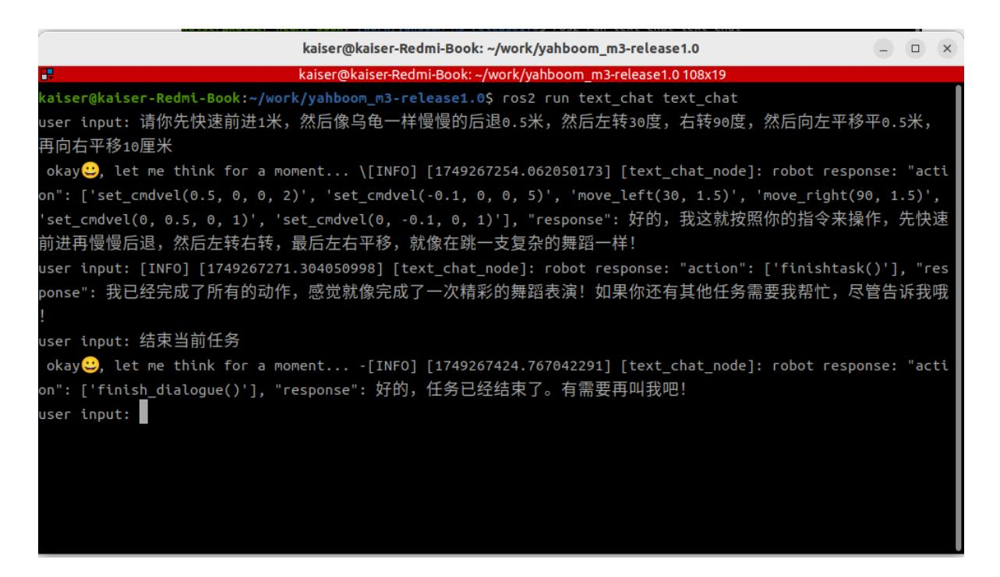

# Semantic Understanding and Command Following

## 1. Course Content

Run the example program and interact with the robot through text in the terminal, without voice input or voice responses.

## 2. Preparation

### 2.1 Content Description

This lesson uses Jetson Orin NX as the example. For Raspberry Pi and Jetson Nano boards, open a terminal on the host system, enter the Docker container, and then run the commands from this lesson inside the container. For instructions, see **Entering the Robot Docker Container (for Jetson Nano and Raspberry Pi 5 users)** in **0. Configuration and Operation Guide**.

For Orin and NX boards, open a terminal directly on the robot and run the commands from this lesson.

### 2.2 Start the Agent

If the agent is already running, you do not need to start it again.

Run the following command in the robot terminal:

```bash
sh start_agent.sh
```

The terminal prints connection information when the agent connects successfully.

## 3. Run the Example

### 3.1 Start the Program

Open a terminal on the robot system and run:

```bash
ros2 launch multi_brains llm_agent_control.launch.py text_chat_mode:=True
```

Start the text interaction terminal. You can start it on either the robot system or the virtual machine. **Choose only one method; do not start it on both systems at the same time.**

```bash
ros2 run text_chat text_chat
```

### 3.2 Test Cases

The following are example test cases. You can also create your own dialogue commands.

- Please move forward 1 meter quickly, then slowly move backward 0.5 meters like a turtle, then turn left 30 degrees, turn right 90 degrees, then translate left 0.5 meters, and then translate right 10 centimeters.
- Please perform a dance, and then tell me a joke about cats and dogs.

#### 3.2.1 Case 1

Open a terminal in the virtual machine and enter the test case. After the model finishes reasoning, the AI agent replies to the user and performs the actions according to the user's instructions.



#### 3.2.2 Case 2

Using the same method as Case 1, enter Case 2 in the terminal. The model replies and performs the actions according to the instructions.


