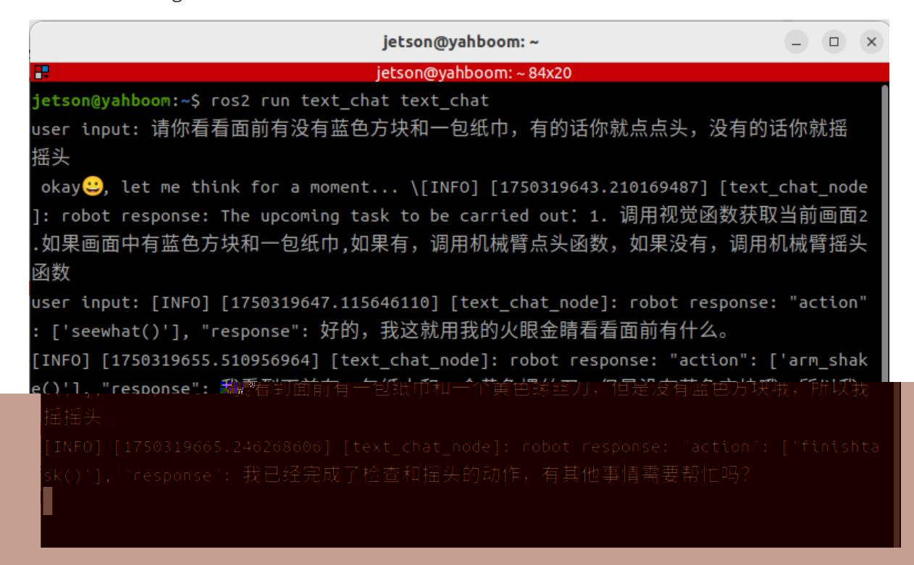

# Multimodal Visual Understanding

## 1. Course Content

Run the example program so the robot can observe the environment through terminal-based text interaction and perform tasks according to instructions.

> [!NOTE]
> The only difference between the text version and the voice version is the input method. The text version does not use speech recognition or speech synthesis playback.

## 2. Preparation

### 2.1 Start the Agent

The Docker agent must be started before testing the examples. If it is already running, you do not need to start it again.

Run the following command in the robot terminal:

```bash
sh start_agent.sh
```

The terminal prints connection information when the agent connects successfully.

## 3. Run the Example

### 3.1 Start the Program

Open a terminal on the robot and run:

```bash
ros2 launch multi_brains llm_agent_control.launch.py text_chat_mode:=True
```

Start the text interaction node on the robot:

```bash
ros2 run text_chat text_chat
```

### 3.2 Test Cases

The following are example test cases. You can also create your own instructions.

- Tell me what objects are in front of you, and describe their functions.
- Please look to see if there is a blue block and a pack of tissues in front of you. If there is, nod your head; if not, shake your head.

#### 3.2.1 Case 1

Enter the test case in the text interaction terminal. After the model finishes reasoning, it replies to the user and performs actions according to the user's instructions.

After the robot completes a task, it enters a waiting state. You can continue the conversation at this point. The new instruction is sent directly to the execution-layer large language model, and the conversation history is retained. Enter `end current task` when you want the robot to end the current task cycle and start a new one.

#### 3.2.2 Case 2

As in Case 1, enter Case 2 in the terminal. The model responds and performs the requested actions.



## 4. Source Code Analysis

Robot action source code path:

```text
~/M3Pro_ws/src/multi_brains/multi_brains/action_service.py
```

Model service source code path:

```text
~/M3Pro_ws/src/multi_brains/multi_brains/model_service.py
```

- The robot visual observation function is mainly implemented by the `seewhat` method in `action_service.py`.
- This function saves and displays an image from the latest viewpoint.
- It then sends a request to the `model_service` node so image feedback can be provided to the `multi_brains` agent in Dify.

```python
def seewhat(self):
    """
    Save the current view image and send it as feedback to the Dify agent.
    """
    self.save_single_image()
    msg = LlmRequest()
    msg.llm_request = self.actionlog.get_text("image_feedback")
    msg.robot_feedback = True
    self.llm_request_pub.publish(msg)
    return None

def save_single_image(self):
    """Save a single image."""
    cv_image = self.bridge.imgmsg_to_cv2(self.image_msg, "bgr8")
    cv2.imwrite(self.image_cache_path, cv_image)
    time.sleep(0.05)
    display_thread = threading.Thread(target=self.__display_saved_image)
    display_thread.start()

def __display_saved_image(self):
    """
    Display the saved image for 4 seconds before closing the window.
    """
    try:
        img = cv2.imread(self.image_cache_path)
        if img is not None:
            cv2.imshow("Saved Image", img)
            cv2.waitKey(4000)
            cv2.destroyAllWindows()
        else:
            self.get_logger().error("Failed to load saved image for display.")
    except Exception as e:
        self.get_logger().error(f"Error displaying image: {e}")
```

The `llm_request_callback` function in `model_service.py` receives requests sent to the `multi_brains` agent. If the `llm_request` field indicates an image request, the function adds `[msg.llm_request, 'image_request', True]` to the model request processing queue.

```python
def llm_request_callback(self, msg: LlmRequest):
    """Receive model requests from a topic and put them into the queue."""
    if self.debug_mode:
        self.get_logger().info(
            f"robot_feedback: {msg.robot_feedback}, llm_request: {msg.llm_request}"
        )
    if msg.robot_feedback:
        if msg.llm_request == self.syslog.get_text("image_feedback"):
            self.llm_handler_queue.put([msg.llm_request, 'image_request', True])
        elif msg.llm_request == "finish":
            self.clear_request_queue()
            self.dify_llmclient.reset_conversation()
        else:
            if self.debug_mode:
                self.get_logger().info(self.syslog.get_text("system_log_4"))
            self.llm_handler_queue.put([msg.llm_request, 'text_request', True])
    else:
        self.llm_handler_queue.put([msg.llm_request, 'text_request', None])
```

In `handle_llm_thread` in `model_service.py`, the response mode is determined by `self.text_chat_mode`. In text-only interaction mode, only text responses are provided.

When the model engine initializes, speech recognition and speech synthesis models are loaded only in voice interaction mode.
