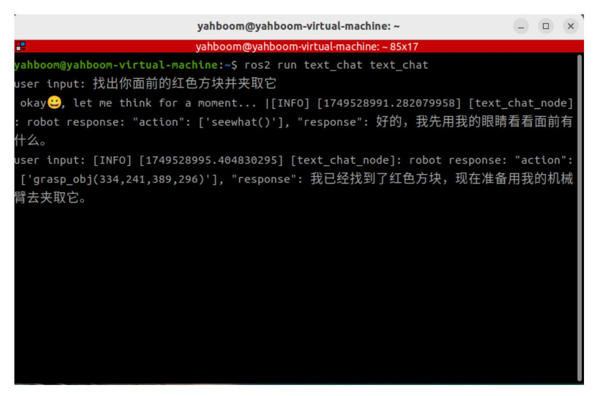
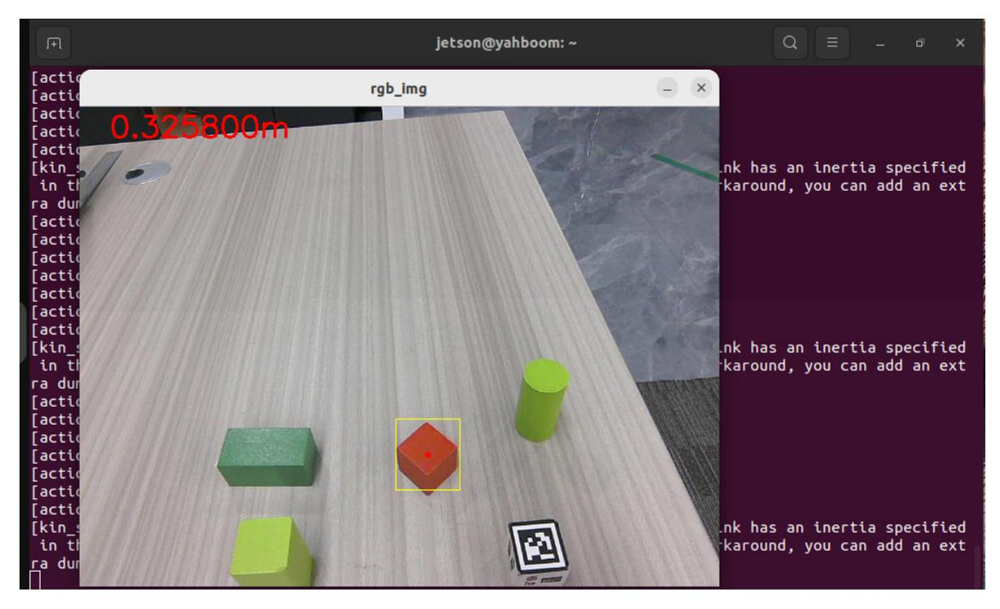
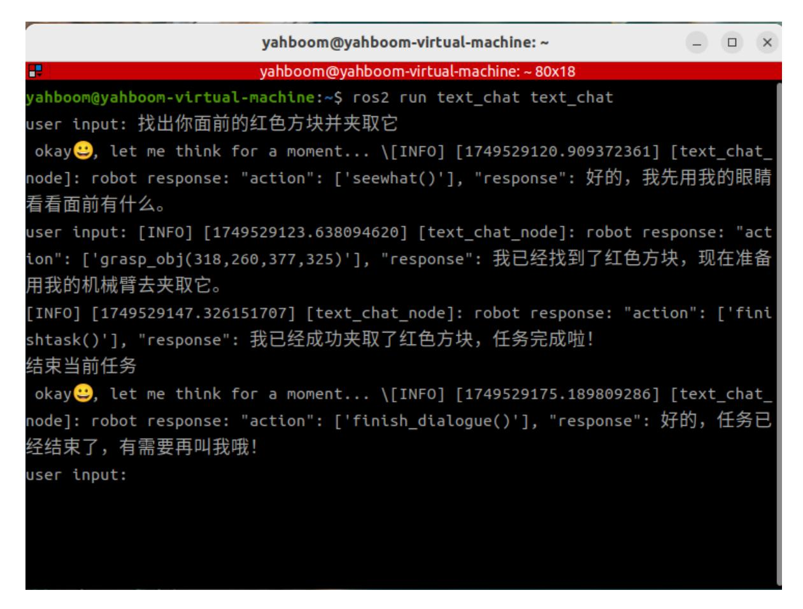
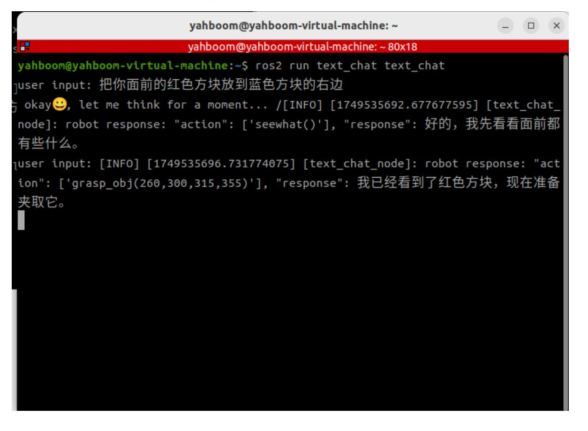
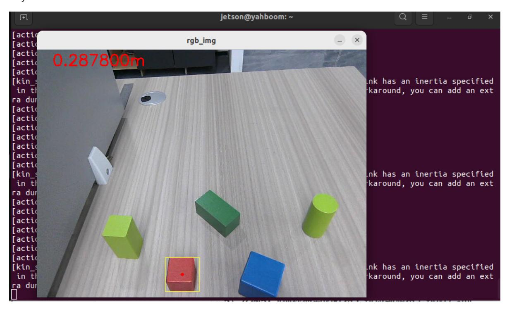
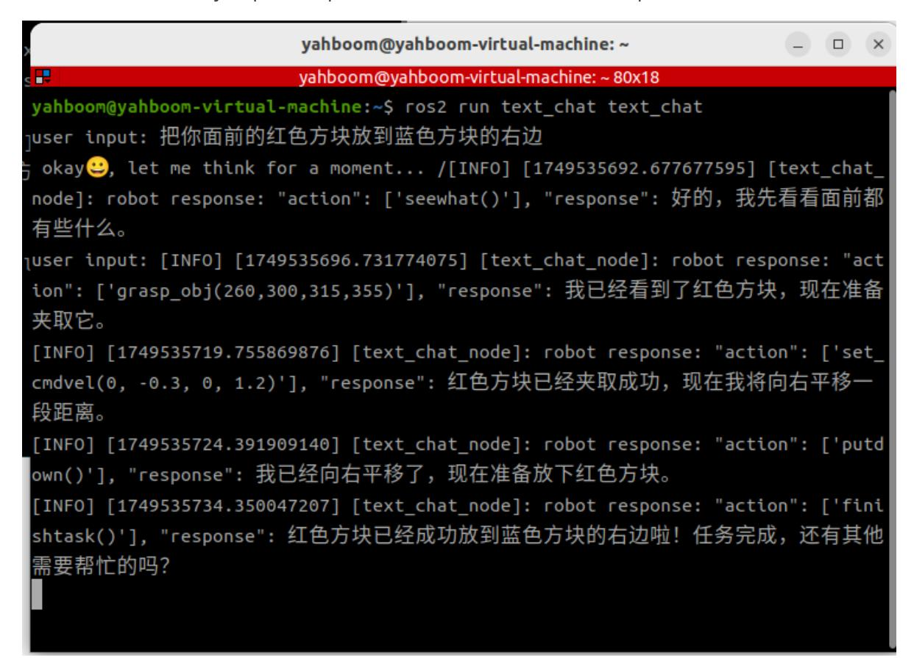
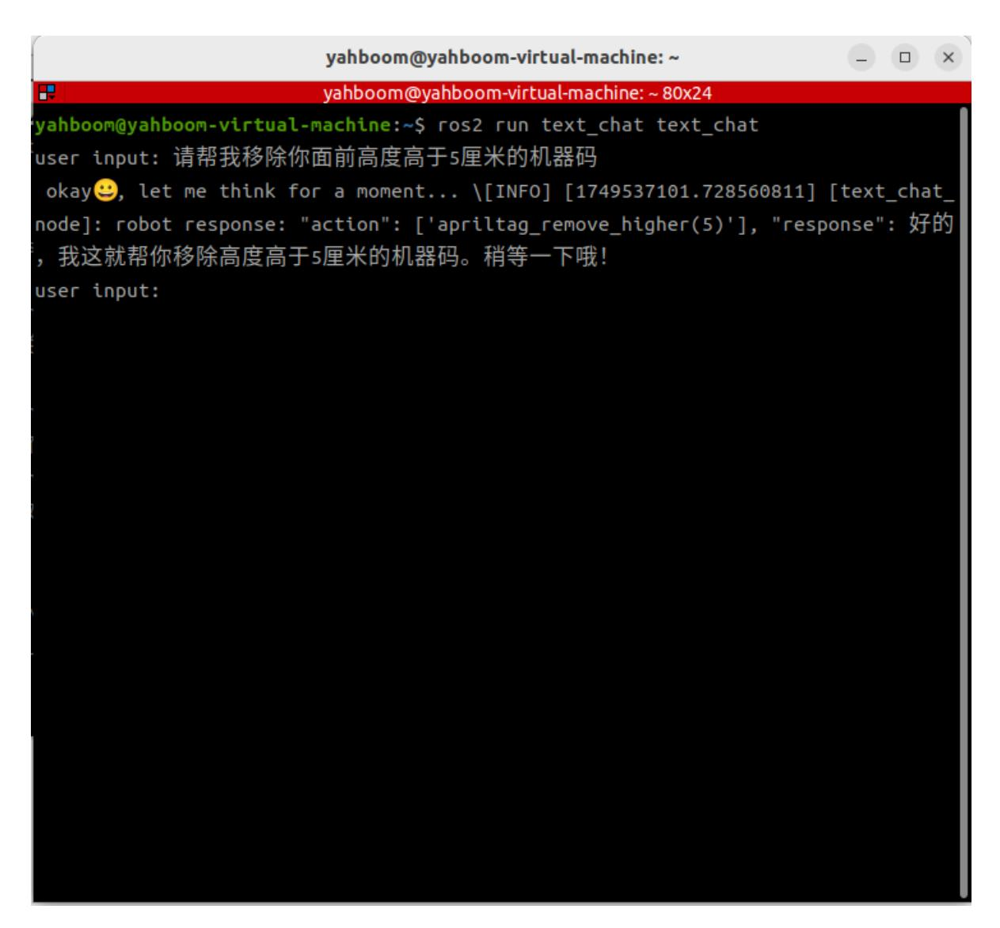
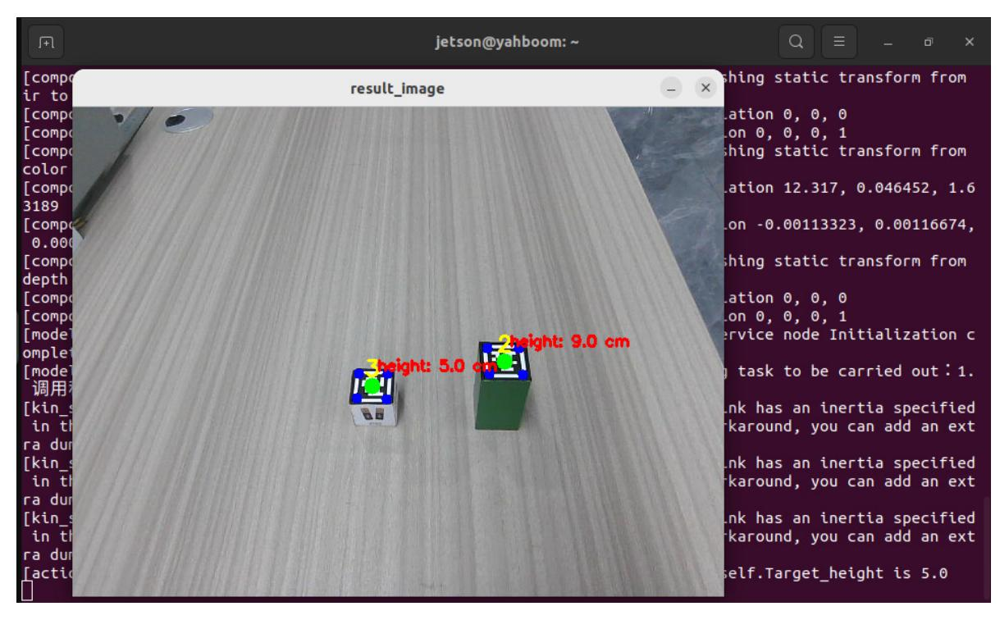
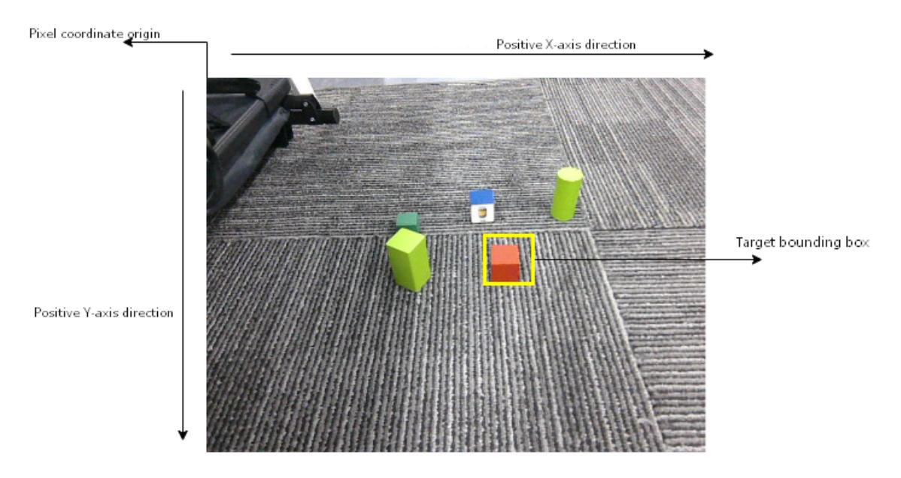

# Multimodal Visual Understanding + Robotic Arm Grasping

## 1. Course Content

Run the example program, using the robot's visual understanding combined with robotic arm grasping for a comprehensive task.

### [!NOTE]

The only difference between the text version and the voice version is the method of command input; the text version does not include speech recognition and speech synthesis playback.

## 2. Starting the Agent

Note: If already started, there is no need to start again.

Enter the following command in the vehicle terminal:

```
sh start_agent.sh
```

The terminal will print the following information, indicating a successful connection:

## 3. Running the Examples

### 3.1 Starting the Program

Connect to the vehicle's screen via VNC and start the AI agent function:

```bash
ros2 launch multi_brains llm_agent_control.launch.py text_chat_mode:=True
```

Start text interaction in any terminal:

```bash
ros2 run text_chat text_chat
```

### 3.2 Test Cases

Here are four reference test cases; users can create their own dialogue commands.

- Find the red cube in front of you and grasp it.Wooden blocks used: 30x30x30 mm blocks.
- Place the red cube in front of you to the right of the blue cube.Wooden blocks used: 30x30x30 mm blocks.
- Please remove the machine code in front of you that is taller than 5 centimeters.Wooden blocks used: 30x30x30 mm blocks.
- Track machine code number three.Wooden blocks used: 40x40x40 mm blocks.

#### 3.2.1 Case 1: "Find the red cube in front of you and grasp it"

Enter "Find the red cube in front of you and grasp it" in the virtual machine terminal. The terminal will print the following information:



After the grasp_obj() function is called, a window titled **rgb_img** will open in the VNC screen, displaying the image from the robot's perspective. The robot will automatically adjust the distance to the target object. After the distance adjustment is complete, the robot will use the robotic arm to grasp the target object.



After the robot picks up an object, the robotic arm will remain in its current position. If you need the robotic arm to return to its initial state, you can use the following methods:

- Method 1: Enter the command: "Put down the block you just picked up" to make the robot put down the red block it just picked up.
- Method 2: Enter the command: "End the current task" to make the robot end the current task. After the task cycle ends, the robotic arm will reset to its initial posture.

Here, we use Method 2 as an example to make the robot end the task and reset the task cycle.



#### 3.2.2 Case 2: "Put the red block in front of you to the right of the blue block"

Enter "Put the red block in front of you to the right of the blue block" in the terminal. The terminal will print the following information:



A window titled **rgb_img** will open in the VNC screen, displaying the image from the robot's perspective. The robot will automatically adjust the distance between itself and the target object. After the distance adjustment is complete, the robot will use its robotic arm to pick up the target object.



Then the robot will translate to the right for a certain distance, and then use its robotic arm to put down the red block it just picked up, and indicate that the task is complete.



When commands such as "End current task" or "You can rest now," which indicate that the robot is no longer needed, are entered, the robot will end the current task.

#### 3.2.3 Case 3: "Please help me remove the machine code in front of you that is taller than 5 centimeters"

Entering "Please help me remove the machine code in front of you that is taller than 5 centimeters" in the virtual machine terminal will print the following information:



A window titled **result_image** will open in the VNC screen, displaying the image from the robot's perspective. The height of each machine code can be seen. After the distance measurement stabilizes, the robot will automatically adjust its distance from the target, and then use its robotic arm to pick up the machine code of the target height and move it to the right side of the robot.



When you enter commands in the terminal such as "end current task" or "you can rest now," which no longer require the robot's action, the robot will end the current task.

## 4. Source Code Analysis

Robot action source code path:

~/M3Pro_ws/src/multi_brains/multi_brains/action_service.py

### 4.1 Case 1

action_service.py program:

Case 1 uses the **seewhat** and **grasp_obj** methods in the **ActionController** class. The **seewhat** function mainly obtains the color image from the depth camera, which has been explained in the **Multimodal Visual Understanding** section. Here, we will explain the **grasp_obj** function.

The coordinate rules for objects in the robotic arm's grasping view are shown in the following figure:



The **grasp_obj(x1, y1, x2, y2)** function is used to call the robotic arm to grasp the target object. The parameters are the coordinates of the top-left and bottom-right vertices of the bounding box of the object to be grasped (the top-left corner of the image is the pixel coordinate origin). For example, in Case 1, the bounding box coordinates of the red square to be grasped can be obtained from the large model's response: the top-left corner coordinates are (365, 200), and the bottom-right corner coordinates are (408, 261).

grasp_obj starts three subprocesses: **grasp_desktop**, **KCF_follow**, and **ALM_KCF_Tracker_Node3**, and passes the parameters given by the AI large model to the **ALM_KCF_Tracker_Node** node via topics.

```python
def grasp_obj(self, x1, y1, x2, y2) -> None:
        """grasp_obj: Grasping object x1, y1, x2, y2: Coordinates of the
object's bounding box """
        def __reset_grasp_obj():
            kill_process_tree(self.grasp_obj_process_1.pid)
            kill_process_tree(self.grasp_obj_process_2.pid)
            kill_process_tree(self.grasp_obj_process_3.pid)
            self.grasp_obj_future = Future()
        cmd_1=['ros2', 'run', 'largemodel_arm', 'grasp_desktop']
        cmd_2=['ros2', 'run', 'largemodel_arm', 'KCF_follow']
        cmd_3=['ros2', 'run', 'M3Pro_KCF', 'ALM_KCF_Tracker_Node']
        self.grasp_obj_process_1=subprocess.Popen(cmd_1)
        time.sleep(5.0) #Waiting for grasp_desktop to finish starting up
        self.grasp_obj_process_2=subprocess.Popen(cmd_2)
        self.grasp_obj_process_3=subprocess.Popen(cmd_3)
        time.sleep(1.0)
        x1 = int(x1)
        y1 = int(y1)
        x2 = int(x2)
        y2 = int(y2)
        self.object_position_pub.publish(Int16MultiArray(data=[x1, y1, x2, y2]))
        while not self.grasp_obj_future.done():
            if self.interrupt_event.is_set():
                __reset_grasp_obj()
                self.pubSix_Arm(self.init_joints)
                return None
            time.sleep(0.1)
        result = self.grasp_obj_future.result()
        if not self.interrupt_event.is_set():
            if result.data == "grasp_obj_done":
                res = True
            else:
                res = False
        __reset_grasp_obj()
        if self.interrupt_event.is_set():
            time.sleep(0.5)
            self.pubSix_Arm(self.init_joints) # Robotic arm retracted
        return res
```

After the grasping is complete, the **KCF_follow** node will publish a signal on the **largemodel_arm_done** topic with the content "**grasp_obj_done**", which sets the **grasp_obj_future** object in the **largemodel_arm_done_callback** callback function.

```python
def action_feedback_callback(self, msg:String):
        '''External action feedback callback function'''
        if msg.data =="follow_line_finish":
            if not self.follow_line_clear_future.done():
                self.follow_line_clear_future.set_result(msg)
        elif msg.data =="road_net_nav_succeeded":
            if not self.road_net_nav_future.done():
                self.road_net_nav_future.set_result(msg)
        elif msg.data =="road_net_nav_failed":
            if not self.road_net_nav_future.done():
                self.road_net_nav_future.set_result(msg)
        if msg.data in ["apriltag_sort_done", "apriltag_sort_failed"]:
            if not self.apriltag_sort_future.done():
                self.apriltag_sort_future.set_result(msg)
        elif msg.data in
["apriltag_remove_higher_done","apriltag_remove_higher_failed"]:
            if not self.apriltag_remove_higher_future.done():
                self.apriltag_remove_higher_future.set_result(msg)
        elif msg.data == "grasp_obj_done":
            if not self.grasp_obj_future.done():
                self.grasp_obj_future.set_result(msg)
        elif msg.data == "color_remove_higher_done":
            if not self.color_remove_higher_future.done():
                self.color_remove_higher_future.set_result(msg)
        elif msg.data == "follow_line_clear_future_done":
            if not self.follow_line_clear_future.done():
                self.follow_line_clear_future.set_result(msg)
```

### 4.2 Case Study 2

The set_cmdvel function controls the robot's base movement by publishing the cmd_vel velocity topic.

```python
def set_cmdvel(self, linear_x:str, linear_y:str, angular_z:str,
duration:str)->None:
        '''Publish cmd_vel velocity command'''
        linear_x = float(linear_x)
        linear_y = float(linear_y)
        angular_z = float(angular_z)
        duration = float(duration)
        twist = Twist()
        twist.linear.x = linear_x
        twist.linear.y = linear_y
        twist.angular.z = angular_z
        self._execute_action(twist, durationtime=duration)
        self.stop()
        return True
```

The putdown method is used to make the robotic arm put down the object it is holding.

```python
def putdown(self):
        self.pubSix_Arm(self.putsown_joints) # Deployment of robotic arm
        time.sleep(4)
        self.pubSingle_Arm(6, 30, 1000) #The robotic arm opens its gripper and
releases the object.
        time.sleep(3)
        self.pubSix_Arm(self.init_joints) # Robotic arm retracted
        return True
```

### 4.3 Case Study 3

The apriltag_remove_higher method starts the external grasp_desktop_remove and apriltag_remove_higher nodes via a subprocess. This is an example from the robotic arm chapter demonstrating the removal of machine code at a specified height.

```python
def apriltag_remove_higher(self, target_high):
        '''Remove machine code at the specified height.'''
        def __reset_apriltag_remove_higher():
            kill_process_tree(self.apriltag_remove_higher_process_1.pid)
            kill_process_tree(self.apriltag_remove_higher_process_2.pid)
            self.apriltag_remove_higher_future = Future()
        target_highf = float(target_high) / 100
        cmd_1=['ros2', 'run', 'largemodel_arm', 'grasp_desktop_remove']
        cmd_2=['ros2', 'run', 'largemodel_arm', 'apriltag_remove_higher','--ros-
args','-p',f'target_high:={target_highf:.2f}']
        self.apriltag_remove_higher_process_1=subprocess.Popen(cmd_1)
        self.apriltag_remove_higher_process_2=subprocess.Popen(cmd_2)
        while not self.apriltag_remove_higher_future.done():
            if self.interrupt_event.is_set():
                __reset_apriltag_remove_higher()
                self.stop()
                self.pubSix_Arm(self.init_joints)
                return None
            time.sleep(0.1)
        result = self.apriltag_remove_higher_future.result()
        if not self.interrupt_event.is_set():
            if result.data == "apriltag_remove_higher_done":
                res=True
            elif result.data == "apriltag_remove_higher_failed":
                res= False
        __reset_apriltag_remove_higher()
        self.pubSix_Arm(self.init_joints)
        return res
```
