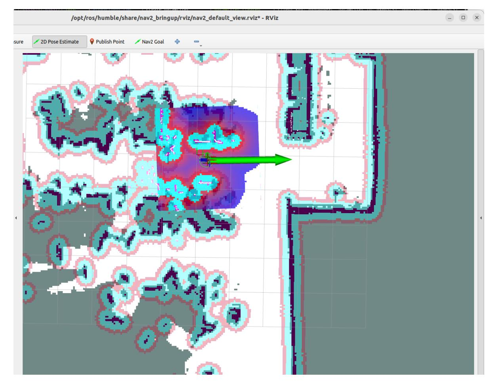
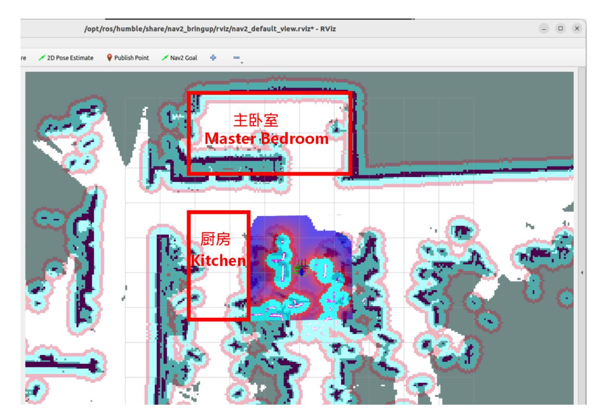
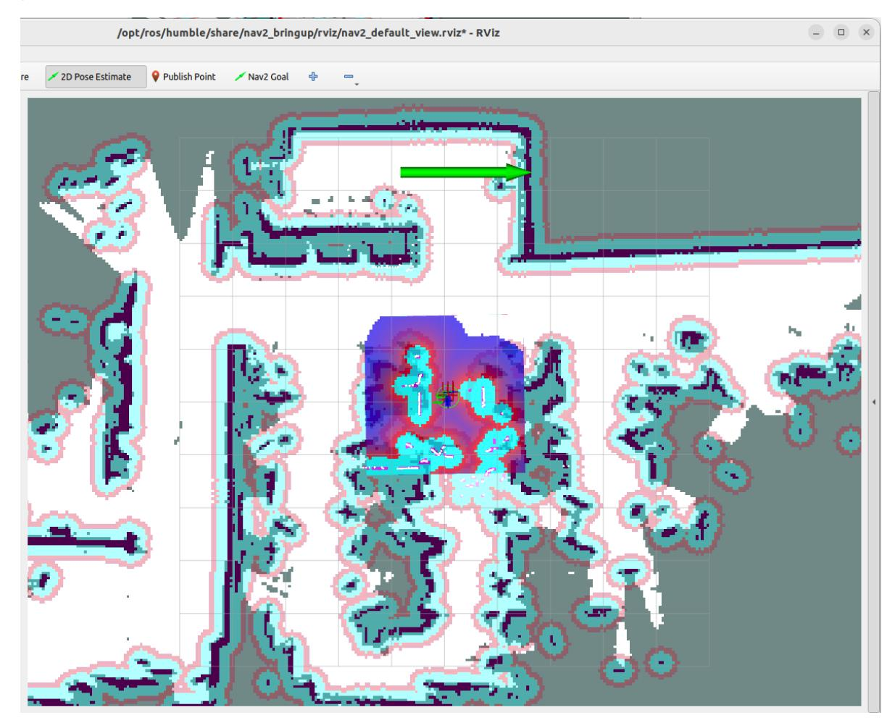
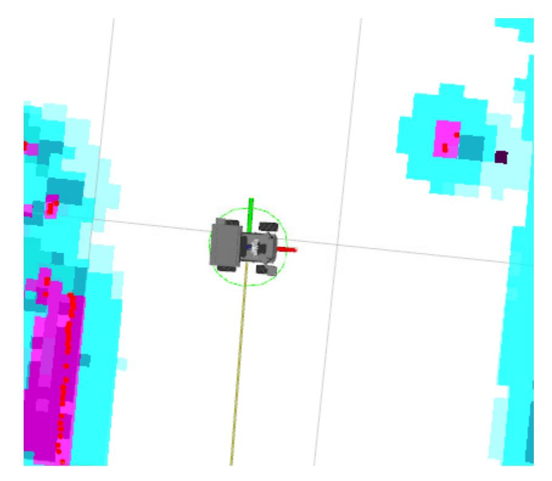
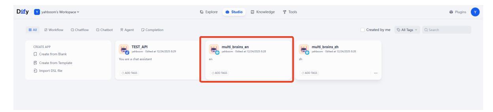
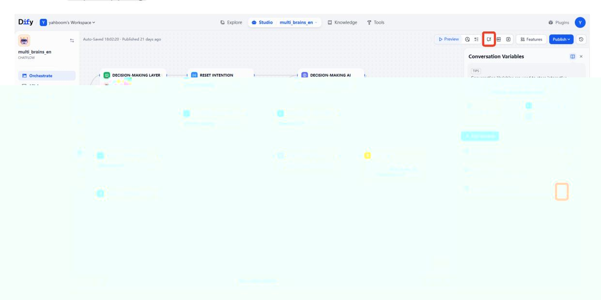
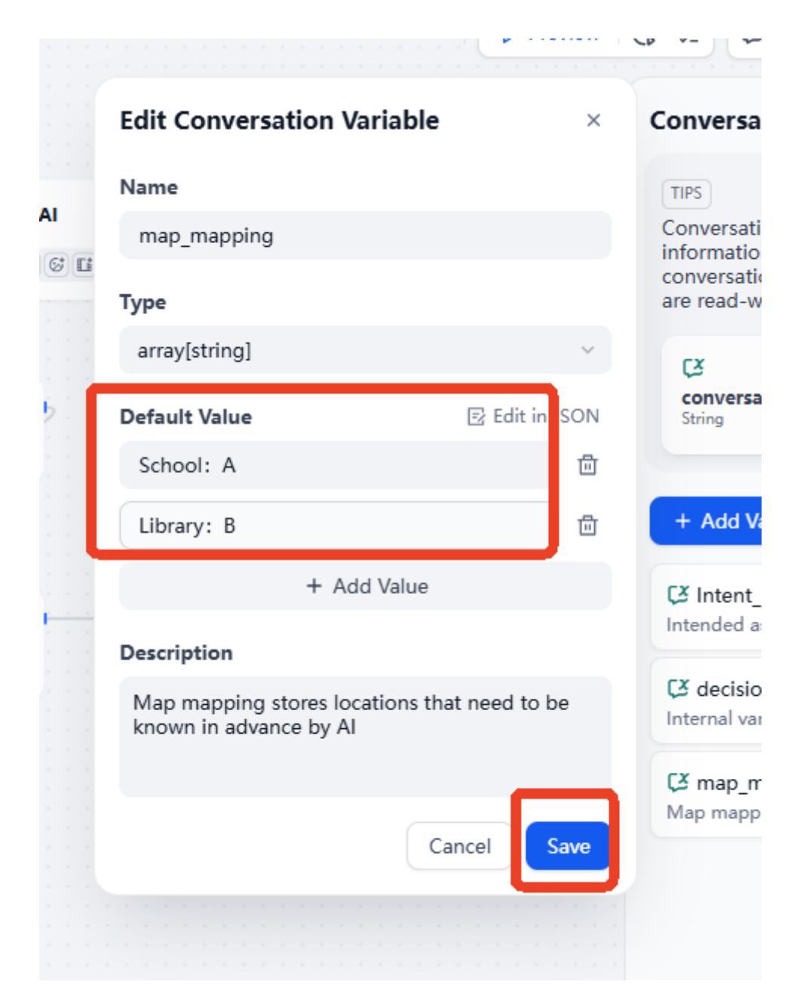
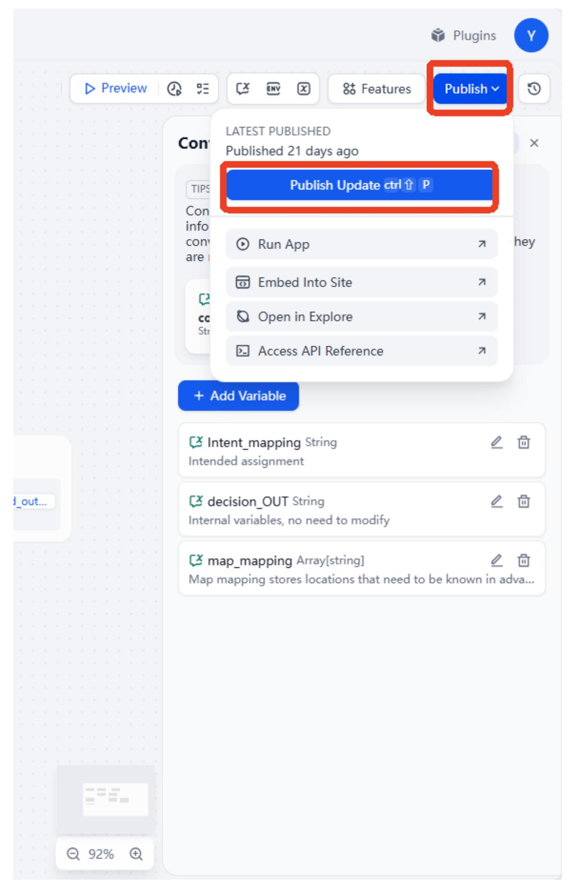
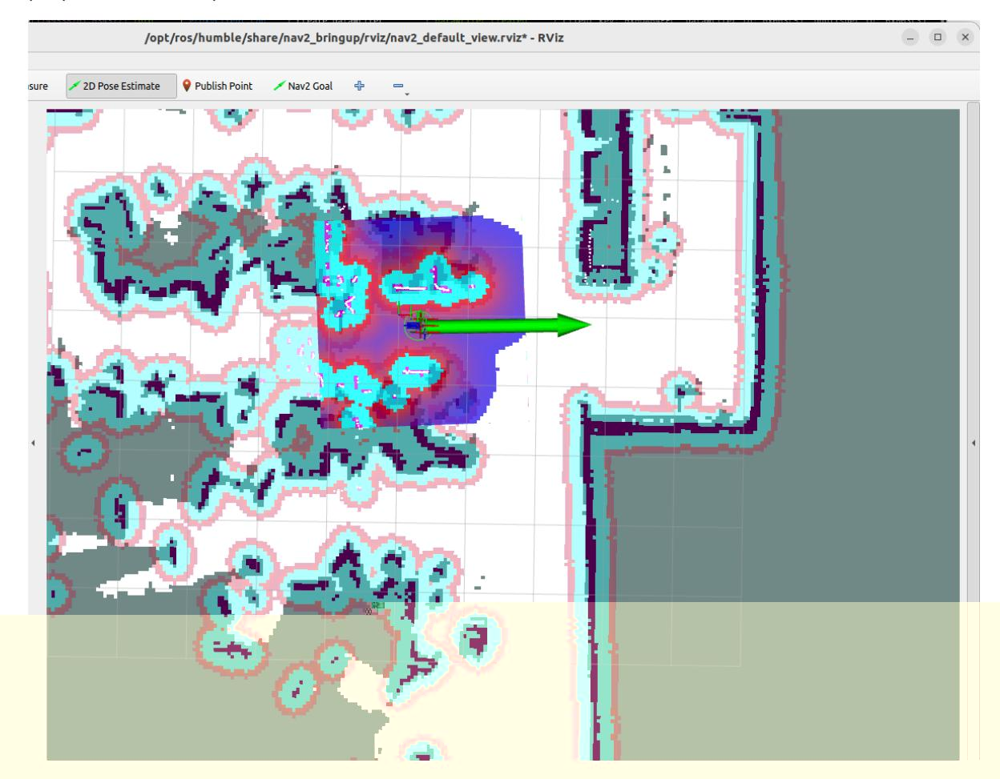
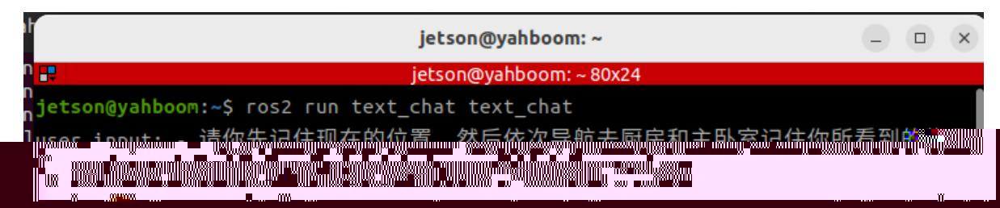

# Multimodal Visual Understanding + SLAM Navigation

#### Multimodal Visual Understanding + SLAM Navigation

- 1. Course Content
- 2. Starting the Agent
  - 2.3 Configuring the Map Mapping File
- 3. Running Example
  - 3.1 Starting the Program
  - 3.2 Test Case

## 1. Course Content

Run example programs to perform integrated tasks using the robot's visual understanding capabilities combined with SLAM navigation through text-based interaction.

# 2. Starting the Agent

**Note: If the agent is already running, you do not need to start it again.**

Enter the following command in the vehicle terminal:

```
sh start_agent.sh
```

The terminal will print the following information, indicating a successful connection:

#### [!NOTE]

Note: To experience this section of the course, you need to first build at least one grid map according to the LiDAR section of the course.

### 2.3 Configuring the Map Mapping File

Connect to the robot's desktop via VNC and start the navigation node using the following commands:

ros2 launch M3Pro_navigation base_bringup.launch.py

ros2 launch M3Pro_navigation navigation2.launch.py

Start RViz on the robot:

ros2 launch M3Pro_navigation nav_rviz.launch.py

Alternatively, you can start the display on the virtual machine; there is no need to start the display window repeatedly.

ros2 launch slam_view nav_rviz.launch.py

Afterward, the rviz2 visualization interface will open. Click **2D Pose Estimate** in the top toolbar to enter the selection state, and roughly mark the robot's position and orientation on the map.

The robot model will be displayed on the map, as shown below:



We can name any precise point on the map. Here, we use "Master Bedroom" and "Kitchen" as examples.



As shown in the figure below, we first click the **Nav2 Goal** tool to navigate the robot to the target point we need to mark.





Run the following command in the terminal to obtain the current robot's pose information in the map coordinate system:

```
ros2 run tf2_ros tf2_echo map base_footprint
```

Open the map_mapping.yaml map mapping file (you can open it using VNC, VS Code, command line, or any other method):

Here's an example of opening the file via the command line:

```
nano ~/M3Pro_ws/multi_brains_file/map_mapping.yaml
```

Modify the symbolic pose under the common_map_areas field. name is the location name. Fill in the previously obtained pose information into the position and orientation fields.

```
#根据实际的场景环境,自定义地图中的区域,可以添加任意个区域,注意和大模型的地图映射保持一致即可
#According to the actual scene environment, customize the areas in the map. You
can add any number of areas, just make sure they are consistent with the map
mapping of the large model
#地图映射Map mapping
common_map_areas: #常规导航 common navigation
 A:
 name: 'Master Bedroom'
 position:
   x: 3.974
   y: -2.634
 orientation:
   x: 0.0
   y: 0.0
   z: -0.688
   w: 0.726
 B:
   name: 'xxx'
   position:
     x: 1.488
     y: 0.661
     z: 0.0
   orientation:
     x: 0.0
     y: 0.0
     z: 0.725
     w: 0.688
```

After the modifications are complete, saving the file will take effect immediately. 2.4 Configuring Map Mapping Variables in Dify

After configuring the map mapping file as described above, we need to let the AI large language model know the relationship between the locations and symbols in these maps. Start the Dify service (if already started, no need to restart):

bringup_dify

Enter the vehicle's IP address directly in the browser's address bar to access the Dify management page, then click to select the corresponding AI application.

#### [!NOTE]

International users: multi_brains_en



Click to select Session Variables in the upper right corner, then click the edit button for the map_mapping variable.



In the pop-up Edit Session Variables window, edit the mapping relationship according to the settings in the previous map mapping file, and then click Save.



Finally, remember to click Publish -> Publish Update to save the changes.



# 3. Running Example

### 3.1 Starting the Program

Connect to the robot's desktop via VNC, open a terminal, and run the command:

ros2 launch multi_brains llm_agent_control.launch.py text_chat_mode:=True

Start navigation commands on the vehicle's control unit:

ros2 launch M3Pro_navigation base_bringup.launch.py

ros2 launch M3Pro_navigation navigation2.launch.py

Start RViz on the robot:

ros2 launch M3Pro_navigation nav_rviz.launch.py

Then, follow the procedure for initializing the navigation function. This will open the rviz2 visualization interface. Click on **2D Pose Estimate** in the toolbar at the top to enter selection mode. Roughly mark the robot's position and orientation on the map. After initialization, the preparation is complete.



Start the text interaction program in the terminal:

ros2 run text_chat text_chat

### 3.2 Test Case

Here is a sample test case; users can create their own dialogue commands.

Please remember your current location, then navigate to the kitchen and the master bedroom in sequence, remembering the items you see in each place. Finally, return to your starting position and tell me what you saw in those two places?

Copy and paste the above test case into the text interaction terminal:



The decision-making AI outputs the planned task steps:

Then the execution layer AI will execute according to these task steps:

```
user input: [INFO] [1750387878.350106583] [text chat node]: robot response: "acti
on": ['get_current_pose()'], "response": 好的,我现在就记住现在的位置,就像记住了
 -个重要的宝藏地点一样。
[INFO] [1750387882.255020679] [text chat node]: robot response: "action": ['naviq
ation(G)'], "response": 我已经记住了当前位置,现在准备导航去厨房啦,就像一个勇敢
的探险家一样!
[INFO] [1750387948.665910436] [text chat node]: robot response: "action": ['navig
ation(G)'],"response":哎呀,刚才去厨房的路上遇到了点小麻烦,不过别担心,我再试
一次!
[INFO] [1750387957.637532129] [text chat node]: robot response: "action": ['seewh
at()'], "response": 我已经成功到达厨房啦! 现在我来观察一下这里都有些什么物品。
[INFO] [1750387963.313431519] [text chat node]: robot response: "action": [], "re
sponse":在厨房里,我看到的是光滑的地板和一条绿色的线条,不过没有看到具体的物品呢
。可能是视角问题,我们继续前进吧!现在我要去主卧室看看了。
[INFO] [1750387966.771073792] [text_chat_node]: robot response: "action": ['navig
ation(A)']. "response": 我已经告诉了你在厨房看到的情况,现在我将导航去主卧室,看
看那里有什么有趣的发现!
[INFO] [1750388031.398516666] [text chat node]: robot response: "action": ['navig
ation(A)'],"response":哎呀,去主卧室的路上似乎遇到了一点小问题,不过别担心,我
再试一次!
[INFO] [1750388037.382963440] [text chat node]: robot response: "action": ['seewh
at()'],"response":我已经成功到达主卧室啦!现在我来观察一下这里都有些什么物品。
[INFO] [1750388045.402025419] [text_chat_node]: robot response: "action": [], "re
sponse":在主卧室里,我看到的同样是光滑的地板,地板上有天然的纹理和一些反光的灯光
。这里也没有看到具体的物品呢。可能是视角问题或者是房间比较空旷。现在,我将返回出
发时的位置,并告诉你我在厨房和主卧室分别看到了什么。
[INFO] [1750388050.039975630] [text chat node]: robot response: "action": ['navig
ation(zero)'], "response": 我已经告诉了你在主卧室看到的情况,现在我将返回出发时的
位置。
[INFO] [1750388091.405150056] [text_chat_node]: robot response: "action": [], "re
sponse":我已经回到了出发时的位置。总结一下我的发现:在厨房,我看到的是光滑的地板
和一条绿色的线条;而在主卧室,我看到的同样是光滑的地板,地板上有天然的纹理和一些
反光的灯光。两个地方都没有看到具体的物品,可能是视角问题或者是房间比较空旷。这就
是我的观察结果,希望对你有帮助!
[INFO] [1750388104.844933245] [text_chat_node]: robot response: "action": ['finis
htask()'],"response":我已经完成了全部任务,如果你还有其他需要帮忙的,请随时告诉
我哦!
```
