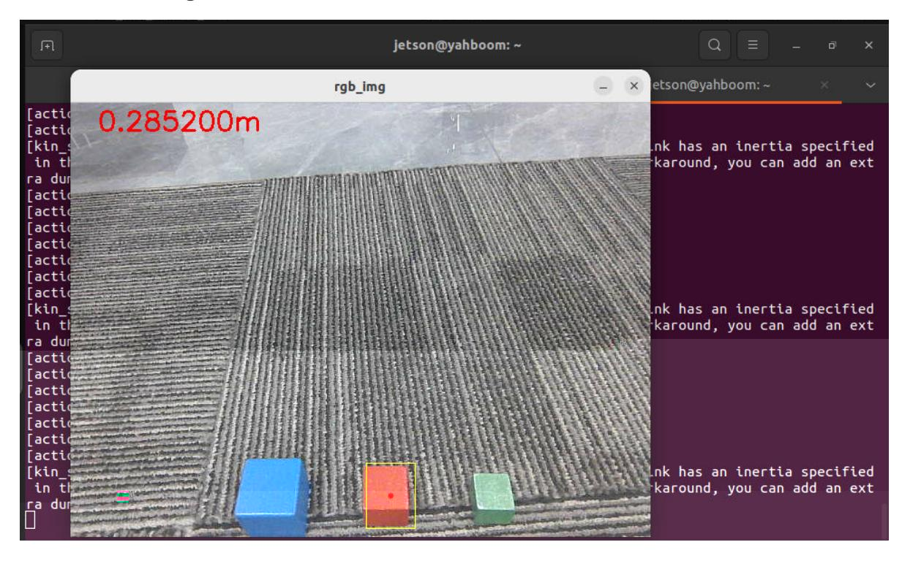
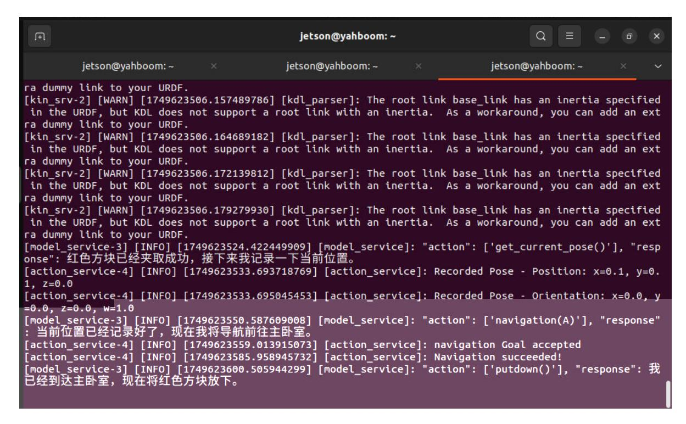
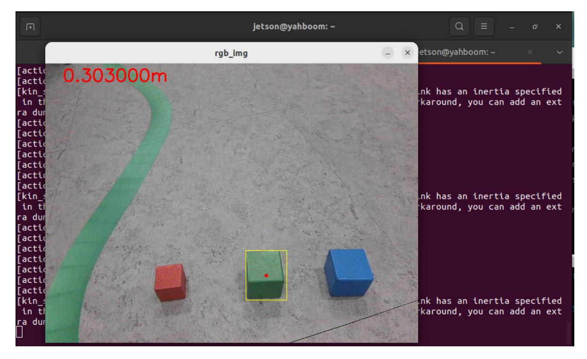

# Robotic Arm Grasping + Multimodal Visual Understanding + SLAM Navigation

**Robotic Arm Grasping + Multimodal Visual Understanding + SLAM Navigation**

- 1. Course Content
- 2. Starting the Agent
- 3. Running the Cases
  - 3.1 Starting the Program
  - 3.2 Testing Cases

## 1. Course Content

- After running the example program, combine Nav2 navigation, robotic arm grasping, and AI large model visual understanding to perform complex task functions.
- **Note: This chapter requires prior configuration of the map mapping file.**

#### [!NOTE]

The difference between the text version and the voice version lies in the instruction input method, and the text version does not require speech recognition and speech synthesis.

### 2. Starting the Agent

**Note: All test cases must start the Docker agent first. If it is already started, there is no need to start it again.**

Enter the following command in the vehicle terminal:

```
sh start_agent.sh
```

The terminal will print the following information, indicating a successful connection:

# 3. Running the Cases

#### 3.1 Starting the Program

Open the terminal on the vehicle and enter the following command:

```
ros2 launch multi_brains llm_agent_control.launch.py text_chat_mode:=True
```

Start the text interaction node in the terminal:

```
ros2 run text_chat text_chat
```

#### 3.2 Testing Cases

Here are two reference test cases; users can create their own test instructions.

Please help me move the red block in front of you to the master bedroom, and then move the green block from the master bedroom to the kitchen.Wooden blocks used: 30x30x30 mm blocks.

Test case input in the text interaction terminal:

Task steps planned by the decision-making large language model:

The execution layer large language model will then execute according to these task steps:

The robot will first grab the red block in front of it as instructed.



Then it navigates to the "bedroom" and uses the robotic arm to put down the red block.



After observing, finding, and grasping the green block in the "master bedroom," it proceeds to the "kitchen."



After putting down the green block in the "kitchen," the robot indicates that the task is complete and enters a waiting state. At this point, enter "End current task, let the robot end the task" in the interaction terminal.
