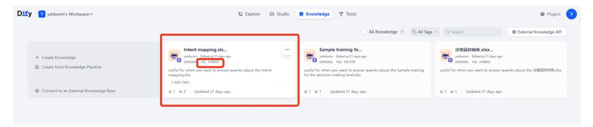
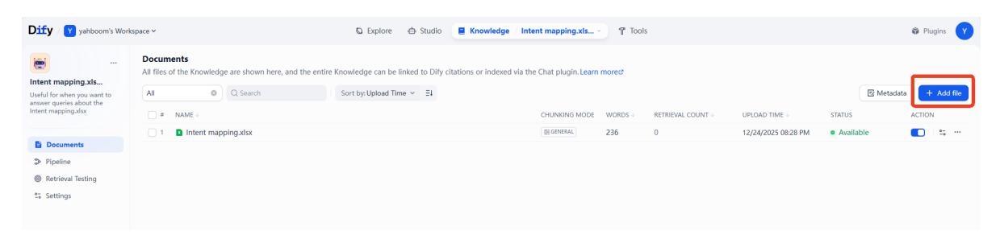
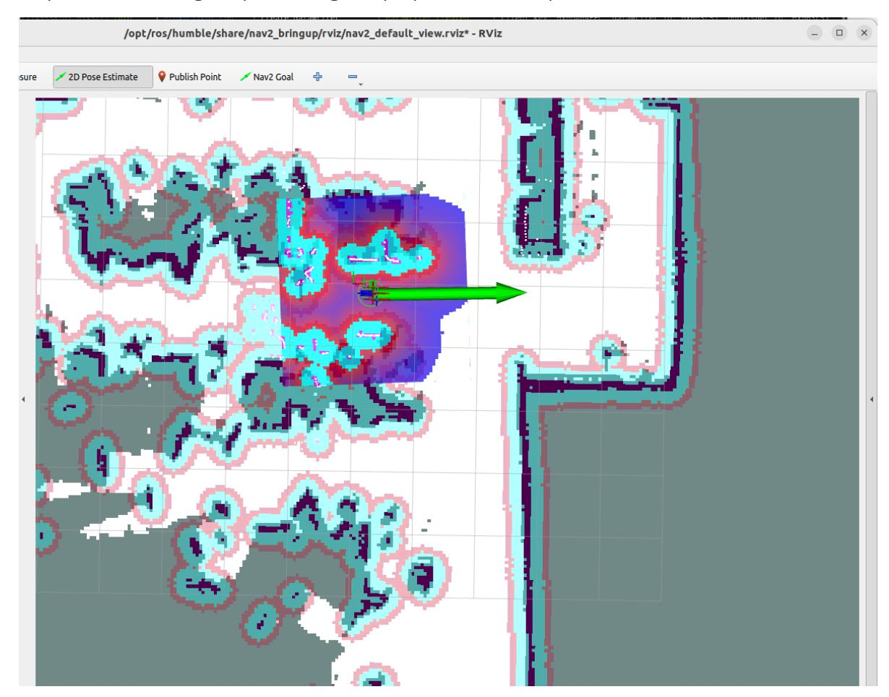
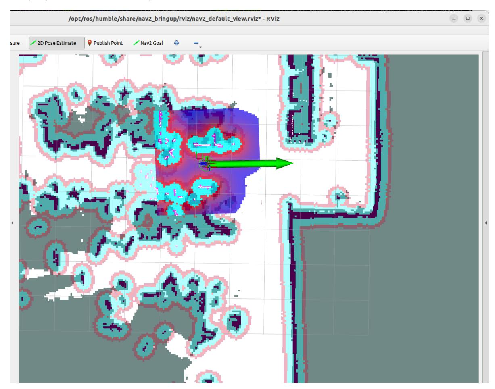
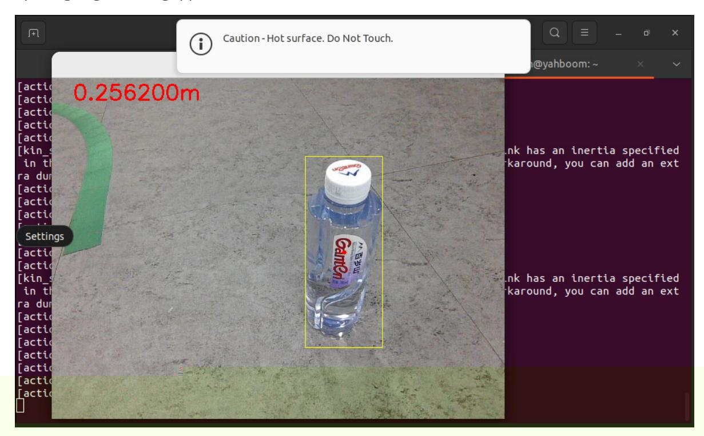

# Intent Understanding

## 1. Course Content

Master the ability to customize unique user intent understanding functions through the RAG knowledge base.

### [!IMPORTANT]

Intent understanding is designed to increase the rapport between the robot and the user, allowing the robot to better understand the user. This function should not be used to perform "strange" and "unconventional" tasks.

## 2. Starting the Agent

Note: If already started, no need to start again.

Enter the following command in the vehicle terminal:

```
sh start_agent.sh
```

The terminal will print the following information, indicating a successful connection:

### 2.2 Configuring the Intent Mapping File

- This file is used to store personal fuzzy intents and the corresponding tasks the robot should perform.
- Open the example file in this tutorial folder. You can add multiple custom intents according to the reference format. The following is a simple example:

| query                      | answer                                                                                                                                                                    |
|----------------------------|---------------------------------------------------------------------------------------------------------------------------------------------------------------------------|
| I'm a little thirsty | 1. Navigate to the kitchen, 2. Check for bottled water or drinks, 3. If available, use the robotic arm to pick up the drink, 4. Navigate back to the starting position |

### 2.3 Configuring the Knowledge Base

Next, we need to upload the edited intent mapping file to the Dify RAG knowledge base.

#### [!NOTE]

For detailed instructions on the RAG knowledge base, please refer to the tutorial in [2. AI Model Development - 06 - Deploy the RAG knowledge base]. - Dify comes preconfigured with a sample knowledge base for Intent mapping to demonstrate how to use the intent understanding feature.



You can modify the Intent mapping.xlsx template, or you can delete it and add your own file.



#### [!TIP]

#### It's worth noting:

To ensure optimal intent understanding performance, it is recommended to set the Intent mapping knowledge base to high-quality mode, as intent understanding often requires retrieving relevant snippets from semantically similar cues. ## 4. Running Examples

### 4.1 Starting the Program

On the vehicle's onboard computer, open a terminal and enter the command to start the AI agent function:

```bash
ros2 launch multi_brains llm_agent_control.launch.py text_chat_mode
```

Alternatively, you can use the shortcut command:

```bash
multi_brains
```

On the vehicle's onboard computer, open two more terminals and enter the commands to start the navigation function:

```bash
ros2 launch M3Pro_navigation base_bringup.launch.py
```

```bash
ros2 launch M3Pro_navigation navigation2.launch.py
```

Start RViz on the robot:

```bash
ros2 launch M3Pro_navigation nav_rviz.launch.py
```

Then, follow the procedure for starting the navigation function to initialize the positioning. This will open the rviz2 visualization interface. Click on **2D Pose Estimate** in the toolbar at the top to enter the selection state. Mark the approximate position and orientation of the robot on the map. After initializing the positioning, the preparation is complete.



## 4. Running Examples

### 4.1 Starting the Program

Run the text interaction node:

```bash
ros2 run text_chat text_chat
```

AI agent function on the vehicle's onboard computer:

```bash
ros2 launch multi_brains llm_agent_control.launch.py text_chat_mode:=True
```

On the vehicle's onboard computer, open two more terminals and enter the commands to start the navigation function:

```bash
ros2 launch M3Pro_navigation base_bringup.launch.py
```

```bash
ros2 launch M3Pro_navigation navigation2.launch.py
```

Start RViz on the robot:

```bash
ros2 launch M3Pro_navigation nav_rviz.launch.py
```

Then, follow the procedure for starting the navigation function to initialize the positioning. This will open the rviz2 visualization interface. Click on **2D Pose Estimate**, enter selection mode, roughly mark the robot's location and orientation on the map. After initialization and localization, the preparation work is complete.



### 4.2 Test Cases

Here are some reference test cases; users can create their own dialogue commands.

I'm in the master bedroom, and I'm a little thirsty.

Enter the test case in the text interaction terminal:

The task steps planned by the decision layer model are as follows:

Execute the task steps planned by the decision layer large model in sequence:

When the robotic arm is grasping, a visualization window will be displayed, as shown below: Note: The robotic arm's factory preset gripping size is for a 3 cm cube. Gripping the bottled water here is only for demonstration purposes. If gripping objects of other sizes, you need to modify the opening angle of the gripper.



After arriving at the "master bedroom," the robot will use its robotic arm to put down the red cube and prompt the user that the task is complete.
