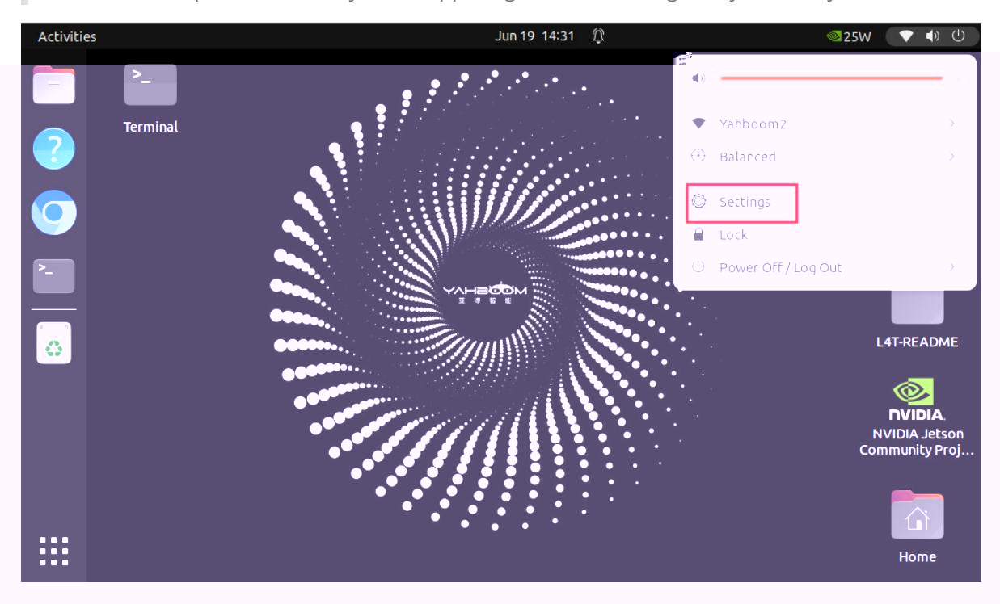
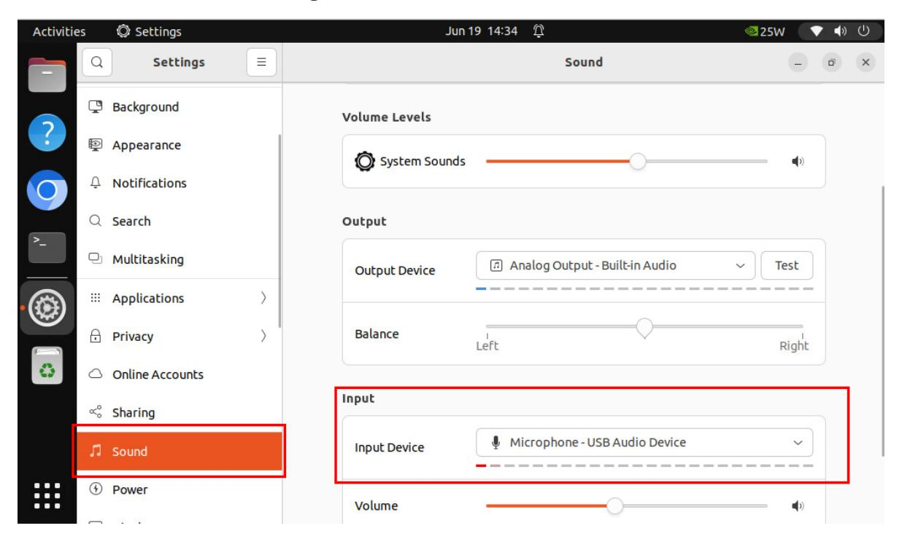

# Semantic Understanding and Instruction Following

#### Semantic Understanding and Instruction Following

- 1. Course Content
- 2. Preparation
  - 2.1 Content Description
  - 2.2 Starting the Agent
- 3. Running the Cases
  - 3.1 Starting the Program
  - 3.2 Test Cases
    - 3.2.1 Case 1
    - 3.2.2 Case 2
- 4. Code Analysis
- 5. Solutions to Common Problems
  - 5.1 Microphone Recording is Too Sensitive
  - 5.2 Microphone Recording Insensitivity
  - 5.3 Software Adjustment of Speech Recognition Sensitivity

# 1. Course Content

1. After running the large language model program, users can interact with the robot through voice conversation. User voice commands are first converted into text by a speech recognition large language model, then the text generation large language model and visual multimodal model accurately understand the user's instructions and speech. Finally, the robot performs the specified actions according to the user's instructions and responds to the user.

# 2. Preparation

# 2.1 Content Description

This section of the course uses the Jetson Orin NX as an example. For Raspberry Pi and Jetson Nano boards, you need to open a terminal on the host machine, then enter the command to enter the Docker container. After entering the Docker container, enter the commands mentioned in this section of the course in the terminal. For instructions on entering the Docker container from the host machine, please refer to the "Entering the Robot's Docker (For Jetson Nano and Raspberry Pi 5 Users)" section in the product tutorial [0. Instructions and Installation Steps]. For Orin and NX boards, simply open the terminal and enter the commands mentioned in this section of the course.

### 2.2 Starting the Agent

**Note: The Docker agent must be started before testing all cases. If it is already running, there is no need to start it again.**

Enter the following command in the vehicle terminal:

The terminal will print the following information, indicating a successful connection:

# 3. Running the Cases

### 3.1 Starting the Program

Open the terminal on the vehicle and enter the following command to start the program:

```
ros2 launch multi_brains llm_agent_control.launch.py
```

Alternatively, you can use the shortcut command:

```
multi_brains
```

After initialization, the following content will be displayed:

### 3.2 Test Cases

Here are two example test cases; users can create their own test commands.

- Please move forward quickly for 1 meter, then slowly move backward 0.5 meters like a turtle, then turn left 30 degrees, turn right 90 degrees, then translate left 0.5 meters, and then translate right 10 centimeters.
- Please perform a dance, and then tell me a joke about cats and dogs.

#### 3.2.1 Case 1

First, wake up the robot using "Hello yahboom". The robot will respond. After the recording prompt, the user can speak. The robot will perform dynamic sound detection. If there is sound activity, it will print "1-1-1-1"; if there is no sound activity, it will print "---------". After speaking, it will perform trailing sound detection. If there is silence for more than 1.5 seconds, the recording will stop. - The robot will first respond to the user, then perform the actions according to the instructions, while the terminal prints the following information:

Interpretation of the large language model's response:

- **Decision layer large language model output:** 1. Move forward quickly 1 meter, move backward slowly 0.5 meters, turn left 30 degrees, turn right 90 degrees, translate left 0.5 meters, translate right 0.1 meters.
- **Decision layer large language model output:** "action": ['set_cmdvel(0.5, 0, 0, 2)', 'set_cmdvel(-0.1, 0, 0, 5)', 'move_left(30, 1.5)', 'move_right(90, 1.5)', 'set_cmdvel(0, 0.5, 0, 1)', 'set_cmdvel(0, -0.1, 0, 1)'], "response": Okay, I'll start executing your instructions now, moving forward quickly and then slowly backward, then turning around and around, like performing a complex dance! "action": ['finishtask()'], "response": I have completed all the actions, it feels like I've finished a wonderful dance performance! If you have any other tasks you need my help with, just let me know!

The action list includes **finish()**

#### 3.2.2 Case 2

Similar to Case 1, after being awakened and speaking, the robot responds to the user and performs a dance according to the instructions.

# 4. Code Analysis

This section of the course applies the basic program framework of AI embodied intelligence. For code analysis, please refer to the chapter [1. Basic Knowledge of AI Large Models - 4. Core Source Code Interpretation].

# 5. Solutions to Common Problems

### 5.1 Microphone Recording is Too Sensitive

If you find that the **VAD (Voice Activity Detection)** continuously displays "1-1-1-1" after you finish speaking, it means the VAD detection is too sensitive. You should prioritize adjusting the microphone sensitivity. Adjusting sensitivity from the software level is generally rarely necessary.

First, connect to the robot's car computer screen via VNC, click on the options bar in the upper right corner, and find the **Settings** option.

#### [!NOTE]

The operation method for Raspberry Pi and Jetson Nano models is similar; both adjust the microphone sensitivity in the upper right corner settings, only the UI style differs.



Scroll down the left-hand **Settings** list, find the **Sound** option, and on the **Sound** page, find the **Input** audio input **Input Device**. Drag the **Volume** slider below to adjust the sensitivity. Adjust it to a suitable value while recording.



### 5.2 Microphone Recording Insensitivity

If the speaker is far from the robot, the **VAD (Voice Activity Detection)** may fail to detect voice activity, causing the recording to end prematurely before the speaker finishes speaking. In this case, you can refer to the steps in **5.1 Microphone Recording Overly Sensitive** to appropriately increase the microphone sensitivity.

#### Note:

If the microphone sensitivity is adjusted too high, it may increase the misidentification of environmental noise, treating environmental noise as voice activity.

### 5.3 Software Adjustment of Speech Recognition Sensitivity

The configuration file path for the multi_brains package is:

```
~/M3Pro_ws/multi_brains_file/multi_brains_setting.yaml
```

Find the VAD_MODE parameter. The parameter range is 1-3; a higher number indicates higher sensitivity of VAD voice activity detection.

```
####################
#ASR function setting
#语音识别功能设置
####################
USE_OLINE_ASR : True # Whether to use online
ASR
ASR_SUPPLIER : 'aliyun' #ASR Supplier (only
effective when using online ASR): Chinese mainland: aliyun International: xunfei
OLINE_ASR_MODEL : 'paraformer-realtime-v2'
ASR_THREASHOLD : 3 #ASR识别结果阈值,单位:字符ASR
recognition result threshold. Unit: characters
WAKEUP_THREASHOLD : 5.0 #唤醒时间阈值,防止
WAKEUP_THREASHOLD时间内被多次唤醒,单位:秒 Wake-up time threshold, preventing
multiple awakenments within the WAKEUP_THREASHOLD time, unit: seconds
VAD_MODE: 1 #vad灵敏度 VAD sensitivity
MAX_SILENCE_FRAMES: 90 #尾音时长检测,单位:帧数
Tail sound duration detection, unit: frames
```
