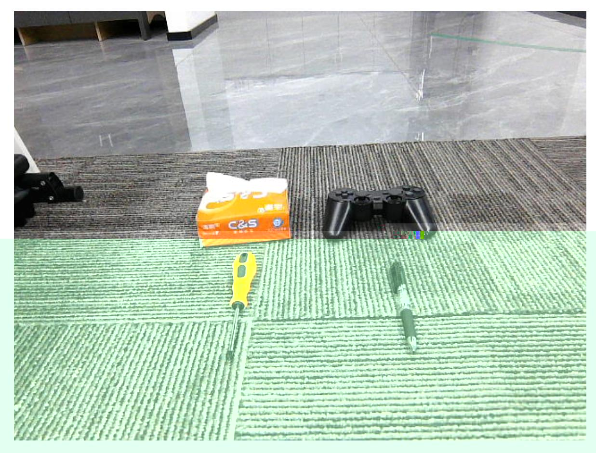

# Multimodal Visual Understanding

## 1. Course Content

Basic: Run the example program so the robot can observe the environment and perform tasks according to voice instructions.

Advanced: Understand the key source code introduced in this section.

## 2. Preparation

### 2.1 Content Description

This lesson uses Jetson Orin NX as the example. For Raspberry Pi and Jetson Nano boards, open a terminal on the host system, enter the Docker container, and then run the commands from this lesson inside the container. For instructions, see **Entering the Robot Docker Container (for Jetson Nano and Raspberry Pi 5 users)** in **0. Configuration and Operation Guide**.

For Orin and NX boards, open a terminal directly on the robot and run the commands from this lesson.

### 2.2 Start the Agent

If the agent is already running, you do not need to start it again.

Run the following command in the robot terminal:

```bash
sh start_agent.sh
```

The terminal prints connection information when the agent connects successfully.

## 3. Run the Example

### 3.1 Start the Program

Open a terminal on the robot and run:

```bash
ros2 launch multi_brains llm_agent_control.launch.py
```

Alternatively, use the shortcut command:

```bash
multi_brains
```

Wait for initialization to complete.

### 3.2 Test Cases

These test cases are for demonstration. You can also create your own dialogue commands.

- Tell me what objects are in front of you and what their functions are.
- Please check if there is a blue cube and a pack of tissues in front of you. If there is, nod your head; if not, shake your head.

#### 3.2.1 Case 1

Wake the robot by saying `Hello yahboom`. The robot responds. After the recording prompt, speak your command. The robot performs dynamic sound detection. If voice activity is detected, the terminal prints `1-1-1-1`; if no voice activity is detected, it prints `---------`. After you finish speaking, end-of-speech detection runs. If silence lasts more than 1.5 seconds, recording stops.

The robot first responds to the user, then performs actions according to the instruction while printing information in the terminal.

Robot perspective:



> [!IMPORTANT]
> The robot has short-term memory. After wake-up, all interactions are stored in the large language model's historical context. The robot clears previous memory only when the user explicitly asks to end the current task or gives a similar stop/rest command.

#### 3.2.2 Case 2

Wake the robot and speak the test command. The terminal prints the response information.

Robot perspective:


## 4. Source Code Analysis

Robot action source code path:

```text
~/M3Pro_ws/src/multi_brains/multi_brains/action_service.py
```

Model service source code path:

```text
~/M3Pro_ws/src/multi_brains/multi_brains/model_service.py
```

The visual observation function is mainly implemented by `seewhat` in `action_service.py`. It saves and displays an image from the latest perspective, then sends a request to the `model_service` node so image feedback can be provided to the `multi_brains` agent in Dify.

For the detailed code flow, see the text-version chapter **Multimodal Visual Understanding**. The voice version uses the same visual feedback path, with speech recognition and speech synthesis added around the interaction.
