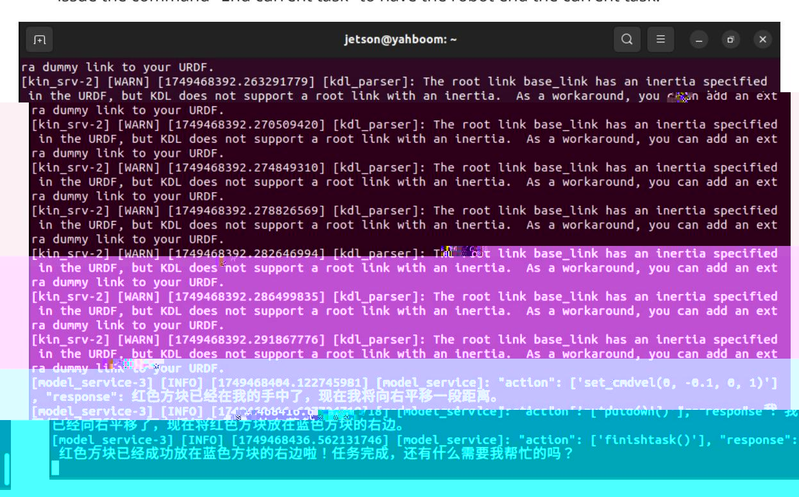

# Multimodal Visual Understanding + Robotic Arm Grasping

## 1. Course Content

- Basic: Run the example program and use the robot's visual understanding together with robotic arm grasping to complete integrated tasks.
- Advanced: Learn the key source code introduced in this section.

> [!NOTE]
> The large language model's responses to the same test command may differ slightly each time and may not exactly match the screenshots.

## 2. Preparation

### 2.1 Content Description

This lesson uses Jetson Orin NX as the example. For Raspberry Pi and Jetson Nano boards, open a terminal on the host system, enter the Docker container, and then run the commands from this lesson inside the container. For instructions, see **Entering the Robot Docker Container (for Jetson Nano and Raspberry Pi 5 users)** in **0. Configuration and Operation Guide**.

For Orin and NX boards, open a terminal directly on the robot and run the commands from this lesson.

### 2.2 Start the Agent

The Docker agent must be started before testing. If it is already running, you do not need to start it again.

Run the following command in the robot terminal:

```bash
sh start_agent.sh
```

The terminal prints connection information when the agent connects successfully.

## 3. Run the Cases

### 3.1 Start the Program

Open a terminal on the robot and start the AI agent:

```bash
ros2 launch multi_brains llm_agent_control.launch.py
```

Alternatively, use the shortcut command:

```bash
multi_brains
```

Wait for initialization to complete.

### 3.2 Test Cases

These cases are for reference. You can also create your own test commands.

Wooden blocks used: 30 x 30 x 30 mm blocks.

#### 3.2.1 Case 1: "Find the red square in front of you and pick it up"

Wake the robot by saying `Hello yahboom`. The robot responds. After the recording prompt, speak the command. The robot performs dynamic sound detection. If voice activity is detected, the terminal prints `1-1-1-1`; if no voice activity is detected, it prints `---------`. After you finish speaking, end-of-speech detection runs. If silence lasts more than 1.5 seconds, recording stops.

After `grasp_obj()` is called, a window named **rgb_img** opens on the VNC screen and displays the robot's view. The robot automatically adjusts its distance from the target object. After distance adjustment is complete, the robotic arm grasps the target item.


> [!IMPORTANT]
> After the robot picks up an object, the robotic arm remains in its current position. To return the arm to its initial posture:
>
> - Method 1: Wake the robot again and ask it to put down the red cube it just picked up.
> - Method 2: Wake the robot again and say `End current task`. After the task cycle ends, the robotic arm resets to its initial posture.

#### 3.2.2 Case 2: "Put the red cube in front of you to the right of the blue cube"

- Wooden blocks used: 30 x 30 x 30 mm blocks.
- Wake the robot and say `Put the red cube in front of you to the right of the blue cube`. The decision layer output shows the robot's strategy: identify the scene, locate the red cube, pick up the red cube, move to the right, and put down the cube.

When the robot completes the task and enters a waiting state, wake it again and say `End current task` to end the current task.



#### 3.2.3 Case 3: "Please remove the AprilTag block in front of you that is taller than 5 centimeters"

- Wooden blocks used: 30 x 30 x 30 mm and 30 x 30 x 60 mm AprilTag blocks.
- Wake the robot and say `Please remove the AprilTag block in front of you that is taller than 5 centimeters`.

The terminal opens a window named **result_image**, showing the height of each AprilTag block. After distance measurement stabilizes, the robot automatically adjusts its distance from the target, then uses the robotic arm to grasp the AprilTag block at the target height and move it to the right side of the robot.


## 4. Source Code Analysis

Robot action source code path:

```text
~/M3Pro_ws/src/multi_brains/multi_brains/action_service.py
```

Case 1 uses the `seewhat` and `grasp_obj` methods in the `ActionController` class. The `seewhat` function obtains the color image from the depth camera and is explained in **Multimodal Visual Understanding**. This section focuses on `grasp_obj`.

The object coordinate rules in the robotic arm grasping view are shown below.


The `grasp_obj(x1, y1, x2, y2)` function calls the robotic arm to grasp the target object. The parameters are the top-left and bottom-right coordinates of the target object's bounding box. The top-left corner of the image is the pixel coordinate origin.

`grasp_obj` starts the `grasp_desktop`, `KCF_follow`, and `ALM_KCF_Tracker_Node` subprocesses, then passes the parameters provided by the large model to `ALM_KCF_Tracker_Node` through a topic.

After grasping is complete, `KCF_follow` publishes `grasp_obj_done` on the `largemodel_arm_done` topic. The callback function sets the corresponding future object and reports the action result.
