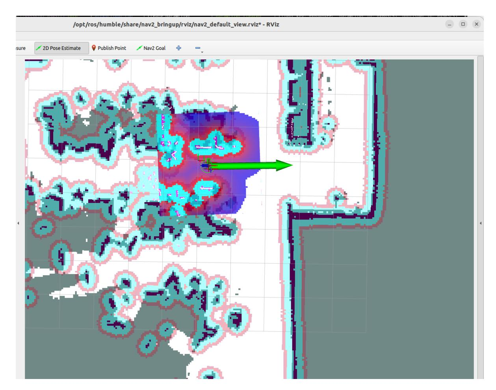
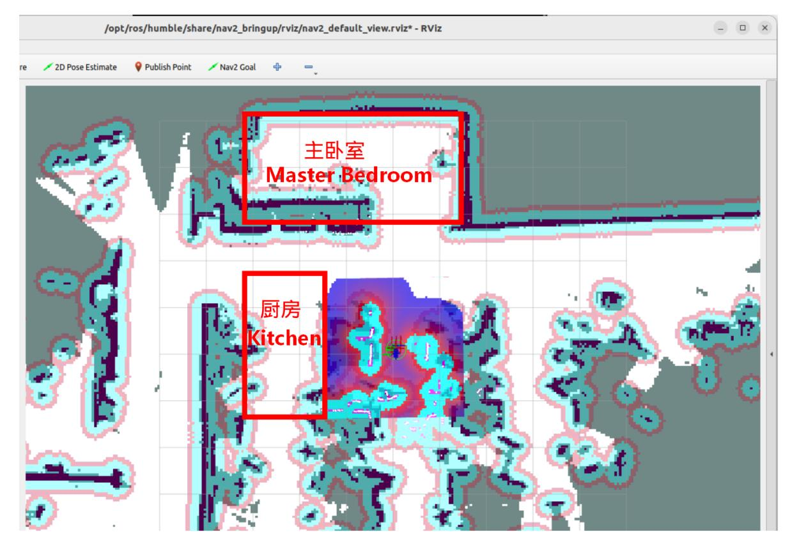
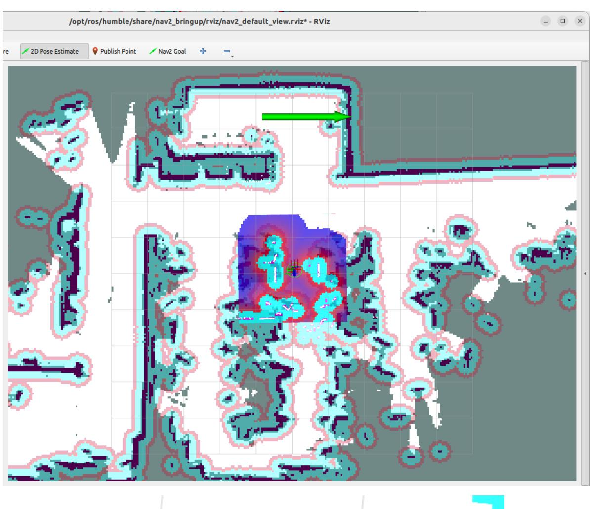
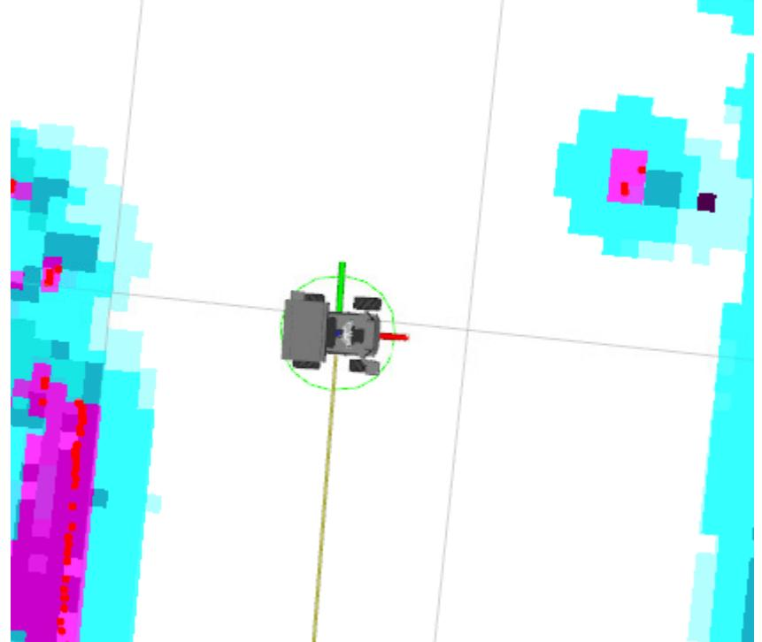
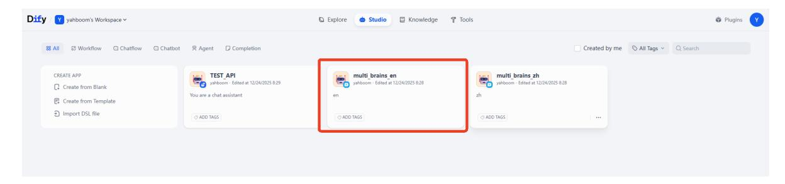
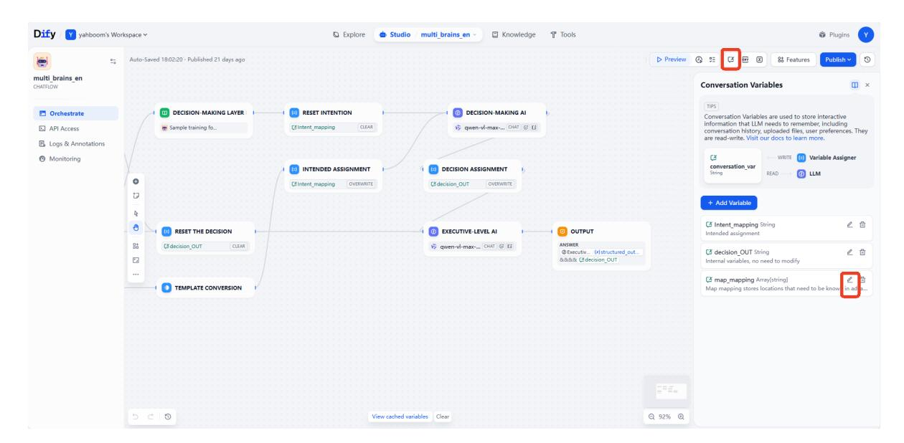
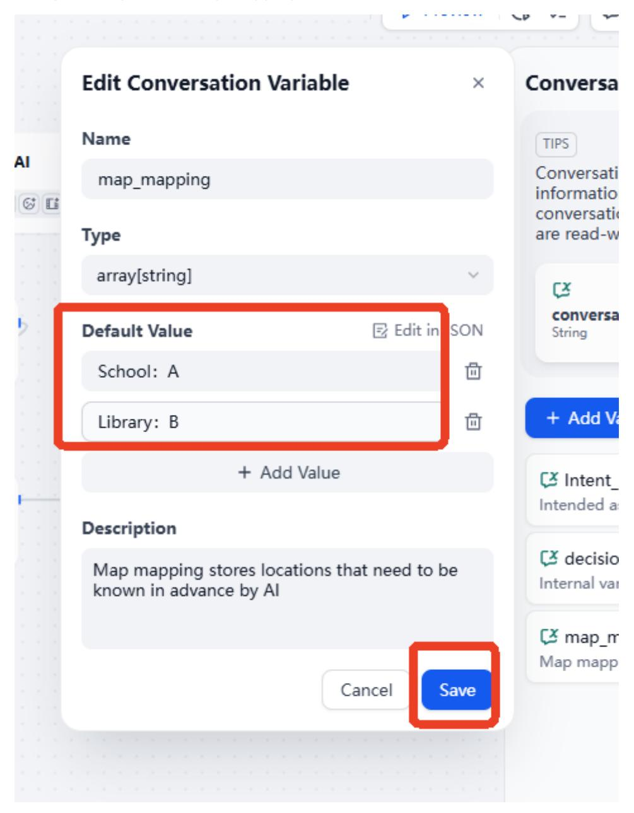
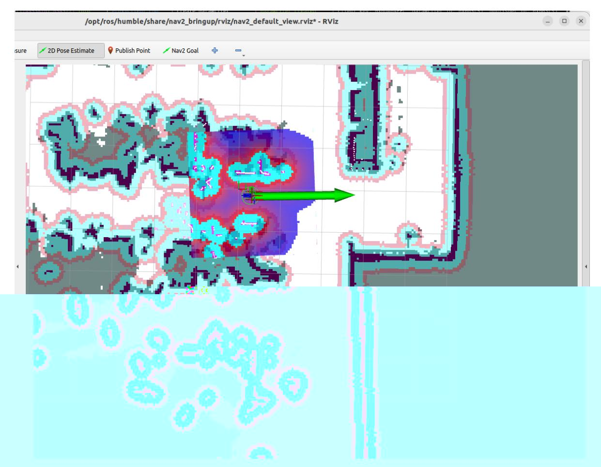

# Multimodal Visual Understanding + SLAM Navigation

#### Multimodal Visual Understanding + SLAM Navigation

- 1. Course Content
- 2. Preparation
  - 2.1 Content Description
  - 2.2 Starting the Agent
  - 2.3 Configuring the Map Mapping File
- 3. Running Example
  - 3.1 Starting the Program
  - 3.2 Test Cases
- 4. Source Code Analysis

# 1. Course Content

- Basic: Run example programs, combining the robot's visual understanding capabilities with SLAM navigation for integrated tasks.
- Advanced: Master the key source code introduced in this section.

# 2. Preparation

### 2.1 Content Description

This section of the course uses the Jetson Orin NX as an example. For Raspberry Pi and Jetson Nano boards, you need to open a terminal on the host machine, then enter the command to enter the Docker container. After entering the Docker container, enter the commands mentioned in this section of the course in the terminal. Instructions on how to access the Docker container from the host machine can be found in the product tutorial [0. Instructions and Installation Steps], specifically the section [Accessing the Robot's Docker (For Jetson Nano and Raspberry Pi 5 users)]. For Orin and NX boards, simply open a terminal and enter the commands mentioned in this section.

### 2.2 Starting the Agent

**Note: If the agent is already running, there is no need to start it again.**

Enter the following command in the vehicle terminal:

sh start_agent.sh

The terminal will print the following information, indicating a successful connection:

#### [!NOTE]

Note: To experience this section, you need to have built at least one grid map according to the LiDAR section of the course.

### 2.3 Configuring the Map Mapping File

Connect to the robot's desktop via VNC and start the navigation node using the following commands:

```
ros2 launch M3Pro_navigation base_bringup.launch.py
ros2 launch M3Pro_navigation navigation2.launch.py
```

Start RViz on the robot:

```
ros2 launch M3Pro_navigation nav_rviz.launch.py
```

Alternatively, you can start the display on the virtual machine; there is no need to start the display window repeatedly.

```
ros2 launch slam_view nav_rviz.launch.py
```

Afterward, the rviz2 visualization interface will open. Click **2D Pose Estimate** in the toolbar above to enter the selection state, and roughly mark the robot's position and orientation on the map.

The robot model will be displayed in the map, as shown below:



We can name any precise point on the map. Here, we use "Master Bedroom" and "Kitchen" as examples.



As shown in the figure below, we first click the **Nav2 Goal** tool to navigate the robot to the target point we need to mark.





Run the following command in the terminal to obtain the current robot's pose information in the map coordinate system:

ros2 run tf2_ros tf2_echo map base_footprint

Open the map_mapping.yaml map mapping file (you can open it using VNC, VS Code, command line, or any other method):

Here's an example of opening the file via the command line:

```
nano ~/M3Pro_ws/multi_brains_file/map_mapping.yaml
```

Modify the symbolic pose under the common_map_areas field. name is the location name. Fill in the previously obtained pose information into the position and orientation fields.

```
#根据实际的场景环境,自定义地图中的区域,可以添加任意个区域,注意和大模型的地图映射保持一致即可
#According to the actual scene environment, customize the areas in the map. You
can add any number of areas, just make sure they are consistent with the map
mapping of the large model
#地图映射Map mapping
common_map_areas: #常规导航 common navigation
 A:
 name: 'Master Bedroom'
 position:
   x: 3.974
   y: -2.634
 orientation:
   x: 0.0
   y: 0.0
   z: -0.688
```

```
w: 0.726
B:
  name: 'xxx'
  position:
    x: 1.488
    y: 0.661
    z: 0.0
  orientation:
    x: 0.0
    y: 0.0
    z: 0.725
    w: 0.688
```

After the modifications are complete, saving the file will take effect immediately. 2.4 Configuring Map Mapping Variables in Dify

- After configuring the map mapping file as described above, we need to let the AI large language model know the relationship between the locations and symbols in these maps.
- Start the Dify service (if already started, no need to restart):

```
bringup_dify
```

Enter the vehicle's IP address directly in the browser's address bar to access the Dify management page, then click to select the corresponding AI application.

#### [!NOTE]

International users: multi_brains_en



Click to select Session Variables in the upper right corner, then click the edit button for the map_mapping variable.



In the pop-up Edit Session Variables window, edit the mapping relationship according to the settings in the previous map mapping file, and then click Save.



Finally, remember to click Publish -> Publish Update to save the changes.


# 3. Running Example

### 3.1 Starting the Program

On the vehicle's terminal, enter the command to start the AI intelligent agent system:

```
ros2 launch multi_brains llm_agent_control.launch.py`
```

Or you can use the shortcut command:

```
multi_brains
```

Start the navigation command on the vehicle's onboard computer:

```
ros2 launch M3Pro_navigation base_bringup.launch.py
```

ros2 launch M3Pro_navigation navigation2.launch.py

Start RViz on the robot:

ros2 launch M3Pro_navigation nav_rviz.launch.py

Then, follow the procedure for starting the navigation function to initialize the positioning. This will open the rviz2 visualization interface. Click on **2D Pose Estimate** in the toolbar above to enter the selection state. Mark the approximate position and orientation of the robot on the map. After initializing the positioning, the preparation work is complete.



### 3.2 Test Cases

The cases are for reference only; provide instructions according to your needs. - Please remember your current location first, then navigate to the kitchen and the master bedroom in sequence, remembering the items you see. Finally, return to your starting position and tell me what you saw in those two places?

Wake up the robot and issue commands. The execution layer large model will execute subtasks according to the task steps planned by the decision layer model: 1. Navigate to the "master bedroom," then observe the items in the environment. Place a pen in the simulated "master bedroom," and place a pack of toilet paper in the simulated "kitchen":

The robot executes the steps according to the output process of the decision layer as follows:

# 4. Source Code Analysis

Robot action source code path:

```
~/M3Pro_ws/src/multi_brains/multi_brains/action_service.py
```

action_service.py program:

Case 1 uses the seewhat, navigation, load_target_points, and get_current_pose methods in the CustomActionServer class. seewhat has been explained in the **Multimodal Visual Understanding + Robotic Arm Grasping** section. This section explains the newly introduced navigation, load_target_points, and get_current_pose functions.

init_ros_communication initialization function:

Creates a nav2 navigation client to request the ros2 navigation action server for subsequent sending of navigation target point requests; creates a TF listener to listen to the coordinate transformation between map and base_footprint.

```
# Create a navigation action client to request the navigation action server
self.navclient = ActionClient(self, NavigateToPose, 'navigate_to_pose')
# Create a TF listener to listen for coordinate transformations
self.tf_buffer = Buffer()
self.tf_listener = TransformListener(self.tf_buffer, self)
```

#### **load_target_points** function:

This function is responsible for loading the target point coordinates from the map_mapping.yaml map mapping file and creating a navigation dictionary to store characters and their corresponding map coordinates. Each point coordinate is of type PoseStamped.

```
def load_target_points(self):
        """
        加载地图映射文件 /Load map mapping file
        """
        self.navpose_dict = {}
        self.road_net_dict = {}
        with open(self.map_mapping_file, "r") as file:
            full_target_points = yaml.safe_load(file)
            common_target_points = full_target_points.get("common_map_areas",
{})
            road_net_target_points =
full_target_points.get("road_net_map_areas", {})
        for name, data in common_target_points.items():#加载常规导航点 / Load
common navigation points
            pose = PoseStamped()
            pose.header.frame_id = "map"
            pose.pose.position.x = data["position"]["x"]
            pose.pose.position.y = data["position"]["y"]
            pose.pose.position.z = data["position"]["z"]
            pose.pose.orientation.x = data["orientation"]["x"]
            pose.pose.orientation.y = data["orientation"]["y"]
            pose.pose.orientation.z = data["orientation"]["z"]
            pose.pose.orientation.w = data["orientation"]["w"]
            self.navpose_dict[name] = pose
```

Receives a character parameter (corresponding to the characters in the map mapping described above), parses the coordinates corresponding to that character from the dictionary, and uses the self.navclient navigation client object to request the ROS2 navigation action server. When the navigation action server returns a value of 4, it indicates successful navigation; other values indicate failure (possibly due to obstacles, planning failures, etc.). After the navigation is complete, the function provides feedback on the action execution result to the large language model.

```
def __normal_navigation(self, point_name)->None:
        '''常规导航功能 / Normal navigation function '''
       self.navigation_finish_flag = False
       self.goal_handle = None
       self.result = None
       self.res = None
       point_name = point_name.strip("'\"")
       if point_name not in self.navpose_dict:
           self.get_logger().error(f"Target point '{point_name}' does not exist
in the navigation dictionary." )
           return None
       if self.first_record:
           # 出发前记录当前在全局地图中的坐标(只有在每个任务周期的第一次执行时才会记录)/
before starting a new task, record the current pose in the global map
           transform = self.tf_buffer.lookup_transform(
               "map", "base_footprint", rclpy.time.Time()
           )
           pose = PoseStamped()
           pose.header.frame_id = "map"
           pose.pose.position.x = transform.transform.translation.x
           pose.pose.position.y = transform.transform.translation.y
           pose.pose.position.z = 0.0
           pose.pose.orientation = transform.transform.rotation
           self.navpose_dict["zero"] = pose
           self.road_net_dict["zero"] = pose
           self.first_record = False
       # 获取目标点坐标 /get_target_pose
       target_pose = self.navpose_dict.get(point_name)
       goal_msg = NavigateToPose.Goal()
       goal_msg.pose = target_pose
       send_goal_future = self.navclient.send_goal_async(goal_msg)
       def goal_response_callback(future):
           self.goal_handle = future.result()
           if not self.goal_handle or not self.goal_handle.accepted:
               self.get_logger().error("Goal was rejected!")
               return None
           get_result_future = self.goal_handle.get_result_async()
           def result_callback(future_result):
               self.result = future_result.result()
               self.navigation_finish_flag = True
               if self.result.status == 4:
                   self.get_logger().info("Navigation finished!")
                   self.res= True
```

```
else:
                    self.get_logger().info(f"Navigation failed with status:
{self.result.status}")
                    self.res= False
            get_result_future.add_done_callback(result_callback)
        send_goal_future.add_done_callback(goal_response_callback)
        while not self.navigation_finish_flag:
            if self.interrupt_event.is_set() :
                self.navclient._cancel_goal(self.goal_handle)
                return None
            time.sleep(0.1)
        self.stop()
        return self.res
```

The **get_current_pose** function retrieves the robot's current map coordinates in the global coordinate system and stores these coordinates in a dictionary for easy retrieval later.

```
def get_current_pose(self):
        """
        获取当前在全局地图坐标系下的位置 /Get the current position in the global map
coordinate system
        """
        transform = self.tf_buffer.lookup_transform("map", "base_footprint",
rclpy.time.Time())
        pose = PoseStamped()
        pose.header.frame_id = "map"
        pose.pose.position.x = transform.transform.translation.x
        pose.pose.position.y = transform.transform.translation.y
        pose.pose.position.z = 0.0
        pose.pose.orientation = transform.transform.rotation
        self.navpose_dict["zero"] = pose
        position = pose.pose.position
        orientation = pose.pose.orientation
        self.get_logger().info(f"Recorded Pose: Position: x={position.x}, y=
{position.y},z={position.z},Orientation: x={orientation.x}, y={orientation.y}, z=
{orientation.z}, w={orientation.w}")
        return True
```
