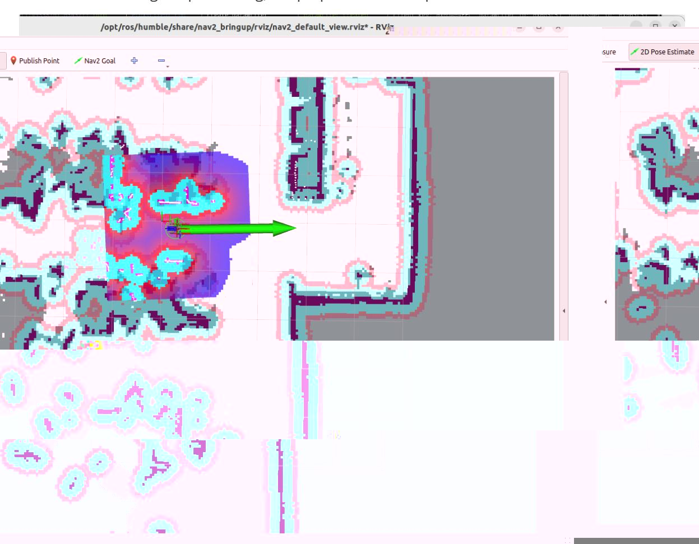
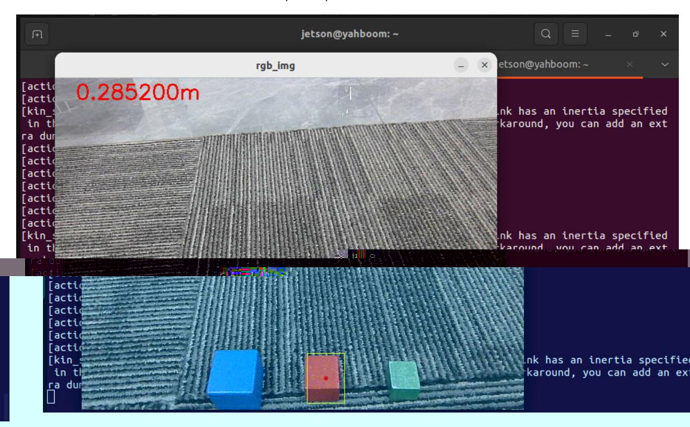
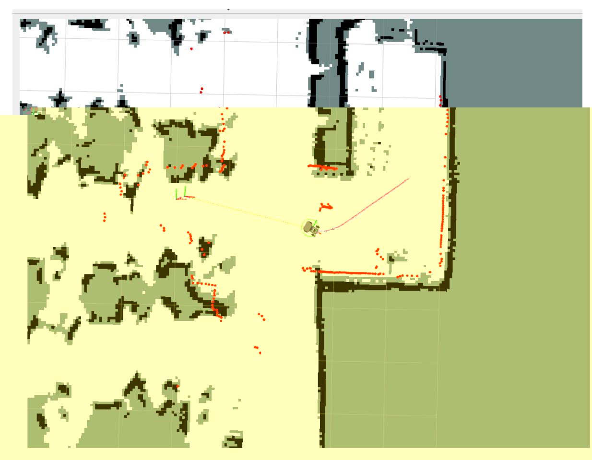
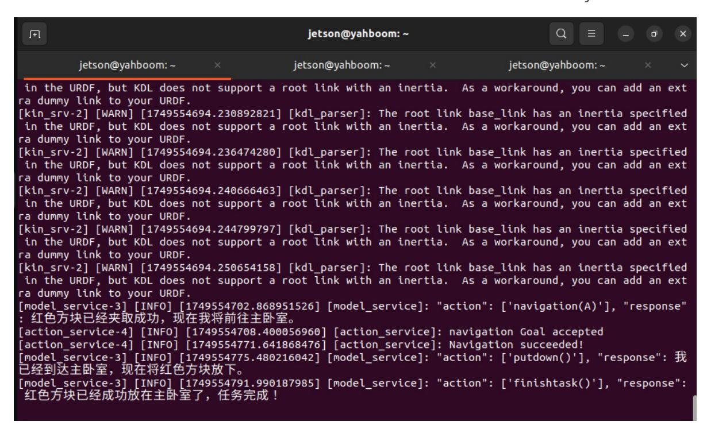

# Robotic Arm Grasping + Multimodal Visual Understanding + SLAM Navigation

Robotic Arm Grasping + Multimodal Visual Understanding + SLAM Navigation

- 1. Course Content
- 2. Preparation
  - 2.1 Content Description
  - 2.2 Starting the Agent
- 3. Running Examples
  - 3.1 Starting the Program
  - 3.2 Test Cases
- 4. Source Code Analysis

## 1. Course Content

Basic: After running the example program, combine Nav2 navigation, robotic arm grasping, and AI large model visual understanding to perform complex task functions.

Advanced: Master the key source code introduced in this tutorial.

- 1. **Note: This chapter requires completing the map mapping file configuration first.**

## 2. Preparation

### 2.1 Content Description

This course uses the Jetson Orin NX as an example. For Raspberry Pi and Jetson Nano boards, you need to open a terminal on the host machine, then enter the command to enter the Docker container. After entering the Docker container, enter the commands mentioned in this course in the terminal. For instructions on entering the Docker container from the host machine, please refer to the "Entering the Robot Car Docker (For Jetson Nano and Raspberry Pi 5 users)" section in the product tutorial [0. Instructions and Installation Steps]. For Orin and NX boards, simply open a terminal and enter the commands mentioned in this course.

### 2.2 Starting the Agent

Note: If the agent is already running, there is no need to start it again.

Enter the following command in the vehicle terminal:

sh start_agent.sh

The terminal will print the following information, indicating a successful connection:

## 3. Running Examples

### 3.1 Starting the Program

On the vehicle terminal, open the terminal and enter the command to start the AI agent function:

```bash
ros2 launch multi_brains llm_agent_control.launch.py
```

Alternatively, you can use the shortcut command:

```
multi_brains
```

After initialization, the following content will be displayed:

Start the navigation command on the vehicle:

```bash
ros2 launch M3Pro_navigation base_bringup.launch.py
```

```bash
ros2 launch M3Pro_navigation navigation2.launch.py
```

Start RViz on the robot:

```bash
ros2 launch M3Pro_navigation nav_rviz.launch.py
```

Then, follow the process for starting the navigation function to initialize the positioning. This will open the rviz2 visualization interface. Click on **2D Pose Estimate** in the toolbar above to enter the selection state. Roughly mark the robot's position and orientation on the map. After initializing the positioning, the preparation is complete.



### 3.2 Test Cases

Wooden blocks used: 30x30x30 mm blocks.

The test cases here are for reference only; users can create their own dialogue commands.

I am currently in the master bedroom. Please bring the red cube in front of you to the master bedroom.

The task steps planned by the decision-making layer model are as follows:

According to the task steps planned by the decision-making layer AI, the robot will first observe the environment in front of it, and then pick up the red block.



Then the robot navigates to the target point along the path planned by the global planner.



After arriving at the navigation target point, the robot will use its robotic arm to put down the red block it is holding and prompt the user that the task is complete. At this point, the robot enters a waiting state (retaining previous conversation memory), and the user can choose to continue the conversation or command the robot to end the current task and start a new task cycle.



## 4. Source Code Analysis

Robot action source code path:

This section's example uses the seewhat, navigation, load_target_points, putdown, and grasp_obj methods from the CustomActionServer class. seewhat, navigation, load_target_points, and grasp_obj have already been explained in previous sections. This section will explain the newly introduced putdown function.

### putdown function:

This function controls the robotic arm to release the object it has grasped. After grasping an object, the robotic arm is in a gripping state. Calling this function allows the robotic arm to release the grasped object. The principle is to control the robotic arm's posture by publishing the robotic arm joint topics. A return value of True indicates that the action was executed successfully, and the result is fed back to the AI large language model for the next operation.

```python
def putdown(self):
    self.pubSix_Arm(self.putsown_joints) # Deployment of robotic arm
    time.sleep(4)
    self.pubSingle_Arm(6, 30, 1000) # The robotic arm opened its gripper and
released the object.
    time.sleep(3)
    self.pubSix_Arm(self.init_joints) # The robotic arm retracted.
    return True
```
