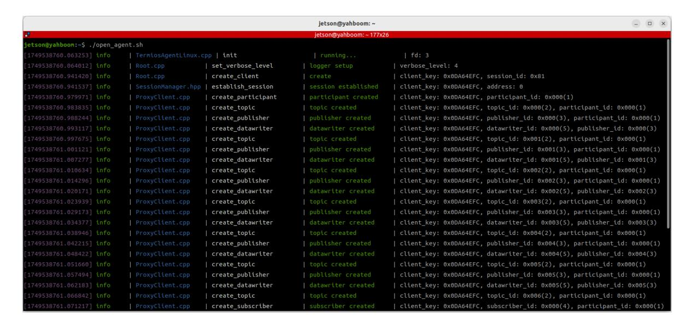
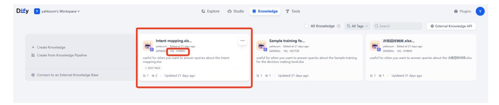
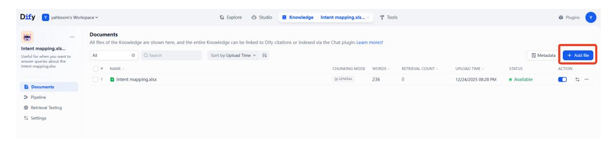
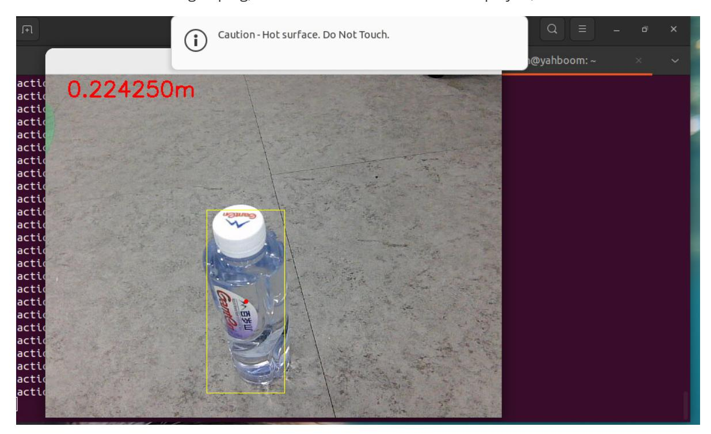
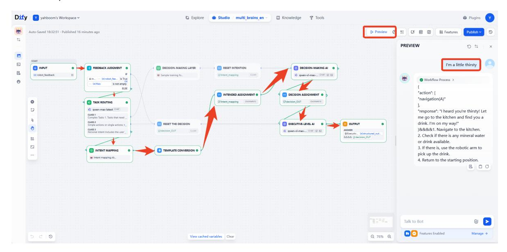
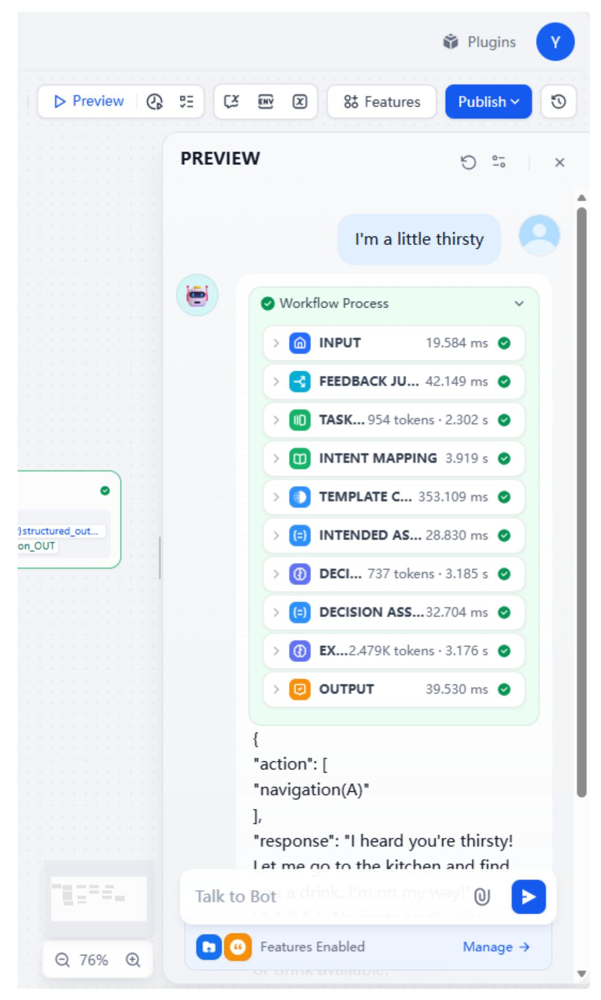
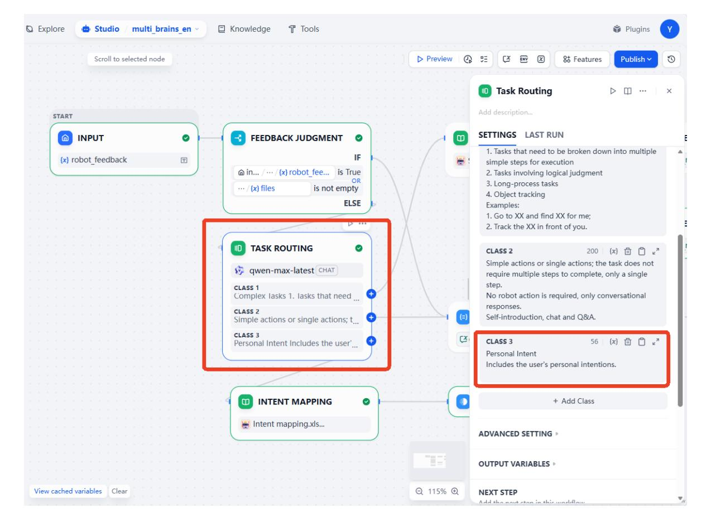
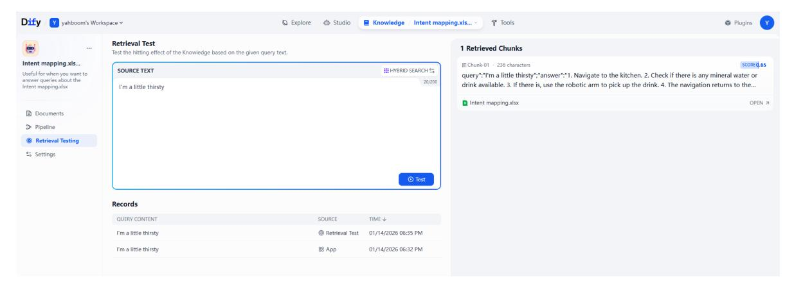

# Intent Understanding

## 1. Course Content

Basic: Learn how to customize user intent understanding through the RAG knowledge base.

Advanced: Learn how to debug intent understanding behavior on the Dify platform.

> [!IMPORTANT]
> Intent understanding is designed to improve rapport between the robot and the user so the robot can understand the user's needs more personally. Do not use this function for unusual or unsafe tasks.

## 2. Preparation

### 2.1 Content Description

This lesson uses Jetson Orin NX as the example. For Raspberry Pi and Jetson Nano boards, open a terminal on the host system, enter the Docker container, and then run the commands from this lesson inside the container. For instructions, see **Entering the Robot Docker Container (for Jetson Nano and Raspberry Pi 5 users)** in **0. Configuration and Operation Guide**.

For Orin and NX boards, open a terminal directly on the robot and run the commands from this lesson.

### 2.2 Start the Agent

If the agent is already running, you do not need to start it again.

Run the following command in the robot terminal:

```bash
sh start_agent.sh
```

The terminal prints connection information when the agent connects successfully.



### 2.3 Configure the Intent Mapping File

This file stores fuzzy personal intents and the corresponding tasks the robot should perform. Open the example file in this lesson's folder. You can add multiple custom intents by following the reference format. A simple example is shown below.

| Query                | Answer                                                                                                                                                                           |
|----------------------|----------------------------------------------------------------------------------------------------------------------------------------------------------------------------------|
| I'm a little thirsty | 1. Navigate to the kitchen. 2. Check if there is bottled water or drinks. 3. If available, use the robotic arm to pick up the drink. 4. Navigate back to the starting position. |

### 2.4 Configure the Knowledge Base

Next, upload the edited intent mapping file to Dify's RAG knowledge base.

> [!TIP]
> For detailed RAG knowledge base instructions, see **2. AI Model Development - 06 - Deploy the RAG knowledge base**.
>
> Dify includes a reference **Intent mapping** knowledge base to demonstrate the intent understanding function.



You can modify the `Intent mapping.xlsx` template, or delete it and add your own file.



> [!TIP]
> For best intent understanding results, set the **Intent mapping** knowledge base to High-Quality mode. Intent understanding often requires retrieving relevant snippets from semantically similar cues.

## 3. Run the Example

### 3.1 Start the Program

On the robot computer, open a terminal and start the AI agent:

```bash
ros2 launch multi_brains llm_agent_control.launch.py
```

Alternatively, use the shortcut command:

```bash
multi_brains
```

On the robot computer, open two more terminals and start the navigation nodes:

```bash
ros2 launch M3Pro_navigation base_bringup.launch.py
```

```bash
ros2 launch M3Pro_navigation navigation2.launch.py
```

Start RViz on the robot:

```bash
ros2 launch M3Pro_navigation nav_rviz.launch.py
```

Initialize navigation in RViz by clicking **2D Pose Estimate** and roughly marking the robot's position and orientation on the map. After initialization, preparation is complete.


### 3.2 Test Case

The following case is for reference. You can also create your own dialogue commands.

```text
I'm in the master bedroom now, and I feel a little thirsty.
```

The decision-layer model plans the task steps, and the execution-layer model executes them in sequence.

When the robotic arm grasps an object, a visualization window is displayed.



After arriving at the **master bedroom**, the robot uses the robotic arm to put down the red block and reports that the task is complete.

## 4. Debugging the Effect

### 4.1 Visual Workflow

Open the corresponding language version of the `multi_brains` application, then click preview to enter test content and view the data flow.



You can also open the workflow to view the time taken for each step and the input and output content of each process.



If the task routing module is inaccurate in some contexts and does not classify the input as **Category 3: Personal Intent**, add constraints or supplementary context descriptions for personal intent here.



You can also test the recall performance of input sentences separately inside the intent mapping knowledge base.


