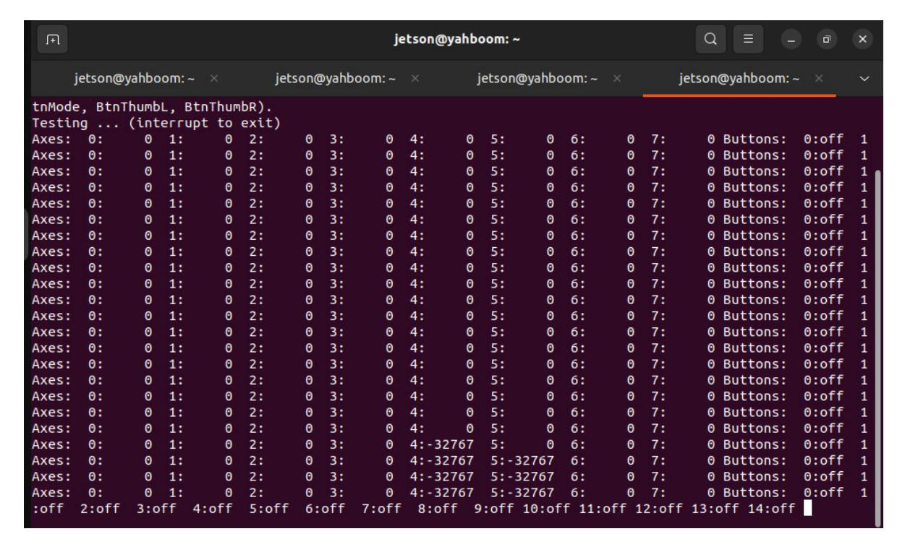
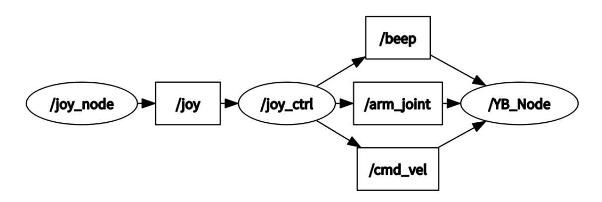
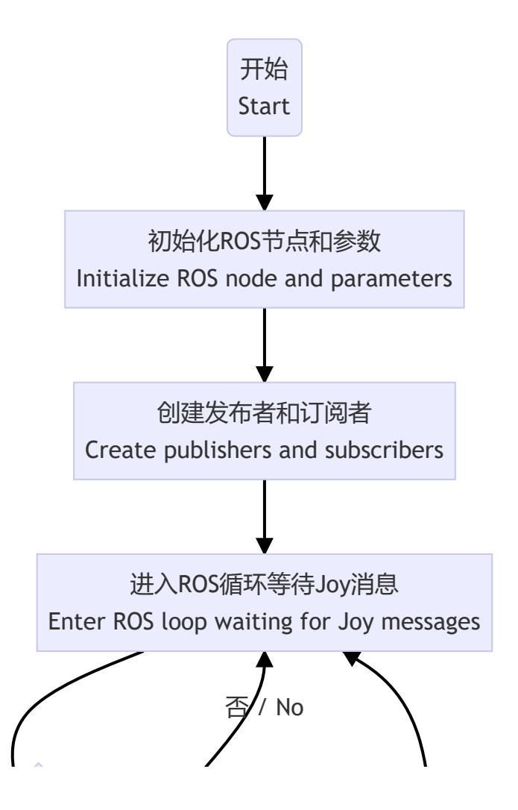
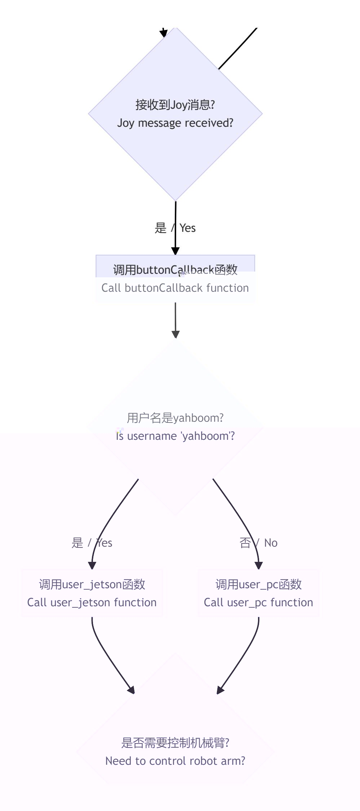
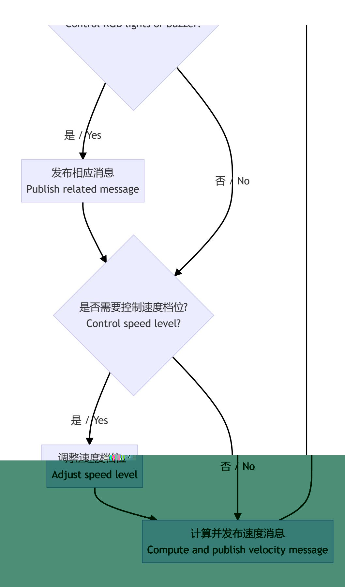

# Controller Control

## 1. Course Content

Learn how to control robot movement with a PS2 controller.

After the program starts, the PS2 controller can control both the robot chassis and the robotic arm.

## 2. Preparation

### 2.1 Content Description

This lesson uses Jetson Orin NX as the example. For Raspberry Pi and Jetson Nano boards, open a terminal, enter the Docker container, and then run the commands from this lesson inside the container. For instructions, see **Configuration and Operation Guide - Enter the Docker (Jetson Nano and Raspberry Pi 5 users, see here)**.

For Orin and NX boards, open a terminal directly on the robot and run the commands from this lesson.

### 2.2 Start the Agent

The Docker agent must be started before testing. If it is already running, you do not need to restart it.

Run the following command in the robot terminal:

```bash
sh start_agent.sh
```

The terminal prints connection information when the agent connects successfully.

### 2.3 Check the Device

Insert the wireless controller USB receiver into the main controller, such as Jetson, Raspberry Pi, or PC. Open a terminal and check the device. If `js0` is displayed, the wireless controller is recognized.

If needed, connect and disconnect the controller receiver and compare the device list. If the list changes, the changed device is the controller. If there is no change, the controller was not connected successfully or was not recognized.


### 2.4 Test Controller Input

Open a terminal and run:

```bash
sudo jstest /dev/input/js0
```

As shown in the image, this wireless controller has 8 axis inputs and 15 button inputs. Press each button to test its corresponding number.



If `jstest` is not installed, run:

```bash
sudo apt-get install joystick
```

## 3. Run the Example

### 3.1 Start the PS2 Controller Control Node

Jetson Nano and Raspberry Pi users must enter the Docker container first.

Open two terminals on the robot computer and run the following nodes separately.

Run the controller receiver node:

```bash
ros2 launch yahboomcar_ctrl yahboomcar_joy_launch.py
```

Run the robot controller node:

```bash
ros2 run yahboomcar_ctrl yahboom_joy_M3Pro
```

### 3.2 Button Control Instructions

| Controller action        | Function                                           |
|--------------------------|----------------------------------------------------|
| Left joystick up/down    | Move the robot forward/backward                    |
| Left joystick left/right | Move the robot left/right                          |
| Right joystick left/right | Rotate the robot left/right                       |
| START                    | Wake from sleep                                    |
| Left joystick press      | Adjust X/Y-axis speed                              |
| Right joystick press     | Adjust angular velocity                            |
| D-pad up                 | Move servo No. 4 up                                |
| D-pad down               | Move servo No. 4 down                              |
| D-pad left               | Move servo No. 3 down                              |
| D-pad right              | Move servo No. 3 up                                |
| X                        | Move servo No. 1 left                              |
| B                        | Move servo No. 1 right                             |
| Y                        | Move servo No. 2 up                                |
| A                        | Move servo No. 2 down                              |
| L1/LB                    | Tighten servo No. 6 gripper / rotate servo No. 5 right |
| L2/LT                    | Loosen servo No. 6 gripper / rotate servo No. 5 left |
| SELECT                   | Switch control between servo No. 6 and servo No. 5 |

## 4. Source Code Analysis

Source code path on Jetson Orin Nano and Jetson Orin NX:

```text
/home/jetson/yahboomcar_ws/src/yahboomcar_ctrl/yahboomcar_ctrl/yahboom_joy_M3Pro.py
```

For Jetson Nano and Raspberry Pi, enter Docker first. Source code path:

```text
/root/yahboomcar_ws/src/yahboomcar_ctrl/yahboomcar_ctrl/yahboom_joy_M3Pro.py
```

### 4.1 View the Node Relationship Graph

Open a terminal and run:

```bash
ros2 run rqt_graph rqt_graph
```



In the node relationship graph:

- `joy_node`: Receives data from the controller receiver and publishes it to the `/joy` topic.
- `joy_ctrl`: Subscribes to `/joy`, parses button and joystick operations, and publishes `/cmd_vel` and `/arm_joint` to control the chassis and robotic arm.

### 4.2 View Topic Messages and Message Types

Open a terminal on the robot or virtual machine and run:

```bash
ros2 interface show sensor_msgs/msg/Joy
```

The `/joy` topic data contains:

- `float32[] axes`: Input data for 8 axes.
- `int32[] buttons`: Input data for 15 buttons.

### 4.3 Program Flowchart

The flowchart image is large. The original image can be viewed in this lesson's folder.








### 4.4 Source Code Analysis

#### 4.4.1 Topic Communication

```python
self.pub_cmdVel = self.create_publisher(Twist,'cmd_vel', 1)
self.pub_SingleTargetAngle = self.create_publisher(ArmJoint, "arm_joint", 1)
self.sub_Joy = self.create_subscription(Joy,'joy', self.buttonCallback,10)
```

Chassis and robotic arm movement are controlled by publishing `/cmd_vel` and `/arm_joint`. The `/joy` topic is subscribed to obtain the PS2 controller button status.

The controller workflow is: parse controller data, convert it into control state variables, and send those variables to the chassis control board through topic communication. The control board subscribes to the topic data and converts it into hardware control values.

#### 4.4.2 Robotic Arm Control

Robotic arm control with the PS2 controller is implemented by the `arm_ctrl` method in the `JoyTeleop` class.

```python
def arm_ctrl(self, id, direction):
    while 1:
        if self.loop_active:
            self.arm_joints[id - 1] += direction
            if id == 5:
                if self.arm_joints[id - 1] > 270:
                    self.arm_joints[id - 1] = 270
                elif self.arm_joints[id - 1] < 0:
                    self.arm_joints[id - 1] = 0
            elif id == 6:
                if self.arm_joints[id - 1] >= 180:
                    self.arm_joints[id - 1] = 180
                elif self.arm_joints[id - 1] <= 30:
                    self.arm_joints[id - 1] = 30
            else:
                if self.arm_joints[id - 1] > 180:
                    self.arm_joints[id - 1] = 180
                elif self.arm_joints[id - 1] < 0:
                    self.arm_joints[id - 1] = 0
            self.arm_joint.id = id
            self.arm_joint.joint = int(self.arm_joints[id - 1])
            self.arm_joint.time = 500
            self.pub_SingleTargetAngle.publish(self.arm_joint)
        else:
            break
        sleep(0.03)
```

#### 4.4.3 Chassis Movement Control

Chassis movement control with the PS2 controller is implemented by the `user_jetson` method in the `JoyTeleop` class.

```python
def user_jetson(self, joy_data):
    # arm_ctrl_start
    if joy_data.buttons[10] == 1:
        self.gripper_active = not self.gripper_active

    if (joy_data.buttons[0] == joy_data.buttons[1] == joy_data.buttons[6] ==
            joy_data.buttons[3] == joy_data.buttons[4] == 0 and
            joy_data.axes[7] == joy_data.axes[6] == 0 and
            joy_data.axes[5] != -1):
        self.loop_active = False
    else:
        if joy_data.buttons[3] == 1:
            print("1,-")
            self.pub_armjoint(1, -1)  # X
        if joy_data.buttons[1] == 1:
            self.pub_armjoint(1, 1)  # B
            print("1,+")
        if joy_data.buttons[0] == 1:
            self.pub_armjoint(2, -1)  # A
            print("2,-")
        if joy_data.buttons[4] == 1:
            self.pub_armjoint(2, 1)  # Y
            print("2,+")
        if joy_data.axes[6] != 0:
            self.pub_armjoint(3, -joy_data.axes[6])  # D-pad left/right
            print("3,-/+")
        if joy_data.axes[7] != 0:
            self.pub_armjoint(4, joy_data.axes[7])  # D-pad up/down
            print("4,-/+")
        if self.gripper_active:
            if joy_data.axes[5] == -1:
                self.pub_armjoint(6, -1)  # L2
                print("6,-")
            if joy_data.buttons[6] == 1:
                self.pub_armjoint(6, 1)  # L1
                print("6,+")
        else:
            if joy_data.axes[5] == -1:
                self.pub_armjoint(5, -1)  # L2
                print("5,-")
            if joy_data.buttons[6] == 1:
                self.pub_armjoint(5, 1)  # L1
                print("5,+")
    # arm_ctrl_end

    # cancel nav
    if joy_data.buttons[9] == 1:
        self.cancel_nav()

    # RGB light
    if joy_data.buttons[7] == 1:
        return

    # Buzzer
    if joy_data.buttons[11] == 1:
        Buzzer_ctrl = UInt16()
        if self.Buzzer_active == 0:
            self.Buzzer_active = self.Buzzer_active + 1
        else:
            self.Buzzer_active = self.Buzzer_active - 1
        Buzzer_ctrl.data = self.Buzzer_active
        for i in range(3):
            self.pub_Buzzer.publish(Buzzer_ctrl)

    # Linear gear control
    if joy_data.buttons[13] == 1:
        if self.linear_Gear == 1.0:
            self.linear_Gear = 1.0 / 3
        elif self.linear_Gear == 1.0 / 3:
            self.linear_Gear = 2.0 / 3
        elif self.linear_Gear == 2.0 / 3:
            self.linear_Gear = 1

    # Angular gear control
    if joy_data.buttons[14] == 1:
        if self.angular_Gear == 1.0:
            self.angular_Gear = 1.0 / 4
        elif self.angular_Gear == 1.0 / 4:
            self.angular_Gear = 1.0 / 2
        elif self.angular_Gear == 1.0 / 2:
            self.angular_Gear = 3.0 / 4
        elif self.angular_Gear == 3.0 / 4:
            self.angular_Gear = 1.0

    xlinear_speed = (
        self.filter_data(joy_data.axes[1]) *
        self.xspeed_limit *
        self.linear_Gear
    )
    ylinear_speed = (
        self.filter_data(joy_data.axes[0]) *
        self.yspeed_limit *
        self.linear_Gear
    )
    angular_speed = (
        self.filter_data(joy_data.axes[2]) *
        self.angular_speed_limit *
        self.angular_Gear
    )

    if xlinear_speed > self.xspeed_limit:
        xlinear_speed = self.xspeed_limit
    elif xlinear_speed < -self.xspeed_limit:
        xlinear_speed = -self.xspeed_limit

    if ylinear_speed > self.yspeed_limit:
        ylinear_speed = self.yspeed_limit
    elif ylinear_speed < -self.yspeed_limit:
        ylinear_speed = -self.yspeed_limit

    if angular_speed > self.angular_speed_limit:
        angular_speed = self.angular_speed_limit
    elif angular_speed < -self.angular_speed_limit:
        angular_speed = -self.angular_speed_limit

    twist = Twist()
    twist.linear.x = xlinear_speed
    twist.linear.y = ylinear_speed
    twist.angular.z = angular_speed
    if self.Joy_active == True:
        print("joy control now")
        for i in range(3):
            self.pub_cmdVel.publish(twist)
```
