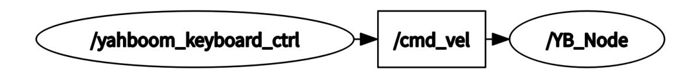

# Keyboard Control

## 1. Course Content

Learn how to control robot movement with the keyboard and understand the control principle.

After the program starts, keyboard keys publish velocity topics to control chassis movement.

## 2. Preparation

### 2.1 Content Description

This lesson uses Jetson Orin NX as the example. For Raspberry Pi and Jetson Nano boards, open a terminal, enter the Docker container, and then run the commands from this lesson inside the container. For instructions, see **Configuration and Operation Guide - Enter the Docker (Jetson Nano and Raspberry Pi 5 users, see here)**.

For Orin and NX boards, open a terminal directly on the robot and run the commands from this lesson.

### 2.2 Start the Agent

The Docker agent must be started before testing. If it is already running, you do not need to restart it.

Run the following command in the robot terminal:

```bash
sh start_agent.sh
```

The terminal prints connection information when the agent connects successfully.

## 3. Run the Example

### 3.1 Start Keyboard Control

Jetson Nano and Raspberry Pi users must enter the Docker container first.

Run the keyboard control node on the robot terminal or in the virtual machine:

```bash
ros2 run yahboomcar_ctrl yahboom_keyboard
```

### 3.2 Key Control Instructions

#### 3.2.1 Direction Control

| Key        | Motion            | Key        | Motion             |
|------------|-------------------|------------|--------------------|
| `i` or `I` | `[linear, 0]`     | `u` or `U` | `[linear, angular]` |
| `,`        | `[-linear, 0]`    | `o` or `O` | `[linear, -angular]` |
| `j` or `J` | `[0, angular]`    | `m` or `M` | `[-linear, -angular]` |
| `l` or `L` | `[0, -angular]`   | `.`        | `[-linear, angular]` |

#### 3.2.2 Speed Control

| Key | Speed change                                      | Key | Speed change                                      |
|-----|---------------------------------------------------|-----|---------------------------------------------------|
| `q` | Increase both linear and angular velocity by 10%  | `z` | Decrease both linear and angular velocity by 10%  |
| `w` | Increase only linear velocity by 10%              | `x` | Decrease only linear velocity by 10%              |
| `e` | Increase only angular velocity by 10%             | `c` | Decrease only angular velocity by 10%             |
| `t` | Switch linear velocity between X axis and Y axis  | `s` | Stop keyboard control                             |

## 4. Source Code Analysis

Source code path on Jetson Orin Nano and Jetson Orin NX:

```text
/home/jetson/yahboomcar_ws/src/yahboomcar_ctrl/yahboomcar_ctrl/yahboom_keyboard.py
```

For Jetson Nano and Raspberry Pi, enter Docker first. Source code path:

```text
/root/yahboomcar_ws/src/yahboomcar_ctrl/yahboomcar_ctrl/yahboom_keyboard.py
```

### 4.1 View the Node Relationship Graph

Open a terminal and run:

```bash
ros2 run rqt_graph rqt_graph
```



From the node relationship graph:

- `yahboom_keyboard_ctrl`: Controls the robot chassis by publishing `/cmd_vel`.
- `/YB_Node`: The chassis node subscribes to `/cmd_vel` and uses inverse kinematics to calculate each wheel speed, controlling robot movement.

### 4.2 View Topic Messages and Message Types

View `/cmd_vel` data:

```bash
ros2 topic echo /cmd_vel
```

View the message type of `/cmd_vel`:

```bash
ros2 topic info /cmd_vel
```

The message type is `geometry_msgs/msg/Twist`. View the message structure:

```bash
ros2 interface show geometry_msgs/msg/Twist
```

`Twist` contains two vector groups:

- `linear`: linear velocity.
- `angular`: angular velocity.

Each field is a `float64`. Because the chassis moves on a two-dimensional plane, keyboard control publishes only `linear.x`, `linear.y`, and `angular.z`.

### 4.3 Program Flowchart


### 4.4 Source Code Analysis

#### 4.4.1 Published Topic: `cmd_vel`

```python
pub = rospy.Publisher('cmd_vel', Twist, queue_size=1)
```

The program packages velocity data and publishes it with `pub.publish(twist)`. The chassis velocity subscriber receives the data and drives the robot.

#### 4.4.2 Movement and Speed Dictionaries

The movement dictionary stores direction-control keys.

```python
moveBindings = {
    'i': (1, 0),
    'o': (1, -1),
    'j': (0, 1),
    'l': (0, -1),
    'u': (1, 1),
    ',': (-1, 0),
    '.': (-1, 1),
    'm': (-1, -1),
    'I': (1, 0),
    'O': (1, -1),
    'J': (0, 1),
    'L': (0, -1),
    'U': (1, 1),
    'M': (-1, -1),
}
```

The speed dictionary stores speed-control keys.

```python
speedBindings = {
    'Q': (1.1, 1.1),
    'Z': (.9, .9),
    'W': (1.1, 1),
    'X': (.9, 1),
    'E': (1, 1.1),
    'C': (1, .9),
    'q': (1.1, 1.1),
    'z': (.9, .9),
    'w': (1.1, 1),
    'x': (.9, 1),
    'e': (1, 1.1),
    'c': (1, .9),
}
```

#### 4.4.3 Read the Current Key

```python
def getKey(self):
    tty.setraw(sys.stdin.fileno())
    rlist, _, _ = select.select([sys.stdin], [], [], 0.1)
    if rlist: key = sys.stdin.read(1)
    else: key = ''
    termios.tcsetattr(sys.stdin, termios.TCSADRAIN, self.settings)
    return key
```

#### 4.4.4 Determine the Key Value and Publish `/cmd_vel`

The main loop reads the key, checks whether it is a movement or speed-control key, updates the current velocity, packages the value into a `Twist` message, and publishes it to `/cmd_vel`.

```python
while (1):
    key = yahboom_keyboard.getKey()
    if key == "t" or key == "T":
        xspeed_switch = not xspeed_switch
    elif key == "s" or key == "S":
        print("stop keyboard control: {}".format(not stop))
        stop = not stop

    if key in moveBindings.keys():
        x = moveBindings[key][0]
        th = moveBindings[key][1]
        count = 0
    elif key in speedBindings.keys():
        speed = speed * speedBindings[key][0]
        turn = turn * speedBindings[key][1]
        count = 0
        if speed > yahboom_keyboard.linenar_speed_limit:
            speed = yahboom_keyboard.linenar_speed_limit
            print("Linear speed limit reached!")
        if turn > yahboom_keyboard.angular_speed_limit:
            turn = yahboom_keyboard.angular_speed_limit
            print("Angular speed limit reached!")
        print(yahboom_keyboard.vels(speed, turn))
        if status == 14:
            print(msg)
        status = (status + 1) % 15
    elif key == ' ':
        (x, th) = (0, 0)
    else:
        count = count + 1
        if count > 4:
            (x, th) = (0, 0)
        if key == '\x03':
            break

    if xspeed_switch:
        twist.linear.x = speed * x
    else:
        twist.linear.y = speed * x
    twist.angular.z = turn * th
    if not stop:
        yahboom_keyboard.pub.publish(twist)
    if stop:
        yahboom_keyboard.pub.publish(Twist())
```
