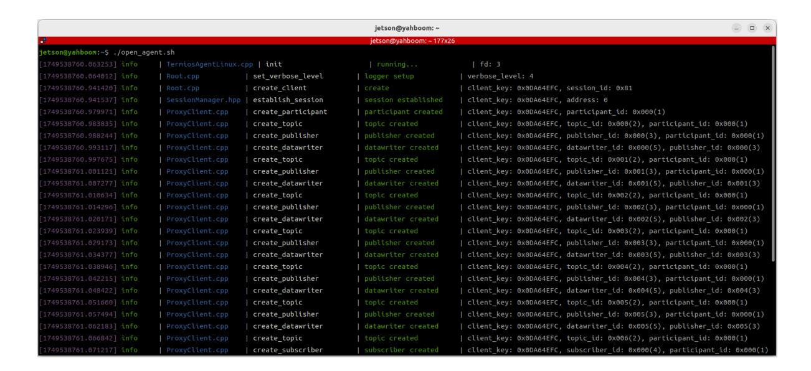
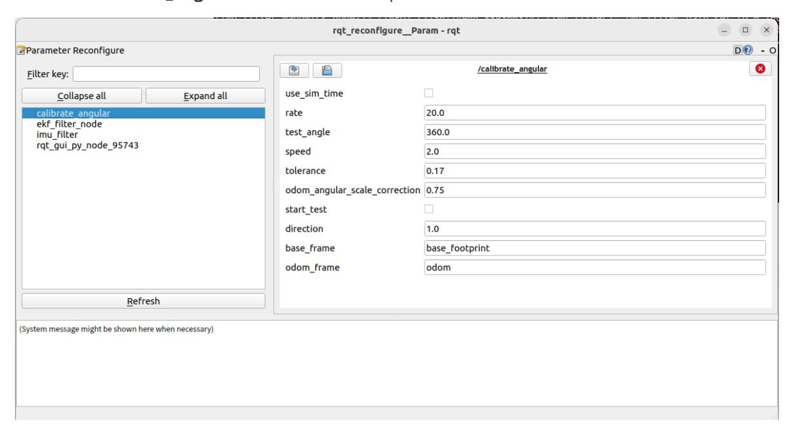
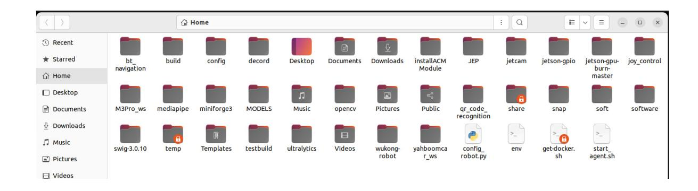
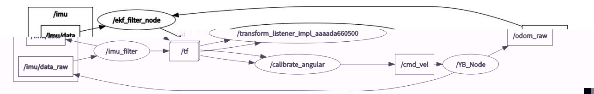

# Angular Velocity Calibration

## 1. Course Content

Learn how to calibrate robot angular velocity.

After the angular velocity calibration program starts, click **Start** in the visual interface. The chassis rotates and stops when the error is less than the tolerance value.

## 2. Preparation

### 2.1 Content Description

This lesson uses Jetson Orin NX as the example. For Raspberry Pi and Jetson Nano boards, open a terminal, enter the Docker container, and then run the commands from this lesson inside the container. For instructions, see **Configuration and Operation Guide - Enter the Docker (Jetson Nano and Raspberry Pi 5 users, see here)**.

For Orin and NX boards, open a terminal directly on the robot and run the commands from this lesson.

### 2.2 Start the Agent

The Docker agent must be started before testing. If it is already running, you do not need to restart it.

Run the following command in the robot terminal:

```bash
sh start_agent.sh
```

The terminal prints connection information when the agent connects successfully.



## 3. Run the Example

### Notice

Jetson Nano and Raspberry Pi users must enter the Docker container first.

### 3.1 Start the Program

Open a terminal on the robot computer and start the angular velocity calibration node:

```bash
ros2 launch calibration calibrate_angular.launch.py
```

Open the dynamic parameter adjuster from the virtual machine terminal:

```bash
ros2 run rqt_reconfigure rqt_reconfigure
```

Click the **calibrate_angular** node in the node list on the left.



Note: The nodes may not appear the first time you open the tool. Click **Refresh** to display all nodes. The **calibrate_angular** node is used to calibrate angular velocity.

The rqt parameters are:

- `test_angle`: Calibration test angle. This example rotates 360 degrees.
- `speed`: Angular velocity.
- `tolerance`: Allowed error tolerance.
- `odom_angular_scale_correction`: Angular velocity scale correction. If the test result is not ideal, modify this value.
- `start_test`: Test switch.
- `base_frame`: Base coordinate frame name.
- `odom_frame`: Odometry coordinate frame name.

### 3.2 Start Calibration

In `rqt_reconfigure`, select the `calibrate_angular` node. Click the box beside `start_test` to start calibration.

The robot monitors the TF transform between `base_footprint` and `odom`, calculates the theoretical rotation angle, and sends a stop command when the error is less than `tolerance`.

If the actual rotation angle is not 360 degrees, modify `odom_angular_scale_correction` in rqt. After modifying the value, click a blank area so the parameter is written, reset `start_test`, and then start calibration again. Record the final calibrated `odom_angular_scale_correction` value.

### 3.3 Write Calibration Parameters to the Chassis

To write parameters to the chassis, first disconnect the chassis agent. Press Ctrl+C or close the agent terminal.

Open `config_robot.py` in the robot home directory.



Uncomment line 552, enter the calibrated coefficient in `robot.set_ros_scale_angluar(xx)`, and save the file.

Open a terminal on the robot and run:

```bash
python3 config_robot.py
```

Wait for parameter writing to finish. The terminal prints the written value, such as `ros_scale_angluar:1.000`, indicating that angular velocity calibration is complete.

## 4. Source Code Analysis

Source code path on Jetson Orin Nano and Jetson Orin NX:

```text
/home/jetson/M3Pro_ws/src/calibration/calibration/calibrate_angular.py
```

For Jetson Nano and Raspberry Pi, enter Docker first.

### 4.1 View the Node Relationship Graph

Open a terminal on the virtual machine and run:

```bash
ros2 run rqt_graph rqt_graph
```



In the node relationship graph:

- `imu_filter` filters raw chassis IMU data from `/imu/data_raw` and publishes filtered data to `/imu/data`.
- `/ekf_filter_node` subscribes to raw odometry `/odom_raw` and filtered IMU data `/imu/data`, performs data fusion, and publishes `/odom`.
- `calibrate_angular` monitors the TF transform from `odom` to `base_footprint` and publishes `/cmd_vel` to control chassis movement.

### 4.2 Source Code Analysis

The `get_odom_angle` method in the `Calibrateangular` class monitors TF coordinate transforms.

```python
def get_odom_angle(self):
    try:
        now = rclpy.time.Time()
        rot = self.tf_buffer.lookup_transform(
            self.base_frame,
            self.odom_frame,
            now,
            timeout=rclpy.duration.Duration(seconds=1.0)
        )
        cacl_rot = PyKDL.Rotation.Quaternion(
            rot.transform.rotation.x,
            rot.transform.rotation.y,
            rot.transform.rotation.z,
            rot.transform.rotation.w
        )
        angle_rot = cacl_rot.GetRPY()[2]
    except (LookupException, ConnectivityException, ExtrapolationException):
        return
```

The `on_timer` method, the timer callback in the `Calibrateangular` class, calculates the robot rotation angle and controls chassis movement.

```python
def on_timer(self):
    self.start_test = self.get_parameter(
        'start_test'
    ).get_parameter_value().bool_value
    self.odom_angular_scale_correction = self.get_parameter(
        'odom_angular_scale_correction'
    ).get_parameter_value().double_value
    self.test_angle = self.get_parameter(
        'test_angle'
    ).get_parameter_value().double_value
    self.test_angle = radians(self.test_angle)
    self.speed = self.get_parameter(
        'speed'
    ).get_parameter_value().double_value

    move_cmd = Twist()
    self.test_angle *= self.reverse
    if self.start_test:
        self.error = self.turn_angle - self.test_angle
        if abs(self.error) > self.tolerance:
            move_cmd.angular.z = copysign(self.speed, self.error)
            self.cmd_vel.publish(move_cmd)
            self.odom_angle = self.get_odom_angle()
            self.delta_angle = (
                self.odom_angular_scale_correction *
                self.normalize_angle(self.odom_angle - self.first_angle)
            )
            self.turn_angle += self.delta_angle
            print("turn_angle: ", self.turn_angle, flush=True)
            print("error: ", self.error, flush=True)
            self.first_angle = self.odom_angle
        else:
            self.error = 0.0
            self.turn_angle = 0.0
            print("done", flush=True)
            self.first_angle = 0
            self.reverse = -self.reverse
            self.start_test = rclpy.parameter.Parameter(
                'start_test',
                rclpy.Parameter.Type.BOOL,
                False
            )
            all_new_parameters = [self.start_test]
            self.set_parameters(all_new_parameters)
    else:
        self.error = 0.0
        self.cmd_vel.publish(Twist())
        self.turn_angle = 0.0
        self.start_test = rclpy.parameter.Parameter(
            'start_test',
            rclpy.Parameter.Type.BOOL,
            False
        )
        all_new_parameters = [self.start_test]
        self.set_parameters(all_new_parameters)
```
