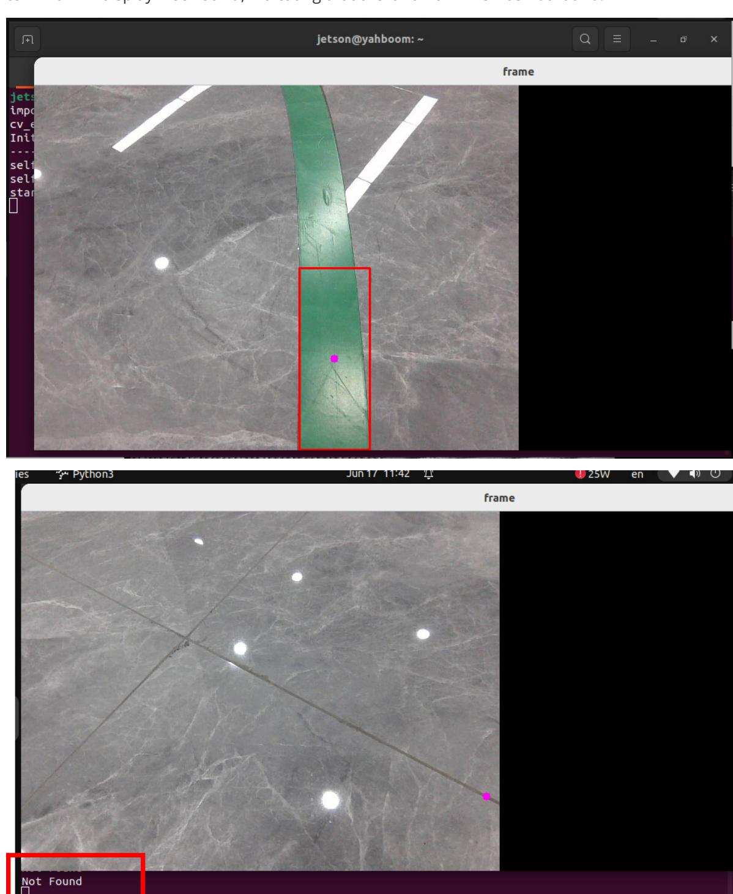
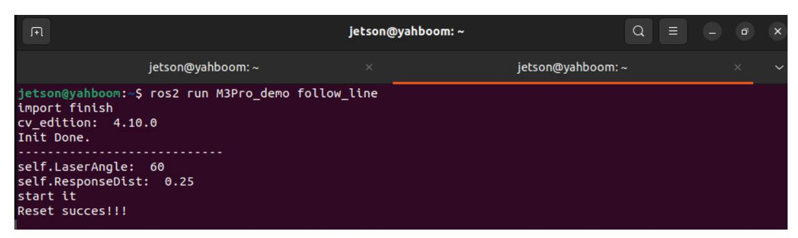
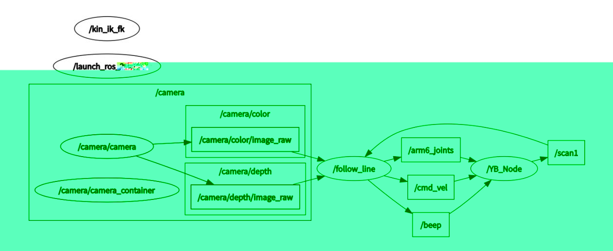
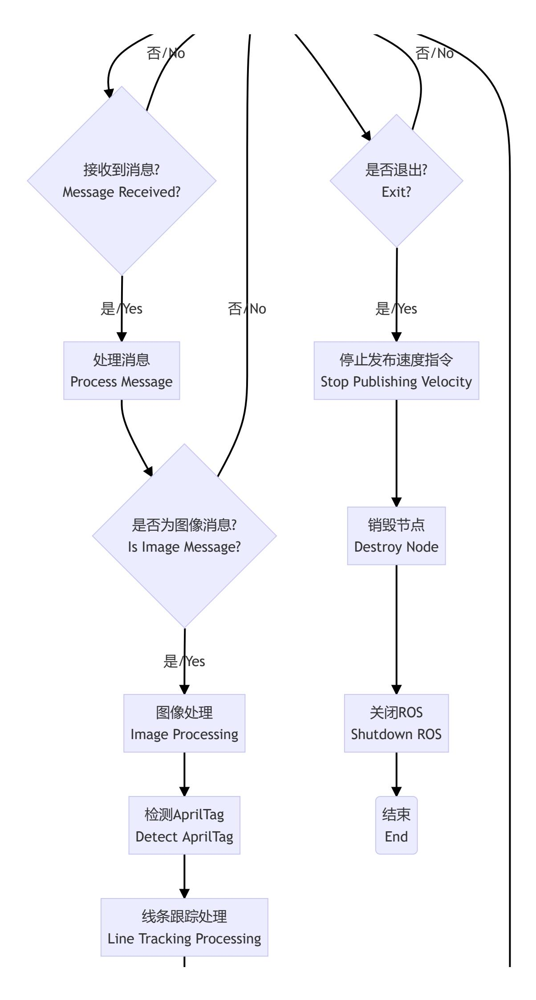

# Autonomous Line Patrol

## 1. Course Content

Learn the robot's autonomous line patrol function.

After the program starts, the robot locks onto the line marker in front of it. Press the spacebar to start. The robot follows the ground marker. If an obstacle appears, the robot pauses and sounds the buzzer. After the obstacle is removed, the robot continues until the marker line disappears and the robot stops.

## 2. Preparation

### 2.1 Content Description

This lesson uses Jetson Orin NX as the example. For Raspberry Pi and Jetson Nano boards, open a terminal, enter the Docker container, and then run the commands from this lesson inside the container. For instructions, see **Configuration and Operation Guide - Enter the Docker (Jetson Nano and Raspberry Pi 5 users, see here)**.

For Orin and NX boards, open a terminal directly on the robot and run the commands from this lesson.

### 2.2 Start the Agent

The Docker agent must be started before testing. If it is already running, you do not need to restart it.

Run the following command in the robot terminal:

```bash
sh start_agent.sh
```

The terminal prints connection information when the agent connects successfully.


## 3. Run the Example

### Notice

Jetson Nano and Raspberry Pi users must enter the Docker container first.

### 3.1 Start the Program

Start the depth camera runtime node in the robot terminal:

```bash
ros2 launch M3Pro_demo camera_arm_kin.launch.py
```

Open another terminal and run:

```bash
ros2 run M3Pro_demo follow_line
```

After the command starts, a graphics window named **frame** appears. A box marks the line marker. Press the spacebar to start following the marker line.

If an obstacle appears ahead, the robot stops line patrol and the buzzer sounds an alarm. After the obstacle is removed, the robot continues until it reaches the end of the marker line. The terminal displays **Not Found** when the marker line is no longer detected.



### 3.2 Color Calibration

The robot is factory-calibrated. If line color recognition is not ideal during patrol, or if you need to change the marker color, recalibrate the line patrol color.

After running `ros2 run M3Pro_demo follow_line` and opening the **frame** window, press `R` on the keyboard to select a color. Hold the left mouse button and draw a rectangle inside the target color area. Make sure the rectangle is within the color range. Release the mouse button to confirm the color automatically.


After color recalibration, the terminal prints **Reset successful!!!**, indicating that calibration is complete.



## 4. Source Code Analysis

Source code path on Jetson Orin Nano and Jetson Orin NX:

```text
/home/jetson/yahboomcar_ws/src/M3Pro_demo/M3Pro_demo/follow_line.py
```

For Jetson Nano and Raspberry Pi, enter Docker first. Source code path:

```text
/root/yahboomcar_ws/src/M3Pro_demo/M3Pro_demo/follow_line.py
```

### 4.1 View the Node Relationship Graph

Open a terminal and run:

```bash
ros2 run rqt_graph rqt_graph
```



In the node relationship graph:

- `follow_Line` subscribes to camera image topics for line detection and subscribes to `/scan1` to determine whether an obstacle is ahead. It controls the buzzer by publishing `/beep`, controls the robotic arm by publishing `/arm6_joints`, and controls chassis movement by publishing `/cmd_vel`.
- `camera` is the active camera node and publishes image information as ROS 2 messages.

### 4.2 Program Flowchart





### 4.3 Key Program Logic

The display callback subscribes to camera topics, converts images into OpenCV format, and displays them.

```python
def callback(self, color_frame, depth_frame):
    # OpenCV
    rgb_image = self.rgb_bridge.imgmsg_to_cv2(color_frame, 'rgb8')
    rgb_image = np.copy(rgb_image)
    depth_image = self.depth_bridge.imgmsg_to_cv2(depth_frame, encoding[1])
    depth_img = cv2.resize(depth_image, (640, 480))
    self.depth_image_info = depth_img.astype(np.float32)
    self.tags = self.at_detector.detect(
        cv2.cvtColor(rgb_image, cv2.COLOR_RGB2GRAY),
        False,
        None,
        0.025
    )
    self.tags = sorted(self.tags, key=lambda tag: tag.tag_id)
    draw_tags(
        rgb_image,
        self.tags,
        corners_color=(0, 0, 255),
        center_color=(0, 255, 0)
    )

    depth_image = self.depth_bridge.imgmsg_to_cv2(depth_frame, encoding[1])
    frame = cv2.resize(depth_image, (640, 480))
    depth_image_info = frame.astype(np.float32)
    action = cv2.waitKey(1)
    if self.count == True and self.Start_ == True:
        if (time.time() - self.start_time) > 3:
            self.Track_state = 'tracking'
            self.count = False
    result_img, bin_img = self.process(rgb_image, action)
    result_img = cv2.cvtColor(result_img, cv2.COLOR_RGB2BGR)
    if len(bin_img) != 0:
        cv.imshow('frame', ManyImgs(1, ([result_img, bin_img])))
    else:
        cv.imshow('frame', result_img)
```

The line patrol logic follows the road marker and stops when an obstacle is detected. It is implemented by the `execute` method in the `LineDetect` class.

```python
def execute(self, point_x, color_radius):
    if self.Joy_active == True:
        if self.Start_state == True:
            self.PID_init()
            self.Start_state = False
        return
    self.Start_state = True

    if color_radius == 0:
        print("Not Found")
        self.pub_cmdVel.publish(Twist())
    else:
        twist = Twist()
        b = UInt16()
        [z_Pid, _] = self.PID_controller.update(
            [(point_x - 320) * 1.0 / 16, 0]
        )
        if self.img_flip == True:
            twist.angular.z = -z_Pid
        else:
            twist.angular.z = +z_Pid
        twist.linear.x = self.linear

        if self.front_warning > 10:
            print("Obstacles ahead !!!")
            self.pub_cmdVel.publish(Twist())
            self.Buzzer_state = True
            b.data = 1
            self.pub_Buzzer.publish(b)
        else:
            if self.Buzzer_state == True:
                b.data = 0
                for i in range(3):
                    self.pub_Buzzer.publish(b)
                self.Buzzer_state = False
            if abs(point_x - 320) < 40:
                twist.angular.z = 0.0

            if self.Joy_active == False:
                self.pub_cmdVel.publish(twist)
            else:
                twist.angular.z = 0.0
```
