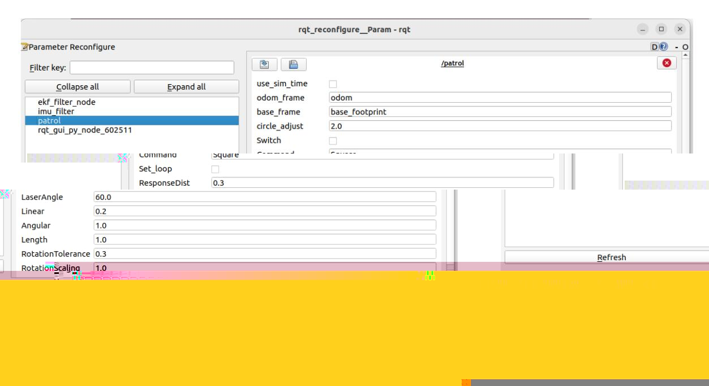
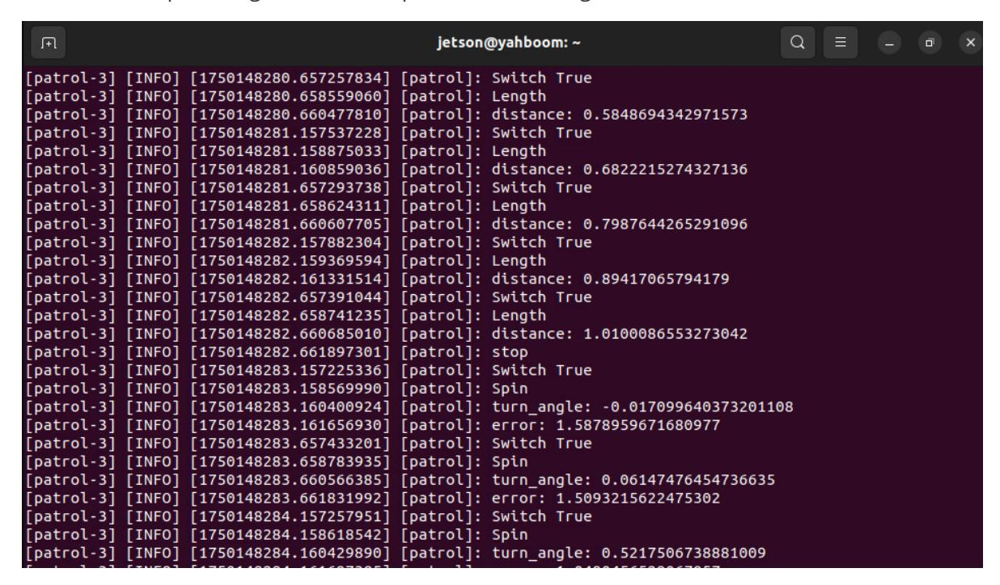
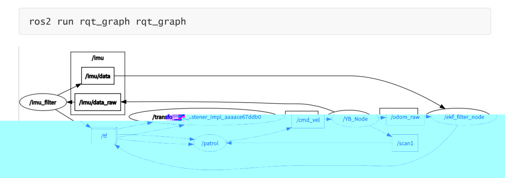

# Patrol

#### Patrol

- 1. Course Content
- 2. Preparation
  - 2.1 Content Description
  - 2.2 Starting the Agent
- 3. Running the Example
  - 3.1 Starting the Program
- 4. Source Code Analysis
  - 4.1 Viewing the Node Relationship Graph
  - 4.2 Program Flowchart
  - 4.3 Key Programs

# 1. Course Content

Learn the Robot Patrol Function

Set the patrol route in the dynamic parameter controller and click Start. The robot will move along the patrol route. Simultaneously, the robot's radar will scan for obstacles within the specified radar angle and obstacle detection distance. If an obstacle is detected, the robot will stop and a buzzer will sound. If no obstacle is detected, the robot will resume patrolling.

# 2. Preparation

### 2.1 Content Description

This course uses the Jetson Orin NX as an example. For Raspberry Pi and Jetson Nano boards, you need to open a terminal and enter the command to enter the Docker container. Once inside the Docker container, enter the commands mentioned in this course in the terminal. For instructions on entering the Docker container, refer to the product tutorial **[Configuration and Operation Guide] - [Entering the Docker (Jetson Nano and Raspberry Pi 5 users see here)]**. For Orin and NX boards, simply open a terminal and enter the commands mentioned in this course.

## 2.2 Starting the Agent

**Note: The Docker agent must be started before testing all examples. If it is already started, you do not need to restart it.**

Enter the command in the vehicle terminal:

sh start_agent.sh

The following information will be printed on the terminal, indicating a successful connection.

# 3. Running the Example

#### Note:

The Jetson Nano and Raspberry Pi series controllers must first enter the Docker container (for steps, see the [Docker course chapter - Entering the Robot's Docker Container]).

# 3.1 Starting the Program

Run the node on the vehicle terminal:

```
ros2 launch patrol patrol.launch.py
```

Using the accompanying virtual machine as an example, run the parameter configuration node:

```
ros2 run rqt_reconfigure rqt_reconfigure
```

Then click the **Patrol** node in the left-hand options bar. If there's no node on the left-hand options bar when you first start, click **Refresh** below.



**[Command]** sets the patrol route. Here, we'll use a square patrol route as an example. The various patrol routes are explained below. After setting the route in the [Command] field, click Switch to start patrolling. The terminal prints the following information:



If there is an obstacle on the patrol path, the robot will stop and display the **obsstance** prompt.

Other parameters in the rqt interface are described below:

- odom_frame: The name of the odometry coordinate system.
- base_frame: The name of the base coordinate system.
- circle_adjust: If the patrol route is circular, this value can be used as a coefficient to adjust the circle size. See the code for details.
- Switch: Gameplay switch.
- Command: Patrol route. There are the following types of routes: [LengthTest] Linear patrol, [Circle] - Circle patrol, [Square] - Square patrol, and [Triangle] - Triangle patrol. - Set_loop: Restart patrol. Once set, the patrol will continue in a loop along the specified route.
- ResponseDist: Obstacle detection distance
- LaserAngle: Radar detection angle
- Linear: Linear velocity
- Angular: Angular velocity
- Length: Distance of linear motion
- RotationTolerance: Rotation error tolerance
- RotationScaling: Rotation scaling factor

# 4. Source Code Analysis

Source Code Path:

Jetson Orin Nano, Jetson Orin NX Host:

```
/home/jetson/M3Pro_ws/src/patrol/patrol/patrol.py
```

Jetson Orin Nano, Raspberry Pi Host:

You need to enter Docker first.

```
root/M3Pro_ws/src/patrol/patrol/patrol.py
```

## 4.1 Viewing the Node Relationship Graph

Open a terminal and enter the command:



In the above node relationship diagram:

- **patrol** is the key node for implementing the patrol function. This node subscribes to the coordinate transformation between the odometry data odom and the besefootprint, and uses the lidar data from /scan1 to determine whether there are obstacles ahead through distance measurement.
- **YB_Node**: The chassis node publishes lidar data **/scan1** and raw odometry data **/odom_raw**. It subscribes to the **/cmd_vel** topic data to control the robot chassis motion using inverse kinematics.
- **ekf_filter_node**: The extended Kalman filter is used to fuse raw odometry data with filtered IMU data and publish the fused odometry data **/odom**. - **imu_filter**: IMU filter node, filters the raw IMU data **/imu/data_raw** and publishes the filtered data **/imu/data**.

### 4.2 Program Flowchart

The image size is too large. Please see the original image in this course folder.

# 4.3 Key Programs

The following explains the core of the program:

**Movement Status Acquisition:** Monitors the TF transformations of odom and base_footprint, and calculates the current XY coordinates and rotation angle.

**Program Implementation:** The get_position and get_odom_angle methods in the YahboomCarPatrol class

```
def get_position(self):
    try:
        now = rclpy.time.Time()
        trans =
self.tf_buffer.lookup_transform(self.odom_frame,self.base_frame,now)
        return trans
    except (LookupException, ConnectivityException, ExtrapolationException):
        self.get_logger().info('transform not ready')
        raise
        return
def get_odom_angle(self):
     try:
```

```
now = rclpy.time.Time()
        rot =
self.tf_buffer.lookup_transform(self.odom_frame,self.base_frame,now)
        #print("oring_rot: ",rot.transform.rotation)
        cacl_rot = PyKDL.Rotation.Quaternion(rot.transform.rotation.x,
rot.transform.rotation.y, rot.transform.rotation.z, rot.transform.rotation.w)
        #print("cacl_rot: ",cacl_rot)
        angle_rot = cacl_rot.GetRPY()[2]
     except (LookupException, ConnectivityException, ExtrapolationException):
        self.get_logger().info('transform not ready')
        return
     return angle_rot
```

**Movement Control:** Basic movement of the robot chassis. All patrol routes are a combination of linear and rotational movements.

**Program Implementation:** The advance and spin methods in the YahboomCarPatrol class

```
def advancing(self,target_distance):
    self.position.x = self.get_position().transform.translation.x
    self.position.y = self.get_position().transform.translation.y
    move_cmd = Twist()
    self.distance = sqrt(pow((self.position.x - self.x_start), 2) +
                        pow((self.position.y - self.y_start), 2))
    self.distance *= self.LineScaling
    self.get_logger().info(f"distance: {self.distance}")
    self.error = self.distance - target_distance
    move_cmd.linear.x = self.Linear
    if abs(self.error) < self.LineTolerance :
        self.get_logger().info("stop")
        self.distance = 0.0
        self.pub_cmdVel.publish(Twist())
        self.x_start = self.position.x;
        self.y_start = self.position.y;
        self.Switch =
rclpy.parameter.Parameter('Switch',rclpy.Parameter.Type.BOOL,False)
        all_new_parameters = [self.Switch]
        self.set_parameters(all_new_parameters)
        return True
    else:
        if self.Joy_active or self.front_warning > 10:
            if self.moving == True:
                self.pub_cmdVel.publish(Twist())
                self.moving = False
                self.get_logger().info("obstacles")
        else:
            #print("Go")
            self.pub_cmdVel.publish(move_cmd)
        self.moving = True
        return False
```

```
def Spin(self,angle):
    self.target_angle = radians(angle)
    self.odom_angle = self.get_odom_angle()
    self.delta_angle = self.RotationScaling *
self.normalize_angle(self.odom_angle - self.last_angle)
    self.turn_angle += self.delta_angle
    # print("turn_angle: ",self.turn_angle)
    self.get_logger().info(f"turn_angle: {self.turn_angle}")
    self.error = self.target_angle - self.turn_angle
    self.get_logger().info(f"error: {self.error}")
    self.last_angle = self.odom_angle
    move_cmd = Twist()
    if abs(self.error) < self.RotationTolerance or self.Switch==False :
        self.pub_cmdVel.publish(Twist())
        self.turn_angle = 0.0
        '''self.Switch =
rclpy.parameter.Parameter('Switch',rclpy.Parameter.Type.BOOL,False)
        all_new_parameters = [self.Switch]
        self.set_parameters(all_new_parameters)'''
        return True
    if self.Joy_active or self.front_warning > 10:
        if self.moving == True:
            self.pub_cmdVel.publish(Twist())
            self.moving = False
            self.get_logger().info("obstacles")
    else:
        if self.Command == "Square" or self.Command == "Triangle":
            #move_cmd.linear.x = 0.2
            move_cmd.angular.z = copysign(self.Angular, self.error)
        elif self.Command == "Circle":
            length = self.Linear * self.circle_adjust / self.Length
            #print("length: ",length)
            move_cmd.linear.x = self.Linear
            move_cmd.angular.z = copysign(length, self.error)
            #print("angular: ",move_cmd.angular.z)
            '''move_cmd.linear.x = 0.2
            move_cmd.angular.z = copysign(2, self.error)'''
        self.pub_cmdVel.publish(move_cmd)
    self.moving = True
```
