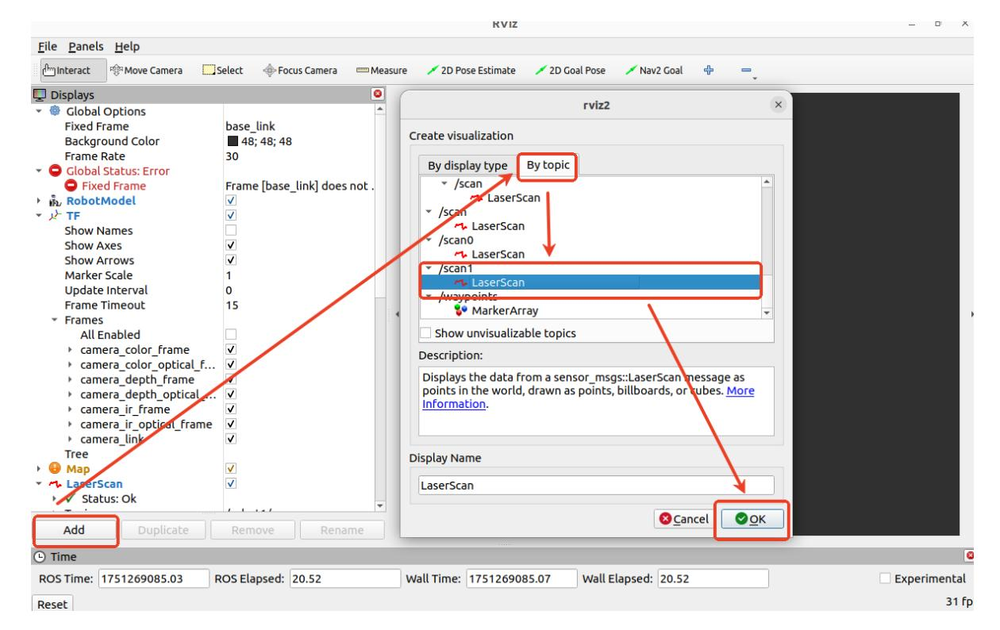
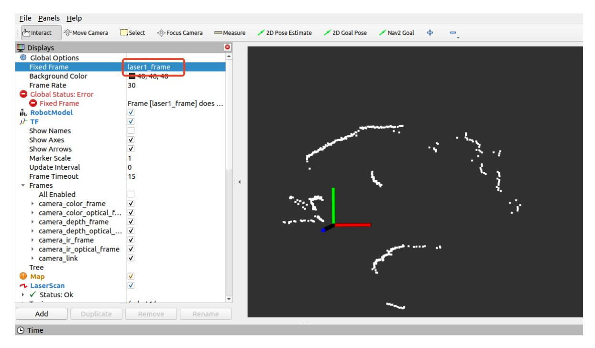

# LiDAR Introduction and Usage

## 1. LiDAR Introduction

### 1.1 T-mini Plus LiDAR

The ROSMASTER-M3 Pro uses the T-mini Plus, a 360-degree 2D LiDAR based on pulsed Time of Flight (ToF) ranging. With its optical, electrical, and algorithmic design, the sensor provides high-frequency, high-precision distance measurements. Its rotating mechanism continuously records angle data, allowing it to scan the surrounding environment and output point cloud data.

### 1.2 LiDAR Characteristics

- 360-degree omnidirectional scanning, with an adjustable scanning frequency of 6-12 Hz
- High-speed ranging at 4000 Hz
- Low ranging error and stable measurements
- Strong resistance to ambient light interference
- Class I eye-safe standard

### 1.3 Performance Parameters

| Item               | Value    | Unit    |
|--------------------|----------|---------|
| Ranging Frequency  | 4000     | Hz      |
| Scanning Frequency | 6 (6-12) | Hz      |
| Ranging Range      | 0.05-12  | m       |
| Scanning Angle     | 0-360    | Degrees |
| Ranging Accuracy   | 20       | mm      |
| Angular Resolution | 0.54     | Degrees |
| Pitch Angle        | 0-1.5    | Degrees |

## 2. Using the LiDAR

On this robot, the ROS expansion board drives two LiDAR sensors. After the agent starts, the low-level control node publishes two LiDAR topics: /scan0 from the left-rear LiDAR and /scan1 from the right-front LiDAR. After the agent is connected, use the following command to view /scan1 data:

One frame of data is shown in the figure above.

- frame_id: LiDAR coordinate frame.
- angle_min and angle_max: Minimum and maximum scan angles. Together they represent a 0-360 degree scan.
- angle_increment: Angular spacing between adjacent measurements.
- range_min and range_max: Minimum and maximum LiDAR range, in meters. In this example, the valid range is 0.05-12.0 m.
- ranges: Measured distance at each scan angle, in meters.

You can also visualize LiDAR point cloud data in RViz. To view /scan1 from a virtual machine, first make sure the virtual machine and robot are on the same LAN and use the same ROS_DOMAIN_ID. Then start RViz from the virtual machine:

```bash
rviz2
```



In RViz, add the /scan1 topic as shown above, then set [Global Options] - [Fixed Frame] to laser1_frame. RViz will display the /scan1 point cloud as shown below.



The white points are the point cloud data from the right-front LiDAR.
