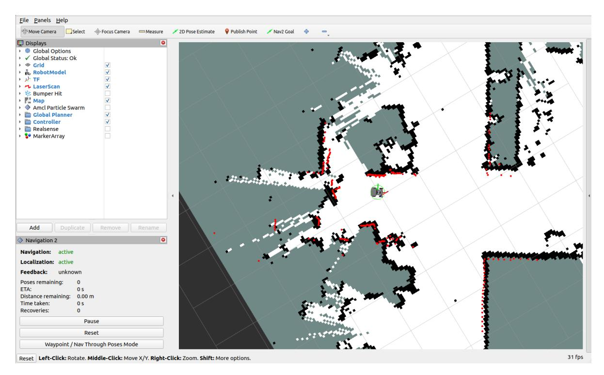
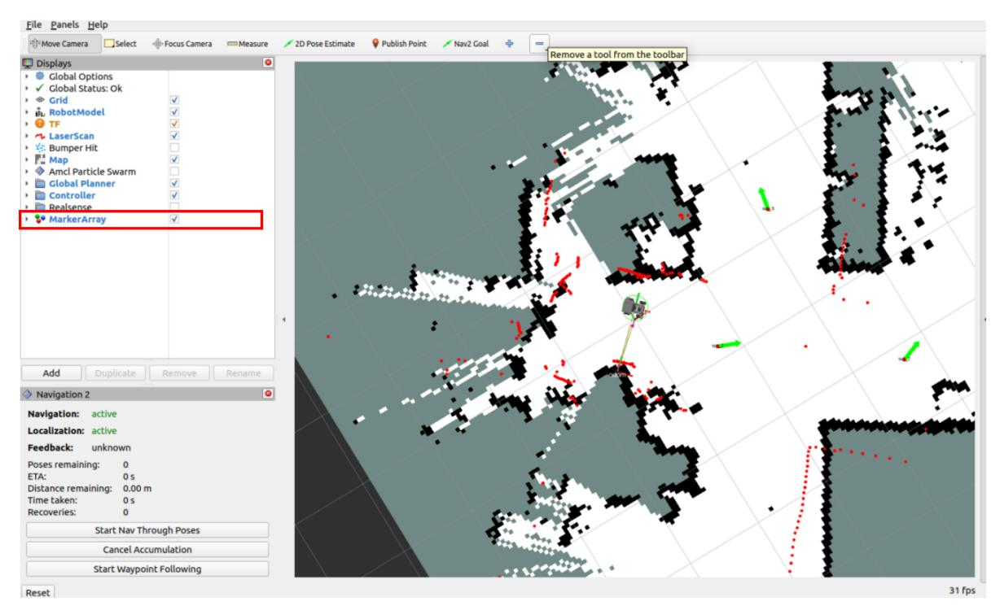
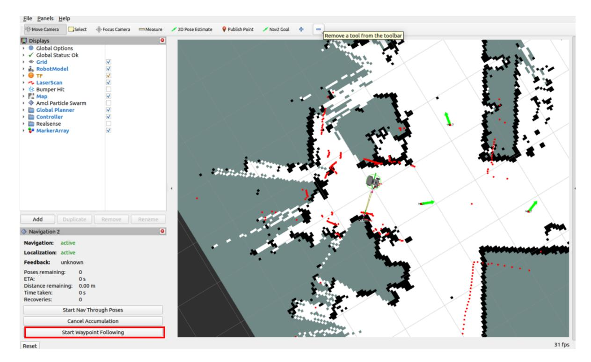
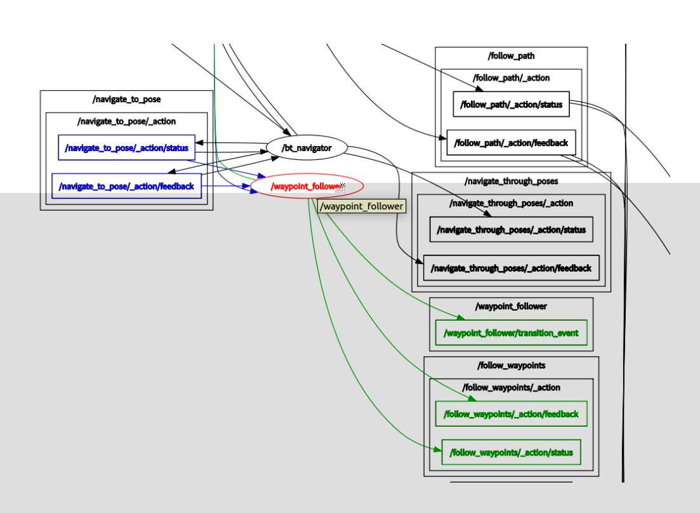

# Navigation2 Multi-Point Navigation and Obstacle Avoidance

## 1. Course Content

**Note:** Complete [Navigation2 Single-Point Navigation and Obstacle Avoidance] first so you have a basic understanding of Navigation2.

This chapter explains how to use Navigation2 waypoint mode for multi-point navigation and obstacle avoidance.

## 2. Preparation

### 2.1 Content Description

This lesson uses the Jetson Orin NX as an example. On Raspberry Pi and Jetson Nano boards, open a terminal and enter the Docker container before running the commands in this lesson. For Docker entry steps, refer to **[Configuration and Operation Guide]--[Entering the Docker (Jetson Nano and Raspberry Pi 5 users, see here)]**. On Orin and NX boards, run the commands directly in a terminal.

### 2.2 Starting the Agent

Note: The agent must be started before testing all examples. If it's already started, you don't need to restart it.

Run the following command in the robot terminal:

```bash
sh start_agent.sh
```

The terminal prints a success message when the connection is established.

## 3. Running the Example

### 3.1 Multi-Point Navigation

#### Note:

- For Jetson Nano and Raspberry Pi series controllers, you must first enter the Docker container (see the [Docker Course Section - Entering the Robot's Docker Container] for steps).
- This section requires at least one existing map. Refer to any of the mapping courses, such as Gmapping-SLAM Mapping, Cartographer Mapping, or SLAM-Toolbox Mapping.

Start the low-level sensors from the robot terminal:

```bash
ros2 launch M3Pro_navigation base_bringup.launch.py
```

Start Navigation2:

```bash
ros2 launch M3Pro_navigation navigation2.launch.py
```

RViz can be started on either the robot or the virtual machine. Choose one method only; do not start RViz in both places at the same time.

For example, on the virtual machine, open a terminal and start RViz:

```bash
ros2 launch slam_view nav_rviz.launch.py
```

To start RViz on the robot, run:

```bash
ros2 launch M3Pro_navigation nav_rviz.launch.py
```


After the map loads, click [2D Pose Estimate] to set the robot's initial pose. Based on the robot's actual position, click and drag in RViz until the robot model matches the real robot pose. If the LiDAR scan roughly overlaps the actual obstacles, the pose estimate is accurate.


After pose initialization is complete, the robot model and the red LiDAR 2D point cloud will appear in the RViz interface.



Click **[Waypoint/Nav Through Pose Mode]** in the lower left corner to enter multi-point navigation mode.


Enable **MarkerArray** in the left configuration panel so waypoints are visible. Then click **Nav2 Goal** and mark multiple target poses on the map.



Click **Start Waypoint Following** in the lower left corner to begin multi-point navigation.



The robot navigates through the marked waypoints in sequence.


## 4. Principle Analysis

### 4.1 Waypoint Data

After [Waypoint/Nav Through Pose Mode] is enabled, RViz publishes marked waypoint information on the /waypoints topic. The RViz waypoint plugin may add intermediate waypoints between user-selected targets to smooth the path. You can inspect the waypoint data with rqt_graph.

Start rqt_graph from the VM terminal:

```bash
ros2 run rqt_graph rqt_graph
```

In rqt_graph, enable **/waypoints** to observe the topic. Select the topic first, then publish waypoints from RViz. The manually marked RViz waypoints will appear on this topic.


Click a waypoint to view its data. In this example, [0] contains the pose coordinate data.


### 4.2 Data Transmission and Execution

After setting waypoint coordinates, click **Start Waypoint Following**. The RViz plugin packages the waypoint sequence into a FollowWaypoints action request and sends it to the /follow_waypoint action server, which executes the waypoints in order.

Open a terminal in the virtual machine and enter the following command:

```bash
ros2 run rqt_graph rqt_graph
```

The node graph shows the **/follow_waypoint** action server. This action server receives the waypoint sequence and drives the robot through each waypoint in order.


