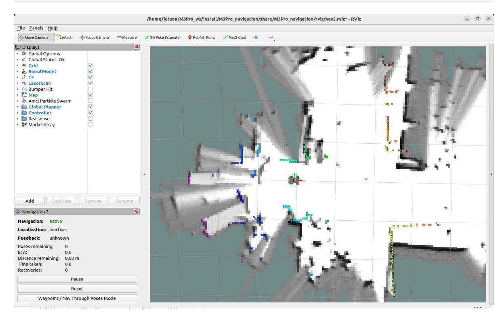
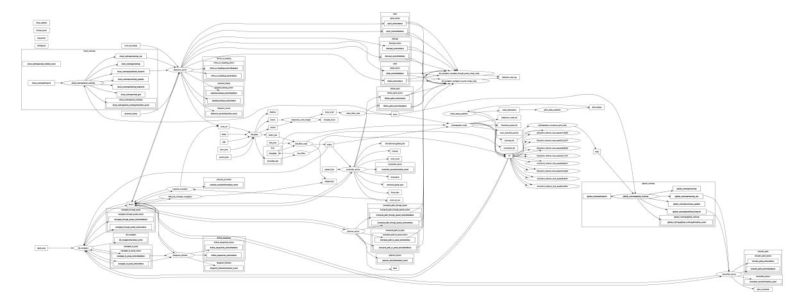
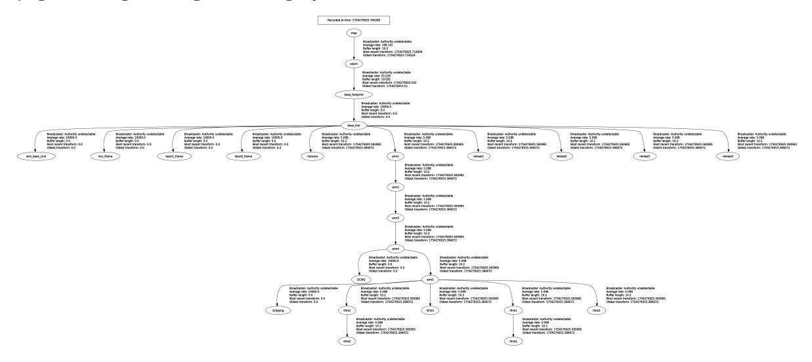

# Rapid Relocalization and Navigation

## 1. Course Content

- 1. Learn the robot's rapid relocalization and navigation capabilities.
- 2. Run the program. A real-time map and robot model will be loaded into RViz. The robot can quickly locate its position within the map and perform real-time SLAM mapping and navigation.

## 2. Principle Overview

### 2.1 Introduction

- Navigation 2 (Nav 2) is the navigation framework included with ROS 2. Its purpose is to safely move a mobile robot from point A to point B.
- The default localization algorithm used in Navigation 2 is AMCL (Adaptive Monte Carlo Localization). By replacing the default AMCL localization method with Cartographer's localization method, other navigation functions remain unchanged.

### 2.2 Differences Between the Two Localization Methods

- **AMCL**: Suitable for scenarios with a known map. For example, in an indoor environment with a pre-built map, the robot can use AMCL to determine its position when performing repetitive tasks or navigating.
- **Cartographer**: It is more suitable for scenarios where robots need to simultaneously map and localize in unknown environments. For example, when a robot enters a new area for the first time and needs to quickly build a map and determine its position, Cartographer is particularly effective.

## 3. Preparation

### 3.1 Content Description

This lesson uses the Jetson Orin NX as an example. For Raspberry Pi and Jetson Nano boards, you need to open a terminal and enter the command to enter the Docker container. Once inside the Docker container, enter the commands mentioned in this lesson in the terminal. For instructions on entering the Docker container, refer to the product tutorial **[Configuration and Operation Guide]--[Entering the Docker (Jetson Nano and Raspberry Pi 5 users, see here)]**. For Orin and NX boards, simply open a terminal and enter the commands mentioned in this lesson.

### 3.2 Map Preparation

For this lesson's rapid relocalization and navigation, you'll need to first save a map in pbstream format according to the tutorials [6. LiDAR - 7. Cartographer Mapping]. The pbstream file will automatically be saved in your home directory (for Raspberry Pi and Jetson Nano, it will be saved in the /root directory within Docker).

## 4. Running the Example

### 4.1 Single-Point Navigation Function

#### Note:

The Jetson Nano and Raspberry Pi series controllers must first enter the Docker container (see the [Docker Course Chapter - Entering the Robot's Docker Container] for steps).

The robot's vehicle terminal starts the underlying sensor command:

```bash
ros2 launch M3Pro_navigation base_bringup.launch.py
```

Then start the Cartographer node for positioning:

```bash
ros2 launch M3Pro_navigation cartographer_localization.launch.py
```

Finally, start Navigation 2.

```bash
ros2 launch M3Pro_navigation navigation_launch.py
```

The RViz visualization function can be launched from either the vehicle or the virtual machine. **Select either** method. Do not launch both the virtual machine and the vehicle simultaneously:

Command to launch the RViz visualization interface from the virtual machine:

```bash
ros2 launch slam_view nav_rviz.launch.py
```

Command to launch the RViz visualization interface from the vehicle:

#### ros2 launch M3Pro_navigation nav_rviz.launch.py



- From RViz, you can see that the robot automatically estimates its initial position, eliminating the need for manual initialization.
- If the robot's initial position deviates significantly, use the [2D Pose Estimate] tool in the RViz toolbar to estimate its approximate position for quick positioning.

### 4.3 Viewing the Node Communication Graph

Enter the VM terminal:

```bash
ros2 run rqt_graph rqt_graph
```

If it doesn't display initially, select [Nodes/Topics (all)] and click the refresh button in the upper left corner. The original image is too large; you can view it in the lesson folder.



### 4.4 Viewing the TF Tree

Enter the VM terminal:

```bash
ros2 run rqt_tf_tree rqt_tf_tree
```

If the page doesn't display initially, click the refresh icon in the upper left corner to refresh the page. The original image is too large; you can view it in the current lesson folder.



## 5. Principle Explanation

The key to fast re-localization navigation is to replace the default amcl positioning method in navigation2 with the Cartographer positioning method. All other settings remain unchanged. The following explains how to replace the positioning method.

Source code location:

Jetson Orin Nano, Jetson Orin NX:

```
/home/jetson/M3Pro_ws/M3Pro_navigation/launch
```

Jetson Nano, Raspberry Pi:

You need to first enter Docker.

```
/root/M3Pro_ws/M3Pro_navigation/launch
```

Find the navigation_launch.py file in the launch directory. The contents are as follows:

This file modifies the default navigation2 launch file, removing the node that originally enabled the amcl positioning method. The rest of the navigation stack remains unchanged.

```python
import os
from ament_index_python.packages import get_package_share_directory
from launch import LaunchDescription
from launch.actions import DeclareLaunchArgument, GroupAction,
SetEnvironmentVariable
from launch.conditions import IfCondition
from launch.substitutions import LaunchConfiguration, PythonExpression
```

```python
from launch_ros.actions import LoadComposableNodes
from launch_ros.actions import Node
from launch_ros.descriptions import ComposableNode, ParameterFile
from nav2_common.launch import RewrittenYaml
def generate_launch_description():
    # Get the launch directory
    bringup_dir = get_package_share_directory('nav2_bringup')
    namespace = LaunchConfiguration('namespace')
    use_sim_time = LaunchConfiguration('use_sim_time')
    autostart = LaunchConfiguration('autostart')
    params_file = LaunchConfiguration('params_file')
    use_composition = LaunchConfiguration('use_composition')
    container_name = LaunchConfiguration('container_name')
    container_name_full = (namespace, '/', container_name)
    use_respawn = LaunchConfiguration('use_respawn')
    log_level = LaunchConfiguration('log_level')
    param_file_name = "yahboom_M3Pro_carto.yaml"
    lifecycle_nodes = ['controller_server',
                       'smoother_server',
                       'planner_server',
                       'behavior_server',
                       'bt_navigator',
                       'waypoint_follower',
                       'velocity_smoother']
    # Map fully qualified names to relative ones so the node's namespace can be
prepended.
    # In case of the transforms (tf), currently, there doesn't seem to be a
better alternative
    # https://github.com/ros/geometry2/issues/32
    # https://github.com/ros/robot_state_publisher/pull/30
    # TODO(orduno) Substitute with `PushNodeRemapping`
    # https://github.com/ros2/launch_ros/issues/56
    remappings = [('/tf', '/tf'),
                  ('/tf_static', '/tf_static')]
    # Create our own temporary YAML files that include substitutions
    param_substitutions = {
        'use_sim_time': use_sim_time,
        'autostart': autostart}
    configured_params = ParameterFile(
        RewrittenYaml(
            source_file=params_file,
            root_key=namespace,
            param_rewrites=param_substitutions,
            convert_types=True),
        allow_substs=True)
    stdout_linebuf_envvar = SetEnvironmentVariable(
        'RCUTILS_LOGGING_BUFFERED_STREAM', '1')
    declare_namespace_cmd = DeclareLaunchArgument(
        'namespace',
```

```
default_value='',
        description='Top-level namespace')
    declare_use_sim_time_cmd = DeclareLaunchArgument(
        'use_sim_time',
        default_value='false',
        description='Use simulation (Gazebo) clock if true')
    declare_params_file_cmd = DeclareLaunchArgument(
        'params_file',
        # default_value=os.path.join(bringup_dir, 'params', 'nav2_params.yaml'),
 default_value=os.path.join(get_package_share_directory("M3Pro_navigation"),
"param", param_file_name ),
        description='Full path to the ROS2 parameters file to use for all
launched nodes')
    declare_autostart_cmd = DeclareLaunchArgument(
        'autostart', default_value='true',
        description='Automatically startup the nav2 stack')
    declare_use_composition_cmd = DeclareLaunchArgument(
        'use_composition', default_value='False',
        description='Use composed bringup if True')
    declare_container_name_cmd = DeclareLaunchArgument(
        'container_name', default_value='nav2_container',
        description='the name of conatiner that nodes will load in if use
composition')
    declare_use_respawn_cmd = DeclareLaunchArgument(
        'use_respawn', default_value='False',
        description='Whether to respawn if a node crashes. Applied when
composition is disabled.')
    declare_log_level_cmd = DeclareLaunchArgument(
        'log_level', default_value='info',
        description='log level')
    load_nodes = GroupAction(
        condition=IfCondition(PythonExpression(['not ', use_composition])),
        actions=[
            Node(
                package='nav2_controller',
                executable='controller_server',
                output='screen',
                respawn=use_respawn,
                respawn_delay=2.0,
                parameters=[configured_params],
                arguments=['--ros-args', '--log-level', log_level],
                remappings=remappings + [('cmd_vel', 'cmd_vel_nav')]),
            Node(
                package='nav2_smoother',
                executable='smoother_server',
                name='smoother_server',
                output='screen',
                respawn=use_respawn,
                respawn_delay=2.0,
```

```
parameters=[configured_params],
                arguments=['--ros-args', '--log-level', log_level],
                remappings=remappings),
           Node(
                package='nav2_planner',
                executable='planner_server',
                name='planner_server',
                output='screen',
                respawn=use_respawn,
                respawn_delay=2.0,
                parameters=[configured_params],
                arguments=['--ros-args', '--log-level', log_level],
                remappings=remappings),
           Node(
                package='nav2_behaviors',
                executable='behavior_server',
                name='behavior_server',
                output='screen',
                respawn=use_respawn,
                respawn_delay=2.0,
                parameters=[configured_params],
                arguments=['--ros-args', '--log-level', log_level],
                remappings=remappings),
           Node(
                package='nav2_bt_navigator',
                executable='bt_navigator',
                name='bt_navigator',
                output='screen',
                respawn=use_respawn,
                respawn_delay=2.0,
                parameters=[configured_params],
                arguments=['--ros-args', '--log-level', log_level],
                remappings=remappings),
           Node(
                package='nav2_waypoint_follower',
                executable='waypoint_follower',
                name='waypoint_follower',
                output='screen',
                respawn=use_respawn,
                respawn_delay=2.0,
                parameters=[configured_params],
                arguments=['--ros-args', '--log-level', log_level],
                remappings=remappings),
           Node(
                package='nav2_velocity_smoother',
                executable='velocity_smoother',
                name='velocity_smoother',
                output='screen',
                respawn=use_respawn,
                respawn_delay=2.0,
                parameters=[configured_params],
                arguments=['--ros-args', '--log-level', log_level],
                remappings=remappings +
                        [('cmd_vel', 'cmd_vel_nav'), ('cmd_vel_smoothed',
'cmd_vel')]),
           Node(
                package='nav2_lifecycle_manager',
                executable='lifecycle_manager',
```

```
name='lifecycle_manager_navigation',
               output='screen',
               arguments=['--ros-args', '--log-level', log_level],
               parameters=[{'use_sim_time': use_sim_time},
                            {'autostart': autostart},
                            {'node_names': lifecycle_nodes}]),
       ]
   )
   load_composable_nodes = LoadComposableNodes(
       condition=IfCondition(use_composition),
       target_container=container_name_full,
       composable_node_descriptions=[
           ComposableNode(
               package='nav2_controller',
               plugin='nav2_controller::ControllerServer',
               name='controller_server',
               parameters=[configured_params],
               remappings=remappings + [('cmd_vel', 'cmd_vel_nav')]),
           ComposableNode(
               package='nav2_smoother',
               plugin='nav2_smoother::SmootherServer',
               name='smoother_server',
               parameters=[configured_params],
               remappings=remappings),
           ComposableNode(
               package='nav2_planner',
               plugin='nav2_planner::PlannerServer',
               name='planner_server',
               parameters=[configured_params],
               remappings=remappings),
           ComposableNode(
               package='nav2_behaviors',
               plugin='behavior_server::BehaviorServer',
               name='behavior_server',
               parameters=[configured_params],
               remappings=remappings),
           ComposableNode(
               package='nav2_bt_navigator',
               plugin='nav2_bt_navigator::BtNavigator',
               name='bt_navigator',
               parameters=[configured_params],
               remappings=remappings),
           ComposableNode(
               package='nav2_waypoint_follower',
               plugin='nav2_waypoint_follower::WaypointFollower',
               name='waypoint_follower',
               parameters=[configured_params],
               remappings=remappings),
           ComposableNode(
               package='nav2_velocity_smoother',
               plugin='nav2_velocity_smoother::VelocitySmoother',
               name='velocity_smoother',
               parameters=[configured_params],
               remappings=remappings +
                           [('cmd_vel', 'cmd_vel_nav'), ('cmd_vel_smoothed',
'cmd_vel')]),
           ComposableNode(
```

```
package='nav2_lifecycle_manager',
            plugin='nav2_lifecycle_manager::LifecycleManager',
            name='lifecycle_manager_navigation',
            parameters=[{'use_sim_time': use_sim_time,
                         'autostart': autostart,
                         'node_names': lifecycle_nodes}]),
    ],
)
# Create the launch description and populate
ld = LaunchDescription()
# Set environment variables
ld.add_action(stdout_linebuf_envvar)
# Declare the launch options
ld.add_action(declare_namespace_cmd)
ld.add_action(declare_use_sim_time_cmd)
ld.add_action(declare_params_file_cmd)
ld.add_action(declare_autostart_cmd)
ld.add_action(declare_use_composition_cmd)
ld.add_action(declare_container_name_cmd)
ld.add_action(declare_use_respawn_cmd)
ld.add_action(declare_log_level_cmd)
# Add the actions to launch all of the navigation nodes
ld.add_action(load_nodes)
ld.add_action(load_composable_nodes)
return ld
```

Find the cartographer_localization.launch.py file in the launch directory. The contents are as follows:

This file starts the Cartographer node and replaces the default Navigation 2 localization method.

```python
from launch import LaunchDescription
from launch.actions import DeclareLaunchArgument
from launch.conditions import IfCondition
from launch.substitutions import LaunchConfiguration
from launch_ros.actions import Node
from launch_ros.substitutions import FindPackageShare
from launch.actions import Shutdown
def generate_launch_description():
    load_state_filename_arg = DeclareLaunchArgument(
        'load_state_filename',
        default_value='/home/jetson/yahboom_map.pbstream'
        )
    use_rviz_arg = DeclareLaunchArgument(
        'use_rviz',
        default_value='true',
    )
    cartographer_node = Node(
```

```
package = 'cartographer_ros',
        executable = 'cartographer_node',
        parameters = [{'use_sim_time': False}],
        arguments = [
            '-configuration_directory',
FindPackageShare('M3Pro_navigation').find('M3Pro_navigation') + '/param',
            '-configuration_basename', 'yahboom_M3Pro.lua',
            '-load_state_filename', LaunchConfiguration('load_state_filename')],
        remappings = [
            ('imu', '/imu/data')],
        output = 'screen'
        )
    cartographer_occupancy_grid_node = Node(
        package = 'cartographer_ros',
        executable = 'cartographer_occupancy_grid_node',
        parameters = [
            {'use_sim_time': False},
            {'resolution': 0.05}],
        )
    rviz_node = Node(
        package = 'rviz2',
        executable = 'rviz2',
        on_exit = Shutdown(),
        arguments = ['-d',
FindPackageShare('cartographer_ros').find('cartographer_ros') +
'/configuration_files/demo_2d.rviz'],
        parameters = [{'use_sim_time': False}],
        condition=IfCondition(LaunchConfiguration('use_rviz'))
    )
    return LaunchDescription([
        # Launch arguments
        load_state_filename_arg,
        use_rviz_arg,
        # Nodes
        cartographer_node,
        cartographer_occupancy_grid_node,
        #rviz_node,
    ])
```
