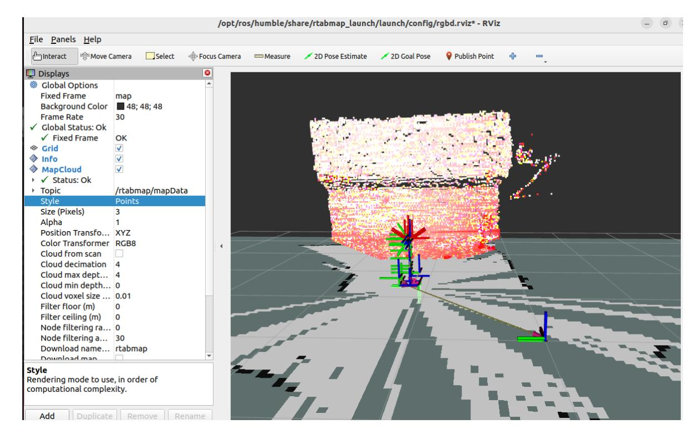
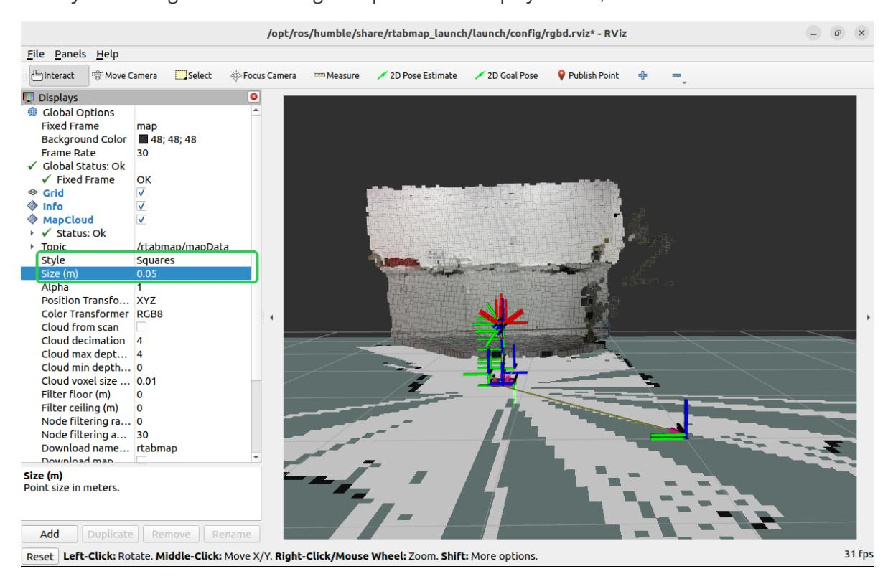
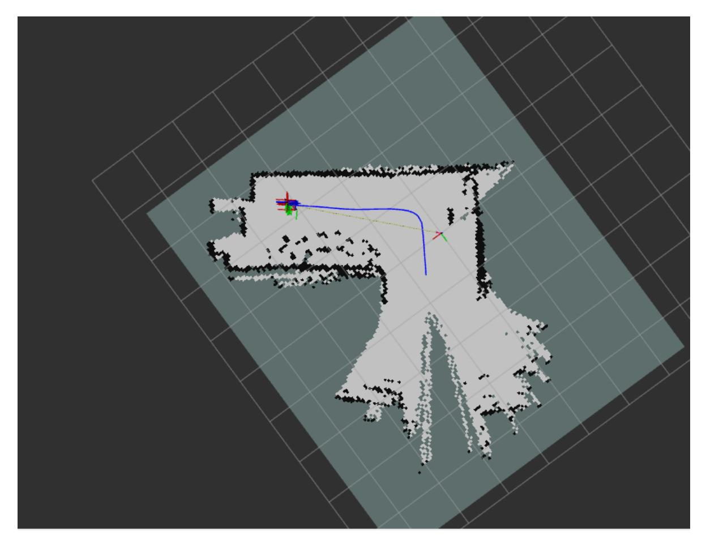

# RTAB-Map Mapping

## 1. Contents

This section explains how to combine the robot chassis, LiDAR, and depth camera to build a map with RTAB-Map.

### 1.1 Introduction to RTAB-Map

RTAB-Map (Real-Time Appearance-Based Mapping) is a real-time SLAM algorithm commonly used for mapping and navigation in robotics and augmented reality. It supports visual loop closure and multi-sensor mapping.

- **Appearance-based loop closure detection**: Uses visual features to recognize previously visited places.
- **Real-time performance**: Uses memory management to keep mapping responsive.
- **Multi-sensor support**: Supports RGB-D, stereo, and monocular cameras.
- **3D map construction**: Builds dense 3D point cloud maps.

### 1.2. RTAB-Map Working Principle

RTAB-Map works in three main stages:

- **Front-end processing**: Acquires sensor images, extracts visual features such as SIFT, SURF, or ORB, and estimates the pose transform between frames.
- **Back-end optimization**: Optimizes the pose graph with graph optimization techniques such as g2o and detects loop closures when the robot returns to a previously visited location.
- **Memory management**: Uses working memory (WM) for recent data and long-term memory (LTM) for older data. When loop closure is detected, relevant data can be transferred from LTM back to WM.

This section requires terminal commands. The terminal you use depends on the mainboard type. This lesson uses the Raspberry Pi 5 as an example. For Raspberry Pi and Jetson Nano boards, open a terminal on the host computer and enter the Docker container. After entering the Docker container, run the commands from this section there. For instructions on entering the Docker container from the host computer, refer to this product tutorial **[Configuration and Operation Guide]--[Entering the Docker (Jetson Nano and Raspberry Pi 5 users, see here)]**.

For Orin boards, simply open a terminal and enter the commands mentioned in this lesson.

## 2. Preparation

Because of performance limitations, Raspberry Pi 5 and Jetson Nano cannot run RTAB-Map smoothly in Docker on the robot mainboard. Use a virtual machine for RTAB-Map processing. For distributed ROS 2 communication between the robot and virtual machine:

- Both systems must be on the same local area network. This is most easily achieved by connecting to the same Wi-Fi network.
- Both systems must have the same ROS_DOMAIN_ID. The default ROS_DOMAIN_ID for the robot is 30, and the default ROS_DOMAIN_ID for the virtual machine is also 30. If they are different, you need to modify the virtual machine's ROS_DOMAIN_ID. To do this, modify the ~/.bashrc file and change the ROS_DOMAIN_ID value to match the robot's. Save and exit the file, then enter the command source ~/.bashrc to refresh the environment variables.
- To verify distributed communication between the two systems, enter ros2 node list on the virtual machine. If you see **/YB_Node**, communication is established.

On an Orin mainboard, RTAB-Map can run directly on the mainboard.

## 3. Program Startup

First, start the chassis, LiDAR, and camera from the robot terminal:

```bash
ros2 launch M3Pro_navigation rtab_bringup.launch.py
```

Then open a terminal in the virtual machine and move the robotic arm to the mapping pose:

```bash
ros2 topic pub /arm6_joints arm_msgs/msg/ArmJoints {"joint1: 90,joint2:
180,joint3: 5,joint4: 0,joint5: 90,joint6: 0,time: 1500"} --once
```

Open another terminal in the virtual machine and start RTAB-Map mapping:

```
ros2 launch rtabmap_launch rtabmap.launch.py rgb_topic:=/camera/color/image_raw
depth_topic:=/camera/depth/image_raw
camera_info_topic:=/camera/color/camera_info odom_topic:=/odom
frame_id:=base_link use_sim_time:=false rviz:=true rtabmap_viz:=false
approx_sync:=true approx_sync_max_interval:=0.01 qos:=2 visual_odometry:=false
icp_odometry:=false subscribe_scan:=true sync_queue_size:=50
topic_queue_size:=50 rtabmap_args:="--delete_db_on_start"
```

After startup succeeds, RViz should look like the image below.



In RViz, change the point cloud display style to RGB, as shown below.



Finally, open a terminal in the virtual machine and start keyboard control so you can drive the robot while mapping:

```bash
ros2 run yahboomcar_ctrl yahboom_keyboard
```

Move the robot as slowly as possible while mapping. Press [z] to reduce speed. Use [i] to move forward, [,] to move backward, [j] to rotate left, and [l] to rotate right.

The completed map is shown below.



After the map is created, press Ctrl+C in the terminal where you launched rtabmap.launch.py to close the program. The map will be saved in /home/yahboom/.ros/rtabmap.db.

## 4. Command Analysis

The RTAB-Map mapping command is:

```
ros2 launch rtabmap_launch rtabmap.launch.py rgb_topic:=/camera/color/image_raw
depth_topic:=/camera/depth/image_raw
camera_info_topic:=/camera/color/camera_info odom_topic:=/odom
frame_id:=base_link use_sim_time:=false rviz:=true rtabmap_viz:=false
approx_sync:=true approx_sync_max_interval:=0.01 qos:=2 visual_odometry:=false
icp_odometry:=false subscribe_scan:=true sync_queue_size:=50
topic_queue_size:=50 rtabmap_args:="--delete_db_on_start"
```

- rgb_topic: Color image topic.
- depth_topic: Depth image topic.
- camera_info_topic: Color camera calibration topic.
- odom_topic: Odometry topic.
- frame_id: Robot base frame.
- use_sim_time: Whether to use simulation time.
- rviz: Whether to start RViz.
- rtabmap_viz: Whether to start the RTAB-Map visualization plugin.
- approx_sync: Whether to use approximate time synchronization.
- approx_sync_max_interval: Maximum allowed synchronization offset.
- visual_odometry: Whether to enable visual odometry.
- icp_odometry: Whether to enable ICP point cloud odometry.
- subscribe_scan: Whether to subscribe to LiDAR scan data.
- sync_queue_size: Time synchronization queue size.
- topic_queue_size: Per-topic subscription queue size.
- rtabmap_args: Parameters passed directly to the RTAB-MAP core. Optional parameters include the following:
  - --delete_db_on_start: Clears the previous map database at startup.
  - --Mem/IncrementalMemory false: Disables incremental memory mode for localization-only use.
  - --Rtabmap/DetectionRate 2: Sets the loop closure detection rate in Hz.
- qos: Quality of Service (QoS) policy. Optional values:
  - 0: SYSTEM_DEFAULT
  - 1: RELIABLE (guaranteed delivery)
  - 2: BEST_EFFORT (possible loss)
