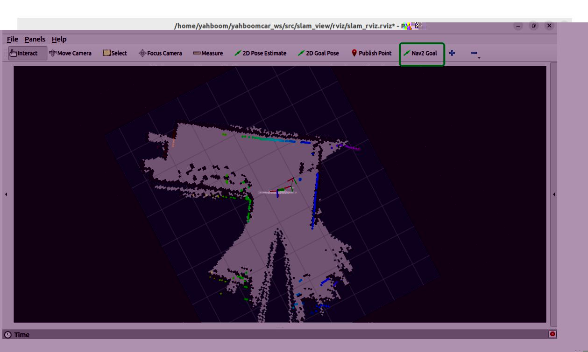

# RTAB-Map Navigation

## 1. Content Description

This section explains how to use a saved RTAB-Map database for navigation by combining the robot chassis, LiDAR, depth camera, RTAB-Map localization, and Navigation2.

This section requires terminal commands. The terminal you use depends on the mainboard type. This lesson uses the Raspberry Pi 5 as an example. For Raspberry Pi and Jetson Nano boards, open a terminal on the host computer and enter the Docker container. After entering the Docker container, run the commands from this section there. For instructions on entering the Docker container from the host computer, refer to this product tutorial **[Configuration and Operation Guide]--[Entering the Docker (Jetson Nano and Raspberry Pi 5 users, see here)]**.

For Orin boards, simply open the terminal and enter the commands mentioned in this section.

## 2. Preparation

Because of performance limitations, Raspberry Pi 5 and Jetson Nano cannot run RTAB-Map smoothly in Docker on the robot mainboard. Use a virtual machine for RTAB-Map processing. For distributed ROS 2 communication between the robot and virtual machine:

- Both systems must be on the same local area network. This is most easily achieved by connecting to the same Wi-Fi network.
- Both systems must have the same ROS_DOMAIN_ID. The default ROS_DOMAIN_ID for the robot is 30, and the default ROS_DOMAIN_ID for the virtual machine is also 30. If they are different, you need to modify the virtual machine's ROS_DOMAIN_ID. To do this, modify the ~/.bashrc file and change the ROS_DOMAIN_ID value to match the robot's. Save and exit the file, then enter the command source ~/.bashrc to refresh the environment variables.
- To verify distributed communication between the two systems, enter ros2 node list on the virtual machine. If you see **/YB_Node**, communication is established.

On an Orin mainboard, RTAB-Map can run directly on the mainboard.

Copy the RTAB-Map database created in the mapping chapter to the home directory. In the virtual machine or Orin mainboard terminal, run:

```bash
cp ~/.ros/rtabmap.db ~
```

Then start the chassis, LiDAR, and camera from the robot terminal:

```bash
ros2 launch M3Pro_navigation rtab_bringup.launch.py
```

Open a terminal in the virtual machine and move the robotic arm to the navigation pose:

```bash
ros2 topic pub /arm6_joints arm_msgs/msg/ArmJoints {"joint1: 90,joint2:
180,joint3: 5,joint4: 0,joint5: 90,joint6: 0,time: 1500"} --once
```

Open another terminal in the virtual machine and start RTAB-Map in localization mode:

```
ros2 launch rtabmap_launch rtabmap.launch.py rgb_topic:=/camera/color/image_raw
depth_topic:=/camera/depth/image_raw
camera_info_topic:=/camera/color/camera_info odom_topic:=/odom
frame_id:=base_link use_sim_time:=false rviz:=true rtabmap_viz:=false
approx_sync:=true approx_sync_max_interval:=0.01 qos:=2 frame_id:=base_link
visual_odometry:=false icp_odometry:=false subscribe_scan:=true
sync_queue_size:=50 topic_queue_size:=50 database_path:=/home/yahboom/rtabmap.db
namespace:=/
rviz_cfg:=/home/yahboom/yahboomcar_ws/src/slam_view/rviz/slam_rviz.rviz
rtabmap_args:="--Mem/IncrementalMemory false"
```

**Note:** If running on an Orin mainboard, use this command in the mainboard terminal:

```
ros2 launch rtabmap_launch rtabmap.launch.py rgb_topic:=/camera/color/image_raw
depth_topic:=/camera/depth/image_raw
camera_info_topic:=/camera/color/camera_info odom_topic:=/odom
frame_id:=base_link use_sim_time:=false rviz:=true rtabmap_viz:=false
approx_sync:=true approx_sync_max_interval:=0.01 qos:=2 frame_id:=base_link
visual_odometry:=false icp_odometry:=false subscribe_scan:=true
sync_queue_size:=50 topic_queue_size:=50 database_path:=/home/jetson/rtabmap.db
namespace:=/
rviz_cfg:=/home/jetson/yahboomcar_ws/src/slam_view/rviz/slam_rviz.rviz
rtabmap_args:="--Mem/IncrementalMemory false"
```

Then start Navigation2 from the VM or Orin mainboard terminal:

```bash
ros2 launch nav2_bringup navigation_launch.py
```

After all nodes start successfully, RViz should look like the image below.



Use [Nav2 Goal] in RViz to assign a target pose. The robot will localize with RTAB-Map and navigate to the goal with Navigation2.

## 3. Command Analysis

The RTAB-Map navigation command below runs RTAB-Map in localization mode. Navigation2 handles path planning and motion control.

```
ros2 launch rtabmap_launch rtabmap.launch.py rgb_topic:=/camera/color/image_raw
depth_topic:=/camera/depth/image_raw
camera_info_topic:=/camera/color/camera_info odom_topic:=/odom
frame_id:=base_link use_sim_time:=false rviz:=true rtabmap_viz:=false
approx_sync:=true approx_sync_max_interval:=0.01 qos:=2 frame_id:=base_link
visual_odometry:=false icp_odometry:=false subscribe_scan:=true
sync_queue_size:=50 topic_queue_size:=50 database_path:=/home/yahboom/rtabmap.db
namespace:=/
rviz_cfg:=/home/yahboom/yahboomcar_ws/src/slam_view/rviz/slam_rviz.rviz
rtabmap_args:="--Mem/IncrementalMemory false"
```

- rgb_topic: Color image topic.
- depth_topic: Depth image topic.
- camera_info_topic: Color camera calibration topic.
- odom_topic: Odometry topic.
- frame_id: Robot base frame.
- use_sim_time: Whether to use simulation time.
- rviz: Whether to start RViz.
- rtabmap_viz: Whether to start the RTAB-Map visualization plugin.
- approx_sync: Whether to use approximate time synchronization.
- approx_sync_max_interval: Maximum allowed synchronization offset.
- visual_odometry: Whether to enable visual odometry.
- icp_odometry: Whether to enable ICP point cloud odometry.
- subscribe_scan: Whether to subscribe to LiDAR scan data.
- sync_queue_size: Time synchronization queue size.
- topic_queue_size: Per-topic subscription queue size.
- database_path: RTAB-Map database path.
- namespace: ROS namespace.
- rviz_cfg: RViz configuration file path.
- rtabmap_args: Parameters passed directly to the RTAB-MAP core. Optional parameters include:
  - --delete_db_on_start: Clear the previous map database on startup.
  - --Mem/IncrementalMemory false: Disable incremental memory mode for localization-only use.
  - --Rtabmap/DetectionRate 2: Set the loop closure detection rate in Hz.
- qos: Quality of Service (QoS) policy. Optional values:
  - 0: SYSTEM_DEFAULT
  - 1: RELIABLE (guaranteed delivery)
  - 2: BEST_EFFORT (possible loss)
