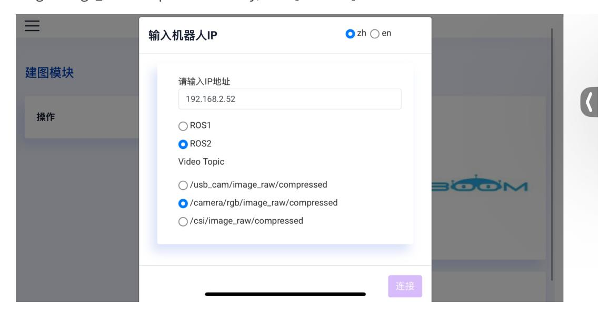
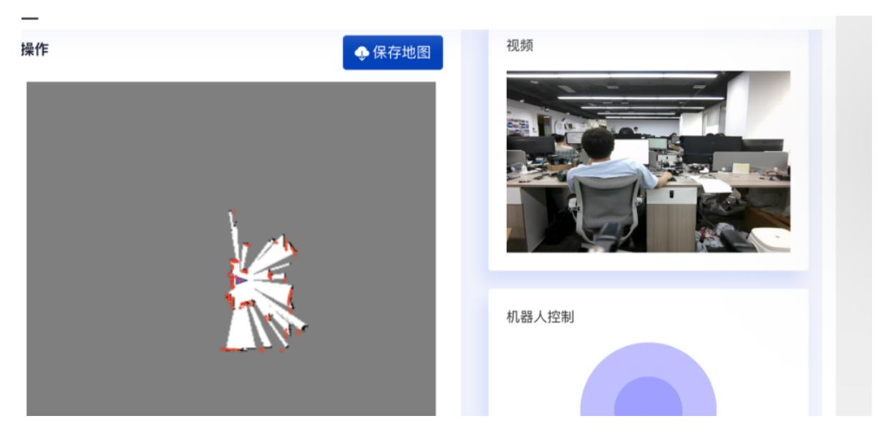
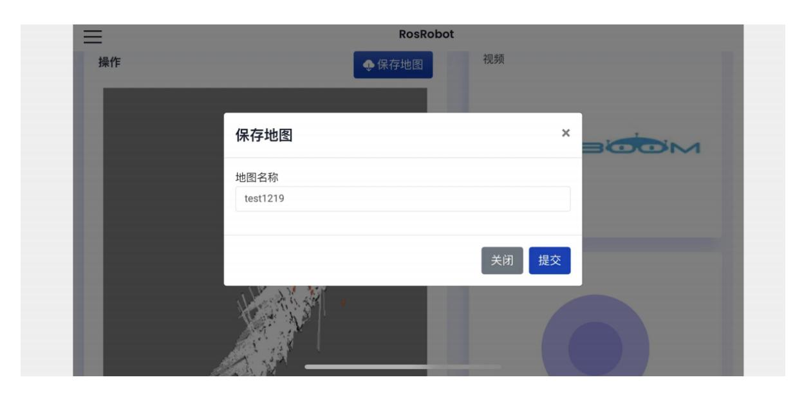
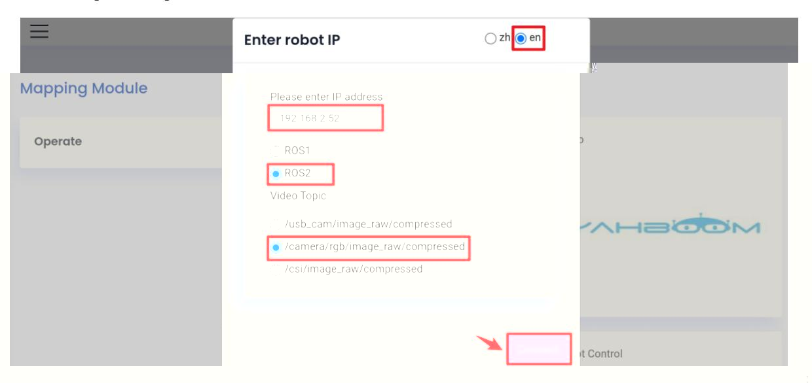
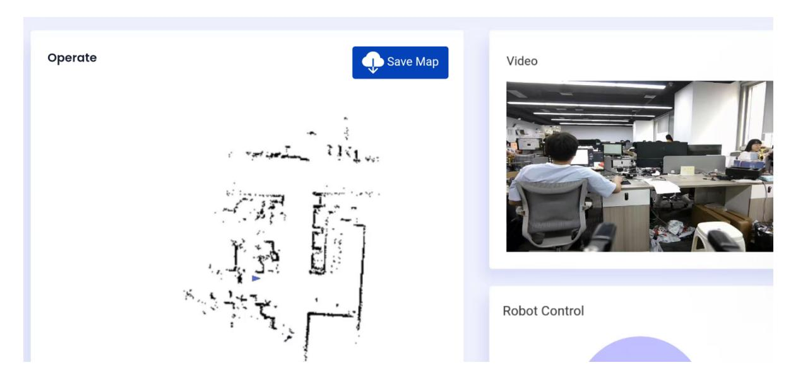
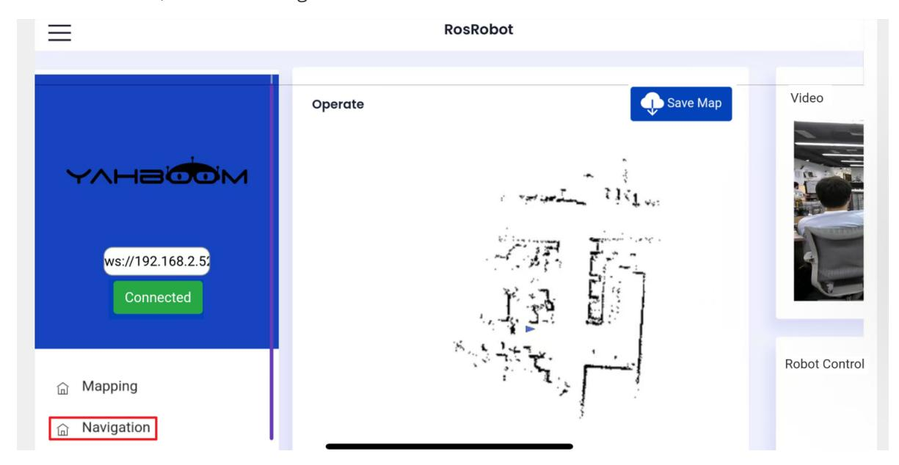
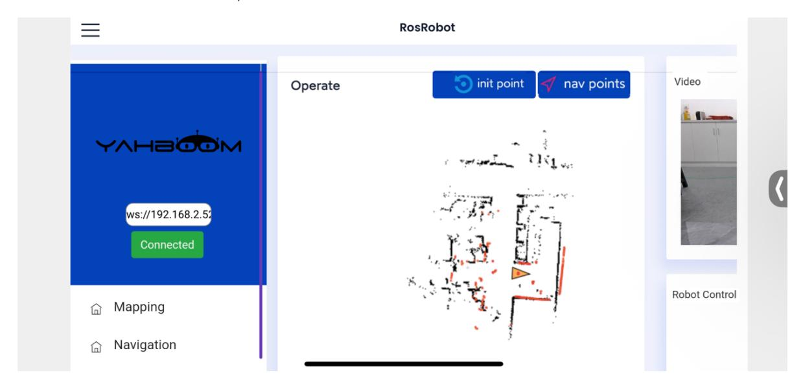
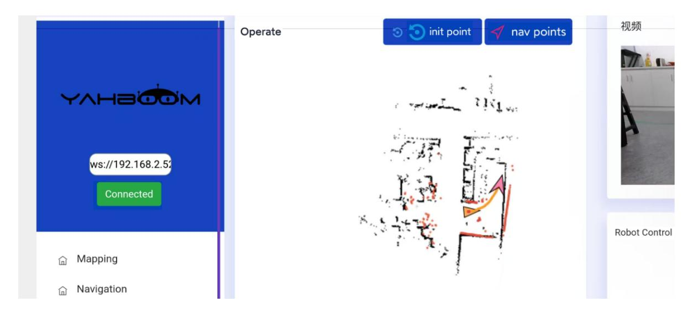

# App Mapping and Navigation

## 1. Content Description

This course explains how to use the [ROS Robot] mobile app to control robot mapping and navigation.

This section requires terminal commands. The terminal you use depends on the mainboard type. This section uses the Raspberry Pi 5 as an example. On Raspberry Pi and Jetson Nano mainboards, open a terminal on the host computer and enter the Docker container. After entering Docker, run the commands from this section there. For Docker entry steps, refer to **[Configuration and Operation Guide] - [Entering the Docker (Jetson Nano and Raspberry Pi 5 users, see here)**.

For Orin boards, simply open the terminal and enter the commands mentioned in this section.

### 1.1. Preparation

First, install the [ROS Robot] app on your phone. Android and iOS users can scan the QR code below to download the remote-control software. iOS users can also search for the ROSRobot mapping and navigation app in the App Store.


The robot and phone must be on the same local area network. This can be achieved by connecting to the same Wi-Fi network.

## 2. Mapping with the App

### 2.1. Program Startup

Run the following commands on the robot terminal to start app-based mapping. Start the camera first, then choose one mapping method.

```bash
#Start the camera
ros2 launch slam_mapping app_camera.launch.py
#Choose one of the following three mapping methods
#Gmapping
ros2 launch slam_mapping app_Gmapping.xml
#Cartographer
ros2 launch slam_mapping app_Cartographer.xml
#Slam_Toolbox
ros2 launch slam_mapping app_Slam_Toolbox.xml
```

In the mobile app, enter the robot IP address, choose [zh] for Chinese or [en] for English, and select ROS2. In the Video Target area, select /camera/rgb/image_raw/compressed, then click [Connect].



After the connection succeeds, the app displays the mapping interface:



Use the on-screen wheel to drive the robot slowly through the area you want to map. Then click Save Map, enter a map name, and click Submit.



The map is saved to:

Raspberry Pi 5 and Jetson Nano boards:

In the running Docker container:

```text
/root/M3Pro_ws/src/M3Pro_navigation/map
```

Orin board:

```text
/home/jetson/M3Pro_ws/src/M3Pro_navigation/map
```

### 2.2. Launch Command Parsing

Code Path:

Raspberry Pi 5 and Jetson Nano boards

The program code is in a running Docker container. The path in Docker is /root/M3Pro_ws/src/slam_mapping/launch/app_Gmapping.xml.

Orin mainboard

The program code path is /home/jetson/M3Pro_ws/src/slam_mapping/launch/app_Gmapping.xml

The app_Gmapping.xml launch file starts the app communication, LiDAR point publisher, mapping node, robot pose publisher, and app map-saving node:

```
<launch>
    <include file="$(find-pkg-share
rosbridge_server)/launch/rosbridge_websocket_launch.xml"/>
    <node name="laserscan_to_point_publisher" pkg="laserscan_to_point_publisher"
exec="laserscan_to_point_publisher"/>
    <include file="$(find-pkg-share slam_mapping)/launch/gmapping.launch.py"/>
    <include file="$(find-pkg-share
robot_pose_publisher_ros2)/launch/robot_pose_publisher_launch.py"/>
    <include file="$(find-pkg-share
yahboom_app_save_map)/yahboom_app_save_map.launch.py"/>
</launch>
```

- rosbridge_websocket_launch.xml: Starts the rosbridge WebSocket server.
- laserscan_to_point_publisher: Publishes LiDAR point cloud data to the app.
- gmapping.launch.py: Starts Gmapping.
- robot_pose_publisher_launch.py: Publishes robot pose information.
- yahboom_app_save_map.launch.py: Saves maps from app commands.

## 3. App Navigation

### 3.1. Program Startup

Start the robot chassis and LiDAR from the robot terminal:

```bash
ros2 launch M3Pro_navigation base_bringup.launch.py
```

Start the camera:

```bash
ros2 launch slam_mapping app_camera.launch.py
```

Start the navigation app:

```bash
ros2 launch M3Pro_navigation app_Navigation2.xml
map:=/root/M3Pro_ws/src/M3Pro_navigation/map/tea.yaml
```

Change map:=/root/M3Pro_ws/src/M3Pro_navigation/map/tea.yaml to the path of your saved map.

In the mobile app, enter the robot IP address, choose [zh] for Chinese or [en] for English, select ROS2, select /camera/rgb/image_raw/compressed in the Video Target area, and click [Connect].



After successfully connecting, the following display appears:



As shown below, select the navigation interface.



Based on the robot's actual position, click [Set Initialization Point] to set its initial pose. If the LiDAR scan area roughly overlaps the actual obstacles, the pose is accurate.



Click [Set Navigation Point] to set the destination. The robot plans a path and follows it to the goal.



### 3.2 Command Analysis

Code Path:

Raspberry Pi and Jetson Nano Board

The program code is in the running Docker container. The path in Docker is /root/M3Pro_ws/src/M3Pro_navigation/launch/app_Navigation2.xml.

Orin Board

The program code path is /home/jetson/M3Pro_ws/src/M3Pro_navigation/launch/app_Navigation2.xml.

The app_Navigation2.xml launch file contains:

```
<launch>
    <include file="$(find-pkg-share
rosbridge_server)/launch/rosbridge_websocket_launch.xml"/>
    <node name="laserscan_to_point_publisher" pkg="laserscan_to_point_publisher"
exec="laserscan_to_point_publisher"/>
    <include file="$(find-pkg-share
robot_pose_publisher_ros2)/launch/robot_pose_publisher_launch.py"/>
    <node name="app_send_goal" pkg="laserscan_to_point_publisher"
exec="app_send_goal"/>
    <include file="$(find-pkg-share
M3Pro_navigation)/launch/navigation2.launch.py"/>
</launch>
```

- rosbridge_websocket_launch.xml: Starts the rosbridge WebSocket server.
- laserscan_to_point_publisher: Publishes LiDAR point cloud data to the app.
- robot_pose_publisher_launch.py: Publishes robot pose information.
- app_send_goal: Publishes navigation goal topics from the app.
- navigation2.launch.py: Starts the Nav2 navigation stack.
