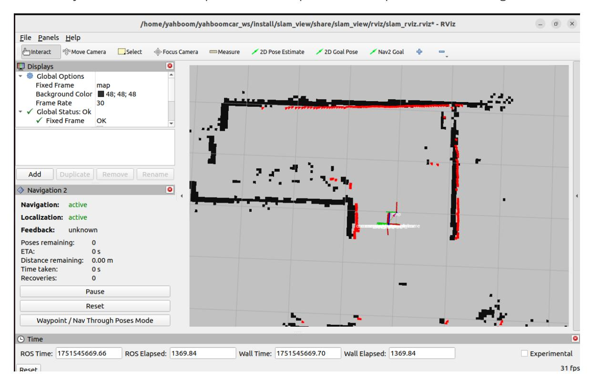
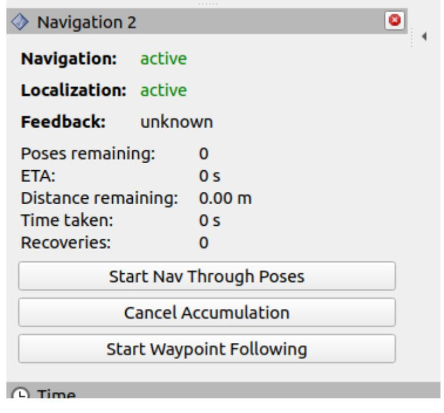

# Machine code handling

## 1. Content Description

This section explains how to combine nav2 navigation, machine code recognition, and threedimensional gripping with a robotic arm to achieve complex handling capabilities.

This section requires entering commands in the terminal. The terminal you choose depends on your motherboard type. This section uses the Raspberry Pi 5 as an example. For Raspberry Pi and Jetson Nano motherboards, you'll need to open a terminal on the host computer and enter the command to enter the Docker container. Once inside the Docker container, enter the commands mentioned in this section in the terminal. For instructions on entering the Docker container from the host computer, refer to the product tutorial **[Configuration and Operation Guide] - [Entering the Docker (Jetson Nano and Raspberry Pi 5 users, see here)**.

Simply open the terminal on the Orin motherboard and enter the commands mentioned in this section.

## 2. Program startup

The virtual machine needs to be on the same LAN as the car, and the ROS_DOMAIN_ID must be the same for both cars. Modify the ROS_DOMAIN_ID value in ~/.bashrc and refresh the environment variables after the modification.

Enter the following statement at the car terminal 1 to start the camera and robotic arm solving program:

```bash
ros2 launch M3Pro_demo camera_arm_kin.launch.py
```

Enter the following statement at the car terminal 2 to start the chassis data fusion and radar data fusion filtering program:

```bash
ros2 launch M3Pro_navigation base_bringup.launch.py
```

Enter the following statement at the trolley terminal 3 to start the gripping program:

```bash
ros2 run M3Pro_demo grasp_transport
```

Enter the following statement at the car terminal 4 to start the machine code recognition program:

```bash
ros2 run M3Pro_demo apriltag_transport_V2
```

Enter the command in the virtual machine terminal 1 to start the navigation RViz display.

```bash
ros2 launch slam_view slam_view.launch.py
```

Enter the following statement on the car terminal 5 to start navigation2:

```bash
ros2 launch M3Pro_navigation navigation2.launch.py map_dir: =
/root/M3Pro_ws/src/yahboom_mapping/maps/yahboom_map.yaml
```

Among them, /root/M3Pro_ws/src/yahboom_mapping/maps/yahboom_map.yaml replace it with the file address of your own yaml map.

Enter the following statement in the virtual machine terminal 2 to start the rotation detection program:

```bash
ros2 run yahboom_nav2_bringup rotation_detect_V2
```

Enter the following statement in the virtual machine terminal 3 to start the navigation status detection program:

```bash
ros2 run yahboom_nav2_bringup get_nav2_status_V2
```

After starting, in the virtual machine's RViz, use the [2D Pose Estimate] tool to give the car an initial pose based on its actual position in the environment and the map. Check whether the obstacles scanned by the car's radar overlap with the black part on the map, as shown in the figure below.



Then click [Waypoint/Nav Through Poses Mode] in [Navigation2 navigation plug-in], and select it as shown below.



Then, we use the [Nav2 Goal] tool to give a target point. The car will navigate to this target point autonomously. When it reaches the destination, the car's buzzer will beep.

You can press the n key, r key, or b key to select the following modes:

- Press the n key: select navigation mode, then use the [Nav2 Goal] tool to set a target point. The car will navigate to this target point and will beep when it reaches the destination.
- Press the r key: select the rotation mode, the car rotates a circle, as shown in the figure below. During the rotation,

If the robot sees the wooden block with the machine code, it will stop rotating and then move left and right to adjust the horizontal distance from the machine code. After adjustment, it will move forward and backward to adjust the vertical distance from the machine code. After adjustment, the lower gripper will grasp the machine code. After

grasping, the buzzer will beep, and the robot arm will move to the handling posture. Finally, according to the terminal prompt: Press the b key to navigate back to the origin (initial position) and then the lower gripper will release the wooden block with the machine code. Alternatively, you can directly use the [Nav2 Goal] tool to specify a target point. After the robot navigates to this target point, the lower gripper will release the wooden block with the machine code.

- If you do not see the machine code, the car terminal will prompt you to press the n key and use the [Nav2 Goal] tool to set a target point. The car will go to the next target point or press the b key to return to the origin (initial position).
- Press the b key to select return mode, and the car will navigate back to the origin (initial position)

## 3. Core code analysis

### 3.1 get_nav2_status_V2

In the virtual machine, the source code path of the program is, /home/yahboom/yahboomcar_ws/src/yahboom_nav2_bringup/yahboom_nav2_bringup/get_nav2_ status_V2.py, the function of this program is to obtain the navigation status and publish and receive some topics.

Import the necessary library files,

```python
import rclpy
from rclpy.action import ActionClient
from geometry_msgs.msg import PoseStamped,Twist,PoseWithCovarianceStamped
from nav2_msgs.action import NavigateThroughPoses
from rclpy.node import Node
from std_msgs.msg import UInt16,Bool,Int16
import time
from visualization_msgs.msg import MarkerArray
```

The program initializes and creates clients, publishers, and subscribers for actions.

```python
def __init__(self):
    super().__init__('navigation_client')
    #Create an action client, the action service called is
/navigate_through_poses
    self._client = ActionClient(self, NavigateThroughPoses,
'/navigate_through_poses')
    #Create a subscriber, subscribe to the topic /back_orin, the callback
function of this topic is to publish the target location back to the origin
    self.sub_back_orin =
self.create_subscription(Bool,"/back_orin",self.send_back_orinCallBack,1)
    #Create a subscriber, subscribe to the topic /waypoints, the callback
function of this topic is to publish the target position selected by the mouse
    self.get_waypoints =
self.create_subscription(MarkerArray,"/waypoints",self.get_waypointsPoseCallBack
,1)
    #Create a subscriber, subscribe to the topic /No_found, the callback function
of this topic is to change the state of some variables when the machine code is
not found after a rotation
```

```
self.sub_no_found =
self.create_subscription(Bool,"/No_found",self.get_FoundFlagCallBack,1)
    #Create a subscriber, subscribe to the topic /grasp_done, the callback
function of this topic is to change the status of some variables after the claw
has completed grabbing the machine code
    self.sub_grasp_done =
self.create_subscription(Bool,"/grasp_done",self.get_GraspStatuCallBack,1)
    #Create a subscriber, subscribe to the topic /cmd_vel_nav, the callback
function of this topic is to change the value of the self.move_flag variable if
the navigation speed is 0
    self.sub_cmd_vel =
self.create_subscription(Twist,"/cmd_vel_nav",self.get_CurVelCallBack,1)
    #Create a subscriber, subscribe to the topic /next_status, the callback
function of this topic is to change the current status according to the topic
message
    self.sub_next_status =
self.create_subscription(Int16,"/next_status",self.get_NextStatusCallBack,1)
    #Create a publisher, the published topic is /beep, the underlying control
node subscribes to this topic to control the buzzer
    self.pub_beep = self.create_publisher(UInt16, "beep", 10)
    #Create a publisher and publish the topic /start_detect to enable the machine
code detection program
    self.pub_Detect = self.create_publisher(Bool, "/start_detect", 10)
    #Create a publisher, the topic of which is /start_transport, which enables
machine code transport and program placement
    self.pub_Transport = self.create_publisher(Bool, "/start_transport", 10)
     #Create a publisher, publish the topic /back_to_orin, publish the topic back
to the origin
    self.pub_BackToOrin = self.create_publisher(Bool, "/back_to_orin", 10)`
    #Create a publisher, publish the topic /transport_done, publish the topic of
transport completion
    self.pub_done = self.create_publisher(Bool, "/transport_done", 10)
    #Create a subscriber, subscribe to the topic of initial pose (origin pose)
    self.sub_init_pose =
self.create_subscription(PoseWithCovarianceStamped,"/initialpose",self.get_InitP
oseCallBack,1)
    #Create target point coordinate object
    self.goal_pose = PoseStamped()
    #Create origin pose coordinate object
    self.orinal_pose = PoseStamped()
    self.goal_pose.header.frame_id = "map"
    self.orinal_pose.header.frame_id = "map"
    self.move_flag = False
    self.pub_rotate = True
    #The flag of completing the clamping, True means the clamping is completed
    self.grasp_done = False
    #Define the current state, there are three values: "Detect", "BackToOrint"
and "Transbot"
    self.cur_status = "Detect"
```

```python
def get_waypointsPoseCallBack(self,msg):
    print("get the pose: ")
    #Get the coordinate value according to the array subscript and assign the
data in the target point coordinate object
    self.goal_pose.pose.position.x =
msg.markers[len(msg.markers)-2].pose.position.x
    self.goal_pose.pose.position.y =
msg.markers[len(msg.markers)-2].pose.position.y
    self.goal_pose.pose.orientation.x =
msg.markers[len(msg.markers)-2].pose.orientation.x
    self.goal_pose.pose.orientation.y =
msg.markers[len(msg.markers)-2].pose.orientation.y
    self.goal_pose.pose.orientation.z =
msg.markers[len(msg.markers)-2].pose.orientation.z
    self.goal_pose.pose.orientation.w =
msg.markers[len(msg.markers)-2].pose.orientation.w
    #Call send_goal to publish the target point coordinates
    self.send_goal()
```

send_goal,

```python
def send_goal(self):
    #Create a NavigateThroughPoses Action target (Goal) message object, used to
send a navigation request to the NavigateThroughPoses action server (Action
Server) of Navigation2.
    goal_msg = NavigateThroughPoses.Goal()
    #Add self.goal_pose to the list of goal_msg.poses, then issue a navigation
request through send_goal_async, set the feedback callback (feedback_callback)
and the target response callback (goal_response_callback) to handle status
updates and results during navigation.
    goal_msg.poses.append(self.goal_pose)
    self._client.wait_for_server()
self._client.send_goal_async(goal_msg,feedback_callback=self.feedback_callback).
add_done_callback(self.goal_response_callback)
```

goal_response_callback,

```python
def goal_response_callback(self, future):
    result = future.result()
    if not result.accepted:
        self.get_logger().error('Goal was rejected!')
        return
    self.get_logger().info('Goal accepted, waiting for result...')
    result_msg = result
    #print(result_msg)
    result.get_result_async().add_done_callback(self.result_callback)
```

feedback_callback,

```python
def feedback_callback(self,feedback_msg):
    #If the remaining distance of the navigation point is less than 0.1m and the
value of self.move_flag is false (navigation speed is 0), then change the value
of self.move_flag to facilitate the next navigation
    if feedback_msg.feedback.distance_remaining<0.10 and self.move_flag ==
False:
        self.move_flag = True
```

result_callback,

```python
def result_callback(self, future):
    result_msg = future.result()
    print("the result_status is ",result_msg.status)
    #If the navigation status is 4, it means that the target point has been
reached, then a topic is published to control the car's buzzer to sound once, and
finally the corresponding message is published according to the current status
    if result_msg.status==4:
        self.Beep_Loop()
        self.move_flag = True
        self.pub_rotate = False
        print("Goal reached.")
        if self.cur_status == "Detect":
            detect = Bool()
            detect.data = True
            self.pub_Detect.publish(detect)
        elif self.cur_status == "Transbot":
            transport = Bool()
            transport.data = True
            self.pub_Transport.publish(transport)
            print("Arrival the target position,unload.")
        elif self.cur_status == "BackToOrin":
            print("Arrival the orin pose.")
            done = Bool()
            done.data = True
            self.pub_done.publish(done)
            self.cur_status = "Detect"
```

get_InitPoseCallBack,

```python
def get_InitPoseCallBack(self,msg):
    #Assign values to the data in the origin coordinate object
    self.orinal_pose.pose.position.x = msg.pose.pose.position.x
    self.orinal_pose.pose.position.y = msg.pose.pose.position.y
    self.orinal_pose.pose.orientation.x = msg.pose.pose.orientation.x
    self.orinal_pose.pose.orientation.y = msg.pose.pose.orientation.y
    self.orinal_pose.pose.orientation.z = msg.pose.pose.orientation.z
    self.orinal_pose.pose.orientation.w = msg.pose.pose.orientation.w
```

### 3.2 rotation_detect_V2

In the virtual machine, the source code path of the program is,

/home/yahboom/yahboomcar_ws/src/yahboom_nav2_bringup/yahboom_nav2_bringup/rotation_ detect_V2.py, the function of this program is to control the car to rotate 360 degrees, and publish and receive some topics.

Import the necessary header files,

```python
import rclpy
from rclpy.node import Node
import tf2_ros
import geometry_msgs.msg
from tf2_ros import TransformListener
from tf2_geometry_msgs import do_transform_pose
from scipy.spatial.transform import Rotation as R
from std_msgs.msg import Float32,Bool,Int16,UInt16
```

The program initializes and defines publishers and definers,

```python
def __init__(self):
    super().__init__('tf_listener_node')
    #Create a subscriber, subscribe to the topic /start_rotate, the callback
function is to enable rotation and change some parameter values
    self.sub_start_rotate =
self.create_subscription(Bool,"/start_rotate",self.get_StartRotateCallBack,100)
    #Create a subscriber, subscribe to the topic /detect_resul, the callback
function is to obtain the result of finding the machine code and change some
parameter values
    self.sub_detect_res =
self.create_subscription(Bool,"/detect_result",self.get_DetectResCallBack,100)
    #Create a publisher and publish the topic /rotation_done. When the rotation
is completed, publish the topic
    self.pub_rotation = self.create_publisher(Bool, "/rotation_done", 10)
    # Create a TF 2 cache and listener
    self.tf_buffer = tf2_ros.Buffer()
    self.tf_listener = tf2_ros.TransformListener(self.tf_buffer, self)
    # Create a timer (10Hz) and get a transformation each time
    self.timer = self.create_timer(0.1, self.timer_callback)
    self.rotate_angle = 0
    #Error value, when the error value is less than 10 degrees, stop rotating.
    self.error = 0.0
    self.target_angle = 360.0
    #Rotation flag. When the value is True, it means that rotation can be
performed to find the machine code.
    self.compute_flag = False
    self.delta_angle = 0.0
    self.turn_angle = 0.0
    self.first_angle = 0.0
    #Get the current angle
    self.get_angle()
```

timer_callback,

```python
def timer_callback(self):
    self.error = self.target_angle - self.turn_angle
    #If the value of self.compute_flag is True, start rotating
    if self.compute_flag == True:
        #Get the current angle, self.rotate_angle
        self.get_angle()
        if self.rotate_angle<0:
            self.rotate_angle = 360 - abs(self.rotate_angle)
```

```
#Calculate the rotation angle increment
        self.delta_angle = self.normalize_angle(self.rotate_angle -
self.first_angle)
        #Calculate the rotation angle
        self.turn_angle += self.delta_angle
        #Calculate the error value
        self.error = self.target_angle - self.turn_angle
        print("self.error: ",self.error)
        self.first_angle = abs(self.rotate_angle)
        #If the error is less than 10 degrees, the rotation ends
        if self.error <10:
            print("Rotation is done. ")
            self.compute_flag = False
            self.error = 0.0
            self.first_angle = 0.0
            self.turn_angle = 0.0
            rotate_done = Bool()
            rotate_done.data = True
            #Publish the topic message of the end of rotation
            self.pub_rotation.publish(rotate_done)
```

getangle,

```python
def get_angle(self):
    try:
        # Get the transformation between two coordinate systems
        transform = self.tf_buffer.lookup_transform('odom', 'base_footprint',
rclpy.time.Time())
        quaternion = [0, 0, transform.transform.rotation.z,
transform.transform.rotation.w]
        #Create a Rotation object
        rotation = R.from_quat(quaternion)
        #Convert to Euler angles
        euler_angles = rotation.as_euler('xyz', degrees=True)
        print("----------------------")
        #Extract the yaw value, which is the value rotated along the z axis,
here refers to the angle of rotation
        self.rotate_angle = euler_angles[2]
    except (tf2_ros.TransformException, KeyError) as e:
        self.get_logger().warn(f"Could not transform: {e}")
```

### 3.3 apriltag_transport_V2

Program code path:

Raspberry Pi and Jetson Nano board

The program code is in the running docker. The path in docker is /root/yahboomcar_ws/src/M3Pro_demo/M3Pro_demo/apriltag_transport_V2.py

Orin Motherboard

The program code path is /home/jetson/yahboomcar_ws/src/M3Pro_demo/M3Pro_demo/apriltag_transport_V2.py

Import the necessary library files,

```python
import cv2
```

```python
import os
import numpy as np
from sensor_msgs.msg import Image
import message_filters
from M3Pro_demo.vutils import draw_tags
from M3Pro_demo.compute_joint5 import *
from dt_apriltags import Detector
from cv_bridge import CvBridge
import cv2 as cv
from arm_interface.srv import ArmKinemarics
from arm_interface.msg import AprilTagInfo,CurJoints
from arm_msgs.msg import ArmJoints,ArmJoint
from std_msgs.msg import Float32,Bool,Int16,UInt16
import time
import transforms3d as tfs
import tf_transformations as tf
import yaml
import math
from M3Pro_demo.Robot_Move import *
from rclpy.node import Node
import rclpy
from message_filters import Subscriber,
TimeSynchronizer,ApproximateTimeSynchronizer
from sensor_msgs.msg import Image
from geometry_msgs.msg import Twist
```

Program initialization and creation of publishers and subscribers,

```python
def __init__(self, name):
    super().__init__(name)
    self.init_joints = [90, 120, 0, 0, 90, 90]
    self.rgb_bridge = CvBridge()
    self.depth_bridge = CvBridge()
    self.pubPos_flag = False
    self.pr_time = time.time()
    self.at_detector = Detector(searchpath=['apriltags'],
                                families='tag36h11',
                                nthreads=8,
                                quad_decimate=2.0,
                                quad_sigma=0.0,
                                refine_edges=1,
                                decode_sharpening=0.25,
                                debug=0)
    self.Center_x_list = []
    self.Center_y_list = []
    self.CurEndPos = [0.1458589529828534, 0.00022969568906952754,
0.18566515428310748, 0.00012389155580734876, 1.0471973953319513,
8.297829493472317e-05]
    self.camera_info_K = [477.57421875, 0.0, 319.3820495605469, 0.0,
477.55718994140625, 238.64108276367188, 0.0, 0.0, 1.0]
    self.EndToCamMat = np.array([[ 0 ,0 ,1 ,-1.00e-01],
                                 [-1 ,0 ,0 ,0],
                                 [0 ,-1 ,0 ,4.82000000e-02],
                                 [ 0.00000000e+00 , 0.00000000e+00 ,
0.00000000e+00 , 1.00000000e+00]])
    #Create a publisher to publish the topic of machine code location
information
```

```
self.pos_info_pub = self.create_publisher(AprilTagInfo,"PosInfo",1)
    self.CmdVel_pub = self.create_publisher(Twist,"cmd_vel",1)
    self.sub_grasp_status =
self.create_subscription(Bool,"grasp_done",self.get_graspStatusCallBack,100)
    #Create a subscriber, subscribe to the topic /start_detect, the callback
function is to modify the value of self.start_detect to True, indicating that the
machine code can be detected
    self.sub_start_detect =
self.create_subscription(Bool,"/start_detect",self.get_StartDetectCallBack,100)
    #Create a subscriber, subscribe to the topic /start_transport, the callback
function is to determine whether the value of self.grasp_done is True. If it is,
it means that the machine code block has been clamped. When it reaches the
destination, it needs to lower the claw to put down the machine code.
    self.sub_start_transport =
self.create_subscription(Bool,"/start_transport",self.get_StartTransportCallBack
,100)
    #Create a subscriber, subscribe to the topic /transport_done, the callback
function is to modify the value of some variables so that the chassis can be
adjusted and the machine code can be clamped next time
    self.sub_start_back2orin =
self.create_subscription(Bool,"/transport_done",self.get_TransbotStatusCallBack,
100)
    #Create a subscriber, subscribe to the topic /rotation_done, the callback
function is to modify the value of self.stop_rotate to True, indicating that the
rotation is stopped
    self.sub_rotation_done=
self.create_subscription(Bool,"/rotation_done",self.get_RotationStatusCallBack,1
00)
    self.TargetAngle_pub = self.create_publisher(ArmJoints, "arm6_joints", 10)
    self.pub_SingleTargetAngle = self.create_publisher(ArmJoint, "arm_joint",
10)
    self.TargetJoint5_pub = self.create_publisher(Int16, "set_joint5", 10)
    #Create a publisher, the topic of the publication is /next_status, the topic
data represents the next status value, 0 means return to the origin, 1 means
detection machine code, 2 means transport machine code
    self.pub_status = self.create_publisher(Int16, "/next_status", 10)
    self.rgb_image_sub = Subscriber(self, Image, '/camera/color/image_raw')
    self.depth_image_sub = Subscriber(self, Image, '/camera/depth/image_raw')
    self.client = self.create_client(ArmKinemarics, 'get_kinemarics')
    self.pub_cur_joints = self.create_publisher(CurJoints,"Curjoints",1)
    while not self.client.wait_for_service(timeout_sec=1.0):
        self.get_logger().info('Service not available, waiting again...')
    self.get_current_end_pos()
    while not self.TargetAngle_pub.get_subscription_count():
        self.pubSix_Arm(self.init_joints)
        time.sleep(0.1)
    self.pubSix_Arm(self.init_joints)
    while not self.pub_cur_joints.get_subscription_count():
        self.pubCurrentJoints()
        time.sleep(0.1)
    self.pubCurrentJoints()
    self.pub_beep = self.create_publisher(UInt16, "beep", 10)
    #Create a publisher, publish the topic is /No_found, the topic data is True
means that no machine code is found after one rotation
    self.pub_no_found = self.create_publisher(Bool, "/No_found", 10)
```

```
#Create a publisher, publish the topic to /unload_done, the topic data is
True, indicating that the unload is completed
    self.pub_unload_done = self.create_publisher(Bool, "/unload_done", 10)
    #Create a publisher, the published topic is /detect_result, the topic data is
True, indicating that the machine code is found
    self.pub_detect_res = self.create_publisher(Bool, "/detect_result", 10)
    #Create a publisher, publish the topic is /start_rotate, the topic data is
True to start the rotation
    self.pub_start_rotate = self.create_publisher(Bool, "/start_rotate", 10)
    #Create a publisher, publish the topic is /start_rotate, the topic data is
True to start the rotation
    self.send_back2orin = self.create_publisher(Bool, "/back_orin", 10)
    self.get_current_end_pos()
    self.pubSix_Arm(self.init_joints)
    self.ts = ApproximateTimeSynchronizer([self.rgb_image_sub,
self.depth_image_sub], 1, 0.5)
    self.ts.registerCallback(self.callback)
    self.pubCurrentJoints()
    self.x_offset = offset_config.get('x_offset')
    self.y_offset = offset_config.get('y_offset')
    self.z_offset = offset_config.get('z_offset')
    #Define the flag for x-direction (vertical) adjustment. If the value is True,
it means horizontal adjustment is possible.
    self.adjust_dist = True
    self.prev_dist = 0
    #Initialize and adjust the PID in the x direction (vertical)
    self.linearx_PID = (0.3, 0.0, 0.1)
    #Initialize the PID to adjust the y direction (horizontal)
    self.lineary_PID = (0.2, 0.0, 0.2)
    #Create a PID control object in the x direction (vertical)
    self.linearx_pid = simplePID(self.linearx_PID[0] / 1000.0,
self.linearx_PID[1] / 1000.0, self.linearx_PID[2] / 1000.0)
    #Create a PID control object in the y direction (horizontal)
    self.lineary_pid = simplePID(self.lineary_PID[0] / 100.0,
self.lineary_PID[1] / 100.0, self.lineary_PID[2] / 100.0)
    self.grasp_Dist = 220.0
    self.joint5 = Int16()
    #Define the rotation flag. If the value is True, it means that the rotation
has started.
    self.rotate = False
    #Define the flag bit that indicates that the adjustment in the y direction
(horizontal) is completed. If the value is True, it means that the adjustment in
the horizontal direction is completed.
    self.y_track_done = False
    #Define the flag for y-direction (horizontal) adjustment. If the value is
True, it means that horizontal adjustment is possible.
    self.y_track = False
    #Define the flag bit of the gripping completion. The value is True,
indicating that the robot gripping is completed.
    self.grasp_done = False
    #Define the flag to start detecting machine code. The value is True,
indicating that the machine code has been detected.
    self.start_detect = False
    #Define the flag to stop rotation. The value is True, indicating that the
rotation is stopped.
    self.stop_rotate = False
```

```python
def callback(self,color_frame,depth_frame):
    #rgb_image
    rgb_image = self.rgb_bridge.imgmsg_to_cv2(color_frame,'rgb8')
    result_image = np.copy(rgb_image)
    result_image = cv.resize(result_image, (640, 480))
    #depth_image
    depth_image = self.depth_bridge.imgmsg_to_cv2(depth_frame, encoding[1])
    depth_to_color_image = cv2.applyColorMap(cv2.convertScaleAbs(depth_image,
alpha=1.0), cv2.COLORMAP_JET)
    frame = cv.resize(depth_image, (640, 480))
    depth_image_info = frame.astype(np.float32)
    tags = self.at_detector.detect(cv2.cvtColor(rgb_image, cv2.COLOR_RGB2GRAY),
False, None, 0.025)
    tags = sorted(tags, key=lambda tag: tag.tag_id) # It seems that the results
are sorted in ascending order, so there is no need to sort them manually
    draw_tags(result_image, tags, corners_color=(0, 0, 255), center_color=(0,
255, 0))
    key = cv2.waitKey(10)
    self.Center_x_list = list(range(len(tags)))
    self.Center_y_list = list(range(len(tags)))
    #The following is to process key events and determine which key is pressed
    #If the r key is pressed, it means that the rotation mode is selected
    if key == ord('r'):
        self.rotate = True
        self.stop_rotate = False
        start_rotate = Bool()
        start_rotate.data = True
        self.pub_start_rotate.publish(start_rotate)
        print("start to rotate.")
    #If the n key is pressed, it means that the navigation mode is selected
    elif key == ord('n'):
        #self.next_navigation = True
        self.rotate = False
        self.stop_rotate = False
        #self.start_detect = False
        next_status = Int16()
        next_status.data = 1
        self.pub_status.publish(next_status)
        print("Go to the next point.")
    #If the b key is pressed, it means the return mode is selected
    elif key == ord('b'):
        print("Come back to the orin.")
        self.rotate = False
        self.start_detect = False
        next_status = Int16()
        next_status.data = 0
        self.pub_status.publish(next_status)
        #self.come_back = True
        back_orin = Bool()
        back_orin.data = True
        self.send_back2orin.publish(back_orin)
    #If enabled, start detection
    if self.start_detect == True:
```

```
#If the rotation flag is set and no machine code is found, the stop
rotation flag is set to False
        if self.rotate == True and len(tags)==0 and self.stop_rotate==False:
            #Publish the car speed. The car rotates at a speed of 0.2 radians
per second
            self.pubVel(0,0,0.2)
            print("Rotating to detect the apriltag.")
        #If the machine code is found and the rotation flag is True, it means
that the machine code is found. At this time, stop rotating, publish some
corresponding topic data, and enable the flag for y-direction (horizontal)
adjustment
        elif len(tags)>0 and self.rotate == True :
            detect = Bool()
            detect.data = True
            self.pub_detect_res.publish(detect)
            self.rotate = False
            self.pubVel(0,0,0)
            self.Beep_Loop()
            print("Found the apriltag.")
            self.y_track = True
        #If the stop rotation flag is True and no machine code is found, it
means that the machine code is not found. At this time, the stop command is
issued and the corresponding topic data is published
        elif self.stop_rotate==True and len(tags)==0:
            #print("Do not found any apriltag.")
            self.pubVel(0,0,0)
            #self.start_detect = False
            no_found = Bool()
            no_found.data = True
            self.pub_no_found.publish(no_found)
    #If the machine code is found and the rotation flag is false, indicating that
the rotation has stopped, then the position of the machine code in the world
coordinate system is calculated.
    if len(tags) > 0 and self.rotate==False:
        for i in range(len(tags)):
            center_x, center_y = tags[i].center
            #cv2.circle(depth_to_color_image,(int(center_x),int(center_y)),1,
(255,255,255),10)
            self.Center_x_list[i] = center_x
            self.Center_y_list[i] = center_y
            cx = center_x
            cy = center_y
            cz = depth_image_info[int(cy),int(cx)]/1000
            pose = self.compute_heigh(cx,cy,cz)
            degree = pose[1]/pose[0]
            #print("degree: ",degree)
            dist_detect = math.sqrt(pose[1] ** 2 + pose[0]** 2)
            dist_detect = dist_detect*1000
            dist = 'dist: ' + str(dist_detect) + 'mm'
            cv.putText(result_image, dist, (int(cx)+5, int(cy)+15),
cv.FONT_HERSHEY_SIMPLEX, 0.5, (255, 0, 0), 2)
            vx = int(tags[i].corners[0][0]) - int(tags[i].corners[1][0])
            vy = int(tags[i].corners[0][1]) - int(tags[i].corners[1][1])
            target_joint5 = compute_joint5(vx,vy)
            #print("target_joint5: ",target_joint5)
```

```
#First adjust the horizontal
            if self.y_track==True:
                self.robot_Y_move(center_x)
            if self.pubPos_flag == True :
                #If the distance between the machine code and the car base_link
is outside the range [200, 220], then the longitudinal distance needs to be
adjusted
                if abs(dist_detect - 210.0)>10 and self.adjust_dist==True:
                    self.move_dist(dist_detect)
                else:
                    self.adjust_dist = False
                    self.pubVel(0,0,0)
                    tag = AprilTagInfo()
                    tag.id = tags[i].tag_id
                    self.cur_tagId = tag.id
                    tag.x = self.Center_x_list[i]
                    tag.y = self.Center_y_list[i]
                    tag.z = depth_image_info[int(tag.y),int(tag.x)]/1000
                    #vx = int(tags[i].corners[0][0]) - int(tag.x)
                    #vy = int(tags[i].corners[0][1]) - int(tag.y)
                    vx = int(tags[i].corners[0][0]) - int(tags[i].corners[1][0])
                    vy = int(tags[i].corners[0][1]) - int(tags[i].corners[1][1])
                    target_joint5 = compute_joint5(vx,vy)
                    print("target_joint5: ",target_joint5)
                    self.joint5.data = int(target_joint5)
                    if tag.z!=0:
                        self.TargetJoint5_pub.publish(self.joint5)
                        #Publish machine code location message topic
                        self.pos_info_pub.publish(tag)
                        self.pubPos_flag = False
                        self.start_detect = False
                        next_status = Int16()
                        #Change the next state and change the state to Transbot
                        next_status.data = 2
                        self.pub_status.publish(next_status)
                    else:
                        print("Invalid distance.")
    result_image = cv2.cvtColor(result_image, cv2.COLOR_RGB2BGR)
    cur_time = time.time()
    fps = str(int(1/(cur_time - self.pr_time)))
    self.pr_time = cur_time
    cv2.putText(result_image, fps, (10, 30), cv2.FONT_HERSHEY_SIMPLEX, 1, (0,
255, 0), 2)
    cv2.imshow("result_image", result_image)
    #cv2.imshow("depth_image", depth_to_color_image)
    key = cv2.waitKey(1)
```
