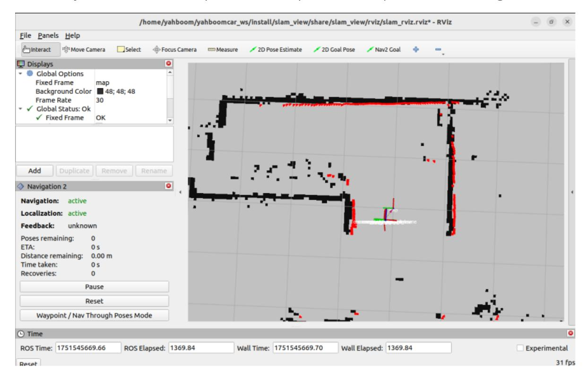
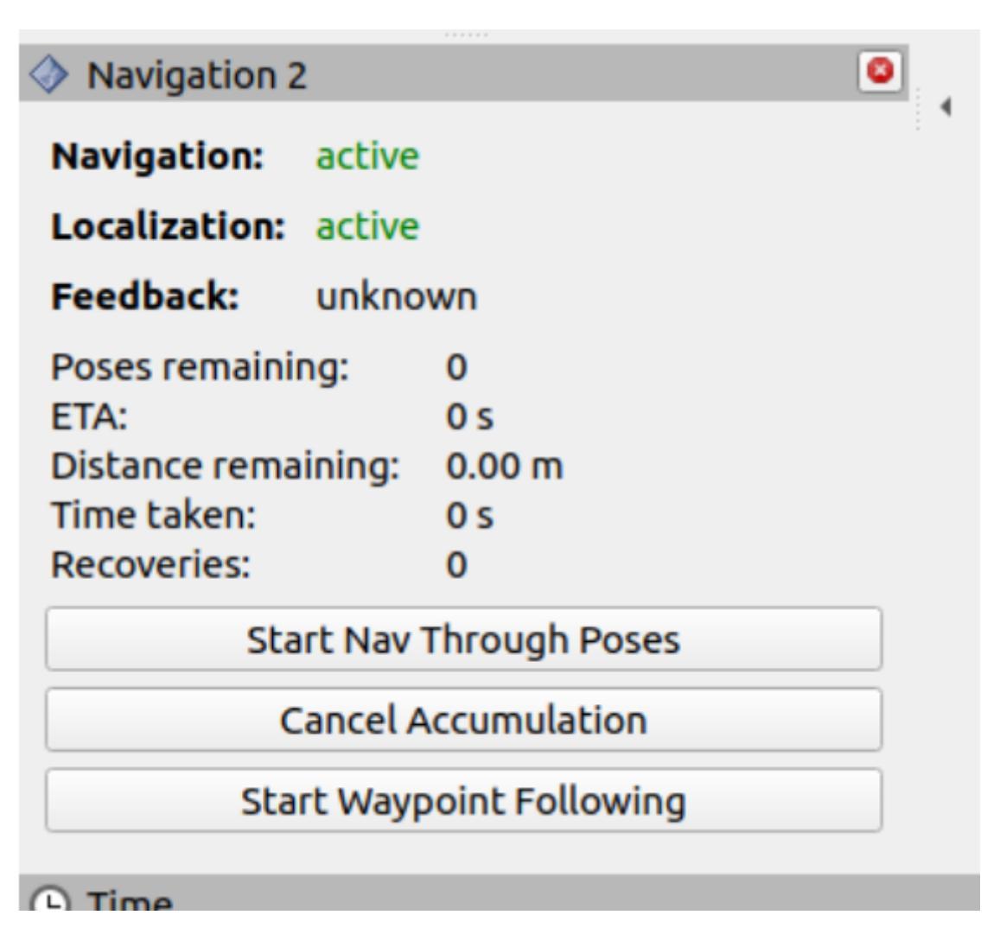
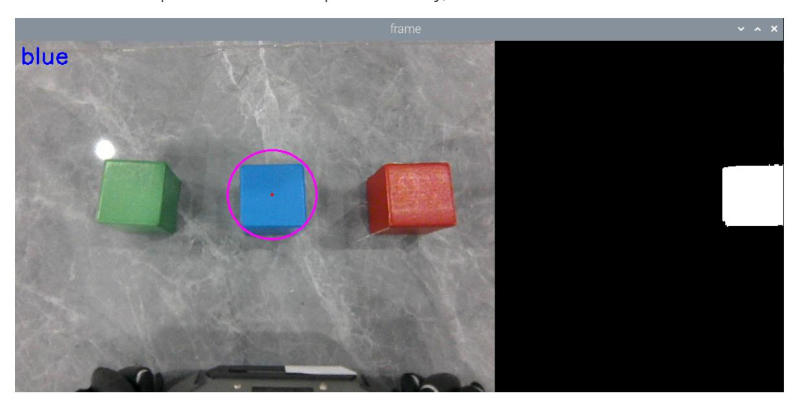
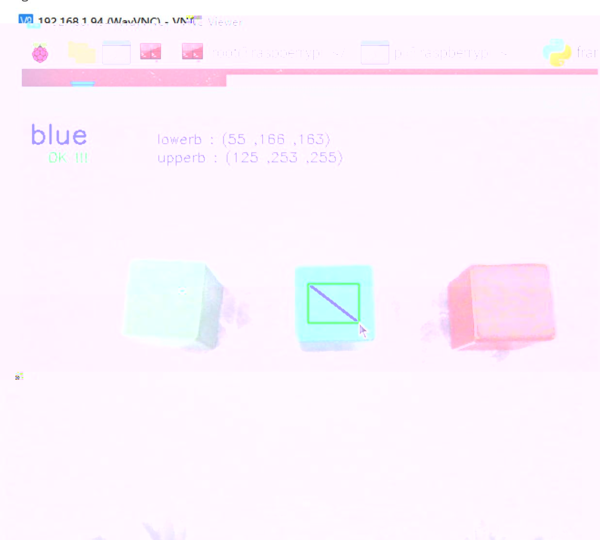

# Color Block Transport

## 1. Content Description

This section explains how to combine Nav2 navigation, colored-block recognition, and 3D robotic-arm gripping to pick up, transport, and place colored blocks.

This section requires terminal commands. The terminal you use depends on the mainboard type. This section uses the Raspberry Pi 5 as an example. On Raspberry Pi and Jetson Nano mainboards, open a terminal on the host computer and enter the Docker container. After entering Docker, run the commands from this section there. For Docker entry steps, refer to **[Configuration and Operation Guide] - [Enter the Docker (Jetson Nano and Raspberry Pi 5 users, see here)**.

On an Orin mainboard, open a terminal directly and run the commands from this section.

## 2. Program Startup

The virtual machine and robot must be on the same LAN and must use the same ROS_DOMAIN_ID. If needed, edit ROS_DOMAIN_ID in ~/.bashrc and run source ~/.bashrc to refresh the environment.

In robot terminal 1, run the following command to start the camera and robotic arm solving program:

```bash
ros2 launch M3Pro_demo camera_arm_kin.launch.py
```

In robot terminal 2, run the following command to start the chassis data fusion and LiDAR data fusion filtering program:

```bash
ros2 launch M3Pro_navigation base_bringup.launch.py
```

In robot terminal 3, run the following command to start the gripping program:

```bash
ros2 run M3Pro_demo grasp_transport
```

In robot terminal 4, run the following command to start the colored block recognition program:

```bash
ros2 run M3Pro_demo color_transport
```

Place the colored block under the camera so the entire block appears in the image.

In virtual machine terminal 1, start the navigation RViz display:

```bash
ros2 launch slam_view slam_view.launch.py
```

In robot terminal 5, run the following command to start Navigation2:

```bash
ros2 launch M3Pro_navigation navigation2.launch.py
map_dir:=/root/M3Pro_ws/src/yahboom_mapping/maps/yahboom_map.yaml
```

Replace /root/M3Pro_ws/src/yahboom_mapping/maps/yahboom_map.yaml with the path to your own YAML map file.

In virtual machine terminal 2, start the navigation status detection program:

```bash
ros2 run yahboom_nav2_bringup get_nav2_status_V2
```

After all programs are running, use [2D Pose Estimate] in the virtual machine's RViz to set the robot's initial pose based on its real position on the map. The pose is accurate when the LiDAR scan overlaps the mapped obstacles.



In the Navigation2 plugin, click [Waypoint/Nav Through Poses Mode] as shown below.



Use the keyboard to choose which colored block to grip or calibrate:

- Press R or r: select red blocks.
- Press G or g: select green blocks.
- Press B or b: select blue blocks.
- Press Y or y: select yellow blocks.
- Press C or c: calibrate the selected block color.

After a color is selected, the program generates a binary image and stitches it to the right side of the color image. The white region in the binary image is the selected block. The example below shows a blue block selected with the b key.



If the blue block is not recognized, press c to calibrate its HSV range. In calibration mode, drag over an area near the center of the blue block and release the mouse to complete calibration.



After selecting a color, press the spacebar to begin gripping the colored block. If the robot is too far or too close, the program moves the chassis to adjust the distance. After the robotic arm grips the block, the buzzer beeps and the arm moves to the transport pose. The robot then rotates 90 degrees and enters navigation transport mode.

In navigation transport mode, use [Nav2 Goal] in RViz to set a target point. The robot plans a path and navigates to the target. After reaching the destination, the robotic arm lowers the gripper to place the colored block, then the robot returns to the starting position for the next recognition cycle.

## 3. Core Code Analysis

Import the required libraries:

```python
import cv2
import os
import numpy as np
import message_filters
from cv_bridge import CvBridge
import cv2 as cv
```

```python
#Import color recognition library
from M3Pro_demo.color_common import *
from arm_interface.srv import ArmKinemarics
from arm_interface.msg import AprilTagInfo,CurJoints
from arm_msgs.msg import ArmJoints,ArmJoint
from std_msgs.msg import Float32,Bool,Int16
import time
import transforms3d as tfs
import tf_transformations as tf
import yaml
import math
from rclpy.node import Node
import rclpy
from message_filters import Subscriber,
TimeSynchronizer,ApproximateTimeSynchronizer
from sensor_msgs.msg import Image
from geometry_msgs.msg import Twist
from ament_index_python.packages import get_package_share_directory
import threading
from M3Pro_demo.compute_joint5 import *
```

The program initializes publishers and subscribers:

```python
def __init__(self, name):
    super().__init__(name)
    self.init_joints = [90, 100, 0, 0, 90, 0]
    self.down_joint = [155, 35, 70, 5, 60,120]
    self.rgb_bridge = CvBridge()
    self.depth_bridge = CvBridge()
    #Define the flag for publishing color block information. When the value is
True, it means publishing. When it is False, it means not publishing.
    self.pub_pos_flag = False
    #Define the array that stores the current end pose coordinates
    self.CurEndPos = [0.1279009179959246, 0.00023254956548456117,
0.1484898062979958, 0.00036263794618046863, 1.3962632350758744,
0.0003332603981328959]
    #Dabai_DCW2 camera internal parameters
    self.camera_info_K = [477.57421875, 0.0, 319.3820495605469, 0.0,
477.55718994140625, 238.64108276367188, 0.0, 0.0, 1.0]
    #Rotation matrix from the end to the camera
    self.EndToCamMat = np.array([[ 0 ,0 ,1 ,-1.00e-01],
                                 [-1 ,0 ,0 ,0],
                                 [0 ,-1 ,0 ,4.82000000e-02],
                                 [ 0.00000000e+00 , 0.00000000e+00 ,
0.00000000e+00 , 1.00000000e+00]])
    self.rgb_image_sub = Subscriber(self, Image, '/camera/color/image_raw')
    self.sub_grasp_status =
self.create_subscription(Bool,"grasp_done",self.get_graspStatusCallBack,100)
    self.depth_image_sub = Subscriber(self, Image, '/camera/depth/image_raw')
    self.CmdVel_pub = self.create_publisher(Twist,"cmd_vel",1)
    self.pub_cur_joints = self.create_publisher(CurJoints,"Curjoints",1)
    self.pub_SingleTargetAngle = self.create_publisher(ArmJoint, "arm_joint",
10)
    self.pos_info_pub = self.create_publisher(AprilTagInfo,"PosInfo",1)
```

```
self.pub_SixTargetAngle = self.create_publisher(ArmJoints, "arm6_joints",
10)
    self.client = self.create_client(ArmKinemarics, 'get_kinemarics')
    while not self.client.wait_for_service(timeout_sec=1.0):
        self.get_logger().info('Service not available, waiting again...')
    self.get_current_end_pos()
    while not self.pub_SixTargetAngle.get_subscription_count():
        self.pubSixArm(self.init_joints)
        time.sleep(0.1)
    self.pubSixArm(self.init_joints)
    while not self.pub_cur_joints.get_subscription_count():
        self.pubCurrentJoints()
        time.sleep(0.1)
    self.pubCurrentJoints()
    self.pub_beep = self.create_publisher(Bool, "beep", 10)
    #Create a publisher, the topic of the publication is /back_orin, the topic
data is True to publish a request to return to the origin
    self.send_back2orin = self.create_publisher(Bool, "/back_orin", 10)
    #Create a subscriber, subscribe to the topic /start_transport, the callback
function is to determine whether the value of self.grasp_done is True. If it is,
it means that the color block has been grasped at this time. When it reaches the
destination, it needs to lower the claw to put down the color block.
    self.sub_start_transport =
self.create_subscription(Bool,"/start_transport",self.get_StartTransportCallBack
,100)
    #Create a publisher, the topic of the publication is /next_status, the topic
data represents the next status value, 0 means returning to the origin, 1 means
detecting the color block, 2 means transporting the color block
    self.pub_status = self.create_publisher(Int16, "/next_status", 10)
    #Create a subscriber, subscribe to the topic /transport_done, the callback
function is to modify the values of some variables so that the chassis can be
adjusted and the color blocks can be clamped next time
    self.sub_start_back2orin =
self.create_subscription(Bool,"/transport_done",self.get_TransbotStatusCallBack,
100)
    #Create a publisher, publish the topic to /unload_done, the topic data is
True, indicating that the unload is completed
    self.pub_unload_done = self.create_publisher(Bool, "/unload_done", 10)
    self.TargetJoint5_pub = self.create_publisher(Int16, "set_joint5", 10)
    #self.PID_init()
    self.pubCurrentJoints()
    self.get_current_end_pos()
    self.ts = ApproximateTimeSynchronizer([self.rgb_image_sub,
self.depth_image_sub], 1, 0.5)
    self.ts.registerCallback(self.callback)
    self.pubSixArm(self.init_joints)
    #Get the compensation values in the xyz directions in the offset table
    self.x_offset = offset_config.get('x_offset')
    self.y_offset = offset_config.get('y_offset')
    self.z_offset = offset_config.get('z_offset')
    self.adjust_dist = True
    self.linearx_PID = (0.5, 0.0, 0.2)
    self.linearx_pid = simplePID(self.linearx_PID[0] / 1000.0,
self.linearx_PID[1] / 1000.0, self.linearx_PID[2] / 1000.0)
    self.target_color = 0
    #Read the HSV values of four colors
```

```
self.red_hsv_text = os.path.join(package_pwd, 'red_colorHSV.text')
    self.green_hsv_text = os.path.join(package_pwd, 'green_colorHSV.text')
    self.blue_hsv_text = os.path.join(package_pwd, 'blue_colorHSV.text')
    self.yellow_hsv_text = os.path.join(package_pwd, 'yellow_colorHSV.text')
    #Define the variable to store hsv, which will eventually be passed to the
color recognition function
    self.hsv_range = ()
    #Select the color block area flag. When the value is True, it means that the
mouse selects the area in the color block.
    self.select_flags = False
    self.gTracker_state = False
    self.windows_name = 'frame'
    self.Track_state = 'init'
    #Define storage of mouse coordinates
    self.Mouse_XY = (0, 0)
    self.cols, self.rows = 0, 0
    #Define the region of interest, here refers to the area on the selected color
block
    self.Roi_init = ()
    #Create a color recognition object
    self.color = color_detect()
    #Define a variable to record the current color
    self.cur_color = None
    #Define the RGB value of the currently selected color
    self.text_color = (0,0,0)
    #The center x coordinate of the target color block
    self.cx = 0
    #The center y coordinate of the target color block
    self.cy = 0
    #The radius of the minimum circumscribed circle of the target color block
    self.circle_r = 0
    #Valid distance flag, the value is True means the current distance is valid
    self.valid_dist = True
    self.grasp_done = False
    self.joint5 = Int16()
    self.corners = np.empty((4, 2), dtype=np.int32)
```

Image topic callback function:

```python
def callback(self,color_frame,depth_frame):
    #Get color image topic data and use CvBridge to convert message data into
image data
    rgb_image = self.rgb_bridge.imgmsg_to_cv2(color_frame,'rgb8')
    rgb_image = cv2.cvtColor(rgb_image, cv2.COLOR_RGB2BGR)
    result_image = np.copy(rgb_image)
    #Get the deep image topic data and use CvBridge to convert the message data
into image data
    depth_image = self.depth_bridge.imgmsg_to_cv2(depth_frame, encoding[1])
    frame = cv.resize(depth_image, (640, 480))
    depth_to_color_image = cv2.applyColorMap(cv2.convertScaleAbs(depth_image,
alpha=1.0), cv2.COLORMAP_JET)
    depth_image_info = frame.astype(np.float32)
    key = cv2.waitKey(10)& 0xFF
    #Call the defined process function to perform key processing and image
processing
    result_frame, binary = self.process(rgb_image,key)
    #Call thread function to display image
```

```
show_frame = threading.Thread(target=self.img_out, args=
(result_frame,binary,))
    show_frame.start()
    show_frame.join()
    #Press the space bar to modify the value of self.pub_pos_flag
    if key == 32:
        self.pub_pos_flag = True
    if self.pub_pos_flag:
        #If self.cx and self.cy are not 0, it means that a color block of the
target color has been detected. At the same time, the radius of the minimum
circumscribed circle of the current color block must be greater than 30. This is
to filter out some small areas that are misidentified.
        if self.cx!=0 and self.cy!=0 and self.circle_r>30:
            #print("self.cx: ",self.cx)
            #print("self.cx: ",self.cy)
            cx = int(self.cx)
            cy = int(self.cy)
            dist = depth_image_info[int(cy),int(cx)]/1000
            #Calculate the position of the color block in the world coordinate
            pose = self.compute_heigh(cx,cy,dist)
            #Calculate the distance between the center of the color block and
the base coordinate base_link
            dist_detect = math.sqrt(pose[1] ** 2 + pose[0]** 2)
            dist_detect = dist_detect*1000
            #If the distance is less than 130 mm, it is considered invalid
            if dist_detect<130:
                print("Invalid dist.")
                self.valid_dist = False
            dist = 'dist: ' + str(dist_detect) + ' mm'
            print("dist: ",dist)
            #If the distance is valid and outside the range [215, 225], then
control the chassis to adjust the distance
            if abs(dist_detect - 220.0)>10 and self.adjust_dist==True and
self.valid_dist == True:
                self.move_dist(dist_detect)
            else:
                self.pubVel(0,0,0)
                self.adjust_dist = False
                cx = int(self.cx)
                cy = int(self.cy)
                #Calculate the depth information of the center point of the color
block
                dist = depth_image_info[int(cy),int(cx)]/1000
            #print("dist: ",dist)
                if dist!=0:
                    #Calculate the rotation angle of the color block based on
the corner coordinates
                    vx = self.corners[0][0][0] - self.corners[1][0][0]
                    vy = self.corners[0][0][1] - self.corners[1][0][1]
                    target_joint5 = compute_joint5(vx,vy)
                    self.joint5.data = int(target_joint5)
                    pos = AprilTagInfo()
                    pos.id = self.target_color
                    pos.x = float(cx)
                    pos.y = float(cy)
                    pos.z = float(dist)
                    self.pub_pos_flag = False
                    #Publish color block location information topic
```

```
self.pos_info_pub.publish(pos)
            self.TargetJoint5_pub.publish(self.joint5)
else:
    self.pubVel(0,0,0)
```
