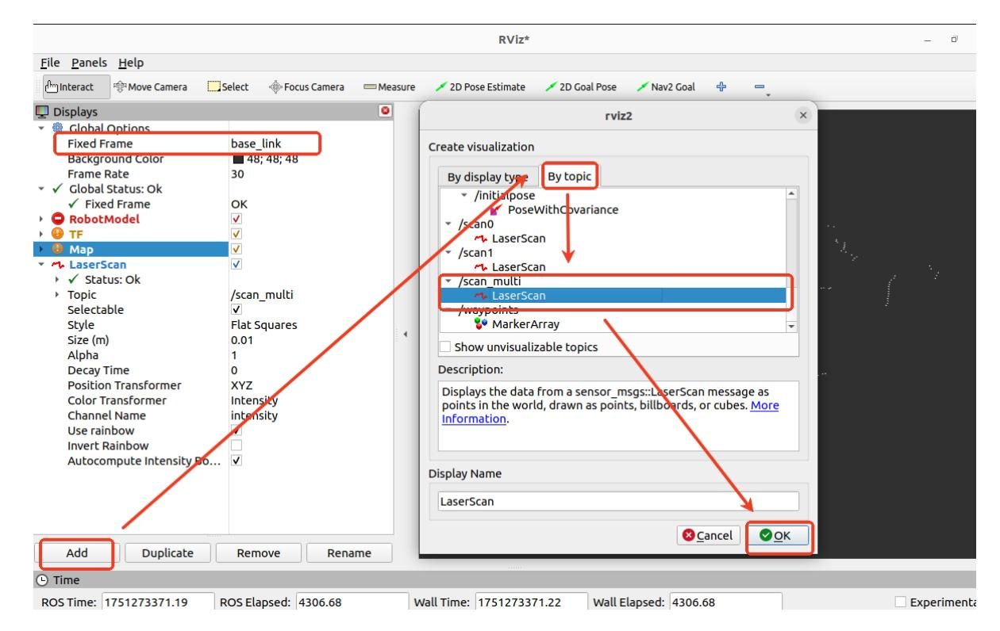
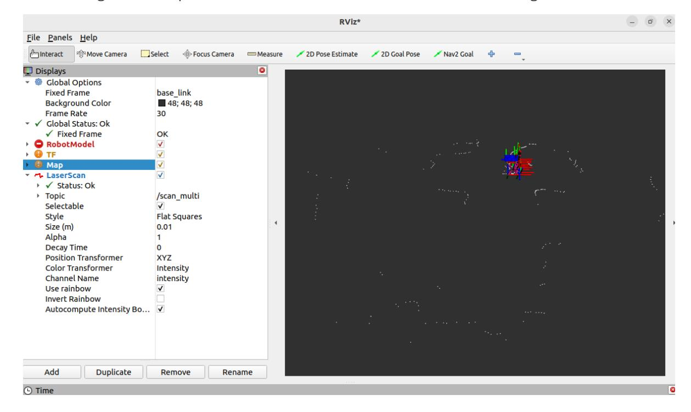
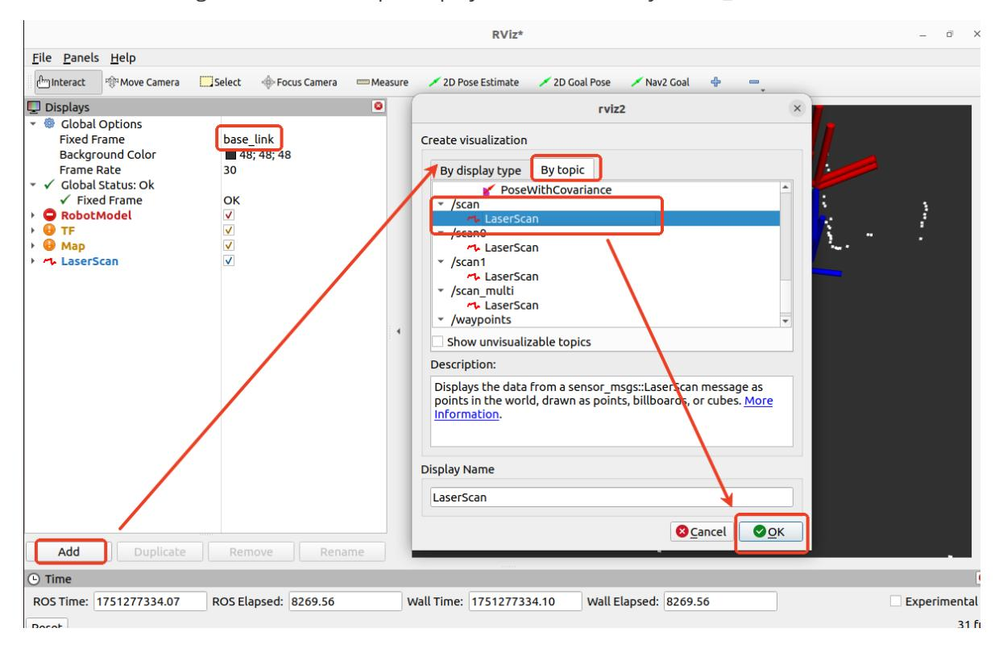
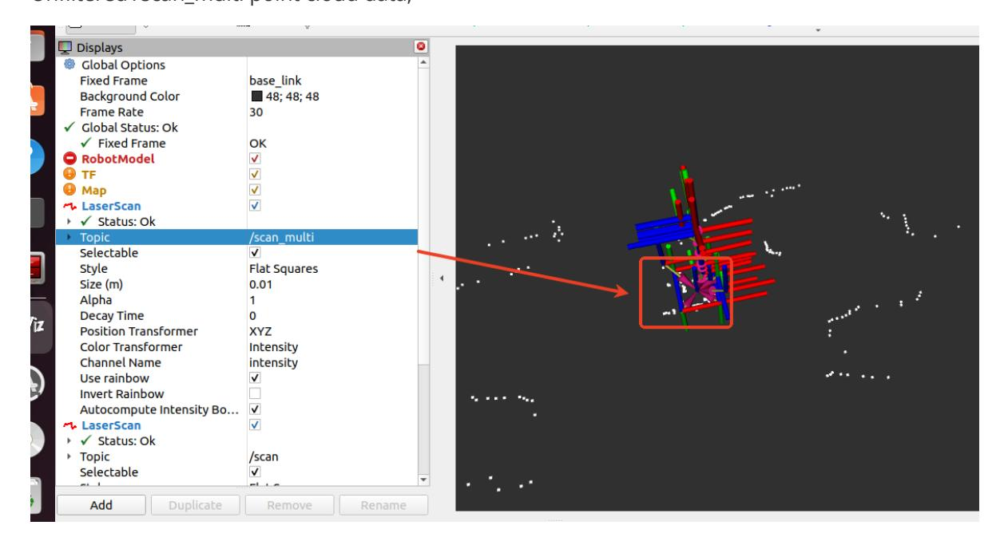
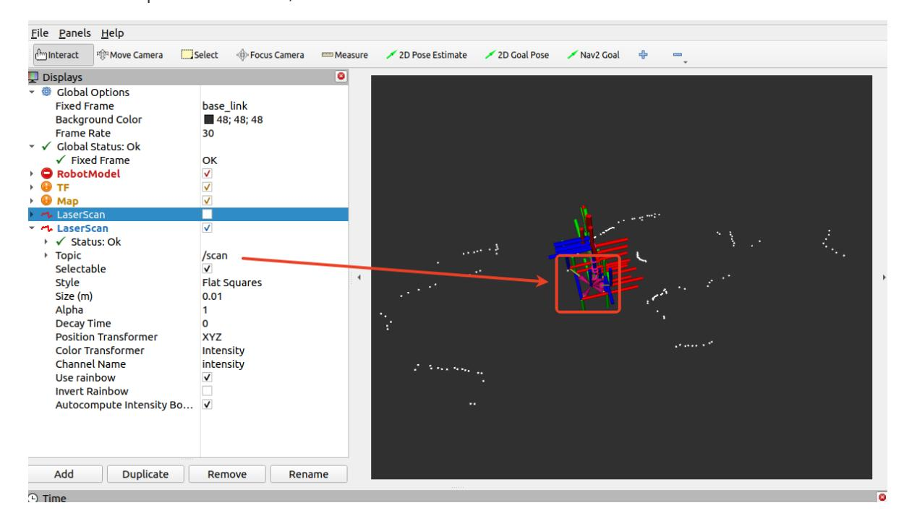
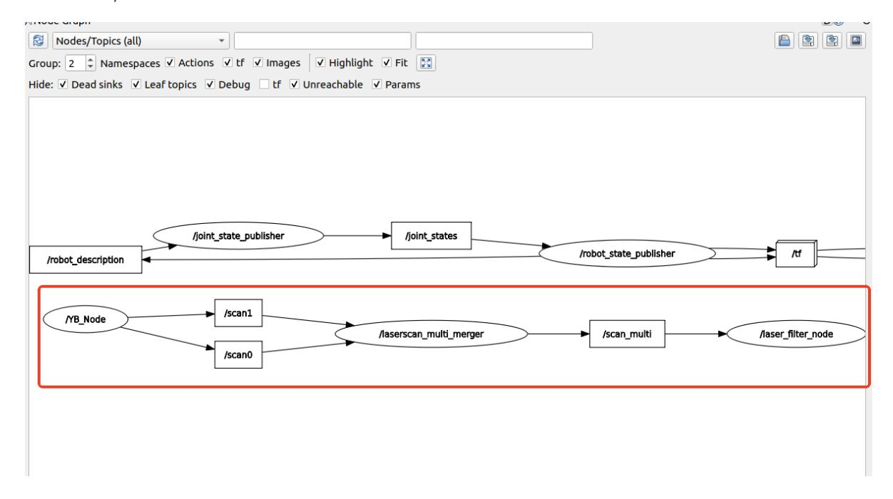

# Dual LiDAR Fusion and Filtering

The robot has two LiDAR sensors: one at the left rear and one at the right front. Mapping and navigation nodes usually consume a single LaserScan topic, so the two scans must be merged and filtered before they are used for SLAM or Navigation2. This chapter uses the ira_laser_tools package for scan fusion.

## 1. ira_laser_tools Package

### 1.1 Package Overview

The ira_laser_tools package provides these functions:

- **Laser Scan Merge**: Merge data from multiple laser scanners into a single scan.
- **Laser Scan Segmentation**: Split a single laser scan into multiple virtual scans.
- **Angle limiting**: Clip the angular range of laser scan data.
- **Scan denoising**: Remove noisy points from laser scans.

On this robot, the laser scan merge interface combines the front and rear LiDAR scans into a single output scan.

### 1.2 Package Source Code

**laserscan_multi_merger.cpp** source code path:

- Raspberry Pi 5 and Jetson Nano: /root/M3Pro_ws/src/M3Pro_core/ira_laser_tools/src/laserscan_multi_merger.cpp inside the running Docker container
- Orin mainboard: /home/jetson/M3Pro_ws/src/M3Pro_core/ira_laser_tools/src/laserscan_multi_merger.cpp

#### **laserscan_merge.yaml** parameter file path:

- Raspberry Pi 5 and Jetson Nano: /root/M3Pro_ws/src/M3Pro_core/ira_laser_tools/config/laserscan_merge.yaml inside the running Docker container
- Orin mainboard: /home/jetson/M3Pro_ws/src/M3Pro_core/ira_laser_tools/config/laserscan_merge.yaml

The laserscan_merge.yaml file contains:

```
laserscan_multi_merger :
  ros__parameters :
    destination_frame : "base_link"
    cloud_destination_topic : "/merged_cloud"
    scan_destination_topic : "/scan_multi"
    laserscan_topics : "/scan0 /scan1"
    angle_min : -3.14
    angle_max : 3.14
    angle_increment : 0.017453
    scan_time : 0.0
    range_min : 0.05
    range_max : 4.0
```

Key parameters are as follows:

- destination_frame: Output coordinate frame for the fused scan. Here it is base_link.
- cloud_destination_topic: Fused point cloud topic. Here it is /merged_cloud.
- scan_destination_topic: Fused LaserScan topic. Here it is /scan_multi.
- laserscan_topics: Input scan topics, /scan0 and /scan1, published by the low-level control node.
- angle_min and angle_max: Output scan limits in radians. The range -3.14 to 3.14 represents 360 degrees.
- angle_increment: Output angular resolution, in radians. Here it is 0.017453.
- range_min and range_max: Output range limits, in meters. Here the valid range is 0.05-4.0 m.

### 1.3 Program Startup

This section requires terminal commands. The terminal you use depends on the mainboard type. This section uses the Raspberry Pi 5 as an example. For Raspberry Pi and Jetson Nano mainboards, open a terminal and enter the Docker container. After entering the Docker container, run the commands from this section there. For instructions on entering a Docker container, refer to the product tutorial **[Robot Configuration and Operation Guide] - [Enter the Docker (Jetson Nano and Raspberry Pi 5 users, see here)**.

On an Orin mainboard, open a terminal directly and run the commands from this section.

After the robot successfully connects to the agent, run the following command:

```bash
ros2 launch ira_laser_tools merge_multi.launch.py
```

After the program starts, use RViz to view the fused scan:

```
rviz2
```

In RViz, add a topic display and set the correct frame_id to view the data.



After the topic is added, the white point cloud shows the fused LiDAR data.



## 2. LiDAR Filtering

After the two scans are fused, the scan still contains points from the robot body. If those points are passed directly to mapping or navigation, the robot can treat itself as an obstacle. The laser filter removes those body points before publishing the /scan topic.

### 2.1 Package Source Code

laser_filter_processor.cpp source code path:

- Raspberry Pi 5 and Jetson Nano: /root/M3Pro_ws/src/M3Pro_core/yahboom_laser_filter/src/laser_filter_processor.cpp inside the running Docker container
- Orin mainboard: the corresponding yahboom_laser_filter source path in the M3Pro_ws workspace

The source code is shown below:

```
#include "laser_filter_processor.hpp"
LaserFilterProcessor::LaserFilterProcessor ( const std::string & node_name )
   : Node ( node_name ) {
   // Parameter initialization
   this -> declare_parameter < double > ( "angle_min" , - 180.0 ); // Shield
range starting angle (unit: degree)
   this -> declare_parameter < double > ( "angle_max" , 180.0 ); // Shield
range end angle (unit: degree)
   laser_sub_ = this -> create_subscription < sensor_msgs::msg::LaserScan > (
       "/scan_multi" , 10 , std::bind ( & LaserFilterProcessor::laserCallback ,
this , std::placeholders::_1 ));
   laser_pub_ = this -> create_publisher < sensor_msgs::msg::LaserScan > (
"/scan" , 10 );
   // Get parameters
   this -> get_parameter ( "angle_min" , angle_min_ );
   this -> get_parameter ( "angle_max" , angle_max_ );
   // Convert angle to radians
   angle_min_rad_ = angle_min_ * M_PI / 180.0 ;
   angle_max_rad_ = angle_max_ * M_PI / 180.0 ;
   RCLCPP_INFO ( this -> get_logger (), "LaserFilterProcessor initialized.
Filtering angles: [%f, %f] degrees" ,
               angle_min_ , angle_max_ );
}
void LaserFilterProcessor::laserCallback ( const
sensor_msgs::msg::LaserScan::SharedPtr msg ) {
   auto filtered_scan = * msg ; // Create a copy for modification
   // Traverse the lidar data
   for ( size_t i = 0 ; i < filtered_scan . ranges . size (); ++ i ) {
       // Calculate the current angle
       double angle = filtered_scan . angle_min + i * filtered_scan .
angle_increment ;
       // If the angle is within the shielding range and the distance is less
than 18cm, set it to invalid data
       if ( angle >= angle_min_rad_ && angle <= angle_max_rad_ &&
filtered_scan . ranges [ i ] < 0.18 ) {
           filtered_scan . ranges [ i ] = std::numeric_limits < float > ::
infinity (); // invalid data
       }
   }
   // Publish filtered data
   laser_pub_ -> publish ( filtered_scan );
}
```

### 2.2 Program Startup

Run the following command to start LiDAR filtering:

```bash
ros2 launch yahboom_laser_filter laser_filter_node.launch.py
```

After the filter starts, use RViz to compare the fused and filtered scans:

```
rviz2
```

In RViz, add the scan topic display and set the correct frame_id.



Compared with /scan_multi, the filtered /scan output no longer includes the points from the robot body.

Unfiltered /scan_multi point cloud data:



Filtered /scan point cloud data:



### 2.3 Node Communication

Run the following command to view node communication:

```bash
ros2 run rqt_graph rqt_graph
```

After it opens, select [Node/Topics (all)] in the upper left corner, then click the refresh button as shown below.


