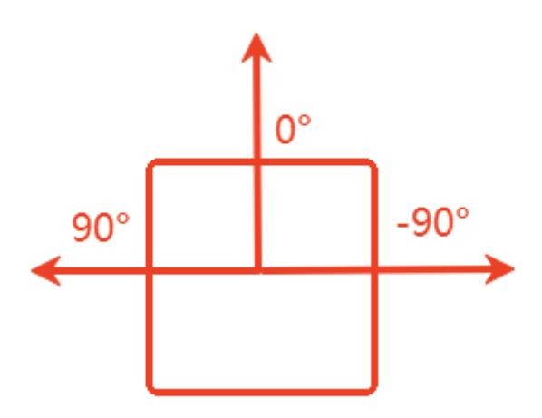

# LiDAR obstacle avoidance

## 1. Content Description

This section describes how the program combines chassis control with fused radar data to detect obstacles in real time as the car moves forward and steer the car to avoid them based on their locations.

This section requires entering commands in the terminal. The terminal you open depends on your motherboard type. This section uses the Raspberry Pi 5 as an example. For Raspberry Pi and Jetson Nano motherboards, you'll need to open a terminal and enter commands to enter a Docker container. Once inside the Docker container, enter the commands mentioned in this section in the terminal. For instructions on entering a Docker container, refer to the product tutorial **[Robot Configuration and Operation Guide] - [Enter the Docker (Jetson Nano and Raspberry Pi 5 users, see here)**.

Simply open the terminal on the Orin motherboard and enter the commands mentioned in this section.

## 2. Program startup

First, open the terminal and enter the following command to start the radar fusion and radar filtering programs.

```bash
ros2 launch yahboom_M3Pro_laser laser_driver.launch.py
```

Next, you can refer to this product tutorial [5. Chassis Control] - [2. Handle Control] to start the handle control to control the car conveniently. Press the R2 button on the handle to cancel and start the radar obstacle avoidance gameplay. If the handle control is not started, it will not affect the operation of this program. Enter the following command in the terminal to start the radar obstacle avoidance program,

```bash
ros2 run yahboom_M3Pro_laser laser_Avoidance
```

After startup, as shown in the figure below, the radar will print out the situation of detecting surrounding obstacles and control the movement of the car.

If there is no obstacle, the car will go straight forward; if there is an obstacle on the left, the car will turn right to avoid the obstacle and continue to move forward; if there is an obstacle on the right, the car will turn left to avoid the obstacle and continue to move forward.

The obstacle avoidance detection distance set by the program is 0.825 meters, and the radar detection angle is 45 degrees to the left and right of 0 degrees. After the dual radar fusion, the radar data at 0 degrees is the front of the vehicle, the left half of the vehicle is 0 degrees-180 degrees, and the right half of the vehicle is -180 degrees-0 degrees. The radar starts from 0 degrees and rotates counterclockwise, as shown in the figure below.



## 3. Core code analysis

Program code path:

Raspberry Pi and Jetson Nano board

The program code is in the running docker. The path in docker is /root/yahboomcar_ws/src/yahboom_M3Pro_laser/yahboom_M3Pro_laser/laser_Avoidance.p y

Orin Motherboard

The program code path is /home/jetson/yahboomcar_ws/src/yahboom_M3Pro_laser/yahboom_M3Pro_laser/laser_Avoi dance.py

Import the necessary library files,

```python
#ros lib
import rclpy
from rclpy.node import Node
from geometry_msgs.msg import Twist
from sensor_msgs.msg import LaserScan
#commom lib
import math
import numpy as np
import time
from time import sleep
from yahboom_M3Pro_laser.common import *
import os
```

The program initializes and creates publishers and subscribers,

```python
def __init__(self,name):
    super().__init__(name)
    #create a sub
    #Create a subscriber to subscribe to the fused radar topic message
 self.sub_laser=self.create_subscription(LaserScan,"/scan",self.registerScan,1)
    #Create a subscriber to subscribe to the handle remote control topic message
    self.sub_JoyState =
self.create_subscription(Bool,'/JoyState',self.JoyStateCallback,1)
    #create a pub
    #Create a publisher to publish speed topic message
    self.pub_vel = self.create_publisher(Twist,'/cmd_vel',1)
    #declareparam
    #Forward linear speed
    self.declare_parameter("linear",0.3)
    self.linear =
self.get_parameter('linear').get_parameter_value().double_value
    # Rotational angular velocity
    self.declare_parameter("angular",1.0)
    self.angular =
self.get_parameter('angular').get_parameter_value().double_value
    # Radar detection angle
    self.declare_parameter("LaserAngle",45.0)
```

```
self.LaserAngle =
self.get_parameter('LaserAngle').get_parameter_value().double_value
    #The detection distance of the obstacle. If it is less than this value, it
means there is an obstacle.
    self.declare_parameter("ResponseDist",0.55)
    self.ResponseDist =
self.get_parameter('ResponseDist').get_parameter_value().double_value
    #The right obstacle count value
    self.Right_warning = 0
    #Left obstacle count value
    self.Left_warning = 0
    #Count of obstacles ahead
    self.front_warning = 0
    #Handle control flag, the value is True means the handle controls the car,
you need to press the R2 key on the handle to take handle control or enable
handle control
    self.Joy_active = False
    #Obstacle counting threshold. Exceeding this value indicates that there is an
obstacle ahead within the detection range.
    self.conut = 10
```

registerScan radar topic callback function,

```python
def registerScan(self, scan_data):
    if not isinstance(scan_data, LaserScan): return
    ranges = np.array(scan_data.ranges)
    self.Right_warning = 0
    self.Left_warning = 0
    self.front_warning = 0
    for i in range(len(ranges)):
        #Convert the radians in the radar topic data into degrees
        angle = (scan_data.angle_min + scan_data.angle_increment * i) * RAD2DEG
        #If it is greater than 0 degrees and less than 45 degrees or less than
-45 degrees and greater than 0 degrees, and the distance corresponding to the
angle is less than 1.5 times the set distance, it is considered that there is an
obstacle ahead.
        if abs(angle) < self.LaserAngle and ranges[i] !=0.0:
            if ranges[i] <= self.ResponseDist*1.5:
                self.front_warning += 1
        #If it is greater than 45 degrees and less than 90 degrees, and the
distance corresponding to the angle is less than 1.5 times the set distance, it
is considered that there is an obstacle on the left.
        if angle < ( 90 - self . LaserAngle ) < 90 and angle > 0 and
 ranges [ i ] ! = 0.0 :
            if ranges [ i ] < = self . ResponseDist * 1.5 :
                self . Left_warning += 1
        #If it is greater than -90 degrees and less than -45 degrees, and the
distance corresponding to the angle is less than 1.5 times the set distance, it
is considered that there is an obstacle on the right.
        if angle < (90 - self.LaserAngle) < 90 and angle>0 and ranges[i] !=0.0:
            if ranges[i] <= self.ResponseDist*1.5:
                self.Left_warning += 1
    #If self.Joy_active is True, publish the parking speed and exit this callback
function
    if self.Joy_active:
        self.pub_vel.publish(Twist())
```

```
return
    twist = Twist()
    #Based on the obstacle count values in front, left, and right, determine
which direction has obstacles and publish the speed topic based on the judgment
results.
    if self.front_warning > self.conut and self.Left_warning > self.conut and
self.Right_warning > self.conut:
        print ('1, there are obstacles in the left and right, turn right')
        twist.linear.x = self.linear
        twist.angular.z = -self.angular
        self.pub_vel.publish(twist)
        sleep(0.2)
    elif self.front_warning > self.conut and self.Left_warning <= self.conut and
self.Right_warning > self.conut:
        print ('2, there is an obstacle in the middle right, turn left')
        twist.linear.x = 0.0
        twist.angular.z = self.angular
        self.pub_vel.publish(twist)
        sleep(0.2)
        if self.Left_warning > self.conut and self.Right_warning <= self.conut:
            twist.linear.x = 0.0
            twist.angular.z = -self.angular
            self.pub_vel.publish(twist)
            sleep(0.5)
    elif self.front_warning > self.conut and self.Left_warning > self.conut and
self.Right_warning <= self.conut:
        print ('4. There is an obstacle in the middle left, turn right')
        twist.linear.x = 0.0
        twist.angular.z = -self.angular
        self.pub_vel.publish(twist)
        sleep(0.2)
        if self.Left_warning <= self.conut and self.Right_warning > self.conut:
            twist.linear.x = 0.0
            twist.angular.z = self.angular
            self.pub_vel.publish(twist)
            sleep(0.5)
    elif self.front_warning > self.conut and self.Left_warning < self.conut and
self.Right_warning < self.conut:
        print ('6, there is an obstacle in the middle, turn left')
        twist.linear.x = 0.0
        twist.angular.z = self.angular
        self.pub_vel.publish(twist)
        sleep(0.2)
    elif self.front_warning < self.conut and self.Left_warning > self.conut and
self.Right_warning > self.conut:
        print ('7. There are obstacles on the left and right, turn right')
        twist.linear.x = 0.0
        twist.angular.z = -self.angular
        self.pub_vel.publish(twist)
        sleep(0.4)
    elif self.front_warning < self.conut and self.Left_warning > self.conut and
self.Right_warning <= self.conut:
        print ('8, there is an obstacle on the left, turn right')
        twist.linear.x = 0.0
        twist.angular.z = -self.angular
        self.pub_vel.publish(twist)
        sleep(0.2)
```

```
elif self.front_warning < self.conut and self.Left_warning <= self.conut and
self.Right_warning > self.conut:
        print ('9, there is an obstacle on the right, turn left')
        twist.linear.x = 0.0
        twist.angular.z = self.angular
        self.pub_vel.publish(twist)
        sleep(0.2)
    elif self.front_warning <= self.conut and self.Left_warning <= self.conut
and self.Right_warning <= self.conut:
        print ('10, no obstacles, go forward')
        twist.linear.x = self.linear
        twist.angular.z = 0.0
        self.pub_vel.publish(twist)
```
