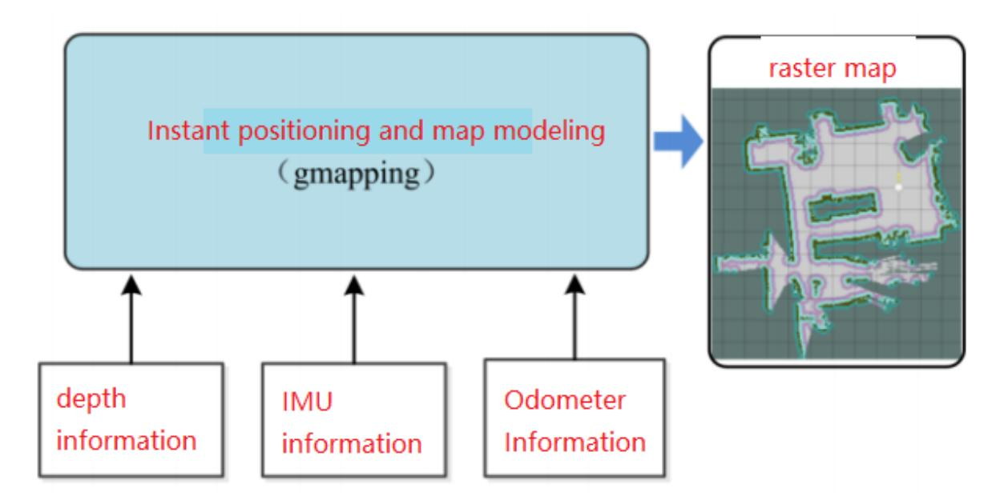
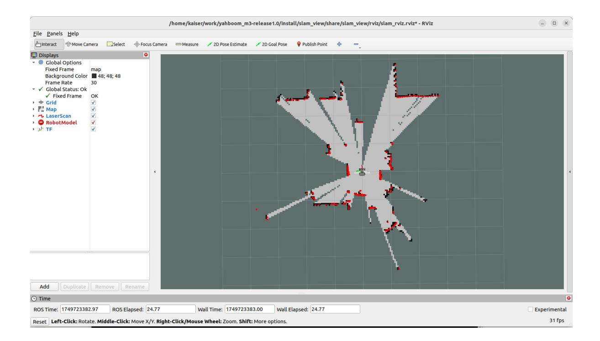
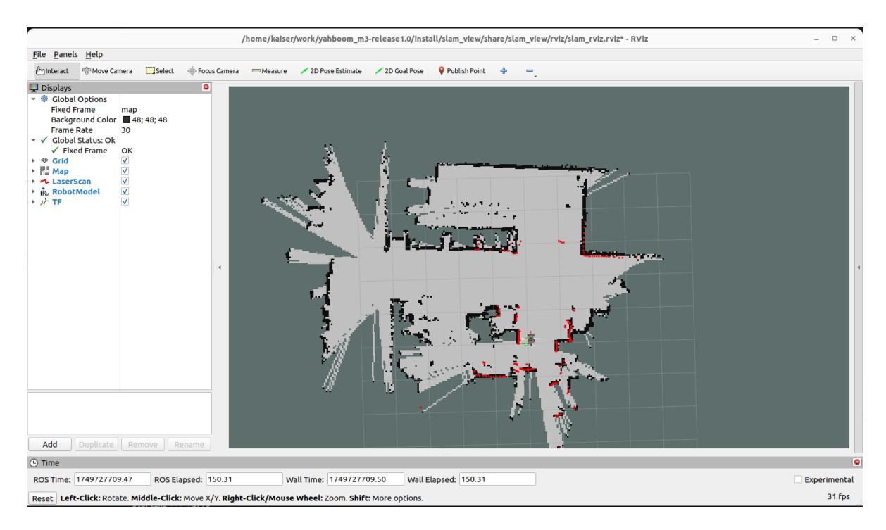
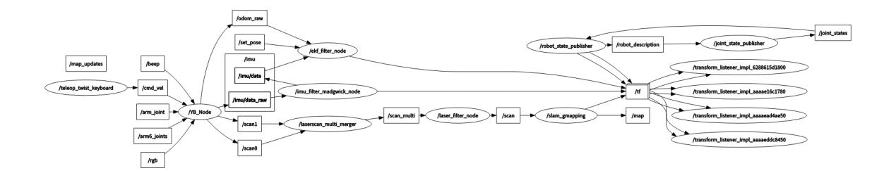

# Gmapping-SLAM Mapping

## 1. Course Content

Learn how to use the gmapping SLAM algorithm on the robot. After starting the mapping node, drive the robot with the keyboard or gamepad to scan the environment, build a raster map, and save the generated map files.

## 2. Introduction to gmapping

### 2.1 Introduction

- gmapping requires fewer than 1440 2D laser points in a single frame. If a scan contains more than 1440 points, the [[mapping-4] process has died] error may occur.
- gmapping is a widely used open-source SLAM algorithm based on the filtering SLAM framework.
- gmapping uses an RBPF particle filter. It estimates the robot pose first, then updates the map.
- gmapping improves the RBPF algorithm by using a better proposal distribution and selective resampling.

**Advantages:** gmapping can build indoor maps in real time. It works well for small environments because it requires relatively little computation and can produce accurate maps.

**Disadvantages:** As the mapped area grows, gmapping needs more particles. Each particle carries its own map, so memory use and computation both increase. gmapping also lacks loop closure detection, so large maps may become misaligned. Increasing the particle count can improve closure, but it also increases CPU and memory load.



### 2.2 Related Materials

[gmapping repository](https://github.com/Project-MANAS/slam_gmapping)

[ros-wiki documentation](https://wiki.ros.org/gmapping)

## 3. Preparation

### 3.1 Content Description

This lesson uses the Jetson Orin NX as an example. On Raspberry Pi and Jetson Nano boards, open a terminal and enter the Docker container before running the commands in this lesson. For Docker entry steps, refer to **[Configuration and Operation Guide]--[Entering the Docker (Jetson Nano and Raspberry Pi 5 users, see here)]**. On Orin and NX boards, run the commands directly in a terminal.

### 3.2 Starting the Agent

Note: To test all cases, you must start the agent first. If it has already been started, you do not need to start it again.

Run the following command in the robot terminal:

```bash
sh start_agent.sh
```

The terminal prints a success message when the connection is established.

## 4. Running the Example

### 4.1 Mapping Process

#### Note:

- **Move slowly while mapping, especially during rotation. Fast motion usually produces poor map quality.**
- **Jetson Nano and Raspberry Pi** controllers must enter the Docker container first. See [Docker course chapter - Entering the robot's Docker container] for steps.

Start mapping from the robot terminal:

```bash
ros2 launch slam_mapping gmapping.launch.py
```

RViz can be started on either the robot or the virtual machine. **Choose one method only**; do not start RViz in both places at the same time:

For example, on the virtual machine, open a terminal and start RViz:

```bash
ros2 launch slam_view slam_view.launch.py
```

To start RViz on the robot, run:

```bash
ros2 launch slam_mapping slam_view.launch.py
```



Open another terminal in the virtual machine and start keyboard control. You can also use a gamepad if the gamepad control node has already been started; see [5. Chassis Control - 2. Controller Control].

```bash
ros2 run yahboomcar_ctrl yahboom_keyboard
```

Click in the terminal window and press z to reduce the speed.

Press I, <, J, and L to move the robot forward, backward, left, and right. Drive slowly until the map is complete.



### 4.2 Saving the Map

Open a new terminal on the robot and save the map:

```bash
ros2 launch slam_mapping save_map.launch.py
```

The terminal prompt **"Map saved successfully"** indicates that the map was saved. If saving fails, run the save command again.

The map is saved to:

- Jetson Orin Nano and Jetson Orin NX:

  ```text
  /home/jetson/M3Pro_ws/install/M3Pro_navigation/share/M3Pro_navigation/map/
  ```

- Jetson Nano and Raspberry Pi, inside Docker:

  ```text
  /root/M3Pro_ws/install/M3Pro_navigation/share/M3Pro_navigation/map/
  ```

The saved output includes a PGM image and the yahboom_map.yaml YAML file.

```yaml
image: yahboom_map.pgm
mode: trinary
resolution: 0.05
origin: [-10, -10, 0]
negate: 0
occupied_thresh: 0.65
free_thresh: 0.25
```

#### Parameter Analysis

- image: Map image path. It can be absolute or relative.
- mode: Map interpretation mode: trinary, scale, or raw. Trinary is the default.
- resolution: Map resolution, in meters per pixel.
- origin: 2D pose (x, y, yaw) of the map's lower-left corner. yaw is counterclockwise; yaw=0 means no rotation. Many system components ignore this yaw value.
- negate: Whether to invert free/occupied meaning for white and black pixels. Threshold interpretation is not affected.
- occupied_thresh: Pixels with an occupancy probability greater than this threshold are considered fully occupied.
- free_thresh: Pixels with an occupancy probability less than this threshold are considered completely free.

## 5. Node Analysis

### 5.1 Displaying the Node Computation Graph

Run in the virtual machine terminal:

```bash
ros2 run rqt_graph rqt_graph
```



### 5.2 TF Transformation

The virtual machine terminal runs:

```bash
ros2 run rqt_tf_tree rqt_tf_tree
```

The image is large; the original can be viewed in this course folder.


### 5.3 gmapping Node Details

```bash
ros2 node info /slam_gmapping
```

Run this command to view the topics and services used by the gmapping node.

```
/slam_gmapping
  Subscribers:
    /parameter_events: rcl_interfaces/msg/ParameterEvent
    /scan: sensor_msgs/msg/LaserScan
  Publishers:
    /entropy: std_msgs/msg/Float64
    /map: nav_msgs/msg/OccupancyGrid
    /map_metadata: nav_msgs/msg/MapMetaData
    /parameter_events: rcl_interfaces/msg/ParameterEvent
    /rosout: rcl_interfaces/msg/Log
    /tf: tf2_msgs/msg/TFMessage
  Service Servers:
    /slam_gmapping/describe_parameters: rcl_interfaces/srv/DescribeParameters
    /slam_gmapping/get_parameter_types: rcl_interfaces/srv/GetParameterTypes
    /slam_gmapping/get_parameters: rcl_interfaces/srv/GetParameters
    /slam_gmapping/list_parameters: rcl_interfaces/srv/ListParameters
    /slam_gmapping/set_parameters: rcl_interfaces/srv/SetParameters
    /slam_gmapping/set_parameters_atomically:
rcl_interfaces/srv/SetParametersAtomically
  Service Clients:
```

```
Action Servers:
Action Clients:
```

### 5.4 Configuration Files

Configuration file paths:

Jetson Orin Nano and Jetson Orin NX:

```
/home/jetson/M3Pro_ws/src/M3Pro_core/slam_gmapping/params/slam_gmapping.yaml
```

Jetson Nano and Raspberry Pi:

Enter Docker first, then use:

```
/root/M3Pro_ws/src/M3Pro_core/slam_gmapping/params/slam_gmapping.yaml
```

Default configuration parameters:

```
slam_gmapping:
  ros__parameters:
    # Angular update threshold (radians): update the map when the robot rotates
beyond this angle
    angularUpdate: 0.25
    # Angle sampling step (radians): step size for angular search in scan
matching
    astep: 0.05
    # Robot base frame name
    base_frame: base_footprint
    # Map frame name
    map_frame: map
    # Odometry frame name
    odom_frame: odom
    # Termination condition for scan matching iteration: stop when parameter
change is smaller than this value
    delta: 0.05
    # Maximum number of iterations for scan matching
    iterations: 5
    # Kernel size used in scan matching, affects the smoothness of matching
    kernelSize: 1
    # Large-scale scan matching sampling range (meters)
    lasamplerange: 0.005
    # Large-scale scan matching sampling step (meters)
    lasamplestep: 0.005
    # Linear update threshold (meters): update the map when the robot moves
beyond this distance
    linearUpdate: 0.5
    # Small-scale scan matching sampling range (meters)
    llsamplerange: 0.01
    # Small-scale scan matching sampling step (meters)
    llsamplestep: 0.01
```

```
# Measurement noise covariance for laser scan
    lsigma: 0.075
    # Number of laser beams to skip: 0 means use all laser points
    lskip: 0
    # Linear sampling step (meters): step size for linear search in scan
matching
    lstep: 0.05
    # Map update interval (seconds)
    map_update_interval: 3.0
    # Maximum laser range (meters): points beyond this distance will be ignored
    maxRange: 6.0
    # Maximum usable laser range (meters): maximum distance used for mapping
    maxUrange: 4.0
    # Minimum score threshold for scan matching: matches below this value will be
discarded
    minimum_score: 0.0
    # Occupancy probability threshold: cells above this value are considered
occupied
    occ_thresh: 0.25
    # Gain factor: affects the speed of map updates
    ogain: 3.0
    # Number of particles in the particle filter
    particles: 30
    # QoS (Quality of Service) parameter settings
    qos_overrides:
      /parameter_events:
        publisher:
          depth: 1000 # Message queue depth
          durability: volatile # Durability policy
          history: keep_all # History policy
          reliability: reliable # Reliability policy
      /tf:
        publisher:
          depth: 1000
          durability: volatile
          history: keep_last # Keep only the latest message
          reliability: reliable
    # Resample threshold: resampling is triggered when the effective particle
count drops below this ratio
    resampleThreshold: 0.5
    # Angular noise covariance for scan matching
    sigma: 0.05
    # Odometry model parameter: linear error ratio caused by linear motion
    srr: 0.1
    # Odometry model parameter: angular error ratio caused by linear motion
    srt: 0.2
    # Odometry model parameter: linear error ratio caused by angular motion
    str: 0.1
    # Odometry model parameter: angular error ratio caused by angular motion
    stt: 0.2
    # Temporal update interval (seconds): update map even when the robot is
stationary
    temporalUpdate: 1.0
    # Transform publish period (seconds)
    transform_publish_period: 0.05
    # Use simulation time
    use_sim_time: false
```

```
# Map maximum range on x-axis (meters)
xmax: 100.0
# Map minimum range on x-axis (meters)
xmin: -100.0
# Map maximum range on y-axis (meters)
ymax: 100.0
# Map minimum range on y-axis (meters)
ymin: -100.0
```

These are the configurable gmapping parameters. After editing them, rebuild the slam_gmapping package in the M3Pro_ws workspace for the changes to take effect:

```bash
colcon build --packages-select slam_gmapping
```
