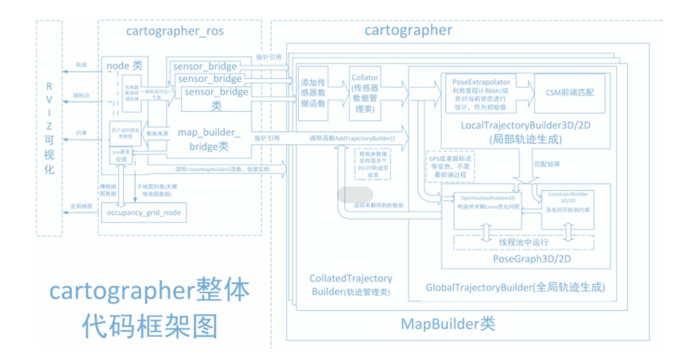
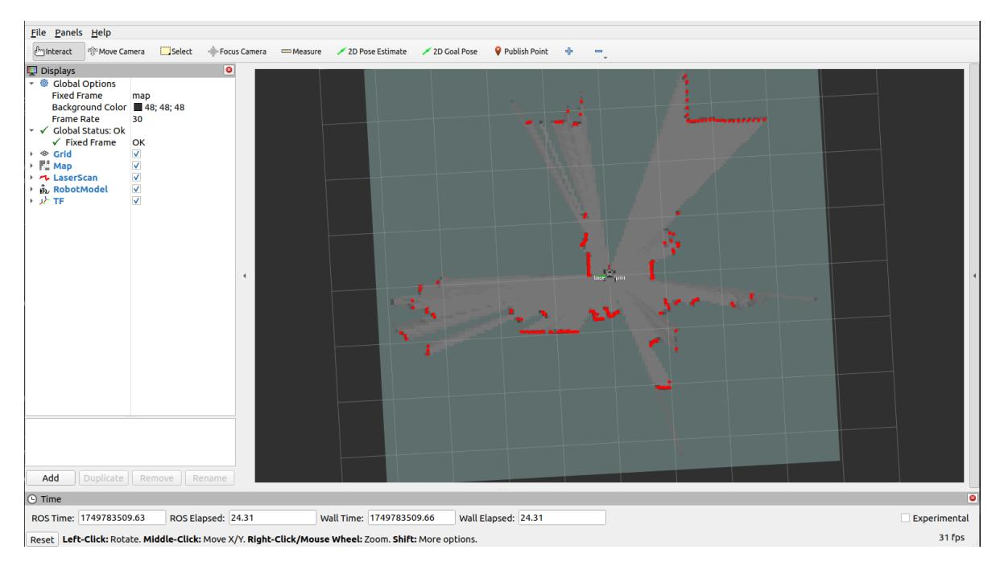
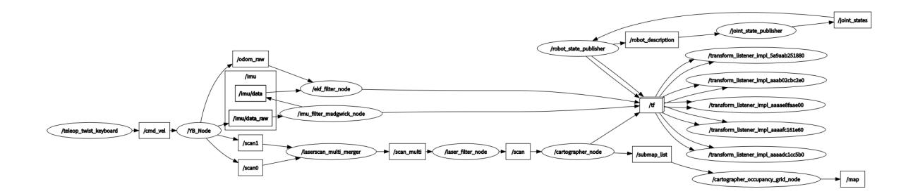
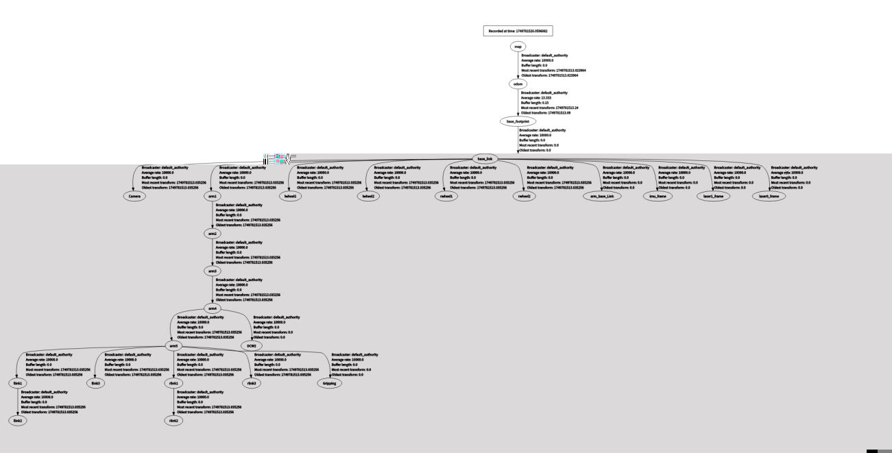

# Cartographer-SLAM Mapping

## 1. Course Content

Learn how to use Cartographer-SLAM mapping on the robot. After starting the sample program, drive the robot with the keyboard or gamepad to scan the environment, build a map, and save both standard map files and a PBStream map for later relocalization.

## 2. Introduction to Cartographer

### 2.1 Introduction

Cartographer is Google's open-source 2D and 3D SLAM (simultaneous localization and mapping) library with ROS support. It combines data from sensors such as LiDAR, IMU, and cameras, then uses graph optimization and the Ceres Solver backend to estimate sensor poses while mapping the environment.

The Cartographer stack mainly consists of cartographer, cartographer_ros, and ceres-solver.



Cartographer follows the common SLAM flow: front-end scan processing, loop closure detection, and back-end optimization. Groups of LaserScan messages are assembled into submaps, and multiple submaps form the global map. Submaps usually have small short-term error, but accumulated error can appear across the global map. Loop closure detection corrects submap poses when the robot revisits a known area. Cartographer fuses odometry, IMU, LaserScan, and other sensor data while using scan matching for loop closure.

cartographer_ros connects Cartographer to ROS. It subscribes to ROS sensor messages, runs Cartographer processing, and publishes ROS messages for debugging and visualization.

### 2.2 Related Materials

[GitHub repository](https://github.com/cartographer-project/cartographer)

[Official Documentation](https://google-cartographer.readthedocs.io/en/latest/)

## 3. Preparation

### 3.1 Content Description

This lesson uses the Jetson Orin NX as an example. On Raspberry Pi and Jetson Nano boards, open a terminal and enter the Docker container before running the commands in this lesson. For Docker entry steps, refer to **[Configuration and Operation Guide]--[Entering the Docker (Jetson Nano and Raspberry Pi 5 users, see here)]**. On Orin and NX boards, run the commands directly in a terminal.

### 3.2 Starting the Agent

Note: To test all cases, you must start the agent first. If it has already been started, you do not need to start it again.

Run the following command in the robot terminal:

```
sh start_agent.sh
```

The terminal prints a success message when the connection is established.

## 4. Running the Example

### 4.1 Mapping Process

#### Note:

- **Move slowly while mapping, especially during rotation. Fast motion usually produces poor map quality.**
- **Jetson Nano and Raspberry Pi** controllers must enter the Docker container first. See [Docker course chapter - Entering the robot's Docker container] for steps.

Start the low-level sensors from the robot terminal:

```bash
ros2 launch slam_mapping bringup.launch.py
```

Start Cartographer mapping:

```bash
ros2 launch slam_mapping cartographer.launch.py
```

RViz can be started on either the robot or the virtual machine. **Choose one method only**; do not start RViz in both places at the same time:

For example, on the virtual machine, open a terminal and start RViz:

```bash
ros2 launch slam_view slam_view.launch.py
```

To start RViz on the robot, run:

```bash
ros2 launch slam_mapping slam_view.launch.py
```



Open another terminal in the virtual machine to start the keyboard control node (you can also use the gamepad control):

```bash
ros2 run yahboomcar_ctrl yahboom_keyboard
```

Click in the terminal window and press z to reduce the speed. Press I, <, J, and L to move the robot forward, backward, left, and right. Drive slowly until the map is complete.


### 4.2 Saving the Map

Open a new terminal on the robot and save the map:

```bash
ros2 launch yahboomcar_nav save_map_launch.py
```

The terminal prompt **"Map saved successfully"** indicates that the map was saved.

The map is saved to:

- Jetson Orin Nano and Jetson Orin NX:

  ```text
  /home/jetson/M3Pro_ws/install/M3Pro_navigation/share/M3Pro_navigation/map
  ```

- Jetson Nano and Raspberry Pi:

  ```text
  /root/M3Pro_ws/install/M3Pro_navigation/share/M3Pro_navigation/map/
  ```

The saved output includes a PGM image and the yahboom_map.yaml YAML file.

```
image: yahboom_map.pgm
mode: trinary
resolution: 0.05
origin: [-10, -10, 0]
negate: 0
occupied_thresh: 0.65
free_thresh: 0.25
```

#### Parameter Analysis

- image: The path of the map file, which can be an absolute path or a relative path
- mode: This attribute can be one of trinary, scale or raw, depending on the selected mode. Trinary mode is the default mode.
- resolution: map resolution, meters/pixels
- origin: The 2D position (x, y, yaw) of the lower-left corner of the map, where yaw is a counterclockwise rotation (yaw=0 means no rotation). Currently, many parts of the system ignore the yaw value.
- negate: whether to invert the meaning of white/black, free/occupied (the interpretation of thresholds is not affected)
- occupied_thresh: Pixels with an occupancy probability greater than this threshold are considered fully occupied.
- free_thresh: Pixels with an occupancy probability less than this threshold are considered completely free.

### 4.3 Saving PBStream Maps

PBStream map files are used for relocalization navigation, which is covered in later chapters.

After the map is built, open a new terminal and finish the trajectory:

```bash
ros2 service call /finish_trajectory cartographer_ros_msgs/srv/FinishTrajectory "
{trajectory_id: 0}"
```

Then open another terminal to save the PBStream map:

On Jetson Orin Nano and Jetson Orin NX:

```bash
ros2 service call /write_state cartographer_ros_msgs/srv/WriteState "{filename:
'/home/jetson/yahboom_map.pbstream'}"
```

On Jetson Nano and Raspberry Pi:

Enter Docker first, then run:

```bash
ros2 service call /write_state cartographer_ros_msgs/srv/WriteState "{filename:
'/root/yahboom_map.pbstream'}"
```

## 5. Node Analysis

### 5.1 Displaying the Node Computation Graph

```bash
ros2 run rqt_graph rqt_graph
```



### 5.2 TF Transformation

The virtual machine terminal runs:

```bash
ros2 run rqt_tf_tree rqt_tf_tree
```

The image size is too large. The original image can be viewed in the folder of this course.



### 5.3 Cartographer Node Details

```bash
ros2 node info /slam_gmapping
```

Run this command to view the topics and services used by the Cartographer node.

```
/cartographer_node
  Subscribers:
    /parameter_events: rcl_interfaces/msg/ParameterEvent
    /scan: sensor_msgs/msg/LaserScan
  Publishers:
    /constraint_list: visualization_msgs/msg/MarkerArray
    /landmark_poses_list: visualization_msgs/msg/MarkerArray
    /parameter_events: rcl_interfaces/msg/ParameterEvent
    /rosout: rcl_interfaces/msg/Log
    /scan_matched_points2: sensor_msgs/msg/PointCloud2
    /submap_list: cartographer_ros_msgs/msg/SubmapList
    /tf:tf2_msgs/msg/TFMessage
    /trajectory_node_list: visualization_msgs/msg/MarkerArray
  Service Servers:
    /cartographer_node/describe_parameters:
rcl_interfaces/srv/DescribeParameters
    /cartographer_node/get_parameter_types: rcl_interfaces/srv/GetParameterTypes
    /cartographer_node/get_parameters: rcl_interfaces/srv/GetParameters
    /cartographer_node/list_parameters: rcl_interfaces/srv/ListParameters
    /cartographer_node/set_parameters: rcl_interfaces/srv/SetParameters
    /cartographer_node/set_parameters_atomically:
rcl_interfaces/srv/SetParametersAtomically
    /finish_trajectory: cartographer_ros_msgs/srv/FinishTrajectory
    /get_trajectory_states: cartographer_ros_msgs/srv/GetTrajectoryStates
    /read_metrics: cartographer_ros_msgs/srv/ReadMetrics
    /start_trajectory: cartographer_ros_msgs/srv/StartTrajectory
    /submap_query: cartographer_ros_msgs/srv/SubmapQuery
    /tf2_frames: tf2_msgs/srv/FrameGraph
    /trajectory_query: cartographer_ros_msgs/srv/TrajectoryQuery
    /write_state: cartographer_ros_msgs/srv/WriteState
  Service Clients:
  Action Servers:
  Action Clients:
```
